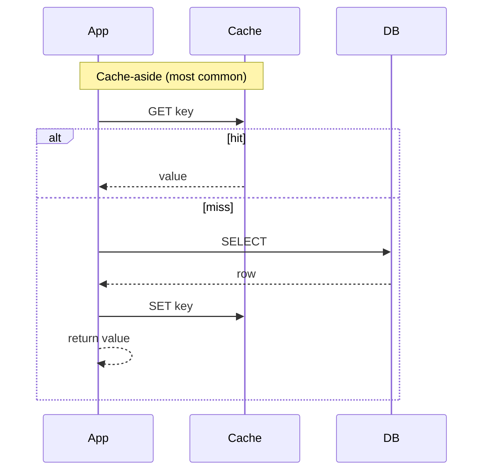

## The four canonical patterns

| Pattern | Read path | Write path | Best for |
|---|---|---|---|
| **Cache-aside (lazy)** | App: cache miss → DB → fill cache | App writes DB, invalidates cache | Default. Most apps. |
| **Read-through** | App → cache → cache fetches DB | App writes DB, cache invalidated | When cache is in front of DB transparently |
| **Write-through** | App → cache | App → cache → DB synchronously | Strong read-after-write |
| **Write-behind (write-back)** | App → cache | App → cache → async batch to DB | Write-heavy, can tolerate loss |

## Eviction policies

- **LRU** (Least Recently Used) — default; works for most workloads.
- **LFU** (Least Frequently Used) — better when access frequency is more stable than recency.
- **TTL** — explicit expiry; combine with LRU.
- **FIFO** — simplest; rarely the right answer.

## Invalidation: the hard part

> *"There are only two hard things in computer science: cache invalidation and naming things."* — Phil Karlton

- **TTL-based** — set short TTL, accept some staleness. Simple.
- **Write-through invalidation** — on DB write, also `DEL key`.
- **Versioned keys** — include a version (`user:42:v3`) and bump on write; old keys age out via LRU.
- **Pub/Sub invalidation** — write fans out via Redis pub/sub or Kafka.

## Common pitfalls

- **Cache stampede** — TTL expires, 10k requests all miss, 10k DB hits in 1ms. Fix: locked refresh, probabilistic early expiry, request coalescing.
- **Hot keys** — one celebrity user gets 100× the traffic. Fix: read replicas, edge caching, fan-out per-user keys.
- **Inconsistent set/delete order** — write to DB, then DEL cache. Reverse order leaks stale reads.
- **Negative caching missing** — cache the "not found" too, or you get amplified DB load on bad lookups.
- **Cache filling becomes the bottleneck** — read-through with slow DB during cold start. Mitigate with warm-up jobs.

## CDN tier (the cache before your cache)

- Cache static + cacheable HTML at the edge.
- Vary on path + headers explicitly; never on cookies you don't need.
- `Cache-Control: public, max-age=300, stale-while-revalidate=86400` is a great default for forgiving content.
- Surrogate keys (Fastly) or tags (CloudFront via invalidations) for targeted purges.

## Decision rubric

- **Read-heavy + tolerable staleness** → cache-aside with TTL. Done.
- **Read-heavy + must be fresh on writes** → cache-aside with explicit invalidation, accept a small race window.
- **Write-heavy** → don't cache writes; cache reads behind a fast DB.
- **Multiple regions** → CDN at the edge + regional Redis. Don't try to globally invalidate Redis cheaply.
