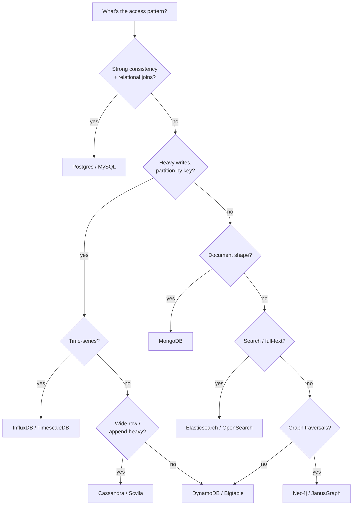

## Decision tree

## Quick reference

| Need | Pick | Because |
|---|---|---|
| Transactions across rows | **Postgres** | ACID, mature, joins are fine up to 100M rows with good indexes |
| Massive write throughput, low query complexity | **Cassandra / DynamoDB** | LSM trees, no global locks, partition-key driven |
| Sub-ms read of hot keys | **Redis** | In-memory, cluster mode for sharding |
| Full-text search / faceting | **Elasticsearch** | Inverted index, relevance scoring |
| Analytics queries on TBs | **Snowflake / BigQuery / Redshift** | Columnar, MPP |
| Time-series telemetry | **TimescaleDB / InfluxDB** | Compression + downsampling |
| Highly connected data (social graph) | **Neo4j** | Index-free adjacency, fast traversals |
| Strict ordering + replay | **Kafka** (as log, not DB) | Partitioned append-only log |
| Geographically distributed strong-consistency | **Spanner / CockroachDB** | TrueTime / Raft, expensive |

## Don't pick X if…

- **Postgres**, if you need >50k writes/sec sustained — start sharding sooner.
- **MongoDB**, if relationships dominate; you'll rebuild joins in app code.
- **DynamoDB**, if your access patterns aren't fully known up front — schema rework is painful.
- **Elasticsearch**, as your source of truth — it's a search index, not a DB.
- **Cassandra**, for read-modify-write patterns — last-write-wins surprises people.

## Hybrid is normal

Most real systems use 2–3:

- Postgres (source of truth) + Redis (hot cache) + Elasticsearch (search) is the most common stack at small scale.
- DynamoDB + S3 + DAX (cache) at AWS-native scale.
- Always justify the "why each one" — interviewers like seeing the reasoning, not just the menu.
