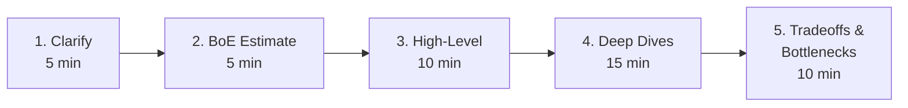

## The template

## 1. Clarify (5 min)

- **Functional requirements** — what *exactly* does it do? What's out of scope?
- **Non-functional** — scale (DAU, QPS), latency target, availability target, consistency expectation.
- **Constraints** — geographic, regulatory, mobile-first?

> "Just to confirm — we're optimising for read latency over write throughput, single-region for v1, eventually consistent is OK?"

## 2. Back-of-envelope (5 min)

- Users → DAU → actions → QPS (avg + peak).
- Storage per record × records/day × retention.
- Bandwidth in/out.
- Round aggressively. State assumptions out loud.

## 3. High-level design (10 min)

- Draw the boxes: client → LB → app tier → cache → DB → queue → workers.
- Define the 3-5 most important APIs (signature, response).
- Define the data model (key tables/collections, partition keys).

> Important: this is a *sketch*. Don't go deep yet. Cover everything shallowly, then ask the interviewer where to dive.

## 4. Deep dives (15 min)

Pick the 2-3 most interesting parts. Common targets:

- **The hottest write path** (timeline, feed, payment) — partitioning, write amplification, idempotency.
- **The trickiest read** (search, ranking, geo) — index design, caching, fanout.
- **A failure scenario** — what happens when the DB region dies?

## 5. Tradeoffs & bottlenecks (10 min)

- Walk through the bottleneck of each tier as scale grows 10× and 100×.
- For each: how would you scale it (cache → replica → shard → rewrite)?
- One thing you'd build differently if you had time.

## What interviewers reward

- **Stating tradeoffs explicitly** — "I picked Cassandra because writes dominate; the cost is no joins, which is fine because we denormalize the feed."
- **Naming real systems** — "This is similar to how Twitter does timeline fan-out on write for most users, fan-out on read for celebrities."
- **Capacity numbers** — "At 1M QPS we'd need ~50 app servers and ~10 Redis shards."
- **Saying you don't know** — and how you'd find out.

## What they punish

- Hand-waving with no numbers.
- Picking a tech because it sounds cool.
- Not noticing your own bottleneck.
- Forgetting failure modes entirely.
- Drawing for 30 minutes without checking in.
