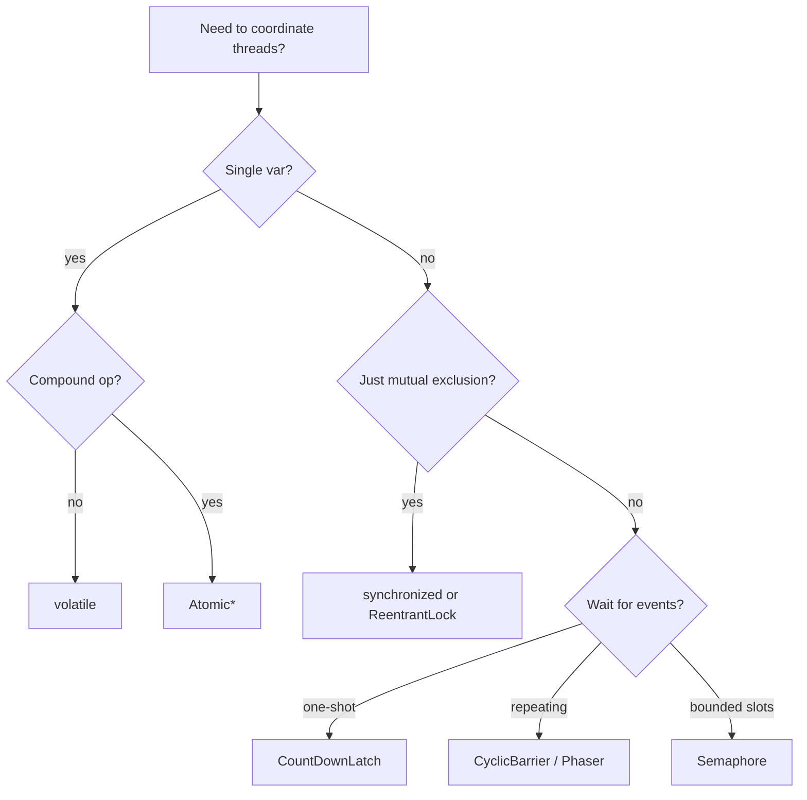

## The picker

| Primitive | Use when | Cost / gotcha |
|---|---|---|
| `synchronized` | Simple critical section, low contention | JIT-biased, but no `tryLock`, no fairness, no interruptibility |
| `volatile` | Single-variable flags, publish-once references | Not for compound ops (`++`, check-then-set) |
| `AtomicInteger` / `AtomicLong` | Counters, sequences, CAS loops | Cache-line bouncing under contention; consider `LongAdder` |
| `LongAdder` / `LongAccumulator` | High-write counters (metrics, hit counters) | `sum()` is O(stripes), not strongly consistent |
| `AtomicReference` | Lock-free state machine, copy-on-write small objects | ABA — pair with `AtomicStampedReference` if reuse is possible |
| `ReentrantLock` | Need `tryLock`, fairness, multiple condition vars, interruptible wait | Always `lock(); try { } finally { unlock(); }` |
| `ReadWriteLock` | Read-heavy guarded state | Writers can starve under read load; not reentrant up-grade-able |
| `StampedLock` | Read-heavy + you can validate optimistic reads | Not reentrant; deadlock-prone; use only when profiling demands it |
| `Semaphore(n)` | Bounded resource pool (DB conns, outbound calls) | `tryAcquire(timeout)` is the safe form |
| `CountDownLatch(n)` | One-shot "wait for N events" | Not reusable — use `CyclicBarrier` if you need to reset |
| `CyclicBarrier(n)` | N threads sync up, then repeat (parallel-phase compute) | Throws `BrokenBarrierException` if anyone bails |
| `Phaser` | Dynamic party count, multi-phase protocols | More flexible than `CyclicBarrier`; steeper API |
| `Exchanger<T>` | Two threads swap a buffer at a rendezvous | Niche — pipeline producer/consumer |
| `BlockingQueue` (`ArrayBlockingQueue`, `LinkedBlockingQueue`) | Producer/consumer hand-off | Bounded vs unbounded matters — unbounded = OOM risk |
| `CompletableFuture` | Async chains, composing IO callbacks | Default executor is the common ForkJoinPool — pass your own for blocking work |
| `ForkJoinPool` | Divide-and-conquer, work-stealing | Don't block inside `RecursiveTask` without `ManagedBlocker` |
| `ConcurrentHashMap` | Shared cache / index | `compute`, `computeIfAbsent`, `merge` are atomic — use them |

## Decision flow

## Async composition with `CompletableFuture`

| Op | Threading |
|---|---|
| `thenApply` | Same thread that completed the prior stage (could be the caller!) |
| `thenApplyAsync` | Default common pool, or your `Executor` |
| `allOf` | Wait for many; `join()` rethrows the first exception |
| `orTimeout(d)` (Java 9+) | Cancels with `TimeoutException` |
| `exceptionallyCompose` | Recover and switch to a fallback future |

Always pass your own executor for blocking work. The common pool has `cores - 1` threads — saturating it stalls every parallel stream in your JVM.

## The contention ladder (cheapest → most expensive)

1. Thread-confined / immutable (no contention)
2. `LongAdder`-style stripe
3. `volatile` / `Atomic*` (CAS, ~10 ns uncontended, much worse contended)
4. `synchronized` biased (~20 ns)
5. `ReentrantLock` (~50 ns)
6. `ReadWriteLock` / `StampedLock` (only wins under heavy read skew)

## Gotchas

- `wait`/`notify` need the same monitor and a loop — never `if`, always `while`.
- `Thread.interrupt()` is a request, not a kill. You must check `Thread.interrupted()` or catch `InterruptedException`.
- `ScheduledExecutorService.scheduleAtFixedRate` swallows exceptions silently — wrap your task.
- A `synchronized` method on a public class lets callers grab the same monitor — prefer a private `final Object lock`.
