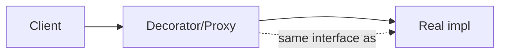

## The shortlist

| Pattern | Category | One-liner | When | Real example |
|---|---|---|---|---|
| **Singleton** | Creational | One instance, globally accessible | Stateless services, config, registries | `Runtime.getRuntime()`, Spring beans (default scope) |
| **Builder** | Creational | Fluent step-by-step construction of an immutable object | >3 ctor args, optional fields, validation at `build()` | `StringBuilder`, `HttpRequest.newBuilder()`, Lombok `@Builder` |
| **Factory Method** | Creational | Subclass decides which concrete type to create | Hide construction, allow swap by config | `Calendar.getInstance()`, `LoggerFactory.getLogger()` |
| **Strategy** | Behavioral | Encapsulate an algorithm; swap at runtime | Sorting, pricing, retry policies | `Comparator`, `Executor`, `RetryPolicy` |
| **Observer** | Behavioral | Subscribe to changes from a subject | Event buses, UI bindings, pub/sub | `PropertyChangeListener`, Spring `ApplicationEvent`, RxJava |
| **Template Method** | Behavioral | Skeleton in base class, hooks in subclass | Common workflow with one varying step | `AbstractList`, `HttpServlet.service()`, JUnit `TestCase` |
| **Adapter** | Structural | Make A look like B | Bridging two libraries / legacy APIs | `Arrays.asList`, `InputStreamReader` |
| **Decorator** | Structural | Wrap to add behavior, same interface | Logging, caching, retry, rate-limit | `BufferedInputStream`, `Collections.unmodifiableList` |
| **Proxy** | Structural | Stand-in that controls access | Lazy load, remote, security, AOP | Hibernate lazy proxies, Spring `@Transactional` proxies, JDK dynamic proxies |
| **Iterator** | Behavioral | Traverse without exposing internals | Custom collections, lazy sequences | `Iterator<T>`, `Stream.iterator()` |

## Singleton — the right way

```java
public enum Config {
  INSTANCE;
  private final Properties props = load();
  public String get(String k) { return props.getProperty(k); }
}
```

Enum singletons are serialization-safe, reflection-resistant, and lazy via class loading. Avoid `synchronized getInstance()` (slow) and broken double-checked locking (no `volatile`).

## Strategy vs Template Method

Both vary behavior — but:
- **Strategy** = composition. The varying piece is a separate object you inject.
- **Template Method** = inheritance. The varying piece is an abstract method on a base class.

Prefer Strategy. Inheritance locks you in.

## Decorator vs Proxy

Look identical from outside — both implement the same interface and wrap a delegate. Different intent:
- **Decorator** adds *new* behavior the caller asked for (compress + buffer).
- **Proxy** controls *access to* the same behavior (lazy, remote, secured).



## Anti-patterns disguised as patterns

- **God Singleton** — every service grabs the singleton; you've built global mutable state. Prefer DI.
- **Builder for 2 fields** — just use a constructor.
- **AbstractFactoryFactoryBean** — if you can't explain it in one sentence, delete it.
- **Observer with no unsubscribe** — silent memory leak; listeners pin everything they reference.
- **Inheritance for code reuse** — favor composition; the JDK's own `Stack extends Vector` is the cautionary tale.

## Patterns the JDK leans on hardest

- I/O streams = Decorator (every `BufferedX`, `GZIPOutputStream`).
- Collections = Iterator + Strategy (`Comparator`).
- `java.util.concurrent` = Strategy (`Executor`, `RejectedExecutionHandler`).
- Spring framework = Proxy (AOP, transactions) + Factory (the whole `ApplicationContext`) + Template (`JdbcTemplate`, `RestTemplate`).
