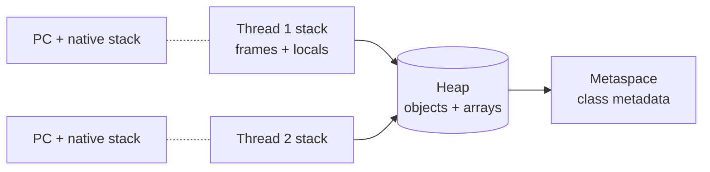

## Memory regions



| Region | What lives there | Per-thread? | GC'd? |
|---|---|---|---|
| Stack | Frames, primitives, references | Yes | No (popped on return) |
| Heap | All `new`'d objects, arrays | No (shared) | Yes |
| Metaspace | `Class` objects, method bytecode, constant pool | No | Class-unload only |
| Code cache | JIT-compiled native | No | Yes (compiled-method eviction) |

Old PermGen is gone since Java 8. Metaspace grows in native memory, capped by `-XX:MaxMetaspaceSize`.

## The three concerns

| Concern | Question | Tool |
|---|---|---|
| **Atomicity** | Does the operation complete as one indivisible step? | `synchronized`, `Atomic*`, `Lock` |
| **Visibility** | Will another thread see my write? | `volatile`, `synchronized`, `final`, `Atomic*` |
| **Ordering** | Can the compiler/CPU reorder my reads & writes? | `volatile`, `synchronized`, `VarHandle` fences |

`long`/`double` writes aren't guaranteed atomic on 32-bit JVMs — use `volatile` or `AtomicLong`.

## Happens-before — the rules that matter

- Each action in a thread happens-before every later action in **that same** thread.
- `unlock` on a monitor happens-before every later `lock` on the same monitor.
- A write to a `volatile` field happens-before every later read of that field.
- `Thread.start()` happens-before any action in the started thread.
- Any action in a thread happens-before another thread observing its `Thread.join()` return.
- Constructor finish happens-before any thread sees the object **iff** the reference doesn't escape during construction.

If two actions aren't ordered by some happens-before chain, the JVM is free to reorder them, cache them, or never publish them.

## `volatile` — what it is and isn't

- Reads/writes are atomic (even for `long`/`double`).
- Establishes happens-before between writer and subsequent readers.
- Inserts a `StoreStore` + `StoreLoad` fence on write; `LoadLoad` + `LoadStore` on read.
- **Does not** make compound ops atomic. `volatile int x; x++` is still a race.

## `final` in the JMM

If a field is `final` and the `this` reference doesn't leak from the constructor, **all threads** see the fully-initialised value without any further synchronisation. This is why immutable objects are safely publishable.

## Double-checked locking (the right way)

```java
class Holder {
  private static volatile Service instance;   // volatile is mandatory
  static Service get() {
    Service s = instance;
    if (s == null) {
      synchronized (Holder.class) {
        s = instance;
        if (s == null) instance = s = new Service();
      }
    }
    return s;
  }
}
```

Without `volatile`, another thread can observe a partially-constructed object — the `instance =` assignment can be reordered ahead of the constructor's writes. Better still: use a static holder class (lazy init via class loading semantics) or `Suppliers.memoize`.

## Quick checklist

- Mutating shared state? Either confine it, immutate it, or guard it.
- Publishing a config object? `final` fields + don't leak `this` = safe.
- Reading a flag set by another thread? `volatile boolean`, not plain `boolean`.
