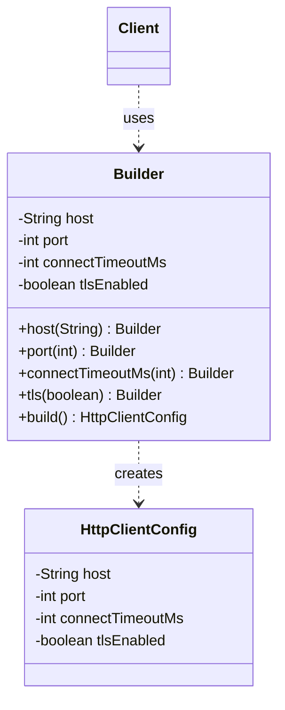
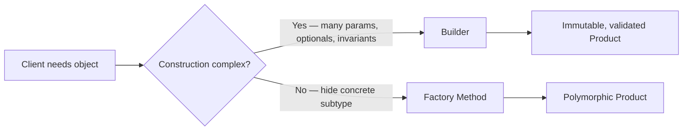
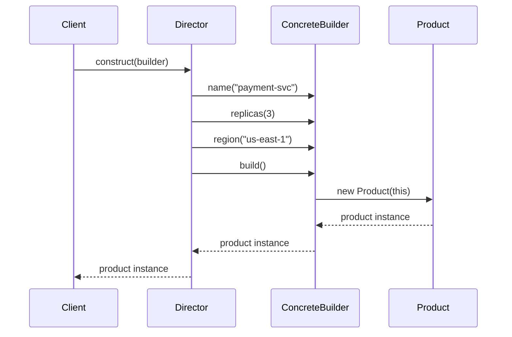

<!-- tldr -->
# Builder Pattern

The Builder pattern is a creational pattern that assembles a complex object step-by-step through a dedicated `Builder` class, keeping construction logic entirely outside the product. In Java, the canonical form (Joshua Bloch, *Effective Java* Item 2) is a **static inner `Builder`** with a fluent, method-chaining API that terminates in a `build()` call returning an immutable product. It directly replaces the *telescoping constructor* anti-pattern and eliminates partially-initialized mutable objects escaping construction.



<!-- standard -->

## What It Is

Builder encapsulates multi-step object construction behind a fluent interface. The client configures only the fields it cares about; `build()` validates cross-field invariants and produces an immutable product. The product's constructor is `private` — only the Builder can call it.

## Why It Matters

- **Readability**: `new Config("host", 443, true, 5_000, null, null)` vs. `Config.builder("host").port(443).tls(true).build()` — intent is self-documenting.
- **Immutability**: All fields are `final`; no setters exist on the product.
- **Single validation seam**: `build()` is the one place to enforce invariants (`host != null`, `port > 0`, TLS/port consistency checks).
- **Optional parameters with defaults**: No overloaded constructors; defaults live in the Builder field declarations.

## Primary Techniques

| Technique | When to Use | Tradeoff |
|---|---|---|
| Static inner `Builder` | Default for domain objects | Boilerplate; solved by Lombok |
| Lombok `@Builder` | Rapid POJO construction | No built-in required-field enforcement |
| Lombok `@SuperBuilder` | Inheritance hierarchies | Annotation magic; harder to debug |
| CRTP/recursive-generic Builder | Manual inheritance without Lombok | Complex `self()` idiom required |
| Director + Builder | Reusable construction sequences | Extra abstraction layer |

## Key Tradeoffs

- **Pro**: Immutability, readability, clean separation of required vs. optional fields.
- **Con**: Doubles classes/fields — every new product field requires a Builder update.
- **Con**: Builder instances are mutable and **not thread-safe** — never share one across threads.
- **Con**: Lombok's generated `build()` does no validation; you must add a custom `build()` override.

## Builder vs. Factory Method Decision Flow



<!-- deep -->

## Deep Dive: Builder in Java

### Canonical Implementation

```java
public final class HttpClientConfig {
    private final String  host;
    private final int     port;
    private final int     connectTimeoutMs;
    private final boolean tlsEnabled;

    private HttpClientConfig(Builder b) {
        this.host             = b.host;
        this.port             = b.port;
        this.connectTimeoutMs = b.connectTimeoutMs;
        this.tlsEnabled       = b.tlsEnabled;
    }

    public static Builder builder(String host) { return new Builder(host); }

    public static final class Builder {
        // Required — enforced by constructor, not a setter
        private final String host;
        // Optional with defaults
        private int     port             = 443;
        private int     connectTimeoutMs = 3_000;
        private boolean tlsEnabled       = true;

        public Builder(String host) {
            this.host = Objects.requireNonNull(host, "host required");
        }

        public Builder port(int port) {
            Preconditions.checkArgument(port > 0 && port < 65_536, "invalid port");
            this.port = port; return this;
        }
        public Builder connectTimeoutMs(int ms) { this.connectTimeoutMs = ms; return this; }
        public Builder tls(boolean tls)          { this.tlsEnabled = tls; return this; }

        public HttpClientConfig build() {
            if (tlsEnabled && port == 80)
                throw new IllegalStateException("TLS on port 80 is suspicious");
            return new HttpClientConfig(this);
        }
    }
}
```

**Key decisions:**
- Required fields go in `Builder(...)` — the compiler enforces them.
- Defaults are set at field declaration — readable and co-located with the field.
- Cross-field validation lives exclusively in `build()`.
- `private` product constructor — only the Builder has access.

---

### Recursive Generic Builder for Inheritance (CRTP)

The most common Java-specific interview pitfall. Naïve inheritance breaks fluent chaining because `BaseBuilder.setFoo()` returns `BaseBuilder`, not `DerivedBuilder`.

**Fix — Curiously Recurring Template Pattern:**

```java
public abstract static class AbstractBuilder<P, B extends AbstractBuilder<P, B>> {
    protected String name;

    @SuppressWarnings("unchecked")
    public B name(String name) { this.name = name; return (B) this; }

    public abstract P build();
}

public static final class ServiceConfigBuilder
        extends AbstractBuilder<ServiceConfig, ServiceConfigBuilder> {
    private int replicas;

    public ServiceConfigBuilder replicas(int r) { this.replicas = r; return this; }

    @Override
    public ServiceConfig build() { return new ServiceConfig(this); }
}

// Usage — no cast needed:
ServiceConfig cfg = new ServiceConfigBuilder()
    .name("payment-svc")   // returns ServiceConfigBuilder, not AbstractBuilder
    .replicas(3)
    .build();
```

Lombok `@SuperBuilder` generates this pattern for you. Know both — interviewers ask you to implement it by hand.

---

### Real-World Systems Using Builder

| System | Builder Usage |
|---|---|
| **Java stdlib** | `StringBuilder`, `HttpClient.newBuilder()`, `ProcessBuilder`, `Stream.Builder` |
| **Guava** | `ImmutableList.builder()`, `ImmutableMap.builder()`, `CacheBuilder` |
| **Protocol Buffers** | Generated `.newBuilder()` per message — mutable Builder, immutable `Message` |
| **Lombok** | `@Builder`, `@SuperBuilder` |
| **Spring** | `UriComponentsBuilder`, `MockMvcRequestBuilders`, `RestTemplate.uriTemplateHandler()` |
| **AWS SDK v2** | `S3Client.builder().region(...).credentialsProvider(...).build()` |
| **Kafka clients** | `AdminClient.create(Map<>)` backed by Properties builder conventions |
| **Jackson** | `ObjectMapper` built via `JsonMapper.builder().enable(...).build()` |

---

### Failure Modes

1. **Shared Builder across threads** — Builder is mutable; concurrent `build()` calls race on fields. Fix: treat Builder as single-use, single-thread. Document it.
2. **Required fields in fluent setters** — omitting a required field produces a `NullPointerException` or corrupt object at runtime. Fix: put required fields in `Builder(...)` constructor.
3. **Mutable collections leaking into product** — `List<String> tags` passed by reference can be mutated by caller post-build. Fix: `List.copyOf(tags)` in `build()`.
4. **Lombok hiding validation** — `@Builder`'s generated `build()` is a plain field assignment. Fix: write a `public HttpClientConfig build()` method in the class body; Lombok respects it.
5. **Builder reuse after `build()`** — nothing prevents calling `build()` twice or mutating the Builder after. Fix: set a `private boolean built` flag; throw `IllegalStateException` on reuse if immutability is critical.
6. **Protobuf-style forgetting to call `build()`** — the Builder itself is a valid, mutable object; if you store a Builder reference instead of the built Message you'll see stale state later.

---

### Capacity and Latency

Builder itself is allocation-only — one extra short-lived heap object per constructed product. At **1M QPS**, the GC pressure from ephemeral Builders is negligible under G1/ZGC (short-lived objects are collected in sub-millisecond minor GCs). At **>10M/sec** object construction rates (e.g., Kafka record assembly in a hot deserialization loop), profile before blaming Builder — but if it shows up, switch to a pooled mutable object or a `record` with a compact canonical constructor.

`build()` itself should run in **< 1 µs** for typical domain objects (a handful of field assignments plus a null check).

---

### Sequence: Director + ConcreteBuilder



The **Director** encodes a fixed construction recipe and can drive different Builders to produce different output formats — e.g., an `XmlReportBuilder` and a `JsonReportBuilder` both driven by the same `ReportDirector`. In practice, Director is rarely used in Java application code; it appears more often in framework internals (e.g., Spring's `BeanDefinitionBuilder` workflows).

---

### Interview Pitfalls

| Question | Strong Answer |
|---|---|
| "Why not just use setters?" | Setters allow partially-initialized, non-immutable objects to escape scope. `build()` guarantees a fully constructed object at a single point. |
| "How do you enforce required fields with Builder?" | Pass them in `Builder(String requiredField)` constructor — compiler enforces presence, no runtime surprise. |
| "Lombok `@Builder` vs. manual?" | Lombok saves boilerplate but loses fine-grained validation and required-field enforcement. Know both; choose based on invariant complexity. |
| "What about Java records?" | `record Point(int x, int y)` replaces Builder for simple value types (≤3 fields, no optional params, no cross-field invariants). Use records when they fit; Builder otherwise. |
| "Implement a generic Builder for a class hierarchy." | Demonstrate CRTP `AbstractBuilder<P, B extends AbstractBuilder<P, B>>` with `self()` or `(B) this` cast. |

---

### Decision Rubric: When to Reach for Builder

| Signal | Recommendation |
|---|---|
| ≥ 4 constructor parameters | **Use Builder** |
| Mix of required and optional params | **Use Builder** |
| Object must be immutable after construction | **Use Builder** |
| Cross-field invariants to enforce | **Use Builder** |
| Inheritance hierarchy of buildable objects | **`@SuperBuilder` or CRTP** |
| ≤ 3 params, no optionals, no invariants | Plain constructor or `record` |
| Simple value object, Java 16+ | `record` with compact canonical constructor |
| Performance-critical hot path > 10M objects/sec | Profile first; consider object pooling or records |