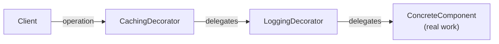
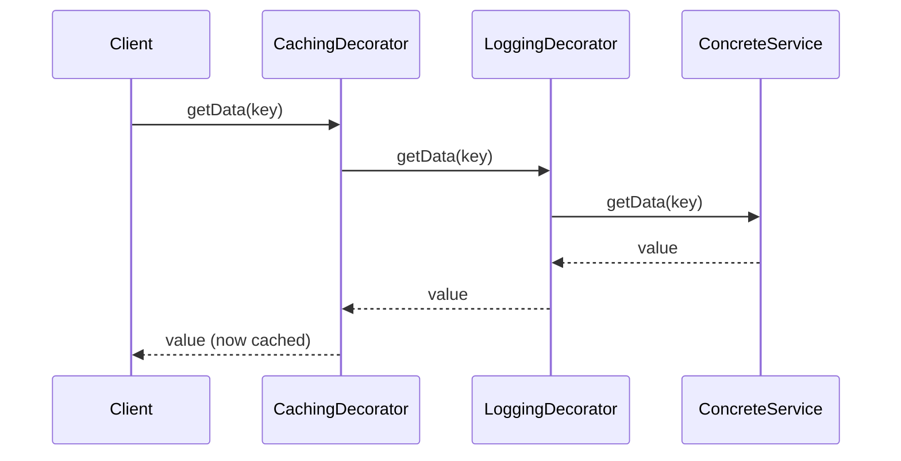
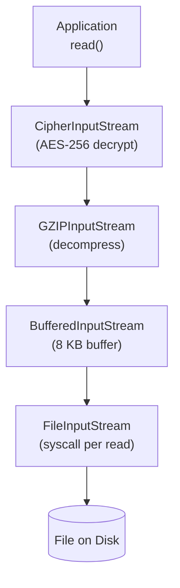

<!-- tldr -->
# Decorator Pattern

The Decorator pattern wraps a target object with one or more decorator objects that implement the same interface, injecting pre/post logic around each delegated call. Unlike inheritance, decorators are composed at runtime, so you can mix and stack behaviors—caching, logging, retry, auth—without a class-explosion. Java's `java.io` package (`BufferedInputStream` wrapping `GZIPInputStream` wrapping `FileInputStream`) is the canonical production implementation shipping in every JDK.



<!-- standard -->

## What It Is

A **structural** pattern (GoF) in which a `Decorator` class:
1. Implements the same `Component` interface as the wrapped object.
2. Holds a `Component` reference injected via constructor.
3. Forwards all calls to the wrapped object, adding behavior before and/or after each delegation.

## Why It Matters

- Adheres to **Open/Closed Principle**: existing classes stay untouched; new behavior ships as a new decorator class.
- Eliminates **combinatorial subclassing**: `n` orthogonal features do not require `2ⁿ` subclasses.
- Makes **cross-cutting concerns** (logging, tracing, rate-limiting, auth) modular, testable, and reorderable without modifying business logic.

## Primary Techniques

| Technique | When to Use |
|---|---|
| Abstract `Decorator` base class | Centralizes delegation boilerplate; subclasses override only augmented methods |
| Interface-only decorator | Simpler when the interface is small (1–3 methods) |
| Constructor chaining (`java.io` style) | `new BufferedReader(new InputStreamReader(socket.getInputStream()))` |
| Spring `BeanPostProcessor` | Auto-wrap beans with cross-cutting behavior at container startup |
| Lombok `@Delegate` | Generates delegation boilerplate; reduces missed-method bugs on large interfaces |

## Key Tradeoffs

**Pros**
- Runtime composition; no recompilation to add or remove a layer.
- Each decorator is independently unit-testable with a mock wrapped object.
- Callers see no interface change—transparent wrapping.

**Cons**
- Deep chains are hard to debug; stack traces span many wrapper classes.
- Decoration **order** is caller-driven and unenforced by the type system.
- Identity checks (`instanceof`, reference equality) break—the caller holds the outermost wrapper.
- Each wrapper adds ~1–5 ns extra dispatch (JIT-inlined after warm-up; negligible below ~50 layers).



<!-- deep -->

## Implementation Skeleton (Java)

```java
// Component interface
public interface DataService {
    String getData(String key);
}

// Concrete component
public class DatabaseService implements DataService {
    public String getData(String key) { /* real DB call ~5 ms */ }
}

// Abstract base decorator — centralizes delegation
public abstract class DataServiceDecorator implements DataService {
    protected final DataService wrapped;
    protected DataServiceDecorator(DataService wrapped) {
        this.wrapped = Objects.requireNonNull(wrapped);
    }
    @Override
    public String getData(String key) { return wrapped.getData(key); }
}

// Concrete decorators — override only augmented methods
public class LoggingDecorator extends DataServiceDecorator {
    @Override public String getData(String key) {
        log.debug("fetch key={}", key);
        String v = wrapped.getData(key);
        log.debug("fetched key={} len={}", key, v.length());
        return v;
    }
}

public class CachingDecorator extends DataServiceDecorator {
    private final Cache<String, String> cache; // Caffeine
    @Override public String getData(String key) {
        return cache.get(key, wrapped::getData); // miss → delegate
    }
}

// Composition at wiring time (e.g., Spring @Bean or manual)
DataService svc = new CachingDecorator(
    new LoggingDecorator(
        new DatabaseService()
    ), Caffeine.newBuilder().maximumSize(10_000_000).build()
);
```

**Key rule**: `CachingDecorator` must be the *outermost* wrapper here. Reversing the order means cache hits are never logged—a silent correctness bug.

---

## Real-World Systems

### java.io — The Archetypal Decorator Tree

Every `InputStream` subclass that accepts another `InputStream` in its constructor is a decorator:



`BufferedInputStream` with an 8 KB buffer reduces `read()` syscalls by **100–1000×** on sequential files, cutting effective I/O latency from ~5 µs/syscall to ~0.005 µs/byte on NVMe.

### Spring Security FilterChain

`FilterChainProxy` chains `OncePerRequestFilter` subclasses (JWT auth, CSRF, CORS, session) via `FilterChain` references. Each filter decorates the next. Reordering `@Order` annotations changes behavior without touching any filter class. Overhead: **< 50 µs P99** for a 10-filter chain on modern hardware.

### `javax.servlet.http.HttpServletRequestWrapper`

`ContentCachingRequestWrapper` and Spring's `MultiReadHttpServletRequest` extend `HttpServletRequestWrapper` to allow body re-reading, header injection, and attribute mutation—while downstream code still programs to `HttpServletRequest`.

### Guava `ForwardingCollection`

`ForwardingCollection<E>` implements `Collection<E>` and delegates everything to `delegate()`. Subclass it and override only the methods you augment. Used inside Google's codebase to wrap `List`, `Set`, and `Map` implementations with instrumentation.

### Kafka Producer/Consumer Interceptors

`ProducerInterceptor<K,V>` and `ConsumerInterceptor<K,V>` plug into the Kafka client pipeline as pre/post hooks on `send()` and `poll()`. Configured as a list in `producer.interceptor.classes`—an explicit ordered decorator chain baked into the client SDK.

---

## Failure Modes

| Failure | Root Cause | Fix |
|---|---|---|
| Wrong decoration order | Caching wraps Logging → cache hits never logged | Document required order; enforce via factory method |
| Leaking inner type | Caller casts to `DatabaseService`; wrapper breaks cast | Program to interface; never downcast decorated objects |
| Thread-safety violation | Stateful decorator (cache, counter) not synchronized | Use `ConcurrentHashMap`, Caffeine, or scope decorators per-request |
| Memory leak | Decorator holds long-lived ref to request-scoped bean | Align lifecycle; use `WeakReference` or prototype scope |
| Missed method delegation | Large interface; override one method, silently skip another | Use abstract base + IDE "delegate methods" or Lombok `@Delegate` |

---

## Capacity & Latency Reference Numbers

| Scenario | Observed Latency |
|---|---|
| Single decorator dispatch (JIT warm) | ~1–5 ns |
| `BufferedInputStream` vs unbuffered sequential read | 100–1000× fewer syscalls |
| Caffeine cache hit (10M entries, heap) | ~30–60 ns |
| Cache miss → DB round-trip | ~1–10 ms |
| Spring Security 10-filter chain P99 | < 50 µs |
| 50-layer decorator chain (pathological) | ~250 ns overhead—still negligible |

At 80% cache hit ratio, a `CachingDecorator` in front of a 5 ms DB call yields an effective average latency of **~1.1 ms** (0.8 × 50 ns + 0.2 × 5 ms).

---

## Decorator vs. Proxy vs. Strategy

| Aspect | Decorator | Proxy | Strategy |
|---|---|---|---|
| **Intent** | Add/stack behavior | Control access, lifecycle | Swap algorithm |
| **Wrappers** | Many, chained | Usually one | One active at a time |
| **Composition owner** | Caller / wiring code | Proxy controls entirely | Client injects |
| **Java examples** | `java.io`, Spring filters | `java.lang.reflect.Proxy`, Spring AOP | `Comparator`, `ExecutorService` |
| **Transparency** | Full (same interface) | Full (same interface) | Partial (strategy is a dependency, not a wrapper) |

> Spring AOP `@Transactional` and `@Cacheable` are implemented as JDK dynamic proxies or CGLIB proxies. They look like decorators and add behavior, but the correct GoF name for Spring AOP proxies is **Proxy**—they also control access (begin/commit transaction) and are generated by the framework, not composed by the caller.

---

## Interview Pitfalls

1. **"Why not just subclass?"** — Interviewers expect you to articulate: static binding, combinatorial explosion with multiple orthogonal features, and SRP violations when base classes accumulate concerns.

2. **Forgetting to forward all methods** — On a 15-method interface, missing one delegation is a silent bug. Name-drop abstract base classes and `@Delegate` as mitigations.

3. **Order confusion under examination** — Be ready to trace a two-decorator chain: which `getData()` fires first, which returns first, and what `CachingDecorator` sees when it re-wraps `LoggingDecorator`.

4. **Conflating Decorator with Proxy** — Both wrap an object and share its interface. The semantic difference: Decorator *adds behavior*; Proxy *controls access/lifecycle*. AOP proxies in Spring often add behavior but the intent is access control (transaction boundary, security check)—Proxy wins by intent.

5. **Thread-safety gaps** — Stateless decorators (pure logging, pure metrics emission) are inherently thread-safe. Stateful ones (caches, rate limiters, counters) are not. Examiners love asking "what breaks if two threads call this simultaneously?"

---

## Decision Rubric — When to Reach for Decorator

**Reach for Decorator when:**
- You need ≥2 independent, composable behaviors on objects assembled at runtime or via configuration.
- The set of behaviors is open-ended—new behaviors are added post-deployment by adding new classes, not editing existing ones.
- You're working with a stable, narrow interface and cannot (or should not) modify existing implementations.
- You need behaviors to be independently unit-testable in isolation.

**Prefer an alternative when:**
- **Single, permanent behavior change** on one class → just extend it.
- **Framework-provided AOP** (`@Transactional`, `@Cacheable`, `@PreAuthorize`) already handles the cross-cut → don't reinvent.
- **Swappable algorithm** without stacking → **Strategy** is the cleaner name and intent.
- **Access control, lazy init, or remote delegation** → **Proxy** is semantically correct.
- **Tree structures where leaf and composite are treated uniformly** → **Composite**.