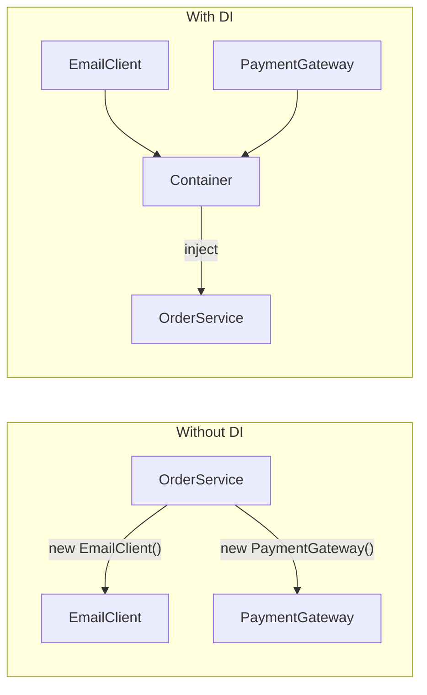
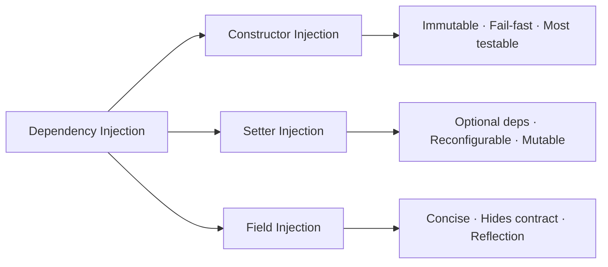
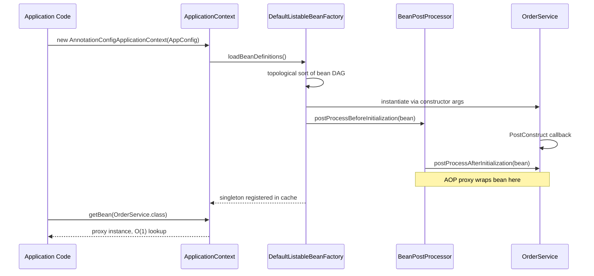

<!-- tldr -->
# Dependency Injection

Dependency Injection (DI) is the concrete realization of the Inversion of Control (IoC) principle: a class declares what it needs, and an external entity—a container, a factory, or calling code—provides it. The class depends on abstractions (interfaces), not concrete types, so every collaborator is swappable, most importantly at test time. Spring's `ApplicationContext`, Google Guice's `Injector`, and Jakarta CDI all automate this wiring at scale.



<!-- standard -->

## What It Is

DI is a structural pattern where an object's collaborators are supplied externally rather than self-created. The three canonical delivery mechanisms in Java are **constructor injection**, **setter injection**, and **field injection** (via reflection, e.g., `@Autowired`). A DI container manages the full dependency graph—construction order, scoping, and lifecycle callbacks—automatically.

## Why It Matters

- **Testability**: Pass mocks through the constructor; no container needed for fast unit tests.
- **Single Responsibility**: The class uses dependencies; it neither builds nor locates them.
- **Open/Closed**: Swap `SmsNotifier` for `EmailNotifier` without touching `OrderService`.
- **Parallel development**: Teams code against interfaces before implementations exist.
- **Lifecycle management**: Containers enforce `@PostConstruct`, `@PreDestroy`, and scope boundaries consistently.

## Primary Techniques

| Style | Delivery | `final` fields | Testability | Best For |
|---|---|---|---|---|
| Constructor | `new Svc(dep)` | ✅ | ✅ No container | Mandatory, required deps |
| Setter | `svc.setDep(d)` | ❌ | ✅ Plain setter call | Optional / reconfigurable deps |
| Field `@Autowired` | Reflection at runtime | ❌ | ⚠️ Needs container or `@InjectMocks` | Legacy code, quick prototypes |

**Rule**: prefer constructor injection for all mandatory dependencies. It encodes the contract in the type signature and forces initialization order at compile time.

## Key Trade-offs

- **Implicit wiring vs. explicitness**: Container-managed DI eliminates boilerplate but produces wiring graphs that are hard to trace in a debugger without IDE tooling.
- **Circular dependencies**: Constructor injection surfaces cycles as a startup `BeanCurrentlyInCreationException`—fail-fast by design. Field/setter injection silently defers them via Spring's early-reference cache, masking design errors.
- **Startup cost**: A Spring application with 1,000+ beans takes 5–15 s to initialize due to classpath scanning, reflection, and CGLIB proxy generation.
- **Portability**: `@Autowired` couples bytecode to Spring. JSR-330 `@Inject` works across Guice, CDI, and Spring without changes.



<!-- deep -->

## Internal Mechanics

### Bean Definition and Resolution in Spring

Spring's `DefaultListableBeanFactory` converts `@Component`, `@Bean`, and XML into `BeanDefinition` objects. On `ApplicationContext.refresh()`:

1. **Scan**: Classpath or explicit config yields a map of `BeanDefinition`s.
2. **Sort**: The factory builds a topological ordering of the dependency DAG.
3. **Instantiate**: Each bean is created in order, resolving constructor args by type + optional `@Qualifier`.
4. **Post-process**: Every bean passes through the `BeanPostProcessor` chain. AOP proxy wrapping—`@Transactional`, `@Async`, `@Cacheable`—happens here via CGLIB or JDK dynamic proxies.
5. **Cache**: Singletons land in a `ConcurrentHashMap<String, Object>`. Subsequent `getBean()` calls are O(1) map lookups.



### JSR-330 vs. Spring Annotations

| Annotation | Spec | Portable | Notes |
|---|---|---|---|
| `@Inject` | JSR-330 | ✅ Guice, CDI, Spring | No `required` flag; combine with `Optional<T>` |
| `@Autowired` | Spring | ❌ Spring only | Supports `required = false` |
| `@Named` | JSR-330 | ✅ | Equivalent to Spring `@Qualifier` |
| `@Singleton` | JSR-330 | ✅ | Honored by Guice and Spring |

**Recommendation for library code**: use `@Inject` + `@Named` so the library is container-agnostic.

## Failure Modes

### Scope Mismatch — The Silent Prototype Bug

A singleton injected with a prototype-scoped bean **receives exactly one prototype instance** at construction time. That prototype effectively becomes a singleton for the lifetime of the outer bean—a classic production bug.

**Fix options (ranked by preference):**
1. Inject `Provider<PrototypeDep>` (JSR-330) or `ObjectFactory<PrototypeDep>` (Spring) and call `.get()` per invocation.
2. Annotate the prototype with `@Scope(proxyMode = ScopedProxyMode.TARGET_CLASS)` to inject a CGLIB-backed scoped proxy.
3. Call `ctx.getBean()` directly—this is the Service Locator anti-pattern; use only when the above are impractical.

### Circular Dependencies

```
// Constructor injection — fails fast at startup (good)
BeanA(BeanB b) + BeanB(BeanA a)  →  BeanCurrentlyInCreationException

// Field injection — Spring resolves via early-reference cache (fragile, masks design flaw)
@Autowired BeanB in BeanA  +  @Autowired BeanA in BeanB  →  starts, but objects
                                                               are partially initialized
                                                               during injection
```

**Fix**: Extract a third shared component to break the cycle, or annotate one site with `@Lazy` to defer proxy creation. Prefer the structural refactor.

### `@Configuration` vs. `@Component` Subtlety

`@Bean` methods inside `@Configuration` classes are intercepted by CGLIB: calling `emailClient()` from another `@Bean` method returns the **cached singleton**. Inside a `@Component` class, `@Bean` methods are **not** proxied—calling `emailClient()` creates a fresh instance each time. This causes hard-to-find duplicate-bean bugs.

## Real-World Systems

| System | DI Mechanism | Key Characteristic |
|---|---|---|
| **Spring Framework** | `ApplicationContext`, JSR-330 | Reflection + CGLIB; 5–15 s startup for large apps |
| **Google Guice** | `Injector` + binding DSL | Lightweight; used across Google's internal services |
| **Dagger 2** | Compile-time code generation | Zero reflection; mandatory for Android < 300 ms cold-start P99 |
| **Micronaut** | AOT compile-time DI | Sub-100 ms startup; targets GraalVM native and serverless |
| **Jakarta CDI** | Weld / OpenWebBeans | Spec-level DI, portable across WildFly, Payara, TomEE |
| **Quarkus** | ArC (CDI subset, AOT) | Native image friendly; used in Kubernetes-native Java services |

## Capacity and Latency Numbers

| Operation | Typical Latency | Notes |
|---|---|---|
| Singleton `getBean()` | 50–200 ns | `ConcurrentHashMap` O(1) lookup |
| Constructor injection (plain object) | 1–5 µs | Allocation + field assignment, no reflection |
| Field injection via `Field.set()` | 2–10 µs | JIT-warmed reflection; negligible in practice |
| Spring context startup, 500 beans | 200–500 ms | Includes classpath scan, CGLIB generation |
| Spring context startup, 5,000 beans | 5–15 s | `@SpringBootTest` integration-test cost |
| Dagger 2 component initialization | < 1 ms | Generated factory code, zero reflection |

## Interview Pitfalls

1. **Field injection as a default**: Immediately signals inexperience. Explain that it hides the dependency contract, forbids `final`, and requires a container (or `Mockito.injectMocks`) even in pure unit tests.

2. **DI vs. Service Locator confusion**: In DI the container *pushes* dependencies to the consumer. In Service Locator the consumer *pulls* from a registry. Both are IoC, but Service Locator couples the consumer to the registry, making it harder to test and impossible to trace statically.

3. **Scope proxy omission in web apps**: Injecting a `@RequestScope` bean into a singleton without `ScopedProxyMode.TARGET_CLASS` means all threads share the first request's object. This is a live-site concurrency bug interviewers love.

4. **Forgetting `@Configuration` CGLIB semantics**: A candidate who cannot explain why `@Configuration` classes are subclassed by CGLIB doesn't understand Spring's singleton contract enforcement.

5. **Circular dependency as a Spring problem**: It is a **design problem**. Spring's ability to resolve field-injection cycles via early references is a workaround, not a feature. Argue for refactoring to break the cycle.

## When to Reach for This

**Use a DI container (Spring / Guice / CDI) when:**
- The dependency graph has ≥ 3 layers or ≥ 10 beans.
- You need swappable implementations (feature flags, multi-tenancy, A/B experiments).
- Cross-cutting concerns (transactions, caching, security) must be added non-invasively.

**Use Pure DI (manual wiring in a Composition Root) when:**
- The graph is small and stable (≤ 10 classes, one entry point).
- Framework coupling in domain code is unacceptable.
- You want predictable startup time for CLIs or AWS Lambda cold starts.

**Use Dagger 2 or Micronaut AOT when:**
- P99 startup time must stay under 100 ms (serverless, Android, GraalVM native).
- Reflection is unavailable or banned by security policy.

**Avoid field injection in production code entirely.** Reserve it for `@SpringBootTest` integration tests where the container is already running and wiring convenience outweighs the cost.