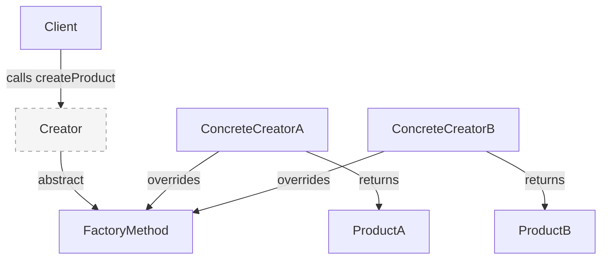
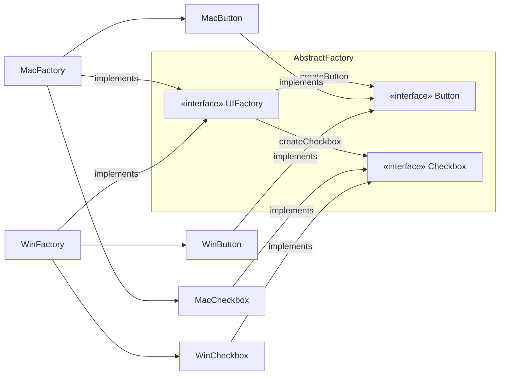
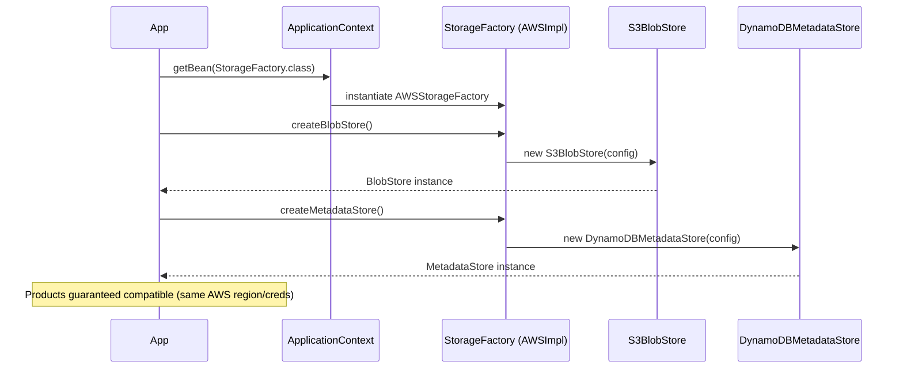

<!-- tldr -->
# Factory Method & Abstract Factory

Factory Method defines a creation interface but defers the concrete type decision to a subclass, decoupling client code from instantiation. Abstract Factory extends this by bundling a *family* of related factories so products from the same family are always compatible. Both patterns replace `new ConcreteType()` with a polymorphic call, making systems open for extension without modifying callers. In Java, they underpin JDBC, `DocumentBuilderFactory`, Spring's `BeanFactory`, and virtually every pluggable-provider API.



<!-- standard -->

## What It Is

**Factory Method** is a creational pattern where a base class/interface declares `createProduct()` (or similar), and each concrete subclass returns a different product. The client operates on the abstract product type — it never calls `new`.

**Abstract Factory** groups *multiple* factory methods under one interface so an entire product family is created together. Swap the factory, swap every product in that family atomically.

### Java Idioms

- `java.util.Calendar.getInstance()` — Factory Method (returns `GregorianCalendar` or locale-specific subclass)
- `javax.xml.parsers.DocumentBuilderFactory.newInstance()` — Abstract Factory pattern over XML providers
- `java.sql.DriverManager.getConnection()` — Factory Method hiding `Connection` implementation
- Spring `ApplicationContext` — `getBean()` is the factory method; bean definitions are the "subclass" configuration

### Primary Techniques

- **Static factory method** — `of()`, `from()`, `valueOf()` on value types; no subclassing needed; great for caching (`Integer.valueOf`)
- **Instance factory method** — override in subclass; enables polymorphic construction
- **Abstract Factory interface** — declare `createButton()`, `createCheckbox()`; provide `MacFactory`, `WinFactory`
- **Generic factory** — `<T> T create(Class<T> type)` used heavily in DI containers

### Comparison

| Dimension | Factory Method | Abstract Factory |
|---|---|---|
| Granularity | One product type | A family of products |
| Extension point | Subclass overrides one method | Swap entire factory object |
| Client coupling | Coupled to creator hierarchy | Coupled only to factory interface |
| Typical Java form | `abstract Creator` with `createProduct()` | Interface with N `createX()` methods |
| Violates OCP if… | New product needs new subclass | New product type added to interface |

### Key Tradeoffs

- Factory Method is simple but proliferates subclasses — prefer it when one dimension of variation exists.
- Abstract Factory is powerful but adding a new product to the interface forces *every* factory to change — a violation of OCP.
- Both shift coupling from concrete classes to abstract types; pair with dependency injection so the factory itself is injected, not `new`-ed.



<!-- deep -->

## Deep Dive

### Canonical Java Implementations

#### Factory Method

```java
// Creator
public abstract class NotificationSender {
    // factory method
    protected abstract Notification createNotification(String message);

    public void send(String message) {
        Notification n = createNotification(message);  // polymorphic call
        n.deliver();
    }
}

// Concrete creators
public class EmailSender extends NotificationSender {
    @Override
    protected Notification createNotification(String message) {
        return new EmailNotification(message);
    }
}

public class SlackSender extends NotificationSender {
    @Override
    protected Notification createNotification(String message) {
        return new SlackNotification(message);
    }
}
```

`NotificationSender.send()` is the **template method**; `createNotification()` is the **factory method** hook. This is the classic GoF combination.

#### Abstract Factory

```java
public interface StorageFactory {
    BlobStore createBlobStore();
    MetadataStore createMetadataStore();
    QueueBackend createQueue();
}

public class AWSStorageFactory implements StorageFactory {
    public BlobStore createBlobStore()      { return new S3BlobStore(); }
    public MetadataStore createMetadataStore(){ return new DynamoDBMetadataStore(); }
    public QueueBackend createQueue()       { return new SQSQueueBackend(); }
}

public class GCPStorageFactory implements StorageFactory {
    public BlobStore createBlobStore()      { return new GCSBlobStore(); }
    public MetadataStore createMetadataStore(){ return new FirestoreMetadataStore(); }
    public QueueBackend createQueue()       { return new PubSubQueueBackend(); }
}
```

Swapping `AWSStorageFactory` → `GCPStorageFactory` at startup reconfigures the entire storage tier without touching a single service class.

---

### Real-World Systems

#### JDBC — Factory Method in Production

```
DriverManager.getConnection(url)  →  resolves driver via ServiceLoader
  └─ MySQLConnection / PgConnection / OracleConnection
```

`getConnection()` is a static factory method. The driver is discovered at runtime via `java.util.ServiceLoader` (SPI) — the canonical Java factory extensibility mechanism. Each new database vendor ships a `META-INF/services/java.sql.Driver` file; no framework code changes.

#### Spring `BeanFactory` / `ApplicationContext`

- `getBean("userRepo")` is a factory method call.
- XML/annotation bean definitions + `@Configuration` classes act as Abstract Factories.
- `@Bean` methods are instance factory methods — Spring calls them reflectively and manages the returned object's lifecycle.
- **Prototype scope** means every `getBean()` call invokes the factory afresh; **Singleton scope** caches the result — a factory with memoization.

#### Kafka `ProducerFactory` / `ConsumerFactory` (Spring Kafka)

Spring Kafka exposes `DefaultKafkaProducerFactory<K,V>` implementing `ProducerFactory<K,V>`. Injecting a different `ProducerFactory` bean switches serializers, brokers, and auth config atomically — Abstract Factory in a real distributed system context.

#### Jackson `JsonFactory` / `TypeFactory`

`ObjectMapper` delegates type resolution to `TypeFactory` (Abstract Factory). Plugging in `AfterburnerModule` replaces bytecode-generated serializers transparently.

---

### Sequence: DI Container Using Abstract Factory



---

### Failure Modes & Pitfalls

| Failure | Root Cause | Fix |
|---|---|---|
| Factory method returns `null` | Default impl or forgotten override | Return `Optional<T>` or throw `UnsupportedOperationException` |
| Abstract Factory OCP violation | Adding a new product type (`createLogger()`) breaks all factories | Use adapter or default interface methods (Java 8+) carefully |
| Subclass explosion | Each variant needs a new `Creator` subclass | Prefer parameterized factory (`Map<String, Supplier<T>>`) |
| Thread-unsafe singleton from factory | Factory caches but isn't synchronized | Double-checked locking or `ConcurrentHashMap.computeIfAbsent` |
| Leaking concrete type | Factory method return type is concrete, not interface | Always declare return type as interface/abstract class |

#### The "Static Factory vs. Constructor" Pitfall

Interviewers often probe this. Static factories (`of()`, `from()`, `getInstance()`) have three concrete advantages over constructors:
1. **Named** — `LocalDate.of(2026, 1, 1)` is clearer than `new LocalDate(2026, 1, 1)`.
2. **Cached** — `Boolean.valueOf(true)` always returns the same object.
3. **Subtype return** — `Collections.unmodifiableList()` returns a private inner class; callers see only `List`.

---

### Capacity & Latency Considerations

- Factory method call overhead is **a single virtual dispatch** — JIT inlines it after ~10K calls; cost ≈ 1–3 ns. Not a bottleneck.
- Abstract Factory introducing reflection (e.g., Spring `getBean`) costs ~50–200 ns for prototype beans; singleton beans are ~5 ns (hash-map lookup). At 1M QPS, prefer singleton scope for hot paths.
- Object allocation from a factory at **1M objects/sec** can generate ~500 MB/min of garbage on a 500-byte object. Use object pooling (`GenericObjectPool`) with a `PooledObjectFactory<T>` — itself an Abstract Factory pattern.

---

### Interview Decision Rubric

Use **Factory Method** when:
- You have a single product type with multiple variants.
- You want subclasses (or callers) to decide the concrete type.
- You're writing a framework and callers will extend, not modify.

Use **Abstract Factory** when:
- Products come in families that must be mutually compatible.
- You need to swap an entire tier (persistence, UI toolkit, cloud provider).
- You want to enforce "don't mix AWS blobs with GCP queues" at compile time.

Prefer **static factory method** (`of`, `from`) when:
- You're on a value type with no subtype variation.
- Caching, named constructors, or covariant return types add value.

Reach for **`Supplier<T>` / `Function<P, T>`** before inventing a full factory hierarchy for simple cases — Java lambdas *are* factory methods.

---

### Common Interview Questions & Strong Answers

**Q: How is Abstract Factory different from a collection of Factory Methods?**
> An Abstract Factory *is* a collection of factory methods, but the key constraint is that they produce a *compatible family*. The factory object itself is injected and swapped atomically. A loose set of factory methods doesn't enforce the family invariant.

**Q: When does the pattern hurt you?**
> Abstract Factory violates OCP when a new product type is added to the interface — every concrete factory must change. Mitigate with default methods in Java 8+ (risky) or a registry/plugin pattern.

**Q: How do you test code that uses factories?**
> Inject the factory (constructor injection). In tests, inject a `TestDoubleStorageFactory` returning in-memory stubs. Never let production code call `new` on a concrete product directly if that product crosses a process boundary.