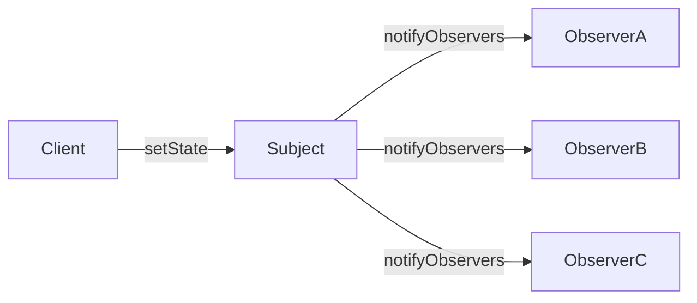
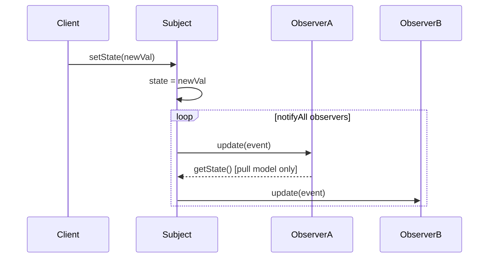
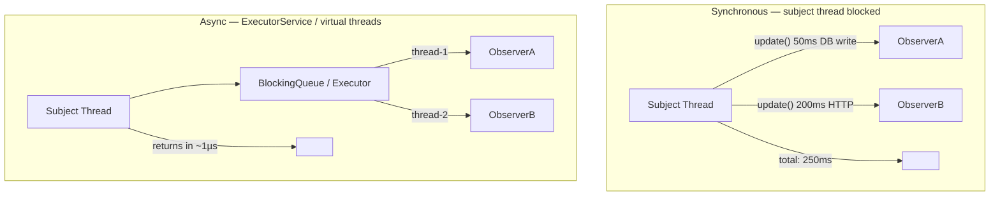
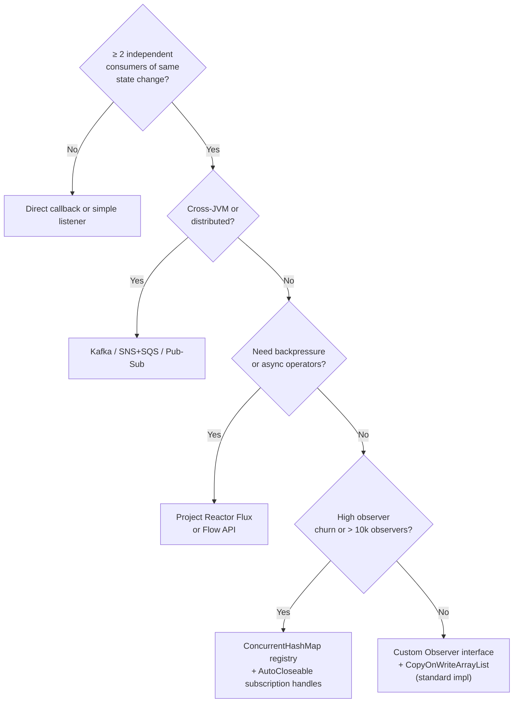

<!-- tldr -->
# Observer

The Observer pattern defines a one-to-many dependency: when a **Subject** (Observable) changes state, every registered **Observer** is notified automatically. Java's ecosystem spans from the deprecated `java.util.Observable` through JavaBeans `PropertyChangeSupport` to full reactive streams (Project Reactor, RxJava), making this pattern central to both legacy codebases and modern event-driven architectures. The core tensions are always **push vs. pull**, **sync vs. async**, and **strong vs. weak references**.



<!-- standard -->

## What It Is

A Subject owns mutable state and a runtime list of Observer references. On state change it iterates that list and calls each observer's `update()` contract. Observers self-register and self-deregister — the Subject has zero compile-time knowledge of concrete consumer types.

**Core roles:**
- **Subject** — owns state, manages observer registry, fires notifications
- **Observer** — declares the `update()` contract (interface, never a class)
- **ConcreteSubject / ConcreteObserver** — domain-specific implementations

## Why It Matters

- **Open/Closed** — add new observer types without touching Subject code
- **Decoupling** — Subject and Observer depend only on interfaces
- **Foundation of event-driven design** — GUI frameworks, messaging systems, and reactive pipelines all derive from this primitive

## Java Incarnations

| Mechanism | Java Version | Notes |
|---|---|---|
| `java.util.Observable` / `Observer` | ≤ Java 8 | **Deprecated Java 9**; `Observable` is a class, forces inheritance |
| `PropertyChangeSupport` / `PropertyChangeListener` | All | JavaBeans standard; still common in Swing and desktop code |
| Custom `EventListener` interfaces | All | Most flexible and idiomatic in modern Java |
| `java.util.concurrent.Flow` | Java 9+ | Reactive Streams spec with backpressure built-in |
| RxJava / Project Reactor | Library | Production reactive; rich operator chains, schedulers |

## Push vs. Pull

- **Push** — Subject sends the new value: `update(T newValue)`. Low latency; forces a fixed payload shape.
- **Pull** — Subject sends itself: `update(Subject s)`; Observer queries what it needs. More flexible; extra round-trip per notification.

## Key Tradeoffs

- **Notification order** is unspecified unless explicitly enforced (e.g., `PriorityQueue` of observers by priority weight)
- **Cascading updates** — Observer A's `update()` mutates Subject B which notifies Observer A → stack overflow
- **Memory leaks** — strong observer references prevent GC of detached components (**lapsed listener problem**)
- **Thread safety** — iterating and mutating the observer list concurrently without synchronization is a data race



<!-- deep -->

## Deep Dive

### Canonical Modern Java Implementation

```java
// Never extend java.util.Observable — prefer interface-based design
public interface StockObserver {
    void onPriceChange(String ticker, double newPrice, double oldPrice);
}

public final class StockTicker {
    // CopyOnWriteArrayList: O(1) iteration, O(n) write — correct for read-heavy observer lists
    private final List<StockObserver> observers = new CopyOnWriteArrayList<>();
    private volatile double price;

    public void register(StockObserver o)   { observers.add(o); }
    public void deregister(StockObserver o) { observers.remove(o); }

    public void setPrice(double newPrice) {
        double old = this.price;
        this.price = newPrice;
        if (Double.compare(old, newPrice) != 0)
            observers.forEach(o -> o.onPriceChange("AAPL", newPrice, old));
    }
}
```

**Why `CopyOnWriteArrayList`?** Reads (iteration on notify) dominate writes (register/deregister). COWAL snapshots the array on every write — O(n) write, O(1) lock-free read. For high-churn registrations (> 10k observers or frequent add/remove), prefer `ConcurrentHashMap<UUID, StockObserver>` keyed by an opaque subscription token returned at registration time.

### Lapsed Listener Problem

Strong observer references held in the Subject's registry prevent GC of detached UI panels, request-scoped Spring beans, or short-lived worker objects. This is one of the most common Java memory leaks in production.

**Mitigations (in preference order):**
1. **Explicit `deregister()` via `AutoCloseable`** — wrap the subscription in a handle; callers use try-with-resources or register a shutdown hook
2. **`WeakReference<Observer>` in registry** — Subject silently prunes GC'd entries on next notify cycle; caller needs no cleanup discipline
3. **Event bus with weak subscribers** — Guava `EventBus` with `WeakEventListener` mode; trades explicitness for safety

### Sync vs. Async Notification

Synchronous notification on the Subject's thread serializes all observers and transfers their latency to the producer.



**Reactive Streams upgrade (`java.util.concurrent.Flow`):**
- `Publisher` ≡ Subject; `Subscriber` ≡ Observer
- `Subscription.request(n)` introduces **backpressure** — observer signals capacity; publisher must honor it or buffer/drop
- Project Reactor's `Flux` adds 200+ composable operators (filter, flatMap, window, retry, onBackpressureBuffer)

### Real-World Systems

| System | Observer Manifestation | Throughput |
|---|---|---|
| **Spring ApplicationContext** | `ApplicationEventPublisher` / `@EventListener`; async via `@Async` + thread pool | Single JVM; ~100k events/s |
| **Kafka** | Consumer groups subscribe to topics; broker fans out to partition replicas | 1M+ msg/s per broker |
| **Swing / JavaFX** | `ActionListener`, `ChangeListener`, property binding on the EDT | Single-threaded; EDT must stay < 16ms/frame |
| **Guava EventBus** | `@Subscribe` annotation; reflection-based dispatch; optional async bus | In-process; ~200k events/s |
| **Akka Actors** | `receive` partial function ≡ typed observer; mailbox ≡ buffered queue | Distributed; ~50M msg/s aggregate |
| **RxJava / Reactor** | `Observable.subscribe()` / `Flux.subscribe()`; scheduler-aware | Backpressure-aware; non-blocking I/O |

### Failure Modes

1. **Notification storm** — 10k state changes/sec × 500 observers = 5M `update()` calls/sec. Mitigate with **debounce** (coalesce events within a time window), **dirty flag + single batch notify**, or observer-side rate limiting.
2. **Observer throws unchecked exception** — breaks the notification loop; remaining observers are never called. Wrap each dispatch in try/catch-log. Never let one bad observer starve the rest.
3. **Ordering dependency bugs** — Observer B assumes Observer A already ran. Enforce with an `@Order`-annotated list or a topological sort of the observer dependency graph. Better: eliminate the dependency by design.
4. **Double notification** — Subject fires from both a setter and a watcher on the same field. Guard with `if (newVal.equals(current)) return;` before notify.
5. **Thread visibility without `volatile`** — Subject writes state on thread T1, notifies Observer which reads same state on T2. Without `volatile` or a lock, Observer may see stale value. `CopyOnWriteArrayList` does **not** provide visibility of your domain fields.

### Capacity & Latency Numbers

| Scenario | Wall-Clock Latency |
|---|---|
| Sync notify, 100 observers, trivial callbacks | < 1 µs total |
| Sync notify, 100 observers, 1ms DB write each | ~100 ms (sequential) |
| Async (8-thread pool), same scenario | ~13 ms (100 / 8 × 1ms) |
| Guava EventBus dispatch overhead (reflection) | ~2–5 µs per event |
| Direct interface `update()` call overhead | ~50 ns per call |
| `CopyOnWriteArrayList.add()` with 1k observers | ~5 µs (full array copy) |

### Observer vs. Mediator — Know the Difference

| Dimension | Observer | Mediator |
|---|---|---|
| Knowledge | Subject knows its observers (via interface) | Colleagues know only the mediator |
| Coupling direction | One-to-many (Subject → Observers) | Many-to-many through a hub |
| Control flow | Decentralized; each observer is independent | Centralized; mediator orchestrates |
| Complexity growth | Low with few observers; explodes with cross-observer dependencies | Mediator becomes a god object if overloaded |

### Interview Pitfalls

- **"Use `java.util.Observable`"** — wrong post-Java 9; it's deprecated, forces class inheritance (breaks composition), and its `setChanged()` / `notifyObservers()` split is error-prone.
- **Ignoring thread safety** — always state whether notification runs on the subject's thread and what locking strategy guards the observer list and the domain state.
- **Missing the lapsed listener call-out** — interviewers testing Android, Swing, or Spring bean lifecycle knowledge specifically probe for this. Name it and give two mitigations.
- **Conflating push and pull silently** — be explicit about which model your implementation uses and justify the choice given the payload size and observer variance.
- **Forgetting exception isolation** — a one-liner about wrapping each `update()` in try/catch signals production maturity.

### When to Reach for Observer — Decision Rubric



**Reach for Observer when:**
- ≥ 2 subsystems must independently react to the same domain event
- The Subject must remain ignorant of consumer count and type at compile time
- Event fan-out is bounded and P99 notification latency is not sub-microsecond critical

**Prefer Reactive Streams (Reactor/RxJava) when:**
- Observers are I/O-bound and you cannot afford to block the subject's thread
- You need composable operators (retry, timeout, merge, zip) on the event stream
- A fast producer / slow consumer scenario makes backpressure a correctness concern, not just a performance concern