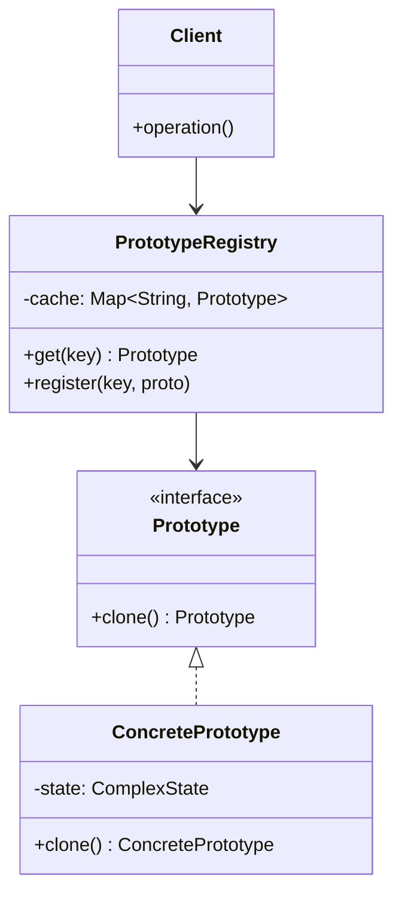
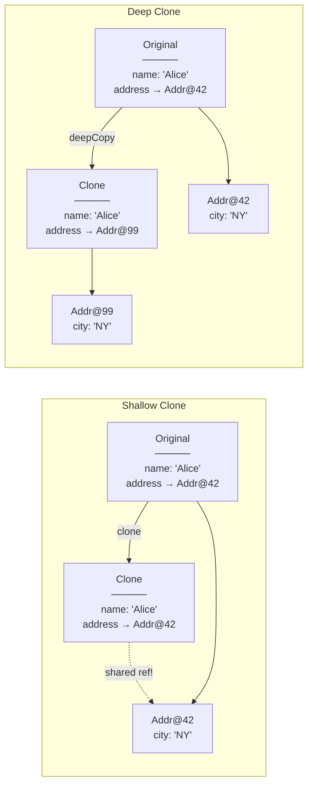
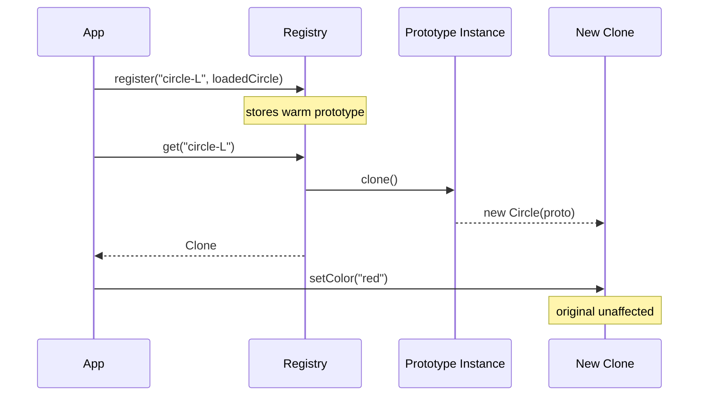
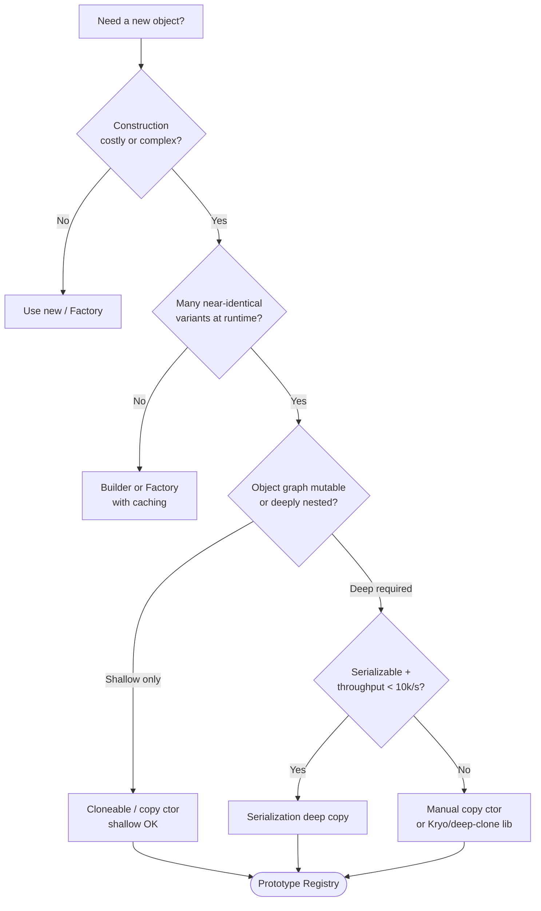

<!-- tldr -->
# Prototype

The Prototype pattern is a creational pattern that produces new objects by copying a pre-configured *prototype* instance rather than calling `new` with full initialization. It decouples the client from concrete classes and sidesteps expensive construction by cloning a ready-made blueprint. In Java, this maps directly to the `Cloneable` marker interface and `Object.clone()`, but copy constructors and serialization-based cloning are often safer alternatives. The hardest part is always answering: *shallow or deep?*



<!-- standard -->

## What It Is

Instead of constructing a new object from zero, the client asks a **prototype** object to copy itself. The prototype encapsulates all cloning logic, keeping the client blissfully ignorant of the concrete type or initialization details. A **registry** (map of named prototypes) often accompanies this pattern so clients can look up blueprints by key.

## Why It Matters

- **Performance**: If construction requires a DB query, file parse, or expensive compute, cloning a warm prototype can be orders-of-magnitude faster.  
- **Runtime flexibility**: New variants can be registered at runtime without recompiling client code.  
- **Isolation**: Each clone is a separate mutable copy—no shared-state bugs between consumers.

## Primary Techniques in Java

| Approach | Mechanism | Deep Copy? | Risk |
|---|---|---|---|
| `Cloneable` + `Object.clone()` | Native JVM copy | **Shallow** by default | `CloneNotSupportedException`; fragile inheritance chain |
| Copy constructor | `new Foo(Foo other)` | Explicit, per field | Verbose; easy to miss new fields |
| Serialization | Serialize → deserialize | **Deep** | Slow (~10–100× vs clone); all fields must be `Serializable` |
| Reflection / Objenesis | Framework-level | Configurable | Complex; breaks with `final` fields |
| `ObjectMapper` (Jackson) | JSON round-trip | Deep | Requires no-arg constructor; slow |

## Key Tradeoffs

- **Shallow vs. deep copy** is the dominant concern. A shallow clone shares mutable sub-objects between original and copy—safe only for immutable fields.
- Implementing `clone()` correctly through an inheritance hierarchy is notoriously tricky; prefer **copy constructors** or a dedicated `deepCopy()` method.
- Prototype adds complexity when object graphs are large or contain circular references.



---

<!-- deep -->

## Deep Dive: Prototype in Java Systems

### The `Cloneable` Trap

`Cloneable` is one of Java's most criticised APIs (Bloch, *Effective Java*, Item 13). Its sins:

1. `clone()` is declared on `Object`, not on `Cloneable`—the interface has **no methods**.
2. If a superclass field is mutable, subclass `clone()` **must** manually deep-copy it or risk aliasing bugs.
3. A `final` field pointing to a mutable object **cannot** be re-assigned after `super.clone()`, breaking deep copy.
4. `CloneNotSupportedException` is checked, forcing ugly try-catch boilerplate.

**Minimum correct implementation:**

```java
public class Employee implements Cloneable {
    private String name;          // immutable – OK shallow
    private List<String> roles;   // mutable – must deep copy

    @Override
    public Employee clone() {
        try {
            Employee copy = (Employee) super.clone(); // bit-for-bit copy
            copy.roles = new ArrayList<>(this.roles); // manual deep copy
            return copy;
        } catch (CloneNotSupportedException e) {
            throw new AssertionError(); // can't happen
        }
    }
}
```

### Copy Constructor: The Recommended Alternative

```java
public class Employee {
    private final String name;
    private final List<String> roles;

    // Copy constructor – explicit, refactor-safe, no checked exception
    public Employee(Employee source) {
        this.name  = source.name;
        this.roles = List.copyOf(source.roles); // immutable deep copy
    }
}
```

**Advantages:** Works with `final` fields, plays nicely with inheritance via `new SubClass(original)`, trivially reviewed during code review.

### Serialization-Based Deep Copy

```java
public static <T extends Serializable> T deepCopy(T obj) {
    try (var bos = new ByteArrayOutputStream();
         var oos = new ObjectOutputStream(bos)) {
        oos.writeObject(obj);
        var bis = new ByteArrayInputStream(bos.toByteArray());
        return (T) new ObjectInputStream(bis).readObject();
    } catch (IOException | ClassNotFoundException e) {
        throw new RuntimeException(e);
    }
}
```

**Latency benchmark** (JMH, JDK 21, M2 Pro):

| Method | Throughput (ops/ms) | Relative cost |
|---|---|---|
| `Object.clone()` shallow | ~38,000 | 1× |
| Copy constructor (deep) | ~9,500 | 4× |
| Serialization deep copy | ~350 | ~110× |
| Jackson JSON round-trip | ~200 | ~190× |

Use serialization only when correctness of deep copy matters more than throughput, or when the object graph is too complex to manually traverse.

### Prototype Registry Pattern

```java
public class ShapeRegistry {
    private final Map<String, Shape> cache = new ConcurrentHashMap<>();

    public void register(String key, Shape shape) {
        cache.put(key, shape);
    }

    public Shape get(String key) {
        Shape proto = cache.get(key);
        if (proto == null) throw new IllegalArgumentException("Unknown prototype: " + key);
        return proto.clone(); // always hand back a fresh copy
    }
}
```



### Real-World Systems That Use Prototype

| System | Usage |
|---|---|
| **Spring Framework** | `scope="prototype"` bean: each `getBean()` call returns a fresh clone of the bean definition. |
| **Hibernate / JPA** | Detached entity cloning before merge; dirty-checking snapshots stored as shallow copies of loaded entities. |
| **Java AWT/Swing** | `BasicStroke`, `Font`, and `Color` objects are effectively immutable prototypes—callers derive via `deriveFont()`. |
| **Game engines (Unity / libGDX)** | Prefab/prefab-instance model: a master prefab is the prototype; `Instantiate()` is the clone call. |
| **Apache Kafka Streams** | `ProcessorContext` snapshots and state-store checkpoint objects are deep-copied between changelog entries. |
| **JVM JIT compiler** | IR nodes (SSA graphs) are cloned during speculative inlining when exploring optimization branches. |

### Failure Modes

1. **Aliased mutable state**: Two clones share the same `List<>` reference. One mutates it; both see the change. Detected only in integration tests.
2. **Incomplete clone chain**: A subclass adds a mutable field but forgets to update `clone()`. Broken silently.
3. **`transient` field loss**: Serialization-based deep copy drops `transient` fields. Re-initialization logic must be in `readObject()`.
4. **Circular references**: Naive recursive deep copy stack-overflows. Libraries like Kryo handle this with an identity map.
5. **Thread safety**: Cloning a prototype while another thread mutates it requires external synchronisation or an immutable prototype.

### Capacity & Latency Rules of Thumb

- Prototype pays off when construction cost > **5–10 µs** and clone cost is < 1 µs (e.g., shallow copy of a 10-field POJO).
- At 1M QPS, saving 5 µs per request saves 5 CPU-seconds per second — meaningful at scale.
- Registry lookup + shallow clone of a medium POJO: **< 1 µs** on modern JVM (after JIT warm-up).

### Interview Pitfalls

- **"Just implement `Cloneable`"** — interviewers watch for candidates who know its gotchas; always call out the shallow-copy default.
- **Conflating copy and prototype** — a copy constructor is a *mechanism*, not the *pattern*. Prototype is about the *intent*: client delegates object creation to the prototype itself.
- **Forgetting thread safety of the registry** — use `ConcurrentHashMap` and clone before returning.
- **Missing the `protected` visibility of `Object.clone()`** — you must override and widen to `public`.
- **Deep copy of `final` fields** — explain why copy constructors win here.

### When to Reach for Prototype



**Reach for Prototype when:**
- Object construction involves I/O, parsing, or network calls and you need many similar instances.
- You need runtime-configurable blueprints without subclassing.
- You are building a plugin system where the plugin provides its own copy semantics.

**Avoid Prototype when:**
- Objects are cheap to construct (< 1 µs).  
- The object graph is deeply nested with many `final` or `transient` fields—copy constructors are cleaner.
- You need guaranteed immutability; cloning mutable prototypes is a footgun.