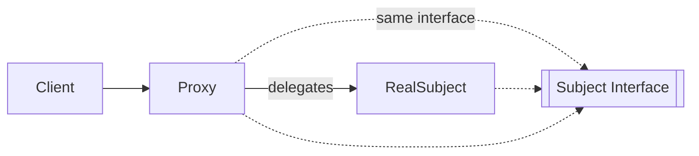
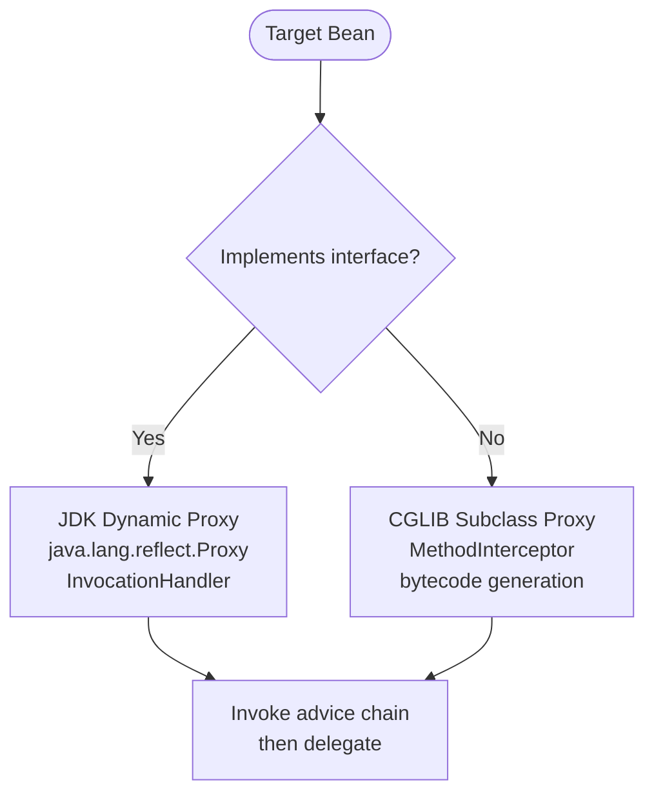
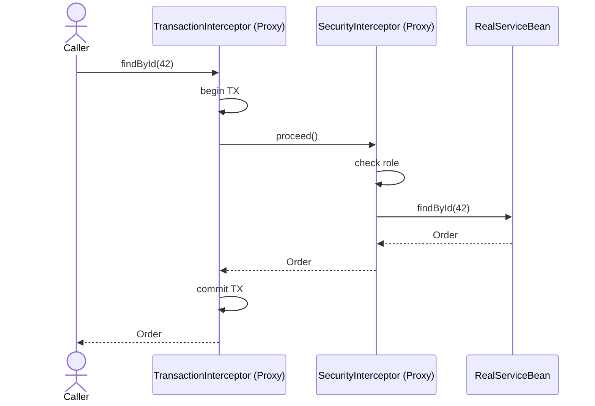

<!-- tldr -->
# Proxy Design Pattern in Java

A Proxy is a structural pattern that places an intermediary in front of a real object, sharing the same interface so callers are unaware of the indirection. The intermediary intercepts method calls, enabling lazy initialisation, access control, logging, caching, or remoting — cleanly separating concerns without touching business logic. In Java, proxies manifest from hand-rolled classes all the way up to JDK dynamic proxies and CGLIB subclass proxies powering Spring AOP.



<!-- standard -->

## What It Is

The Proxy pattern (GoF Structural, pg. 207) defines a **Subject** interface, a **RealSubject** implementing it, and a **Proxy** that also implements it while holding a reference to the RealSubject. Callers depend only on the Subject interface.

### Why It Matters

- **Decoupling**: callers never change when you swap a no-op proxy for a caching one.
- **Single-responsibility**: security, latency tracking, and retry logic live in the proxy, not the service.
- **Framework foundation**: Spring's transaction, security, and caching annotations all work because every `@Bean` that needs interception is secretly a proxy at runtime.

### The Four Classic Flavours

| Type | Intent | Java Example |
|---|---|---|
| **Virtual** | Defer expensive creation | Hibernate lazy-loaded `@OneToMany` collection |
| **Remote** | Represent an object in another JVM/process | Java RMI stub; gRPC generated stub |
| **Protection** | Enforce access rules before delegation | Spring Security method security proxy |
| **Smart Reference / Cache** | Add cross-cutting behaviour (logging, caching) | Spring AOP `@Cacheable`, `@Transactional` |

### JDK Dynamic Proxy vs CGLIB



- **JDK proxy**: interface-only; zero extra dependencies; `Proxy.newProxyInstance()` returns an object that IS-A Subject.
- **CGLIB**: subclasses the concrete class at runtime; `final` classes/methods cannot be proxied — a common interview trap.
- Spring Boot defaults to CGLIB (`proxyTargetClass = true` since Spring 5.x) to avoid the "must cast to interface" footgun.

### Key Tradeoffs

- **Performance**: JDK reflection adds ~10–30 ns per call; CGLIB generated bytecode is closer to direct invocation after JIT warm-up. Negligible vs. I/O, meaningful at 10M+ QPS in tight loops.
- **Debuggability**: stack traces grow with proxy depth; `$$SpringCGLIB$$0` suffixes can confuse new team members.
- **`final` limitation**: CGLIB cannot subclass `final` classes. Annotating `@Service` classes `final` in Kotlin requires `kotlin-allopen` plugin.

<!-- deep -->

## Deep Dive

### Hand-Rolled Proxy Skeleton

```java
public interface OrderService {
    Order findById(long id);
}

public class CachingOrderProxy implements OrderService {
    private final OrderService delegate;
    private final Cache<Long, Order> cache;

    public CachingOrderProxy(OrderService delegate, Cache<Long, Order> cache) {
        this.delegate = delegate;
        this.cache = cache;
    }

    @Override
    public Order findById(long id) {
        return cache.computeIfAbsent(id, delegate::findById);
    }
}
```

Clean, zero-framework, fully testable. Use this when you own both sides and the behaviour is narrow.

---

### JDK Dynamic Proxy — Runtime Mechanics

```java
OrderService proxy = (OrderService) Proxy.newProxyInstance(
    OrderService.class.getClassLoader(),
    new Class[]{OrderService.class},
    (proxyObj, method, args) -> {
        long t0 = System.nanoTime();
        try {
            return method.invoke(realService, args);
        } finally {
            metrics.record(method.getName(), System.nanoTime() - t0);
        }
    }
);
```

`method.invoke()` uses reflection. After JIT compilation the JVM may inline it, but cold-path P99 is ~100–200 ns vs ~1–2 ns for a direct call — irrelevant when the body does any I/O.

---

### Spring AOP Proxy Chain



Spring wraps advisors in a chain (ordered by `@Order` / `Ordered`). Each interceptor calls `MethodInvocation.proceed()` to hand off to the next — identical to the Chain-of-Responsibility pattern.

---

### Real-World Systems Using Proxy Semantics

| System | Proxy Role |
|---|---|
| **Hibernate / JPA** | Virtual proxy for lazy `@ManyToOne`; collection proxy for `@OneToMany` (`PersistentBag`) |
| **Spring `@Transactional`** | CGLIB proxy opens/commits/rolls-back transactions; self-invocation breaks this |
| **gRPC / Thrift stubs** | Remote proxy generated from `.proto`; hides serialisation and network |
| **Feign / OpenFeign** | JDK dynamic proxy over annotated interface; HTTP call is the delegation |
| **Java RMI** | Oldest Java remote proxy; `RemoteObject` stub generated by `rmic` |
| **Mockito** | CGLIB/ByteBuddy subclass or JDK proxy; intercepts calls to return stubs |

---

### Failure Modes & Pitfalls

#### 1. Self-Invocation (the #1 Spring interview pitfall)
```java
@Service
public class InvoiceService {
    @Transactional
    public void process() { this.save(); }   // ← bypasses proxy!

    @Transactional(propagation = REQUIRES_NEW)
    public void save() { /* ... */ }
}
```
`this.save()` calls the raw object, not the proxy → the inner `@Transactional` is silently ignored. Fix: inject the bean into itself (`@Autowired InvoiceService self`) or use `AopContext.currentProxy()`.

#### 2. `final` Classes in Kotlin
Kotlin classes are `final` by default. CGLIB throws `Cannot subclass final class`. Use `open` keyword or the `kotlin-allopen` Gradle plugin.

#### 3. Proxy Type Mismatch
With JDK proxy, casting to a concrete class throws `ClassCastException`. Always program to the interface or set `proxyTargetClass = true`.

#### 4. Thread Safety of Lazy Virtual Proxy
Double-checked locking for lazy init:
```java
private volatile RealSubject subject;

public Response call() {
    if (subject == null) {
        synchronized (this) {
            if (subject == null) subject = new RealSubject();
        }
    }
    return subject.call();
}
```
`volatile` ensures visibility across cores; omitting it is a classic data-race bug.

---

### Capacity / Latency Reference Points

| Scenario | Overhead |
|---|---|
| JDK proxy dispatch (warm JIT) | ~10–30 ns/call |
| CGLIB dispatch (warm JIT) | ~2–5 ns/call |
| Spring `@Transactional` (DB round-trip) | dominated by DB ~1–10 ms |
| Hibernate lazy-load collection (N+1) | 1 extra SQL × N rows; at 1,000 rows = 1,000 queries |
| Feign HTTP proxy | ~1–50 ms network latency |

---

### Decision Rubric — When to Reach for Proxy

```
1. Need to intercept calls transparently?  → Proxy (not Decorator if callers shouldn't know)
2. Cross-cutting concern (TX, auth, cache)? → Spring AOP proxy — avoid boilerplate
3. Remote call hiding?                      → Remote proxy (Feign, gRPC stub)
4. Expensive object, defer creation?        → Virtual proxy (Hibernate lazy, CompletableFuture)
5. Need to vary behaviour per caller?       → Protection proxy
6. Proxy wrapping a different interface?    → That's Adapter, not Proxy
7. Adding behaviour with awareness?         → Decorator is cleaner (wraps same contract but caller knows)
```

---

### Interview Checklist

- [ ] Distinguish Proxy vs Decorator (same interface; Proxy controls *access*, Decorator *adds behaviour* — both are structural and structurally similar; the intent is the differentiator).
- [ ] Explain self-invocation failure and three fixes.
- [ ] Know when Spring chooses JDK vs CGLIB and how to override.
- [ ] Describe how `@Transactional` is implemented end-to-end using a proxy chain.
- [ ] Discuss N+1 as a consequence of misconfigured virtual proxy (lazy loading).
- [ ] ByteBuddy as a modern alternative to CGLIB (used by Mockito 2+, Spring 6 experiments).