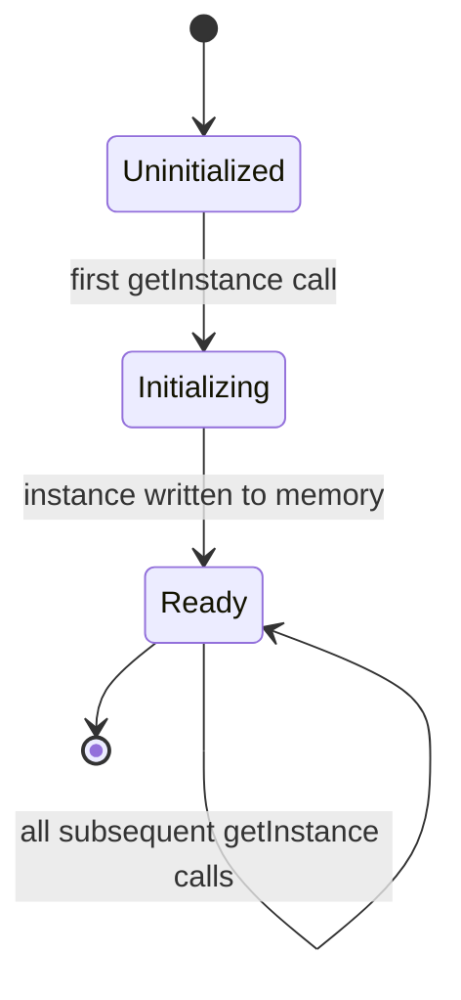
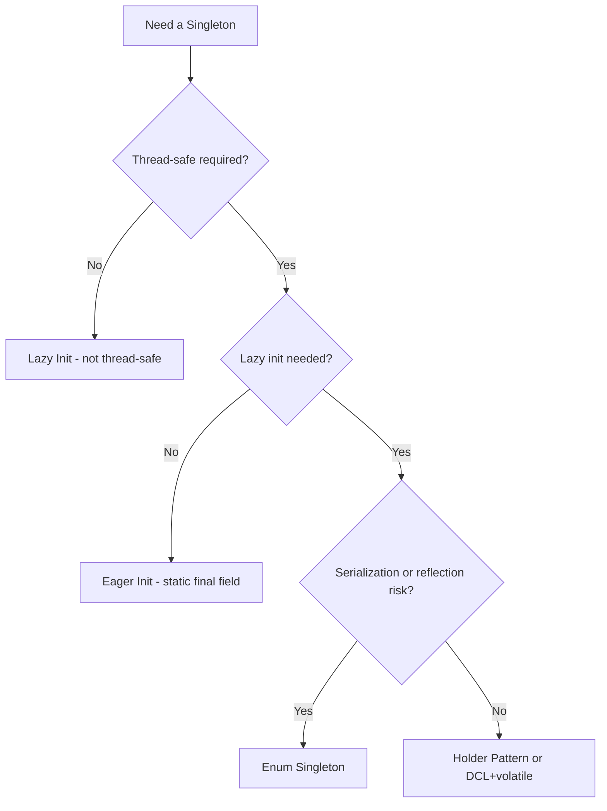
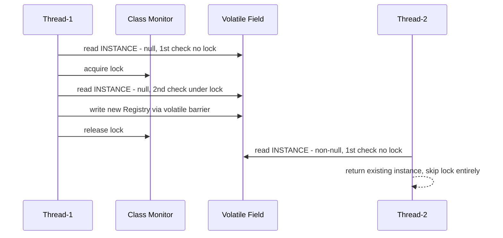

<!-- tldr -->
# Singleton

The Singleton pattern restricts a class to a single instance and exposes a global access point to it. In Java, naïve implementations are subtly broken—the JVM memory model, multiple classloaders, serialization, and reflection each create separate paths to constructing a second instance. Five distinct strategies exist, trading laziness, thread safety, and bullet-proofness against each other. Knowing which to reach for, and why the others fail, is a staple FAANG interview question.



<!-- standard -->

## What It Is

A class that manages its own sole instance via a private constructor and a static factory (`getInstance()`). Most useful for shared, expensive-to-create resources: thread pools, config registries, driver managers, and logging facades.

## Why It Matters

- **Shared-state correctness**: Two independent instances of a connection pool or circuit-breaker cause split-brain bugs.
- **Resource efficiency**: One logger/registry vs. N copies per component reduces GC pressure and contention.
- **JVM subtlety**: Java's memory model (JSR-133), classloaders, serialization, and reflection each independently break naïve implementations.

## Five Implementations

| Strategy | Thread-Safe | Lazy | Serialization-Safe | Reflection-Safe |
|---|---|---|---|---|
| Eager — `static final` field | ✅ | ❌ | ❌ | ❌ |
| Synchronized `getInstance()` | ✅ | ✅ | ❌ | ❌ |
| Double-Checked Locking (DCL) + `volatile` | ✅ | ✅ | ❌ | ❌ |
| Initialization-on-Demand Holder | ✅ | ✅ | ❌ | ❌ |
| **Enum** | ✅ | ❌ | ✅ | ✅ |

## Key Tradeoffs

- **Eager vs. lazy**: Eager init is trivially correct; lazy defers cost but demands synchronization machinery.
- **Performance**: A fully `synchronized getInstance()` acquires a monitor on every call (~50–200 ns under contention). DCL amortizes that to one `volatile` read (~1–5 ns) after initialization.
- **Testability**: A hard Singleton is untestable in isolation. Prefer DI-container-managed singletons (Spring `@Bean`, Guice `@Singleton`) so tests can inject stubs.
- **Enum caveat**: Cannot extend a base class; use only for true leaf-node singletons.



<!-- deep -->

## Algorithms & JVM Internals

### Double-Checked Locking (DCL)

```java
public final class Registry {
    // volatile prevents instruction reordering AND guarantees visibility
    private static volatile Registry INSTANCE;

    private Registry() { /* expensive init */ }

    public static Registry getInstance() {
        if (INSTANCE == null) {                // 1st check — no lock
            synchronized (Registry.class) {
                if (INSTANCE == null) {         // 2nd check — under lock
                    INSTANCE = new Registry();  // volatile write — safe publish
                }
            }
        }
        return INSTANCE;
    }
}
```

**Why `volatile` is non-negotiable (Java ≥ 5, JSR-133):**
`new Registry()` compiles to three JIT-reorderable steps: (a) allocate memory, (b) assign reference to `INSTANCE`, (c) run constructor body. Without `volatile`, Thread-2 can observe a non-null but half-constructed object at the 1st check. `volatile` inserts a happens-before fence, ensuring the constructor fully completes before the write to `INSTANCE` becomes visible to any other thread.

---

### Initialization-on-Demand Holder (preferred over DCL)

```java
public final class Registry {
    private Registry() {}

    private static final class Holder {
        // JVM class-init lock guarantees this runs exactly once per classloader
        static final Registry INSTANCE = new Registry();
    }

    public static Registry getInstance() {
        return Holder.INSTANCE; // triggers Holder.<clinit> on first access only
    }
}
```

The JVM spec guarantees `<clinit>` executes under a monitor lock exactly once per classloader. No explicit `synchronized`, no `volatile`, zero overhead after first call. **This is the idiomatic Java answer for lazy + thread-safe with no DI framework.**

---

### Enum Singleton (bullet-proof)

```java
public enum Registry {
    INSTANCE;
    public void doWork() { /* ... */ }
}
```

- JVM serialization spec: `Enum` deserialization never creates a new instance — it resolves by name to the existing constant.
- Reflection: `Constructor.newInstance()` on an enum throws `IllegalArgumentException` unconditionally.
- Downside: not lazy; cannot `extend` a concrete base class.

---



---

## Real-World Systems

| System | Singleton Usage |
|---|---|
| **Spring IoC** | Default bean scope is singleton per `ApplicationContext` — **not JVM-wide** (a common interview gotcha) |
| **HikariCP** | `HikariDataSource` is typically a singleton; multiple instances create separate pools with separate thread-pool overhead |
| **Log4j 2 / SLF4J** | `LogManager` / `LoggerFactory` — eagerly initialized process-wide singletons |
| **JDK Runtime** | `Runtime.getRuntime()`, `System.getSecurityManager()`, `Desktop.getDesktop()` — all Holder/Eager patterns |
| **JDBC DriverManager** | Maintains a `static` `CopyOnWriteArrayList` of drivers — global mutable singleton state |
| **Kafka KafkaProducer** | Typically singleton-scoped per client app; creating multiple producers per topic wastes TCP connections and buffers |

---

## Failure Modes

### 1. Multiple Classloaders
In OSGi containers or application servers (Tomcat with multiple WAR files), each `ClassLoader` has independent static state. The same Singleton class loaded by two classloaders yields **two distinct instances sharing no state**. Fix: load the Singleton from a shared parent classloader, or delegate to JNDI/CDI.

### 2. Serialization Breaks Non-Enum Singletons
`ObjectInputStream.readObject()` invokes the constructor reflectively, bypassing `getInstance()`. Without a guard, you get a second instance. Fix:

```java
// Add to any serializable Singleton (DCL / Holder)
protected Object readResolve() {
    return INSTANCE; // discard the deserialized copy
}
```
Enum handles this automatically — no `readResolve` needed.

### 3. Reflection Attacks
`Constructor.setAccessible(true)` bypasses `private`. Guard with:

```java
private Registry() {
    if (INSTANCE != null) {
        throw new IllegalStateException("Use getInstance()");
    }
}
```
Or just use Enum, which prevents this at the JVM level.

### 4. Non-`final` Class
A non-`final` Singleton can be subclassed; the subclass's `<clinit>` may trigger a second construction path. Always declare Singletons `final`.

### 5. Spring ≠ JVM Singleton
`@Scope("singleton")` in Spring means one instance per `ApplicationContext`. Two context instances = two "singletons". In tests that `new AnnotationConfigApplicationContext(...)` multiple times, this is a frequent source of state leaks.

---

## Capacity & Latency Numbers

| Operation | Approximate Cost |
|---|---|
| `volatile` read — uncontended post-init (Holder / DCL) | 1–5 ns |
| Uncontended `synchronized` block | 15–40 ns |
| Contended `synchronized` block (8 threads) | 50–500 ns |
| Class-init lock — Holder, one-time | ~1 µs, amortized to 0 thereafter |
| Enum constant access | ~1 ns — direct static field read |

At 1M QPS, a fully `synchronized getInstance()` under even moderate contention adds ~0.5 ms aggregate overhead per second — negligible at low scale but measurable in hot paths.

---

## Interview Pitfalls

1. **"Just add `synchronized` to `getInstance()`"** — correct but scales poorly. Interviewers want you to propose DCL or Holder and explain why.
2. **Forgetting `volatile` in DCL** — partial construction is a real hardware-observable bug on x86 store-buffer forwarding, not just a theoretical concern.
3. **Spring singleton ≠ JVM singleton** — conflating the two signals shallow Spring knowledge.
4. **Testability blind spot** — a senior answer always flags that hard Singletons resist mocking; propose an interface + DI-injected implementation.
5. **Enum can't extend** — don't suggest Enum when the Singleton must subclass a framework base class (e.g., `AbstractScheduler`).
6. **Distributed systems** — claiming Singleton solves cross-JVM uniqueness. It doesn't. That requires external coordination (ZooKeeper, etcd, Redis `SETNX`).

---

## Decision Rubric

| Situation | Recommendation |
|---|---|
| Spring / Guice available | DI-managed singleton — never hand-roll |
| No DI, need lazy + thread-safe | **Initialization-on-Demand Holder** |
| Need serialization + reflection safety, no inheritance | **Enum Singleton** |
| Simple eager init, no serialization concern | `private static final T INSTANCE = new T()` |
| Multiple classloaders (OSGi, app server) | Shared parent classloader or JNDI |
| Distributed system — multiple JVMs | Do not use Singleton; use distributed coordination (ZooKeeper, etcd, Redis) |

> **When NOT to reach for Singleton**: any time a DI container is in scope. Singletons couple callers to a concrete class, make unit tests fragile, and provide no lifecycle hooks. Let the container manage scope and inject a shared instance through an interface.