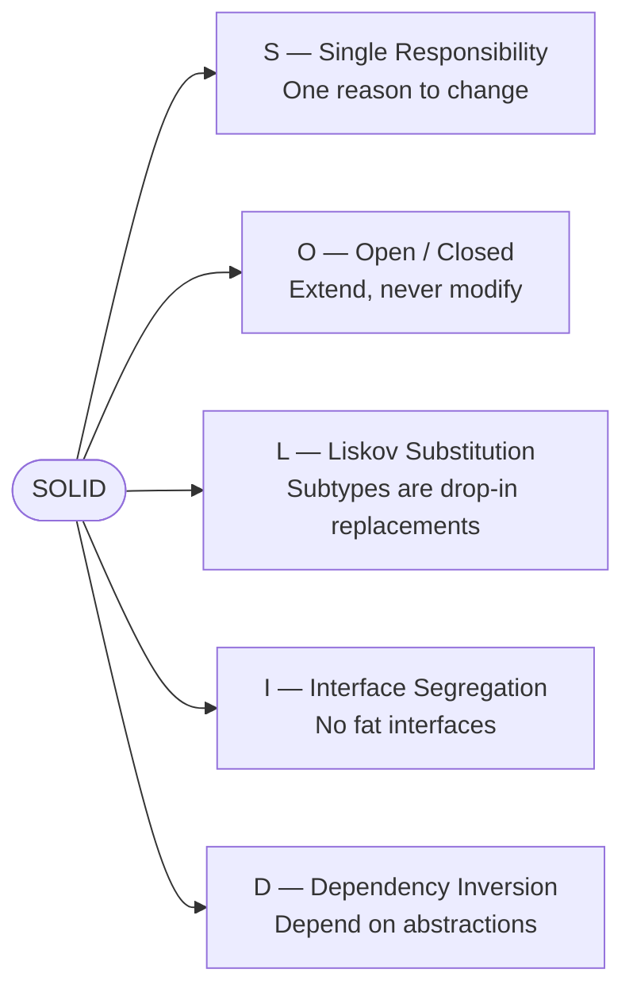
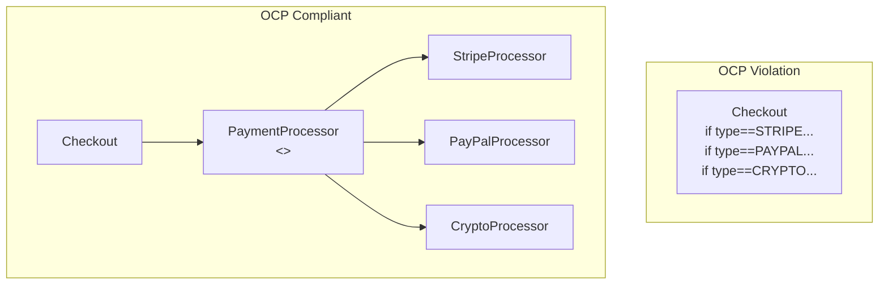
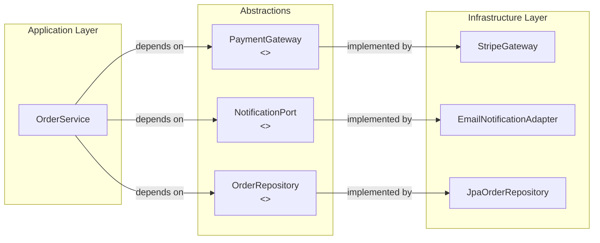
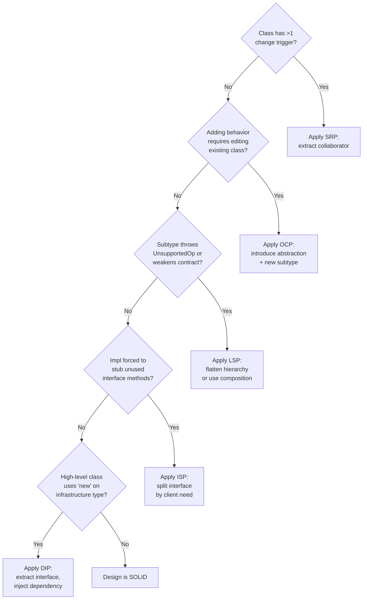

<!-- tldr -->
# SOLID Principles

SOLID is an acronym for five object-oriented design principles — Single Responsibility, Open/Closed, Liskov Substitution, Interface Segregation, and Dependency Inversion — codified by Robert C. Martin. They collectively push a codebase toward low coupling, high cohesion, and classes with narrow, stable contracts. Violating any principle typically materialises as classes that are impossible to unit-test in isolation, fragile under requirement change, or impossible to extend without modifying production code already in use.



<!-- standard -->

## What Each Principle Demands

**Single Responsibility (SRP):** A class should have exactly one reason to change — one actor owning its behavior. An `OrderService` that also formats PDF invoices and sends emails violates SRP: a layout change forces a recompile of business logic.

**Open/Closed (OCP):** Existing, tested code should be *open for extension* via new subtypes or strategy injection, *closed for modification*. The canonical Java expression is adding a new `PaymentProcessor` implementation without touching the `Checkout` class.

**Liskov Substitution (LSP):** Any code that works with a `Bird` reference must work correctly if handed a `Penguin`. If a subtype throws `UnsupportedOperationException` or silently weakens a postcondition, it breaks LSP and every polymorphic call site.

**Interface Segregation (ISP):** Clients should not be forced to depend on methods they do not use. Split a 12-method `UserRepository` into `UserReadRepository` and `UserWriteRepository`; read-only services then have no compile-time dependency on write methods.

**Dependency Inversion (DIP):** High-level modules must not import concrete low-level modules; both should import an abstraction. In Java this means `OrderService` accepts `PaymentGateway` (interface), not `StripePaymentGateway` (class).

## Quick Reference

| Principle | Key Signal of Violation | Java Fix |
|---|---|---|
| SRP | Class imports unrelated packages (e.g., `javax.mail` + domain logic) | Extract collaborator; inject via constructor |
| OCP | `switch`/`instanceof` chains grow with every new type | Strategy / Visitor pattern |
| LSP | Overridden method throws `UnsupportedOperationException` | Redesign hierarchy; prefer composition |
| ISP | `@Override` methods with empty bodies or stubs | Split interface; use role interfaces |
| DIP | `new ConcreteService()` inside a high-level class | Constructor injection; Spring `@Autowired` |



<!-- deep -->

## Deep Dive: SOLID in Production Java Systems

### Single Responsibility — Beyond the Textbook

SRP is not "one method per class." Robert Martin's precise definition is **one actor** (one team / one business concern) as the sole source of change requests.

**Practical heuristic:** count the number of distinct `import` domains at the top of a class. An `OrderService` importing `java.sql`, `javax.mail`, `com.itextpdf`, and domain packages has four change axes. Each should be its own collaborator injected via interface.

**Failure mode in microservices:** A service that owns both read (CQRS query) and write (command) paths, plus outbox event publishing, ends up with three separate deployment cadences colliding in one codebase. At Netflix scale (~millions of order events/day), this routinely causes unrelated rollbacks.

---

### Open/Closed — The Strategy + Registry Pattern

A mature Java implementation uses a registry map rather than a `switch`:

```java
// Registered at startup — zero modification for new types
Map<String, PaymentProcessor> processors = Map.of(
    "stripe",  new StripeProcessor(config),
    "paypal",  new PayPalProcessor(config),
    "crypto",  new CryptoProcessor(config)
);

// High-level code never changes
PaymentProcessor p = processors.get(order.getPaymentMethod());
p.process(order);
```

Spring's `@Component` + `Map<String, PaymentProcessor>` auto-injection achieves this with zero boilerplate. Adding a new processor is a single class annotated `@Service("venmo")`.

**Real-world anchor:** Spring's `HandlerMapping` chain follows OCP — Spring MVC adds `RequestMappingHandlerMapping`, `RouterFunctionMapping`, etc. without modifying `DispatcherServlet`.

---

### Liskov Substitution — The Formal Contract

LSP can be verified against three rules:

| Rule | Requirement |
|---|---|
| Preconditions | Subtype may only *weaken* preconditions (accept a wider input) |
| Postconditions | Subtype may only *strengthen* postconditions (guarantee a narrower output) |
| Invariants | Class-level invariants must hold in every subtype |

**Classic Java violation:** `java.util.Stack extends Vector`. `Stack` exposes `insertElementAt()` (inherited from `Vector`), which violates the LIFO invariant. A method typed as `Stack<T>` can have its invariant broken by a caller holding a `Vector<T>` reference.

**Interview trap:** The `Rectangle → Square` example. A `Square` that overrides `setWidth` to also set height violates LSP because a test like `rect.setWidth(5); rect.setHeight(10); assert area == 50` silently fails for `Square`. The fix is not inheritance — model both as separate value objects implementing a `Shape` interface.

---

### Interface Segregation — Measuring Fat Interfaces

**Rule of thumb:** if more than ~20% of an interface's methods are stubbed or throw `UnsupportedOperationException` across your implementations, the interface is too broad.

In Kafka's client library, `Consumer<K,V>` and `Producer<K,V>` are deliberately segregated. A `KafkaConsumer` has no `send()` method; testing a consumer pipeline requires only a `MockConsumer`, not a full broker-connected object.

**Java 8+ mitigation:** `default` methods let you add behavior to an interface without breaking existing implementors — but they are *not* a license to bloat interfaces. Use them for optional lifecycle hooks (e.g., `default void close() {}`), not core contracts.

---

### Dependency Inversion — Spring IoC as Living Proof

DIP is the structural enabler of testability. Every Spring application is an implementation:



At test time, `StripeGateway` is replaced with `StubPaymentGateway` in milliseconds — no network call, no transaction overhead. This is why DIP directly controls your unit-test execution time (target: <100 ms per test, no I/O).

**DynamoDB example:** AWS's SDK `DynamoDbClient` is an interface. Amazon ships `DynamoDbClient.create()` for production and `DynamoDbEnhancedClient` wraps it. Your `UserRepository` implementation should accept `DynamoDbClient`; swapping to `DynamoDbLocal` in CI takes one line.

---

### Failure Modes Under Scale

| Violation | Symptom at Scale | Cost |
|---|---|---|
| SRP ignored | 10k-line God class; 50+ merge conflicts/sprint | 40-60% developer velocity loss |
| OCP ignored | New payment type requires touching 12 files | Regression rate spikes; P0 risk each deploy |
| LSP broken | Polymorphic code needs `instanceof` guards to be safe | Every polymorphic call site becomes a bug magnet |
| ISP ignored | Microservice stub implements 30 unused methods | Mock maintenance overhead; contract drift |
| DIP violated | `new` in business logic; zero unit tests possible | CI suite requires full Docker stack; 10-min feedback loop instead of 10-second |

---

### Capacity & Latency Touchpoints

- Constructor injection (DIP) adds **zero** runtime overhead vs. `new` — resolved once at startup by the IoC container.
- Spring's `ApplicationContext` startup with 500 beans: ~800 ms cold start; GraalVM native image cuts it to ~50 ms.
- An interface dispatch in JIT-compiled Java has ~1–3 ns overhead vs. direct invocation — irrelevant at every scale except tight numeric loops.

---

### Interview Pitfalls

1. **"SOLID means more classes."** Wrong framing. It means *focused* classes. Ten 50-line classes beat one 500-line class for testability and parallel development.
2. **Confusing ISP and SRP.** SRP is about *reasons to change* (actor-driven); ISP is about *client-specific interfaces* (consumer-driven). A class can satisfy SRP and still expose a fat interface.
3. **OCP does not mean immutable code.** Bug fixes modify existing classes — that is expected. OCP governs *feature extension* paths.
4. **LSP is a runtime contract, not just a compile-time one.** Java's type system cannot enforce LSP; you need tests (contract tests with `@ParameterizedTest` over all subtypes).
5. **Over-engineering DIP.** Not every `new LocalDate()` is a DIP violation. Apply DIP where the concrete depends on I/O, external state, or volatile business rules.

---

### Decision Rubric: When to Actively Apply Each Principle



Apply these principles **before** the first feature lands in a new module; retrofitting onto a 100k-line codebase costs 3–6x more than designing correctly up front.