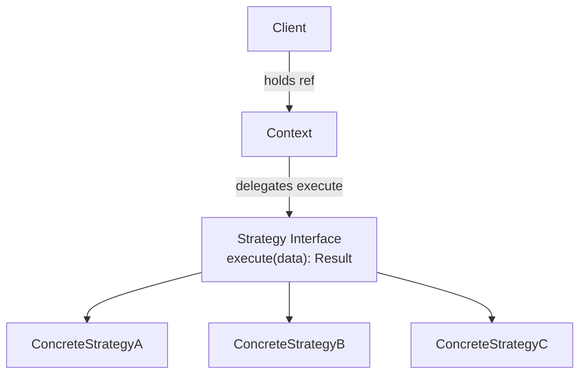
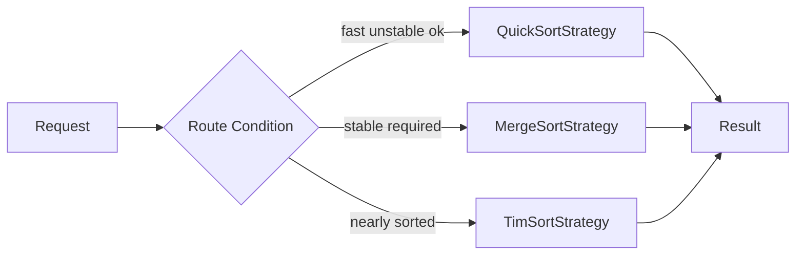
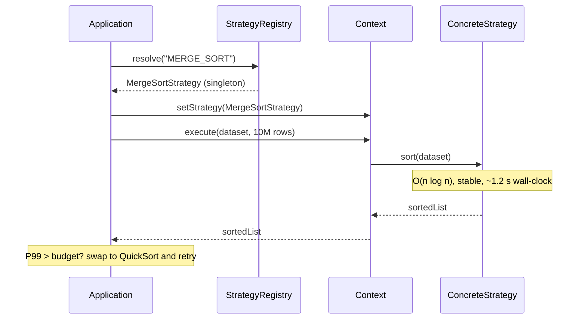

<!-- tldr -->
# Strategy Pattern

The Strategy pattern separates **what** an algorithm does from **who calls it**: a `Context` holds a reference to a `Strategy` interface and delegates its core operation there. Concrete implementations are injected at construction time or via a setter and swapped without touching the client. In Java 8+, any single-abstract-method `Strategy` interface collapses to a `@FunctionalInterface`, replacing anonymous classes with lambdas entirely.



<!-- standard -->

## What It Is

Strategy is a **behavioural** GoF pattern built on composition over inheritance. A `Context` object owns a `Strategy` reference and knows nothing about the concrete class wired in. The pattern enforces the **Open/Closed Principle**: adding a new algorithm means a new class, not editing existing ones. It also satisfies the **Dependency Inversion Principle** — both `Context` and strategies depend on the abstraction, never on each other.

## Why It Matters

- Eliminates sprawling `if/else` or `switch` blocks that grow with every new variant.
- Strategies are independently unit-testable with no framework dependencies.
- In Java, any SAM strategy interface is trivially a `@FunctionalInterface`, enabling lambda injection.
- Enables runtime behaviour changes driven by user preferences, feature flags, or A/B experiments.

## Primary Techniques

| Technique | When to use |
|---|---|
| Constructor injection | Strategy fixed for object lifetime; promotes immutability |
| Setter injection | Must change at runtime — user prefs, A/B test, tenant config |
| `EnumMap<Key, Strategy>` | Finite known variants; O(1) dispatch without switch |
| Factory / Registry | Strategy resolved from config key; centralises creation |
| Lambda / method reference | One-liner strategies; eliminates anonymous class boilerplate |

## Key Tradeoffs

- **Class proliferation**: each algorithm becomes a class; small variants inflate the package count fast.
- **Shared state**: stateful strategies are not thread-safe by default — prefer immutable strategies; use prototype-scope beans in Spring when state is unavoidable.
- **Discoverability**: callers must know valid strategy keys; a typed `enum` or `sealed interface` makes invalid keys a compile error.
- **Overhead**: virtual dispatch costs ~1–5 ns post-JIT and is negligible below ~100 M calls/s. Megamorphic dispatch (> 3 hot concrete types) blocks JIT inlining — worth measuring on hyper-critical paths.



<!-- deep -->

## Deep Dive: Strategy Pattern

### Canonical Java Implementation

```java
@FunctionalInterface
public interface SortStrategy<T extends Comparable<T>> {
    void sort(List<T> data);   // SAM — lambda-compatible
}

public final class Sorter<T extends Comparable<T>> {
    private SortStrategy<T> strategy;

    public Sorter(SortStrategy<T> strategy) {
        this.strategy = Objects.requireNonNull(strategy);
    }

    public void setStrategy(SortStrategy<T> s) {
        this.strategy = Objects.requireNonNull(s);
    }

    public void sort(List<T> data) { strategy.sort(data); }
}

// Lambda replaces anonymous class; method ref replaces lambda
Sorter<Integer> s = new Sorter<>(list -> Collections.sort(list));
s.setStrategy(list -> list.sort(Comparator.reverseOrder())); // hot-swap
```

**Key decisions:**
- `@FunctionalInterface` enforces the SAM contract at compile time — a second abstract method becomes a build error.
- `Objects.requireNonNull` in both constructor *and* setter prevents a null strategy from silently failing deep in the call stack.
- Generics keep `Context` type-safe with no casts.

### Strategy vs. Template Method — The Definitive Split

| Dimension | Strategy | Template Method |
|---|---|---|
| Mechanism | **Composition** (has-a) | **Inheritance** (is-a) |
| Algorithm boundary | Entire algorithm delegated | Fixed skeleton; steps overridden |
| Runtime swap | Yes — reference reassigned | No — class chosen at instantiation |
| Java 8+ idiom | Lambda / method reference | Default methods on abstract class |
| Testability | Inject mock; no subclassing needed | Must subclass or use spy |
| Coupling | Context decoupled from impl | Subclass tightly coupled to parent |

### Real-World Occurrences

**JDK**
- `java.util.Comparator` — the archetypal Java strategy. `List.sort(comparator)` dispatches to whatever `compare` implementation is passed; chaining via `thenComparing` composes strategies.
- `java.util.concurrent.RejectedExecutionHandler` — `ThreadPoolExecutor` delegates queue-full policy to `AbortPolicy`, `CallerRunsPolicy`, `DiscardOldestPolicy`, or a custom impl.
- `javax.net.ssl.SSLContext` / `KeyManager` / `TrustManager` — cipher-suite negotiation and certificate validation are strategy slots.

**Frameworks**
- **Spring**: `PlatformTransactionManager`, `ResourceLoader`, `AuthenticationProvider`, and `MessageConverter` are all strategies injected by DI. Swapping JPA to JDBC transactions means a one-line bean change, not code rewrites.
- **Hibernate**: `IdentifierGenerator` (UUID, sequence, table, custom) is a pure strategy; configured per-entity in annotations.
- **Kafka**: `org.apache.kafka.clients.producer.Partitioner` — round-robin, sticky, and custom are concrete strategies. A poorly written custom partitioner doing blocking I/O inside `partition()` can add **+2–10 ms P99** latency by starving the sender thread.

**Distributed Systems**
- **Cassandra** replica-placement: `AbstractReplicationStrategy` governs how replicas are distributed. `SimpleStrategy` (ignores rack topology) vs. `NetworkTopologyStrategy` (rack-aware) is a literal strategy swap in `cassandra.yaml`. Choosing wrongly can drop availability from 99.99% to 99.9% under a rack failure because replicas co-locate on the same physical rack.
- **Elasticsearch**: `MergePolicy` and `IndexDeletionPolicy` on each shard engine are strategy objects. Tuning `TieredMergePolicy.maxMergeAtOnce` from 10 → 5 can cut P99 indexing latency by ~30% on write-heavy clusters.

### Sequence: Runtime Strategy Dispatch



### Failure Modes

1. **Null strategy** — missed `requireNonNull` causes `NullPointerException` deep inside `Context.execute()`; guard in *both* constructor and setter.
2. **Mutable shared strategy** — a single stateful strategy instance shared across threads corrupts internal state under concurrency. Fix: make strategies stateless (strongly preferred), use `ThreadLocal<Strategy>`, or configure prototype scope in Spring.
3. **Strategy leaking context** — a strategy that back-references `Context` creates circular dependency and complicates testing. Pass only the minimal data slice needed to `execute()`, not the entire context object.
4. **Registry key drift** — string-keyed registries (`Map<String, Strategy>`) break silently at runtime when keys are renamed. Replace with an `enum` key or `sealed interface` variants to make invalid keys a compile error.
5. **Megamorphic dispatch hot path** — the JIT inlines virtual calls aggressively when ≤ 2 concrete types are hot. Once a third type becomes frequent on the same call site, the JIT deoptimises to a vtable lookup (~5–15 ns/call). Profile with `perf` or async-profiler before assuming strategy overhead is negligible on paths exceeding 50 M calls/s.

### Capacity & Latency Numbers

| Scenario | Observed |
|---|---|
| JIT-inlined bimorphic virtual dispatch | ~1–3 ns/call after ~10 k warm-up invocations |
| Megamorphic dispatch (> 3 hot concrete types) | ~5–15 ns/call |
| Spring singleton strategy lookup via DI | ~50–200 ns (single `ConcurrentHashMap` lookup) |
| Kafka custom `Partitioner` with blocking I/O | +2–10 ms P99 on producer send path |
| Cassandra `NetworkTopologyStrategy` vs `SimpleStrategy` | < 1 ms coordination overhead; correctness dwarfs perf |

### Interview Pitfalls

- **"It's just polymorphism."** True — Strategy *is* runtime polymorphism via composition. The value is the explicit, injectable, swappable boundary and what it enables architecturally. Articulate that clearly; vague answers signal surface-level knowledge.
- **Forgetting lambdas.** Any Java 8+ interviewer expects: *"`Comparator` is the canonical JDK strategy; any SAM interface becomes a strategy via lambda."* Silence here is a red flag.
- **Confusing Strategy with State.** State *transitions itself* — the concrete state object is responsible for changing the context's state reference. In Strategy, the context's owner drives the swap. The difference is who controls the change.
- **Omitting thread safety.** Stateless strategies are inherently thread-safe and singleton-able. Stateful ones are not. Mention this unprompted; it signals you've used the pattern in production.
- **Over-applying.** If there will never be more than two variants and they won't change, a simple `if/else` is more readable. Demonstrating awareness of the cost of abstraction impresses senior panels.

### When to Reach for Strategy — Decision Rubric

```
≥ 3 algorithm variants, or new-variant growth expected?
  └─ YES → Strategy

Are variants finite and known at compile time, zero runtime selection?
  └─ YES → sealed interface + pattern matching (Java 21+) / EnumMap dispatch

Do variants share a common skeleton with only a few differing steps?
  └─ YES → Template Method (or interface with default methods)

Is the variant a one-liner that never needs independent testing?
  └─ YES → inline lambda directly — skip the named interface

Otherwise → Strategy
```

**Reach for Strategy when:**
- The algorithm is a genuine **variation point**: tenant-specific logic, user-configurable preferences, plugin architectures, or A/B-tested algorithms.
- Each variant needs **independent unit tests** and its own performance profile.
- Behaviour must change **without recompilation** — config-driven or DI-wired systems.

**Avoid when:**
- The variation is trivial and the codebase has low churn — abstraction cost outweighs benefit.
- The algorithm has many shared steps; Template Method or a default-method interface is more expressive.
- The hot path exceeds ~50 M calls/s and profiling shows megamorphic dispatch overhead — consider a sealed type hierarchy with `switch` expressions for JIT-friendly monomorphic dispatch.