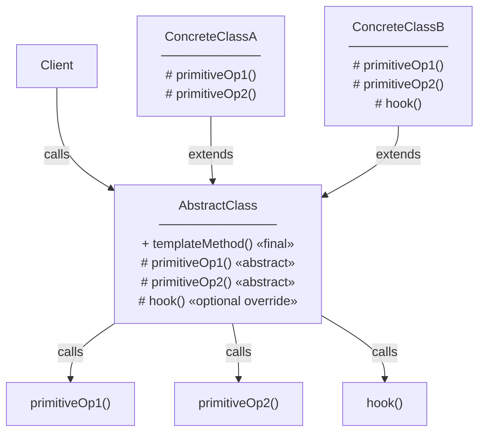
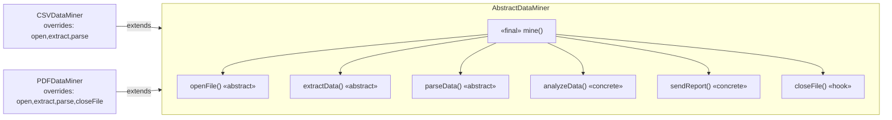
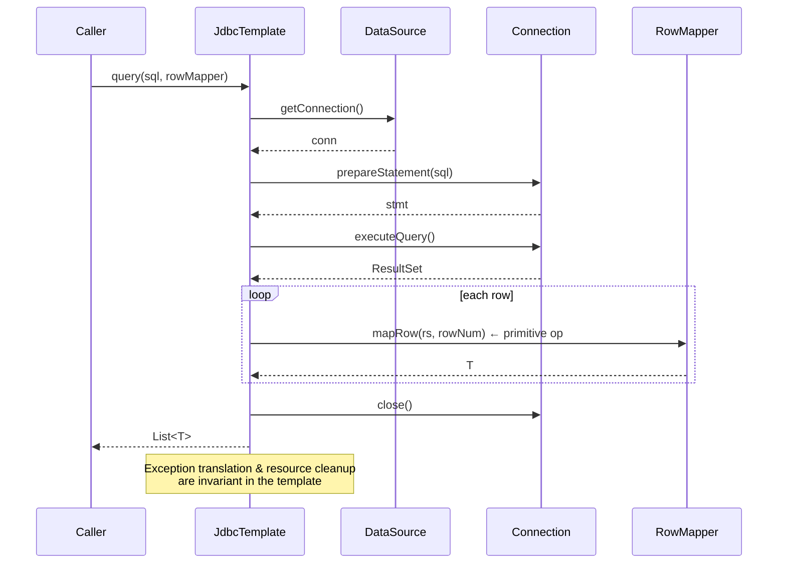

<!-- tldr -->
# Template Method

Template Method is a behavioral pattern where a base class defines the **invariant skeleton** of an algorithm as a `final` method, calling abstract or overridable hook methods that subclasses fill in. The base class drives control flow ("Hollywood Principle: don't call us, we'll call you"). It eliminates duplicate scaffolding across variants while locking the overall sequence. Java's standard library uses it pervasively — `HttpServlet`, `AbstractList`, and `AbstractQueuedSynchronizer` all rely on it.



<!-- standard -->

## What It Is

A **template method** is declared `final` in the abstract superclass so subclasses cannot reorder steps. It calls:

- **Abstract primitive operations** — mandatory overrides that provide the variant behaviour.
- **Hook methods** — concrete, empty (or defaulted) methods that subclasses *may* override for optional customisation.
- **Concrete operations** — invariant logic the base class owns entirely.

## Why It Matters

Without Template Method you copy-paste the wiring code (open connection → start transaction → execute → commit/rollback → close) into every variant. Any cross-cutting concern (logging, retry, metrics) must be duplicated. Template Method centralises the algorithm contract; Spring's `JdbcTemplate` removes thousands of lines of JDBC boilerplate exactly this way.

## Primary Techniques

| Technique | Mechanism | Use when |
|---|---|---|
| Abstract primitives | `abstract` method, must override | Step has no sensible default |
| Hook (optional) | `protected` method with empty or no-op body | Step is genuinely optional |
| `final` template | Prevents subclass reordering | Sequence is a hard invariant |
| Default hooks | Method with safe default, overridable | Sensible fallback exists |

## Tradeoffs

- **✅ Open/Closed Principle** — add variants without touching the algorithm skeleton.
- **✅ Code reuse** — invariant wiring lives in one place.
- **❌ Inheritance coupling** — subclasses are tightly coupled to the parent; a change to step ordering breaks all subclasses.
- **❌ Proliferation** — one new variant per subclass; Strategy often scales better when variants are numerous or need runtime switching.
- **❌ Testing friction** — you must instantiate a concrete subclass (or an anonymous inner class) to unit-test the base's template logic.



<!-- deep -->

## Deep Dive

### Canonical Java Implementation

```java
public abstract class DataProcessor<T> {

    // The template — final to lock the algorithm sequence
    public final List<T> process(InputStream source) {
        List<T> raw  = read(source);          // abstract
        List<T> validated = validate(raw);    // abstract
        if (shouldDeduplicate()) {            // hook — default true
            validated = deduplicate(validated);
        }
        List<T> enriched = enrich(validated); // hook — default: identity
        emit(enriched);                        // concrete
        return enriched;
    }

    protected abstract List<T> read(InputStream source);
    protected abstract List<T> validate(List<T> items);

    // Hook: override to disable
    protected boolean shouldDeduplicate() { return true; }

    // Hook: override to add enrichment
    protected List<T> enrich(List<T> items) { return items; }

    // Invariant — base class always emits metrics
    private void emit(List<T> items) {
        Metrics.counter("processed.count").increment(items.size());
    }
}
```

Key decisions:
- `final` on `process()` — the sequence is the contract.
- `protected` on hooks/primitives — subclasses can see them; clients cannot call them directly.
- Return types on hooks allow fluent transformation chains.

---

### Real-World Usage in Production Systems

#### `java.util.AbstractList` (JDK)
`AbstractList` implements `iterator()`, `listIterator()`, `indexOf()`, `subList()`, and all mutation methods on top of two abstract primitives: `get(int index)` and `size()`. `ArrayList`, `ImmutableList` (Guava), and countless custom lists extend it. The template method here is implicit — the `Itr` inner class calls `get()` which you override.

#### `javax.servlet.HttpServlet`
`service(req, resp)` is the template. It dispatches to `doGet`, `doPost`, `doPut`, etc. You override exactly the verbs you need; the dispatching, connection handling, and 405 fallback are invariant in the base.

#### `AbstractQueuedSynchronizer` (AQS — `java.util.concurrent`)
The most sophisticated Template Method in the JDK. `acquire(int)` / `release(int)` are the templates. Subclasses override `tryAcquire(int)` / `tryRelease(int)` to define what "holding the lock" means. `ReentrantLock`, `Semaphore`, `CountDownLatch`, and `ReadWriteLock` are all variants built this way. **Doug Lea explicitly describes it as Template Method in the original paper.**

#### Spring `JdbcTemplate`
`execute(StatementCallback<T>)` handles connection acquisition, exception translation (`SQLException` → `DataAccessException`), and resource cleanup. You supply a `StatementCallback` lambda — the primitive operation. The template makes JDBC transactionally safe with ~5 lines instead of ~50.

#### Kafka `AbstractFetcherThread`
Broker replication and consumer fetch share a common "fetch loop" template; the difference between follower replication and consumer polling is just the primitive that decides *what* to fetch and *where* to commit the offset.

---

### Sequence: Spring JdbcTemplate `query()`



---

### Failure Modes & Pitfalls

| Pitfall | Detail |
|---|---|
| **Non-final template** | Subclass accidentally overrides the template itself, silently breaking the algorithm contract. Always mark `final`. |
| **Calling overridable methods from constructor** | Broken object state if a subclass primitive relies on a field initialised after `super()`. |
| **LSP violation** | Subclass primitive throws unchecked exceptions the template doesn't handle, leaking abstraction. Document the contract. |
| **God base class** | Template accumulates optional steps; base class balloons to 500+ lines. Extract sub-templates or switch to Strategy. |
| **Testability trap** | You can't mock the abstract class easily. Use package-private no-op concrete test doubles or spy on the abstract class with Mockito's `spy()`. |

---

### Capacity & Latency Context

Template Method is zero-cost at runtime — it compiles to standard virtual dispatch. JVM JIT inlines monomorphic call sites (one concrete subclass per call site) after ~10 000 invocations. In AQS, `tryAcquire` is typically inlined completely for uncontended `ReentrantLock`, contributing to sub-**50 ns** uncontended lock acquisition on modern JVMs.

---

### Template Method vs. Strategy

| Dimension | Template Method | Strategy |
|---|---|---|
| Variation mechanism | Inheritance | Composition |
| Runtime switching | ❌ Fixed at construction | ✅ Inject new strategy |
| Number of variants | Small, stable | Large or dynamic |
| Coupling | High (inherits full parent) | Low (depends on interface) |
| Testability | Harder (concrete subclass needed) | Easier (mock interface) |

**Thumb rule:** If the *skeleton* is the invariant and variants are compile-time fixed, use Template Method. If variants need runtime injection or are numerous, use Strategy.

---

### Interview Decision Rubric

Reach for **Template Method** when:

1. **Multiple classes share an identical algorithm skeleton** with only 2–5 differing steps.
2. The **sequence of steps is a hard invariant** (transaction boundaries, lifecycle hooks, protocol framing).
3. You want to **prevent subclasses from reordering** steps (compliance, security, protocol correctness).
4. The domain already uses inheritance (e.g., framework extension points like `HttpServlet` subclasses).

Avoid when:
- Variants need to be swapped at runtime → **Strategy**.
- The number of variants will grow unboundedly → **Strategy** or **Decorator**.
- You're working in a functional style → pass lambdas/functions directly (effectively Strategy without the interface ceremony).