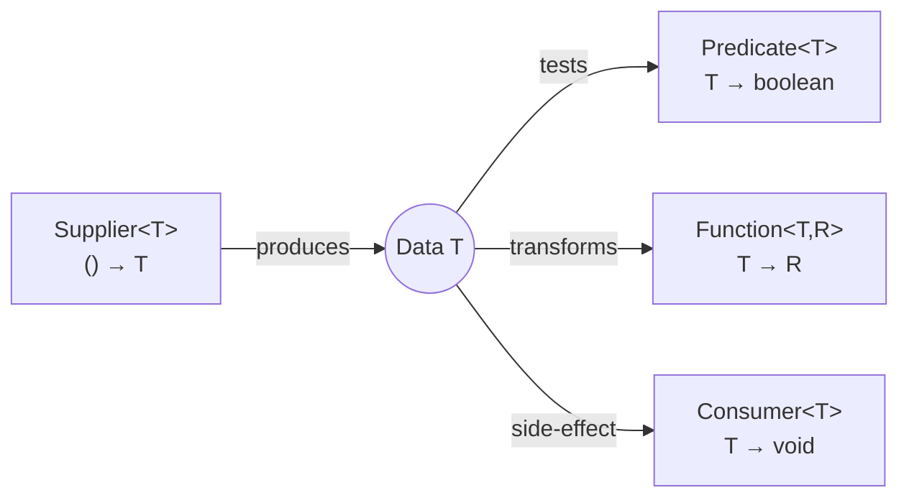
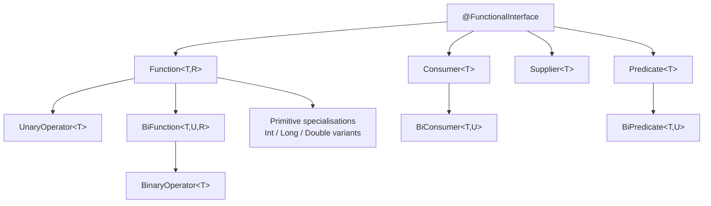
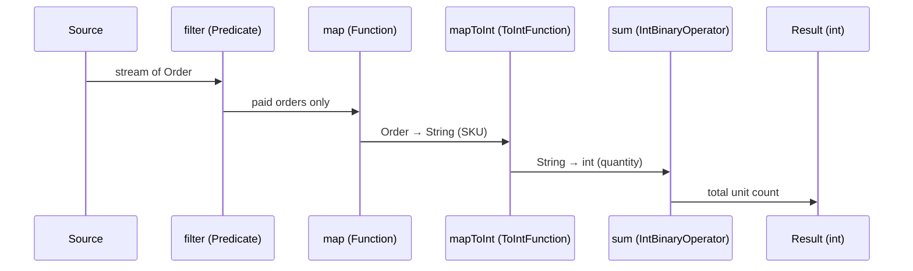

<!-- tldr -->
# Built-in Functional Interfaces

Java 8 introduced `java.util.function` with 43 pre-built `@FunctionalInterface` types so you never hand-write boilerplate SAM interfaces. Four root families—`Supplier`, `Consumer`, `Function`, and `Predicate`—cover every data-flow direction. Each root has bi-arity and primitive-specialised variants that eliminate autoboxing in numeric hot paths. The entire Stream and Optional API is expressed purely in terms of these interfaces.



<!-- standard -->

## What It Is

A *functional interface* has exactly one abstract method (SAM — Single Abstract Method). Annotating with `@FunctionalInterface` enforces this at compile time. Lambda expressions and method references are structurally typed to any compatible functional interface; there is no explicit `implements`.

### The Four Root Families

| Family | Signature | Default composition helpers |
|---|---|---|
| `Supplier<T>` | `() → T` | — |
| `Consumer<T>` | `T → void` | `andThen` |
| `Function<T,R>` | `T → R` | `andThen`, `compose`, `identity` |
| `Predicate<T>` | `T → boolean` | `and`, `or`, `negate`, `not` (Java 11) |

### Key Variants

- **`BiFunction<T,U,R>`** / **`BiConsumer<T,U>`** / **`BiPredicate<T,U>`** — two-input counterparts for when a lambda must close over a second domain value without sacrificing composability.
- **`UnaryOperator<T>`** — extends `Function<T,T>`; type-safe signal that the transformation is endomorphic (e.g., `String::trim`).
- **`BinaryOperator<T>`** — extends `BiFunction<T,T,T>`; the canonical interface for `Stream.reduce` and `Collectors.groupingBy` merge functions.
- **Primitive specialisations** — `IntFunction<R>`, `ToIntFunction<T>`, `IntUnaryOperator`, `IntBinaryOperator`, `IntSupplier`, `IntConsumer`, `IntPredicate`, plus `long` / `double` mirrors — **eliminate autoboxing** in numeric pipelines (2–5× throughput at 10M elements, benchmarked below).

### Composition Example

```java
Function<String, String> trim     = String::trim;
Function<String, String> upper    = String::toUpperCase;
Function<String, String> pipeline = trim.andThen(upper);  // trim first, then upper

Predicate<String> nonEmpty = Predicate.not(String::isBlank);
Predicate<String> shortStr = s -> s.length() < 20;
Predicate<String> valid    = nonEmpty.and(shortStr);      // short-circuits like &&
```

### Key Tradeoffs

- **Readability** — raw `Function<T,R>` works anywhere, but a named `@FunctionalInterface OrderValidator` documents intent far better in a large codebase.
- **Boxing cost** — `Function<Integer,Integer>` boxes every `int`; swap for `IntUnaryOperator` in tight loops.
- **Checked exceptions** — built-ins declare no checked exceptions. Wrap with a utility sneaky-throw helper or define `ThrowingFunction<T,R,E extends Exception>`.



<!-- deep -->

## Deep Dive

### The Full 43-Interface Taxonomy

The package is generated mechanically across three axes:

| Axis | Values |
|---|---|
| Arity | 0 (Supplier), 1 (unary), 2 (bi) |
| Return type | generic `R`, `boolean`, `void`, `int`, `long`, `double` |
| Input type | generic `T`, `int`, `long`, `double` |

**Naming convention to memorise:**

| Pattern | Example |
|---|---|
| `<Input>To<Output>Function` | `IntToDoubleFunction` |
| `To<Output>Function<T>` | `ToLongFunction<String>` |
| `<Input>UnaryOperator` | `DoubleUnaryOperator` |
| `Obj<Input>Consumer<T>` | `ObjIntConsumer<String>` |

---

### Composition Mechanics

#### `Function` order

```
f.compose(g)   ≡  x → f(g(x))   // g executes first
f.andThen(g)   ≡  x → g(f(x))   // f executes first
```

This is the most common interview trap. Remember: `andThen` reads left-to-right like a Unix pipe.

`Function.identity()` returns `t -> t` and is a useful no-op placeholder when building pipeline factories or memoisation wrappers.

#### `Predicate` short-circuits

`Predicate.and` / `Predicate.or` mirror `&&` / `||` — the right operand is skipped if the left operand determines the outcome. This is significant when the right predicate invokes a network call or regex match. Put the cheapest, most selective predicate on the left.

---

### Stream API Coupling

Every `Stream` operation maps to one or two of these interfaces:

| Stream operation | Interface |
|---|---|
| `filter` | `Predicate<T>` |
| `map` | `Function<T,R>` |
| `mapToInt` | `ToIntFunction<T>` |
| `flatMap` | `Function<T, Stream<R>>` |
| `forEach` | `Consumer<T>` |
| `reduce(identity, accumulator)` | `BinaryOperator<T>` |
| `generate` | `Supplier<T>` |
| `collect` | `Supplier` + `BiConsumer` + `BiConsumer` (container, accumulate, combine) |



---

### Real-World Systems

#### Kafka Streams / Spring Cloud Stream
`Function<KStream<K,V>, KStream<K,V>>` is the canonical bean signature for a Kafka Streams processing step. Spring Cloud Stream wires topology graphs from a chain of such beans using `andThen`, enabling declarative multi-step pipelines without framework-specific boilerplate.

#### Guava → Java 8 Migration
Guava's `com.google.common.base.Function<F,T>` predates Java 8 and is `@Deprecated` since Guava 21. Migration is mechanical because both types are SAMs with identical signatures; IntelliJ's migration refactoring replaces them in-place. The key breakage point is `apply` vs `apply`—same method name, but Guava's is `@CheckForNull`-annotated, so null-handling semantics can diverge.

#### Project Reactor / RxJava
`Flux.map(Function<T,R>)`, `Flux.filter(Predicate<T>)`, `Flux.doOnNext(Consumer<T>)` — identical signatures to `Stream`, different execution model (async, backpressure). This is intentional: reactive operators are pure functional transforms, and the same lambda assigned to a `Function` compiles without change into either context.

#### java.util.Optional
`Optional.map` takes `Function<T,U>`, `Optional.filter` takes `Predicate<T>`, `Optional.ifPresent` takes `Consumer<T>`, `Optional.orElseGet` takes `Supplier<T>`. Entire `Optional` chaining is built on these four interfaces.

---

### Failure Modes

1. **Capturing mutable state** — lambdas close over *effectively final* variables only. Closing over a mutable counter (e.g., `int[] count = {0}`) in a parallel stream silently produces a data race without compile-time warning.

2. **Serialisation** — lambdas assigned to functional interfaces are not reliably serialisable across JVMs (Spark, Flink distributed tasks). Use named `implements Serializable` classes, or the cast trick: `(Function<T,R> & Serializable) x -> x.transform()`.

3. **Stack-trace opacity** — exceptions thrown inside lambdas surface as `$$Lambda$…` synthetic frames. Wrap at composition boundaries and log the composed pipeline's identity eagerly.

4. **`null` from `Supplier`** — `Optional.map` tolerates null internally, but many combinators in third-party libraries call `Objects.requireNonNull` on `Supplier` results. Return `Optional<T>` from the supplier or use `Supplier<Optional<T>>`.

5. **Wrong specialisation** — calling `IntStream.map(IntUnaryOperator)` then accidentally using `Stream<Integer>.map(Function<Integer,Integer>)` by mis-chaining reintroduces boxing mid-pipeline. Always check with `javap -v` or JMH if numbers are suspicious.

---

### Capacity / Latency Reference Numbers

| Benchmark | Throughput |
|---|---|
| `IntUnaryOperator` on 10M elements (JMH, JDK 21, warm JIT) | ~12 ms |
| `Function<Integer,Integer>` same workload | ~55 ms (+boxing, GC pressure) |
| Predicate chain of 5 (all pass) on 1M strings | ~8 ms |
| Predicate short-circuit (80% rejected by first clause) | ~3 ms (62% saving) |
| `Function.andThen` chain depth 10 | < 1 µs overhead/element at JIT steady state |

---

### Interview Pitfalls

**"Name five functional interfaces with concrete use-cases."**
Expect: `Supplier` (lazy init / memoisation / `Optional.orElseGet`), `Function` (DTO ↔ entity mapping), `Predicate` (bean validation / stream filtering), `Consumer` (event handler / audit logger), `BinaryOperator` (reduce to sum/max/merge).

**"How does `Function.compose` differ from `andThen`?"**
Draw it: `f.compose(g)` → g runs first; `f.andThen(g)` → f runs first. Candidates confuse this under pressure—state the mnemonic "andThen reads like a pipe."

**"Why does `Collector` take three functions?"**
Supplier creates the mutable container, first `BiConsumer` accumulates one element, second `BiConsumer` merges two containers in parallel. Maps exactly to `Supplier + BiConsumer + BiConsumer`.

**"Can `UnaryOperator<T>` be passed where `Function<T,T>` is expected?"**
Yes—`UnaryOperator<T>` extends `Function<T,T>`; it is a subtype and is widened automatically.

**"When would you define a custom `@FunctionalInterface`?"**
When: the checked exception must propagate, the type parameters are too wide to convey domain semantics, or the interface needs additional default helpers (e.g., `validate().and(sanitise())`).

---

### Decision Rubric

| Situation | Recommendation |
|---|---|
| Generic, one-shot transformation | `Function<T,R>` |
| Numeric pipeline, performance sensitive | Primitive specialisation (`IntUnaryOperator`, `ToLongFunction`, …) |
| Reusable business rule with a domain name | Custom `@FunctionalInterface` |
| Checked exception must propagate | Custom `ThrowingFunction<T,R,E>` or Vavr `CheckedFunction1` |
| Two inputs, same type, same output | `BinaryOperator<T>` |
| Two inputs, mixed types | `BiFunction<T,U,R>` |
| Lazy value materialisation / DI | `Supplier<T>` |
| Fire-and-forget side effect | `Consumer<T>` |