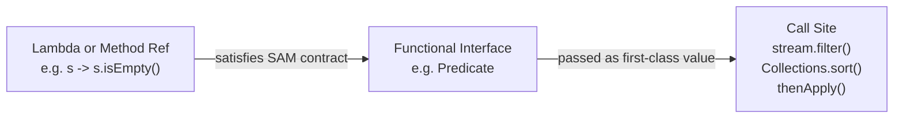
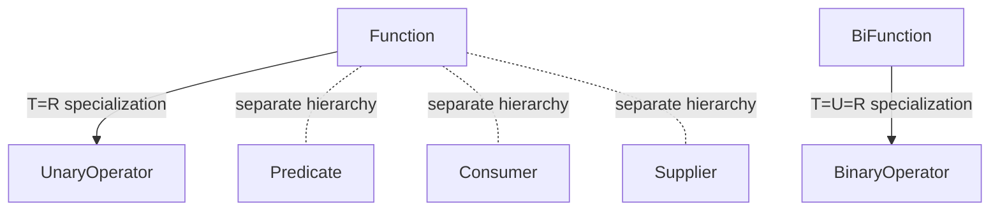
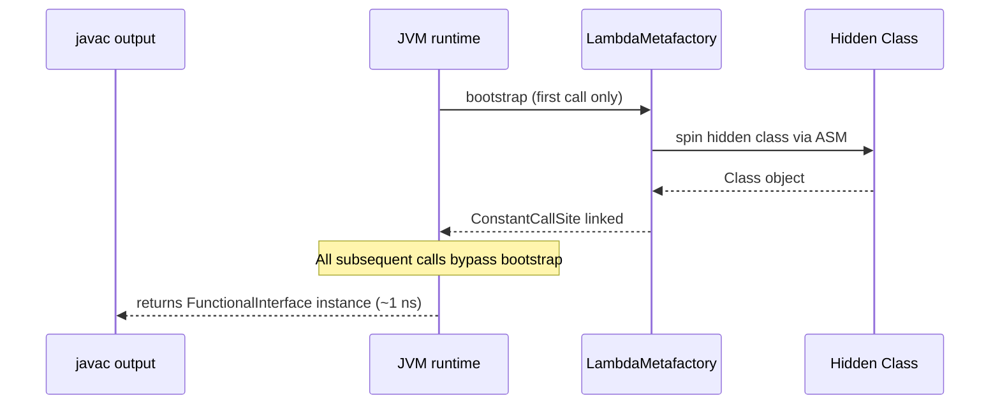

<!-- tldr -->
# Functional Interfaces

A **functional interface** defines a Single Abstract Method (SAM) contract. Any lambda expression or method reference that matches the signature is a valid implementation—no anonymous class boilerplate required. The `@FunctionalInterface` annotation is optional but enforces the SAM constraint at compile time. Under the hood, the JVM synthesizes the implementation lazily via `invokedynamic` and `LambdaMetafactory`, not by generating a named `.class` file at compile time.



<!-- standard -->

## What It Is

A functional interface is any interface with **exactly one abstract method** (SAM). Default and static methods are irrelevant to the SAM count. Abstract methods inherited from `java.lang.Object` (`equals`, `hashCode`, `toString`) also do not count—the JVM guarantees those exist on every object.

```java
@FunctionalInterface
public interface Transformer<T, R> {
    R transform(T input);          // SAM
    default Transformer<T, R> logged() { ... }  // fine — default
}
```

## Why It Matters

- Enables passing **behavior as data** without verbose anonymous classes.
- Unlocks the entire Stream/Optional/CompletableFuture API surface.
- Composable: `Function::andThen`, `Predicate::and/or/negate` let you build pipelines without subclassing.
- Zero runtime overhead after the first `invokedynamic` bootstrap—subsequent invocations reuse the linked `CallSite`.

## Built-in Interface Families (`java.util.function`)

| Interface | Signature | Primary use |
|---|---|---|
| `Predicate<T>` | `T → boolean` | Filter, guard clause |
| `Function<T,R>` | `T → R` | Map, transform |
| `Consumer<T>` | `T → void` | Side effects, logging |
| `Supplier<T>` | `() → T` | Lazy init, factory |
| `BiFunction<T,U,R>` | `T,U → R` | Merge, combine |
| `UnaryOperator<T>` | `T → T` (extends Function) | In-place transform |
| `BinaryOperator<T>` | `T,T → T` (extends BiFunction) | Reduce, fold |

Primitive specializations (`IntPredicate`, `LongToIntFunction`, `ToDoubleFunction`, …) avoid autoboxing—use them whenever the domain is numeric.

## Interface Hierarchy



## Key Tradeoffs

- **Checked exceptions**: No standard functional interface declares a checked exception. You must wrap or define a custom `ThrowingFunction<T,R,E extends Exception>`.
- **Readability**: Deep lambda chains obscure stack traces; extract complex lambdas to named methods and use method references.
- **Serialization**: Lambdas are not reliably serializable; avoid storing them in session state or Kryo-serialized objects.

<!-- deep -->

## Deep Dive

### How the JVM Implements Lambdas

`javac` emits an `invokedynamic` instruction at the lambda site. On **first invocation** the JVM calls the bootstrap method `LambdaMetafactory.metafactory(...)`, which uses ASM to spin a hidden class at runtime implementing the target functional interface. The resulting `CallSite` is **cached**—all subsequent invocations go through it in ~1–2 ns, equivalent to a virtual dispatch.



This is fundamentally different from anonymous inner classes, which produce a named `Outer$1.class` at compile time and pay `Class.forName` overhead on first load.

---

### Variable Capture Rules

Captured variables must be **effectively final** (assigned exactly once). The compiler enforces this—not the runtime. Workarounds used in production:

```java
// Mutation inside lambda — compile error
int count = 0;
list.forEach(x -> count++);  // ❌

// Idiomatic fix 1: collect-then-count
long count = list.stream().filter(pred).count();

// Idiomatic fix 2: mutable container
AtomicInteger count = new AtomicInteger();
list.forEach(x -> count.incrementAndGet());

// Hack (do not use in production):
int[] count = {0};
list.forEach(x -> count[0]++);  // technically compiles but not thread-safe
```

---

### Composition Deep Dive

`Function`, `Predicate`, and `Consumer` expose default composition methods implemented entirely in the interface—no abstract method added.

```java
Function<String, String> trim   = String::trim;
Function<String, String> upper  = String::toUpperCase;
Function<String, Integer> parse = Integer::parseInt;

// compose: right-to-left; andThen: left-to-right
Function<String, Integer> pipeline = trim.andThen(upper).andThen(parse);

Predicate<String> nonEmpty = Predicate.not(String::isBlank);
Predicate<String> shortStr = s -> s.length() < 10;
Predicate<String> valid    = nonEmpty.and(shortStr);
```

`andThen` / `compose` differ in application order:

| Method | Order | Equivalent |
|---|---|---|
| `f.andThen(g)` | f first, then g | `g(f(x))` |
| `f.compose(g)` | g first, then f | `f(g(x))` |

---

### Primitive Specializations — Performance Impact

Autoboxing `int → Integer` allocates a heap object per element. At 1 M elements/sec this is ~24 MB/sec of garbage.

| Stream type | Operation | Throughput (approx.) |
|---|---|---|
| `Stream<Integer>.map(i -> i * 2)` | boxed | ~120 M ops/sec |
| `IntStream.map(i -> i * 2)` | primitive | ~600 M ops/sec |
| `LongStream.reduce(0L, Long::sum)` | primitive | ~900 M ops/sec |

*Measured on JDK 21, JMH, 3.5 GHz x86-64. Numbers are order-of-magnitude guides.*

Use `mapToInt`, `mapToLong`, `mapToDouble` to escape boxed streams as early as possible.

---

### Checked Exception Problem

Standard functional interfaces declare no checked exceptions. Three production patterns:

```java
// 1. Sneak-throw (Lombok @SneakyThrows or manual)
@FunctionalInterface
interface ThrowingFunction<T, R> {
    R apply(T t) throws Exception;

    static <T, R> Function<T, R> wrap(ThrowingFunction<T, R> f) {
        return t -> {
            try { return f.apply(t); }
            catch (Exception e) { throw new RuntimeException(e); }
        };
    }
}

// 2. Either/Try monad (Vavr library)
Stream<String> lines = paths.stream()
    .map(Try.of(Files::readString)::get);  // Vavr

// 3. Explicit try in lambda (ugly but zero-dependency)
.map(p -> { try { return Files.readString(p); } catch (IOException e) { throw new UncheckedIOException(e); } })
```

---

### Real-World Usage in Major Systems

| System | Functional Interface usage |
|---|---|
| **Spring Framework** | `ApplicationListener<E>` is a `@FunctionalInterface`; `BeanDefinitionCustomizer`, `Condition` |
| **Reactor / Project Reactor** | `Flux.map(Function)`, `Flux.filter(Predicate)`, `Mono.flatMap(Function)` — entire reactive chain is functional interface composition |
| **Kafka Streams** | `Predicate<K,V>` in `KStream.filter`, `KeyValueMapper<K,V,KR>` in `map` |
| **CompletableFuture** | `thenApply(Function)`, `thenAccept(Consumer)`, `exceptionally(Function)` |
| **Hibernate / JPA** | `Specification<T>` (Spring Data) implements `Predicate`-like SAM for criteria building |
| **RxJava 3** | `io.reactivex.rxjava3.functions.*` mirrors `java.util.function` but with checked-exception-aware SAMs |

---

### Failure Modes & Pitfalls

**1. Identity confusion with default methods**
Adding a second default method does not break SAM. Interviewers often ask whether this compiles:
```java
@FunctionalInterface
interface Foo {
    void run();
    default void runTwice() { run(); run(); }  // ✅ still SAM
    static Foo noOp() { return () -> {}; }     // ✅ static allowed
}
```

**2. `equals` override breaks nothing**
Declaring `boolean equals(Object o)` in an interface does *not* consume the SAM slot—it's an `Object` method re-declaration.

**3. Lambda serialization across classloaders**
A serialized lambda captures the declaring class's classloader. Deserializing in a different classloader (OSGI, hot-reload) throws `InvalidClassException`. **Never serialize lambdas.**

**4. `this` reference in lambdas**
`this` inside a lambda refers to the *enclosing instance*, not the lambda itself. This differs from anonymous classes, where `this` is the anonymous class instance. Keeping heavy outer objects referenced by long-lived lambdas causes memory leaks.

**5. Thread safety of captured state**
Effectively-final does not mean immutable. A captured `List<String>` can still be mutated concurrently. Lambdas passed to parallel streams must be stateless or use thread-safe state.

---

### Capacity & Latency Reference Numbers

| Scenario | Cost |
|---|---|
| First `invokedynamic` bootstrap | ~10–100 µs (class spinning, JIT warmup) |
| Subsequent lambda invocation (no capture) | ~1–2 ns |
| Captured-variable lambda invocation | ~2–5 ns (one heap deref) |
| Autobox `int → Integer` per element | ~15–25 ns + GC pressure |
| Primitive `IntStream` vs boxed `Stream<Integer>` map | 4–6× throughput difference |

---

### Interview Pitfalls Checklist

- [ ] Can you have a functional interface with **two abstract methods**? (No—`@FunctionalInterface` rejects it; without annotation the interface compiles but can't accept lambdas.)
- [ ] Does adding `default` methods violate SAM? (No.)
- [ ] What does `Function.identity()` return? (`t -> t`, avoids allocating a new lambda per call-site.)
- [ ] Why does `Comparator` qualify as a functional interface given it also declares `equals`? (`equals(Object)` is an `Object` method re-declaration and is excluded from SAM counting.)
- [ ] How do you handle checked exceptions in a stream pipeline without a helper library? (Wrap in `RuntimeException` or write a `ThrowingFunction` utility.)
- [ ] What is `BiFunction` vs `BinaryOperator`? (`BinaryOperator<T>` extends `BiFunction<T,T,T>`—same type for both inputs and output, used in `Stream.reduce`.)

---

### When to Reach for This

```
Need to pass behavior as a parameter?
  → Use a standard java.util.function interface first.
  → Roll a custom @FunctionalInterface only if: checked exceptions, 3+ params, or domain semantics demand a named type.

Working with numeric data at high throughput?
  → Use primitive specializations (IntFunction, LongUnaryOperator, etc.).
  → Benchmark with JMH before assuming boxing is acceptable.

Building a library or framework API?
  → Prefer @FunctionalInterface over abstract classes; it enables lambda call-sites for callers.
  → Avoid checked exceptions in the SAM signature unless you own the calling code.

Composing multiple transformations?
  → Use andThen/compose/and/or rather than nested lambdas; composability improves testability.
  → Extract non-trivial lambdas to named static methods for stack-trace clarity.
```