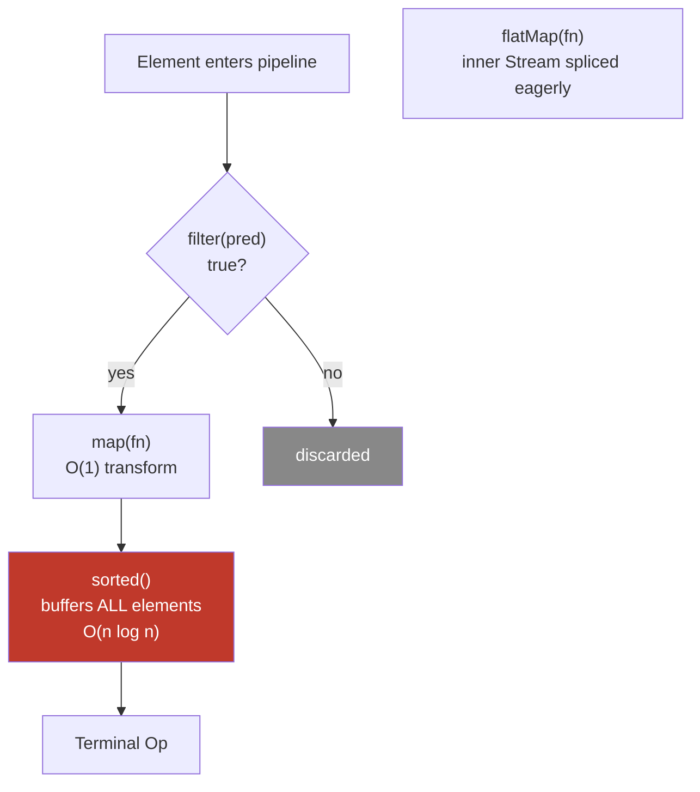
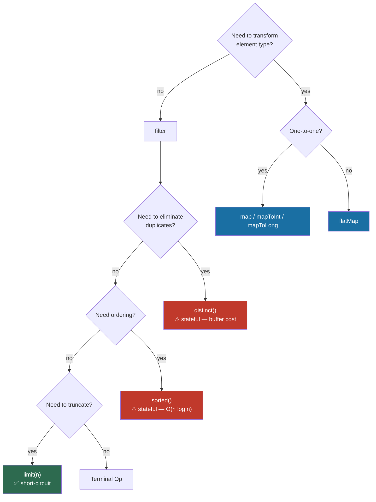

<!-- tldr -->
# Intermediate Operations in Java 8 Streams

Intermediate operations are the transformation stages of a Java Stream pipeline. They are **lazy**: calling `filter()` or `map()` constructs a pipeline descriptor but processes zero elements until a terminal operation (`collect`, `forEach`, `reduce`, etc.) pulls data through. Each intermediate operation returns a new `Stream<T>`, enabling method chaining. The JVM fuses adjacent stateless operations into a single pass, making pipelines far more efficient than equivalent loop chains.


<!-- standard -->

## What They Are

Every method on `Stream<T>` that returns another `Stream` is an intermediate operation. No element is touched until a terminal operation subscribes to the pipeline. This deferred execution allows:

- **Fusion**: the runtime can merge `filter + map` into one loop iteration per element.
- **Short-circuiting**: `limit(n)` stops pulling from the source the moment `n` elements are emitted downstream.
- **Infinite source support**: `Stream.iterate(0, n -> n+1).filter(...).limit(100)` works because nothing forces the infinite stream to materialize.

## Taxonomy

| Operation | Stateless? | Short-circuits? | Signature |
|---|---|---|---|
| `filter` | ✅ | ❌ | `Stream<T> filter(Predicate<T>)` |
| `map` | ✅ | ❌ | `Stream<R> map(Function<T,R>)` |
| `mapToInt/Long/Double` | ✅ | ❌ | `IntStream mapToInt(ToIntFunction<T>)` |
| `flatMap` | ✅ | ❌ | `Stream<R> flatMap(Function<T,Stream<R>>)` |
| `peek` | ✅ | ❌ | `Stream<T> peek(Consumer<T>)` |
| `distinct` | ❌ stateful | ❌ | `Stream<T> distinct()` |
| `sorted` | ❌ stateful | ❌ | `Stream<T> sorted(Comparator<T>?)` |
| `limit` | ❌ stateful | ✅ | `Stream<T> limit(long)` |
| `skip` | ❌ stateful | ❌ (ordered) | `Stream<T> skip(long)` |
| `takeWhile` *(Java 9)* | ✅ | ✅ | `Stream<T> takeWhile(Predicate<T>)` |
| `dropWhile` *(Java 9)* | ✅ | ❌ | `Stream<T> dropWhile(Predicate<T>)` |

## Key Tradeoffs

- **Stateful ops break parallelism efficiency.** `sorted()` and `distinct()` must buffer the entire sub-stream before passing elements forward, costing O(n) heap and invalidating the "one-pass" benefit.
- **`flatMap` vs `map`**: use `flatMap` when each element expands into zero-or-more outputs (e.g., tokenizing sentences into words). `flatMap` is *not* lazy at the inner `Stream` level in Java 8 — the inner stream is eagerly spliced, so avoid wrapping blocking I/O inside `flatMap` on a parallel stream.
- **`peek` is debug-only.** Its execution is tied to downstream demand; in short-circuit pipelines it may fire fewer times than expected.
- **Primitive streams (`IntStream`, `LongStream`, `DoubleStream`)** avoid boxing overhead — always prefer `mapToInt` over `map` when the downstream is numeric aggregation.



<!-- deep -->

## Deep Dive: Internals, Failure Modes & Interview Mastery

### Pipeline Execution Model

The Stream API uses a **sink chain** internally (`java.util.stream.AbstractPipeline`). Each stage wraps the next in a `Sink<T>`, forming a push-pull hybrid:

1. The terminal operation creates a `Sink` and calls `pipeline.wrapSink(terminalSink)`.
2. Each intermediate stage wraps the downstream `Sink`, producing the full chain.
3. The source spliterator **pushes** elements into the head sink; each sink can filter (not call `downstream.accept`) or transform (call `downstream.accept(transformed)`).

This means **stateless operations have O(1) per-element overhead** — literally a method call. The JIT inlines small lambdas aggressively.

### Stateful Operations in Detail

#### `sorted()`
- Buffers via `SpinedBuffer` (grows in chunks of 2^n, max ~2 GB).
- **Parallel sorted**: splits, sorts each split, merges — O(n log n) total but parallelizable.
- Avoid on streams >10M elements in latency-sensitive paths; prefer pre-sorted data structures.

#### `distinct()`
- Uses `LinkedHashSet` internally to preserve encounter order.
- Memory: O(k) where k = unique elements. On a 100 M-row stream with high cardinality, this is a heap killer.
- **Parallel `distinct`**: uses a concurrent `ConcurrentHashMap`-based set, then a dedup-by-identity merge — correct but contention-heavy.

#### `limit(n)` on parallel streams
- Ordering constraint makes parallel `limit` expensive: the runtime must track global count across threads using `AtomicLong` and synchronize. For **unordered** streams, call `.unordered().limit(n)` — this enables each thread to independently count to `n/threadCount`, dramatically reducing coordination.

### `flatMap` Gotcha — Lazy Inner Streams Lost

```java
// BAD: inner stream from Files.lines() is never closed
stream.flatMap(path -> {
    try { return Files.lines(path); } catch (...) { ... }
});

// GOOD: use try-with-resources via Stream.of + flatMap only for simple cases,
// or collect intermediate, or use custom Spliterator
```

In Java 8, `flatMap` does *not* propagate `close()` to inner streams. Java 16+ fixes this. Until then, **never pass resource-backed streams into `flatMap` without a custom wrapper**.

### Real-World Parallels

| System | Analogue to Java Stream Intermediate Ops |
|---|---|
| **Kafka Streams** | `KStream.filter().mapValues().flatMapValues()` — same lazy DAG model, but distributed and fault-tolerant |
| **Apache Spark RDD** | `filter()`, `map()`, `flatMap()` are narrow transformations (no shuffle = stateless); `distinct()`, `sortBy()` are wide (stateful = shuffle) |
| **Project Reactor / RxJava** | `Flux.filter().map().flatMap()` — reactive analog; `flatMap` is concurrent, `concatMap` is sequential (mirrors Java's ordered encounter) |
| **SQL query planner** | `filter` ≈ `WHERE`, `map` ≈ `SELECT expr`, `sorted` ≈ `ORDER BY`, `limit` ≈ `FETCH FIRST n ROWS` — the optimizer similarly pushes filters before sorts |

### Capacity & Latency Numbers to Know

- A tight `filter + map` pipeline on a `ArrayList<Long>` processes **~250–400 M elements/sec** on a single core (JIT-warmed, simple lambda).
- Adding `sorted()` drops throughput to **~15–30 M elements/sec** (dominated by `TimSort`).
- Parallel stream break-even vs sequential: typically **>10 K elements** for CPU-bound, stateless operations. For stateful ops the break-even is much higher due to merge cost.
- `distinct()` on 1 M elements with 50% uniqueness: ~120 ms sequential, ~60 ms parallel (4-core) — but memory doubles.

### Interview Pitfalls

#### Pitfall 1 — Reusing a stream
```java
Stream<String> s = list.stream().filter(x -> x.startsWith("A"));
s.forEach(System.out::println);
s.count(); // ❌ IllegalStateException: stream has already been operated upon
```
Streams are **single-use**. A common trap in code reviews.

#### Pitfall 2 — Assuming `peek` always fires
```java
long count = stream.peek(System.out::println).limit(3).count();
// Only 3 peek calls, not list.size() — short-circuit stops pulling
```

#### Pitfall 3 — Mutating shared state inside lambdas
```java
List<String> result = new ArrayList<>();
stream.filter(pred).forEach(result::add); // ❌ not thread-safe in parallel
// ✅ use .collect(Collectors.toList())
```

#### Pitfall 4 — `map` vs `flatMap` for `Optional` chains (Java 8)
```java
Optional<String> name = userOpt.flatMap(User::getAddress)
                                .map(Address::getCity); // correct chaining
```
Using `map` where `flatMap` is needed produces `Optional<Optional<T>>`.

#### Pitfall 5 — Ordered parallel streams with `limit`
```java
// Slow: maintains encounter order across threads
IntStream.range(0, 1_000_000).parallel().limit(10).sum();

// Fast: drop ordering when semantics allow
IntStream.range(0, 1_000_000).parallel().unordered().limit(10).sum();
```

### Decision Rubric: When to Reach for Which Operation



### Ordering Rules (Critical for Parallel Streams)

- **Encounter order** is preserved end-to-end if the source has order (e.g., `List`) unless you call `.unordered()` or the terminal op doesn't care (e.g., `forEach` vs `forEachOrdered`).
- `filter` + `map` never change order. `sorted` re-establishes order. `distinct` preserves first-seen order on sequential streams.
- In parallel, maintaining encounter order for `limit`, `skip`, `distinct`, and `forEachOrdered` requires expensive coordination — drop it explicitly with `.unordered()` when correctness allows.

### Summary Checklist for Code Review / Interview

- [ ] Are stateful ops (`sorted`, `distinct`) justified, or can the data arrive pre-sorted/pre-deduped?
- [ ] Is `flatMap` used with resource-backed streams? Close them.
- [ ] Does a parallel stream operate on a `LinkedList` source? (Poor spliterator — use `ArrayList` or arrays.)
- [ ] Is `limit` used on a parallel ordered stream that could be `.unordered()`?
- [ ] Are lambdas capturing mutable shared state?
- [ ] Is `mapToInt/Long/Double` used instead of `map` for numeric aggregation to avoid boxing?