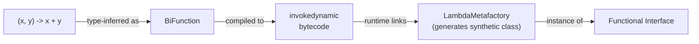
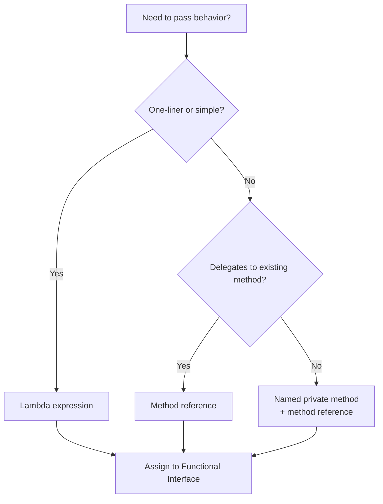
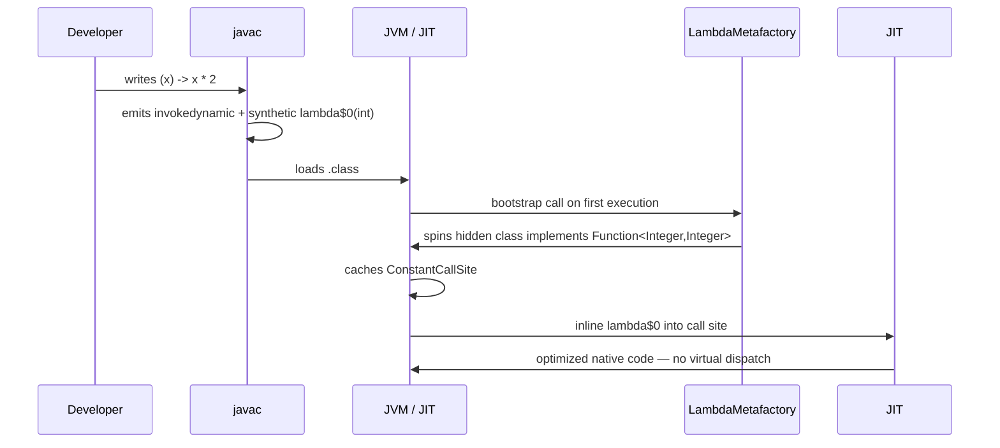

<!-- tldr -->
# Lambda Expressions

A lambda expression is an anonymous function — a block of code with parameters and a body — that can be stored in a variable, passed as an argument, or returned from a method. Java 8 introduced them as syntactic sugar over single-abstract-method (SAM) interfaces, backed by `invokedynamic` at the bytecode level rather than anonymous inner classes. This preserves backward compatibility while enabling a functional style: higher-order functions, composable behavior, and lazy evaluation via the Streams API.



<!-- standard -->

## What It Is

A lambda has three parts: a parameter list, the `->` arrow, and a body (expression or block).

```java
// expression form — implicit return
Comparator<String> byLen = (a, b) -> a.length() - b.length();

// block form — explicit return
Function<String, Integer> parse = s -> {
    if (s == null) throw new IllegalArgumentException();
    return Integer.parseInt(s);
};
```

The type is always a **functional interface** (exactly one abstract method). The compiler infers the target type from context (assignment, method parameter, cast).

## Why It Matters

| Without lambdas | With lambdas |
|---|---|
| Anonymous inner class: 5-7 LoC | Single expression |
| Separate `Comparator` subclass | Inline sort key |
| Callbacks require new `.java` files | Pass behavior as data |
| No lazy evaluation | `Stream` pipeline defers work until terminal op |

The JIT can **inline** lambdas aggressively because `invokedynamic` defers class generation to runtime, avoiding the classloader overhead of anonymous inner classes at compile time.

## Primary Techniques

- **Method references** — shorthand for lambdas that delegate to an existing method: `String::toUpperCase`, `System.out::println`, `User::new`.
- **Capturing variables** — lambdas close over *effectively final* local variables (compiler-enforced). Instance/static fields are mutable captures (watch for threading bugs).
- **Composition** — `Function.compose()` / `Function.andThen()`, `Predicate.and()` / `Predicate.or()`, `Consumer.andThen()`.
- **Partial application** — wrap a lambda in another lambda to bind one argument, mimicking currying.

## Key Tradeoffs

- **Readability**: Short lambdas are cleaner than anonymous classes; long lambdas with multiple `if`/`try` blocks belong in named methods.
- **Debuggability**: Stack traces show synthetic names (`MyClass$$Lambda$14`). Use named method references to get readable frames.
- **Serialization**: Lambdas are *not* reliably serializable — avoid storing them in caches or sending over RPC.
- **Performance**: For hot, trivial loops, a plain `for` loop still beats `stream().forEach()` due to boxing and object allocation in non-primitive streams.



<!-- deep -->

## Deep Dive: Lambda Expressions

### How `invokedynamic` Works Under the Hood

The JVM compiles each lambda body into a **private synthetic static method** in the enclosing class. An `invokedynamic` instruction at the call site bootstraps via `LambdaMetafactory.metafactory()`, which — on first invocation — spins up a hidden inner class implementing the target interface. Subsequent calls reuse the same class (or a `ConstantCallSite`). Key implications:

- **No `.class` file** is written to disk — the class lives in a special classloader namespace.
- **JIT inlining** is highly effective because the call site is monomorphic (one concrete type per call site).
- Contrast with anonymous inner classes: the compiler eagerly emits a `Foo$1.class`, inflating the JAR and cold-start classloading time.

### Variable Capture Rules

```java
int threshold = 42;          // effectively final — OK
threshold++;                 // now mutable — compiler error if captured

String prefix = "ID-";       // effectively final
Function<Integer, String> f = n -> prefix + n;   // captures copy of reference

// Instance field capture — no restriction, but introduces hidden state
class Formatter {
    private String sep = ",";
    Function<List<String>, String> joiner = parts -> String.join(sep, parts); // captures 'this'
}
```

**Interview pitfall**: "Effectively final" means *never reassigned*, not `final` keyword. The compiler checks this. Captured primitives are copied by value; captured object references are copied, but the *object* is shared — mutations to the object are visible.

### Performance Numbers & Benchmarks (JMH baselines, JDK 21, x86-64)

| Scenario | Throughput (ops/µs) | Notes |
|---|---|---|
| `IntStream.range(0,1000).sum()` | ~900 | primitive stream, no boxing |
| `Stream<Integer>.mapToInt().sum()` | ~280 | boxing overhead |
| Plain `for` sum over `int[]` | ~2200 | CPU SIMD-friendly |
| Lambda passed to `Collections.sort` | ≈ anonymous class | Identical after JIT |
| Stream pipeline, 10-stage, 1M elements | P99 ≈ 12 ms | vs. ~4 ms imperative |

**Rule of thumb**: Streams + lambdas are fine for business logic throughput requirements (< 50K items, non-hot path). For inner-loop numeric kernels, prefer imperative code or `IntStream`/`LongStream` to avoid boxing.

### Real-World System Usage

#### Kafka Streams DSL
```java
builder.stream("orders")
       .filter((k, v) -> v.getAmount() > 100)
       .mapValues(v -> enrichWith(inventoryStore, v))
       .to("enriched-orders");
```
Each lambda becomes a `Processor` node in a DAG. The Kafka Streams planner analyzes the topology at build time — lambdas themselves carry no topology metadata, so debugging requires `Topology.describe()`.

#### Spring WebFlux / Project Reactor
`Flux.fromIterable(list).filter(...).map(...).subscribeOn(Schedulers.parallel())` — lambdas are stored in operator chain objects. Each operator allocates one `Fuseable` object; with thousands of concurrent requests this can generate GC pressure. Use `publishOn` sparingly and batch where possible.

#### CompletableFuture Pipelines
```java
CompletableFuture.supplyAsync(() -> fetchUser(id), executor)
    .thenApply(user -> buildProfile(user))
    .thenCompose(profile -> fetchRecommendations(profile))
    .exceptionally(ex -> FallbackProfile.empty());
```
Each stage stores a lambda. If the executor is unbounded and stages are CPU-bound, you get thread starvation. Always pass an explicit `Executor`; never rely on `ForkJoinPool.commonPool()` in production.

### Failure Modes

1. **Accidental capture of large objects** — a lambda capturing `this` (via an instance method reference) keeps the entire enclosing object alive. Common in Android/desktop memory leaks; relevant in long-lived Kafka processor stores.
2. **Silent `null` returns** — `Function<T,R>` permits `null` returns. Compose three functions where one returns `null`; the next NPEs at runtime with a useless stack frame. Prefer `Optional<R>` as the return type in composed pipelines.
3. **Exception transparency** — lambdas passed to `Stream` / `Function` cannot throw checked exceptions without wrapping. The boilerplate wrapper pattern (`sneakyThrow` or `ThrowingFunction`) obscures error handling and breaks callers that expect checked contract.
4. **Serialization** — storing a lambda in a `HashMap` and trying to serialize the map via Java serialization throws `NotSerializableException` at runtime. Use `Serializable` functional interfaces only when you truly need serialized behavior (Spark, for instance, mandates it).
5. **Parallel stream misuse** — `list.parallelStream().forEach(db::insert)` where `db::insert` is not thread-safe. `forEach` on parallel streams gives no ordering or concurrency guarantees.

### Closure Semantics vs. Other Languages



### Composition Patterns at Scale

```java
// Build a validation pipeline dynamically
List<Predicate<Order>> rules = List.of(
    o -> o.getAmount() > 0,
    o -> o.getCurrency() != null,
    o -> inventoryService.isAvailable(o.getSku())
);

Predicate<Order> combined = rules.stream()
    .reduce(o -> true, Predicate::and);

orders.stream()
      .filter(combined)
      .forEach(this::process);
```

`Predicate.and()` short-circuits: once one predicate returns `false`, the rest are skipped — equivalent to `&&` in imperative code.

### Interview Pitfalls

| Pitfall | What the interviewer is probing |
|---|---|
| "Lambdas are just anonymous classes" | Understand `invokedynamic` vs. classfile generation |
| Using `parallelStream()` everywhere | Know when overhead exceeds gain (small lists, IO-bound work) |
| Ignoring checked exceptions in streams | Know the `ThrowingFunction` wrapper pattern and its tradeoffs |
| Forgetting `effectively final` rule | Understand JMM implications of captured variables |
| Confusing `map` vs `flatMap` | Understand monadic composition |
| Serializing lambdas naively | Understand hidden class restrictions |

### Decision Rubric: When to Reach for Lambdas

```mermaid
flowchart TD
    A[Need to parameterize behavior?] -->|Yes| B{How complex is the body?}
    B -->|"≤3 lines, pure"| C[Lambda ✅]
    B -->|"> 3 lines OR stateful| D[Named method + reference ✅]
    A -->|No| E[Imperative code — simpler]
    C --> F{Hot path > 10M calls/sec?}
    F -->|Yes| G[Benchmark — consider imperative\nor primitive specialization]
    F -->|No| H[Ship it ✅]
    D --> H
```

**Reach for lambdas when**: passing strategy/policy behavior to frameworks (sort, filter, map, retry), composing validation/transformation pipelines, wiring event handlers or callbacks in reactive code.

**Avoid lambdas when**: the body needs checked exceptions and callers must handle them, the lambda would close over mutable shared state across threads, or you need reliable Java serialization of the function object.