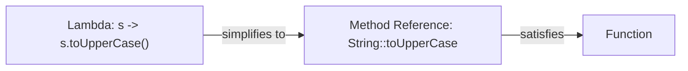
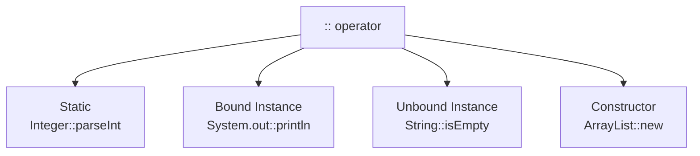
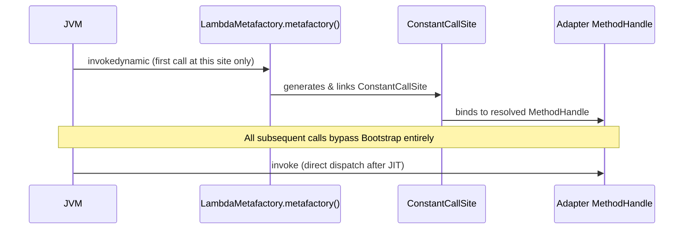
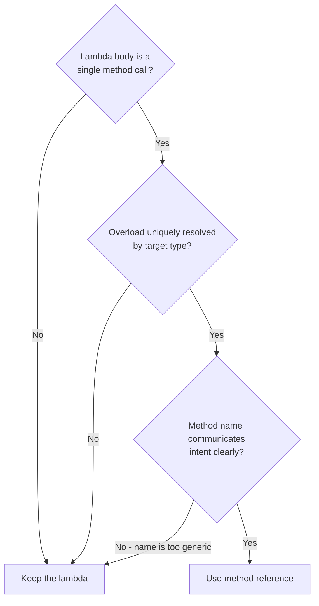

<!-- tldr -->
# Method References

A method reference (`ClassName::method`) is syntactic sugar for a single-method lambda whose body contains exactly one method call with no intermediate logic. The compiler maps the reference to a functional interface, verifying arity and types at compile time. At runtime the JVM implements it via `invokedynamic` and `LambdaMetafactory`—not by generating a new class file per reference site.



<!-- standard -->

## What It Is

A method reference uses the `::` operator to produce a functional-interface implementation that delegates directly to a named method. There are exactly **four forms**:

| Form | Syntax | Example | Equivalent Lambda |
|---|---|---|---|
| Static | `ClassName::staticMethod` | `Integer::parseInt` | `s -> Integer.parseInt(s)` |
| Bound instance | `objectRef::instanceMethod` | `System.out::println` | `x -> System.out.println(x)` |
| Unbound instance | `ClassName::instanceMethod` | `String::toLowerCase` | `s -> s.toLowerCase()` |
| Constructor | `ClassName::new` | `ArrayList::new` | `n -> new ArrayList<>(n)` |

## Why It Matters

- **Readability signal**: a method reference says "this lambda is a pure delegation"—no hidden logic buried in a closure.
- **Compile-time safety**: overloaded methods that can't be uniquely resolved produce a hard compile error rather than silent wrong-method dispatch.
- **Refactoring stability**: renaming the target method propagates through IDE tooling; a lambda string literal would silently rot.
- **Performance parity**: `LambdaMetafactory` generates the same adapter path as a hand-written lambda—no allocations on hot paths after JIT.

## Primary Techniques

**Unbound vs. bound** is the most-tested distinction. An unbound reference like `String::length` threads the instance through as the *first* argument of the functional interface (`Function<String, Integer>`). A bound reference like `str::length` captures a specific receiver at reference-creation time, producing a zero-argument interface (`Supplier<Integer>`).

**Constructor references** with generics require a visible target type. `ArrayList::new` resolves to `Supplier<ArrayList>` or `IntFunction<ArrayList>` depending on the functional interface; if the compiler cannot infer the constructor, it fails to compile—be explicit with the target type.

## Key Tradeoffs

- **Clarity**: method references reduce noise when delegation is obvious; they obscure intent when the method name is generic (`Processor::process` adds no signal over an inline lambda).
- **Overloading**: `println` has 10 overloads—`System.out::println` compiles only when the target functional interface pins exactly one overload.
- **Debugging**: stack traces from a method reference show the target method directly; lambdas show a synthetic name like `lambda$main$0`.



<!-- deep -->

## Compiler Resolution Algorithm

javac applies these rules in order when it encounters a `::` expression:

1. **`name` is `new`** → constructor reference; functional interface return type must be assignable from the constructed type.
2. **`expr` is a type name and `name` is static in that type** → static method reference.
3. **`expr` is a type name, `name` is an instance method, and the functional interface's first parameter type matches the class** → unbound instance reference; first FI argument becomes the receiver.
4. **`expr` is an expression (variable, field, method call)** → bound instance reference; receiver evaluated **once at reference-creation time**, not at each invocation.
5. Multiple overloads satisfy the functional interface signature → **compile error: ambiguous**.

### invokedynamic Bootstrap Flow



`LambdaMetafactory` generates one **hidden class per call site** (JDK 15+: via `Lookup.defineHiddenClass`), not per invocation. After JIT warmup a method reference call is equivalent to a direct virtual dispatch—sub-nanosecond on hot paths.

---

## Real-World Usage

### Java Stream API (JDK Internals)
`Comparator.comparing(Person::getAge)` is idiomatic throughout the JDK. The key extractor is stored as `Function<T,U>` and invoked ~O(n log n) times during a sort; the unbound reference avoids per-element closure allocation and inlines cleanly under `-XX:+TieredCompilation`.

### Kafka Streams DSL
Kafka Streams 3.x topology builders accept `ValueMapper<V,VR>` and `KeyValueMapper<K,V,KR>`. At ~1M messages/sec throughput, eliminating per-message lambda object churn matters:

```java
stream.mapValues(Avro::deserialize)
      .filter(EventValidator::isValid)
      .mapValues(Enricher::enrich);
```

Each `::` produces a distinct call site with its own `ConstantCallSite`—zero allocation per message after warmup.

### Spring Framework (Functional Bean Registration)
Spring 5+ `GenericApplicationContext` accepts constructor references:

```java
context.registerBean(UserService.class, UserService::new);
```

This avoids reflective instantiation—critical in GraalVM native-image builds where `Class.forName` paths require explicit reachability metadata. A constructor reference is resolved at compile time and trivially AOT-compiled.

### CompletableFuture Pipelines
```java
CompletableFuture.supplyAsync(dataService::fetchData)
    .thenApply(ResponseParser::parse)
    .thenAccept(cache::store);
```

Bound references capture `dataService` and `cache` once; `ResponseParser::parse` is unbound. Each stage is a distinct `ConstantCallSite` linkage—the pipeline has zero reference-related allocation overhead post-warmup.

---

## Failure Modes

### Overloaded Target Methods
```java
// Pins to println(int) — compiles
Consumer<Integer>  a = System.out::println;
// Pins to println(Object) — compiles
Consumer<Object>   b = System.out::println;
// println returns void, not String — compile error
Function<String,?> c = System.out::println;
```
**Rule**: the functional interface's return type and parameter types must uniquely resolve a single overload. When they don't, the error message is often cryptic; train yourself to read it as "which overload did you mean?"

### Null Receiver in a Bound Reference
```java
String s = null;
Supplier<String> sup = s::toUpperCase; // reference created without error
sup.get();                              // NullPointerException at invocation time
```
The receiver is captured at reference-creation time. A `null` is stored silently; the NPE surfaces only on the first call—often far from the capture site. A guard-wrapped lambda (`() -> Objects.requireNonNull(s).toUpperCase()`) fails eagerly.

### Serialization
Method references don't implement `Serializable` by default. Forcing it:

```java
Comparator<String> c = (Comparator<String> & Serializable) String::compareTo;
```

generates a serializable adapter but introduces `serialVersionUID` fragility; the internal class name encodes a checksum that varies across JVM versions. Avoid serializing method references across JVM boundaries in distributed systems.

### Generic Type Erasure and Raw Types
```java
// OK — target type inferred as Supplier<List<String>>
Supplier<List<String>> s = ArrayList::new;

// Raw type warning — T erased to Object
Supplier raw = ArrayList::new;
```
Constructor references respect type inference at the call site. Erasure only bites if you assign to a raw or unbounded wildcard target.

---

## Capacity & Latency Numbers

| Scenario | Overhead vs. direct call |
|---|---|
| Cold (bootstrap, one-time per call site) | 5–20 µs |
| Warm (interpreted tier) | 2–5 ns |
| Hot (JIT C2, inlined) | ≤ 1 ns |
| Lambda vs. method reference (same FI, same JIT tier) | **Identical** |

At 1M QPS with P99 < 1 ms budgets, the warm/hot gap is immaterial. The only scenario where a method reference *changes* GC pressure relative to a lambda is when a **bound reference captures a large object graph**, keeping the receiver reachable longer than necessary.

---

## Interview Pitfalls

1. **Unbound vs. bound confusion** — Interviewers describe a functional interface and ask which form applies. Anchor the answer: *unbound threads the instance as the first FI argument; bound captures it at reference-creation time.*

2. **"Method references are faster than lambdas"** — **False.** After JIT they are identical; the `invokedynamic` bootstrap cost is the same for both.

3. **"Any lambda can be rewritten as a method reference"** — **False.** Multi-step bodies (`s -> s.trim().toLowerCase()`), conditionals, and assignments have no direct `::` equivalent.

4. **`this::method` is a bound reference** — `this` is a valid bound receiver, commonly used in Spring `@Bean` configurations and Swing/JavaFX listener registration.

5. **Overloaded methods + `::` = ambiguity compile error** — A favorite exam question: why does `Consumer<String> c = System.out::println` compile but `Function<String, Void> f = System.out::println` does not? (Answer: `println` returns `void`, not `Void`.)

---

## Decision Rubric: When to Reach for a Method Reference



**Use a method reference when:**
- The lambda is a pure delegation to a named, stable, publicly accessible method.
- The functional interface context uniquely resolves any overloads.
- The method name itself communicates the transformation (e.g., `Employee::getSalary` is clearer than `e -> e.getSalary()`).

**Stick with a lambda when:**
- The body requires two or more steps, a null-guard, or conditional branching.
- You want a stack trace with an immediately obvious synthetic name for debugging.
- The method name is too generic (`Processor::run`) to signal what's happening.
- Capturing the receiver in a bound reference would extend its GC lifetime undesirably.