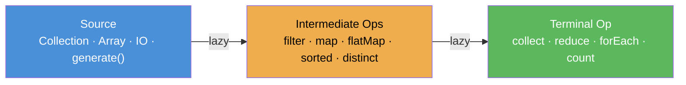
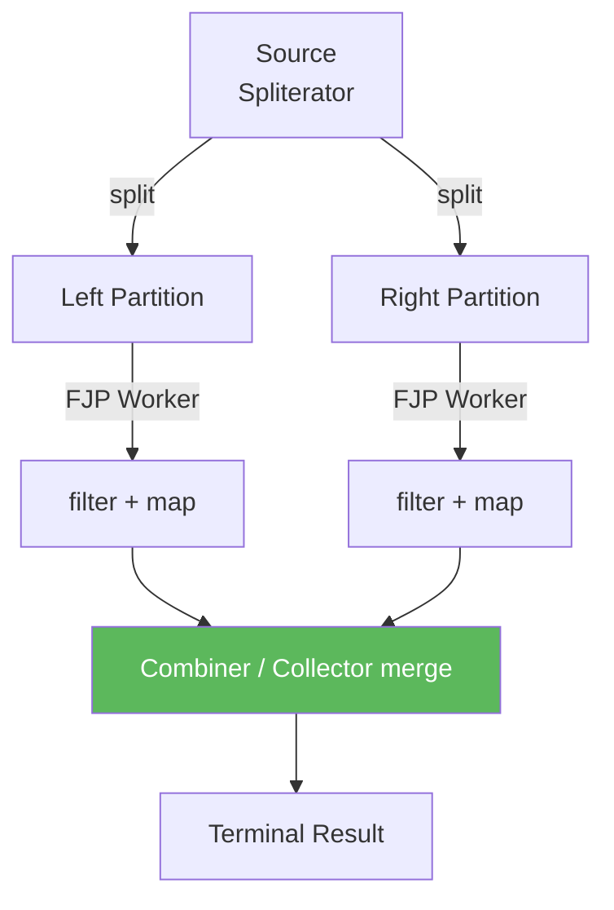
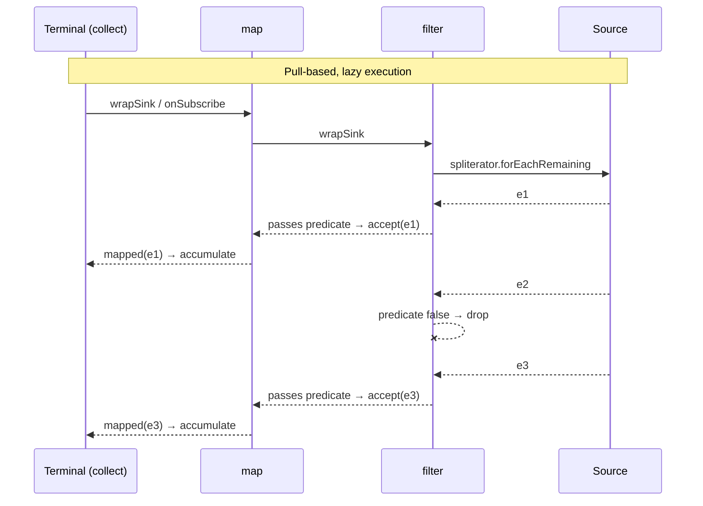

<!-- tldr -->
# Streams API

A `Stream<T>` is a lazily-evaluated pipeline of operations over a data source—collection, array, I/O channel, or generator. Unlike collections, streams carry no storage; they describe computation. A pipeline has exactly one source, zero-or-more stateless/stateful intermediate operations, and exactly one terminal operation that triggers execution. Parallelism is a first-class toggle, not a rewrite.



<!-- standard -->

## What It Is

Streams are the execution layer for functional-style bulk data processing in Java. They implement the **pipeline pattern**: each intermediate op wraps the previous stage in a new `Stream` object; nothing executes until the terminal op pulls elements.

## Why It Matters

- Replaces verbose `for`-loop idioms with declarative, readable transformations.
- Built-in short-circuiting (`findFirst`, `anyMatch`, `limit`) avoids full traversals.
- Switching to `parallelStream()` exploits multi-core without manual thread management.
- Composable `Collector` framework handles grouping, partitioning, and joining in one pass.

## Primary Techniques

| Category | Methods |
|---|---|
| Filtering / slicing | `filter`, `distinct`, `limit`, `skip`, `takeWhile`*, `dropWhile`* |
| Mapping | `map`, `flatMap`, `mapToInt/Long/Double`, `mapMulti`* |
| Reduction | `reduce`, `count`, `sum`, `min`, `max` |
| Collection | `collect(Collectors.toList/toMap/groupingBy/joining)` |
| Matching | `anyMatch`, `allMatch`, `noneMatch`, `findFirst`, `findAny` |

*Java 9+

**Stateless vs stateful** intermediates matter: `filter` and `map` are stateless (process each element independently); `sorted`, `distinct`, and `limit` are stateful and may buffer the entire stream.

## Key Tradeoffs

- **Parallel overhead**: `ForkJoinPool.commonPool()` splits via `Spliterator`. For datasets < ~10 k small objects, sequential is usually faster due to split/merge overhead.
- **Boxing cost**: `Stream<Integer>` boxes every element. Prefer `IntStream`/`LongStream`/`DoubleStream` for numeric work.
- **Encounter order**: ordered sources (`List`) preserve order even in parallel but reduce parallelism; `unordered()` hint can help.
- **Reusability**: a stream is consumed once. Attempting to reuse throws `IllegalStateException`.



<!-- deep -->

## Deep Dive

### How Lazy Evaluation Works

Each intermediate op wraps the upstream in a `ReferencePipeline.StatelessOp` or `StatefulOp`. The terminal op calls `Sink.begin → Sink.accept* → Sink.end`. The pipeline is pulled **element-by-element**, enabling short-circuit exits without materialising intermediate lists.



### Collectors In Depth

`Collectors.groupingBy` internally uses `HashMap` + `ArrayList`; adding a downstream collector (e.g., `counting()`) runs a second reduction per group in the same pass:

```java
Map<Dept, Long> headcount = employees.stream()
    .collect(groupingBy(Employee::dept, counting()));
```

`Collectors.teeing` (Java 12) runs two collectors concurrently on the same stream and merges results—useful for mean + variance in one traversal.

### Parallel Streams: Real Numbers & Sizing

| Dataset size | Element type | Sequential | Parallel (8-core) | Winner |
|---|---|---|---|---|
| 1 k `Integer` sum | boxed | ~10 µs | ~80 µs | Sequential |
| 1 M `int` sum | `IntStream` | ~500 µs | ~100 µs | Parallel |
| 100 M `double` stats | `DoubleStream` | ~400 ms | ~60 ms | Parallel |

Rules of thumb:
- N × cost-per-element must exceed ~100 µs before parallel pays off.
- **NQ model**: N = number of elements, Q = per-element cost. NQ > 10 k → consider parallel.
- IO-bound pipelines: parallel streams on the common pool block FJP workers; use a custom `ForkJoinPool` or virtual threads instead.

```java
ForkJoinPool pool = new ForkJoinPool(32);
List<Result> out = pool.submit(() ->
    ids.parallelStream().map(this::fetchFromDB).collect(toList())
).get();
```

### Spliterator & Custom Sources

A `Spliterator<T>` characterises a source via bit flags: `ORDERED`, `DISTINCT`, `SORTED`, `SIZED`, `NONNULL`, `IMMUTABLE`, `CONCURRENT`, `SUBSIZED`. Providing accurate characteristics lets the framework skip redundant work (e.g., skipping `sorted` when `SORTED` is set).

### Real-World Usage

- **Kafka Streams DSL** mirrors the Stream API pattern (`KStream.filter`, `map`, `groupByKey`, `aggregate`) but over infinite event logs with backpressure.
- **Spring Data projections** use `Stream<T>` return types on repository methods to stream JDBC result sets without loading into a `List`, capping heap at O(1) instead of O(N).
- **Elasticsearch Java client** exposes `SearchHits` as an `Iterable` you wrap in `StreamSupport.stream(...)` for pipeline processing.
- **Lucene's DocValues** iterates segments using a `Spliterator`-backed stream for field statistics.

### Failure Modes & Gotchas

| Mistake | Consequence | Fix |
|---|---|---|
| Reusing a consumed stream | `IllegalStateException` at runtime | Create a new stream per use; use `Supplier<Stream<T>>` |
| `parallelStream` + shared mutable state | Race conditions, wrong results | Use `collect` / `reduce`; never mutate external state |
| `sorted()` on an infinite stream | Hangs forever | Always apply `limit()` before stateful ops on infinite sources |
| `Stream<Integer>` for arithmetic | ~3–5× slower due to boxing | Use `mapToInt().sum()` etc. |
| `forEach` + side effects in parallel | Non-deterministic ordering | Use `forEachOrdered` or avoid forEach for order-sensitive work |
| `toMap` with duplicate keys | `IllegalStateException` | Supply merge function: `toMap(k, v, (a, b) -> b)` |
| `flatMap` inside parallel stream | Sub-streams are always sequential | Prefer `mapMulti` (Java 16) for parallel-friendly flat-mapping |

### Capacity & Latency Reference

- `Stream.generate(UUID::randomUUID).limit(1_000_000).collect(toList())` → ~600 ms sequential, bottlenecked on UUID generation.
- `IntStream.range(0, 100_000_000).sum()` → ~50 ms sequential, ~8 ms parallel (8-core).
- `Files.lines(path)` on a 10 GB file streams lazily; peak heap stays < 1 MB (one buffer-worth at a time).

### Interview Pitfalls

1. **`findFirst` vs `findAny`**: `findFirst` respects encounter order (forces synchronisation in parallel). `findAny` is faster in parallel when order is irrelevant.
2. **`reduce` identity contract**: The identity must be a true identity for the combiner (`a op identity == a`). Using `0` as identity for multiplication is a bug.
3. **`peek` is not guaranteed to fire**: On short-circuiting pipelines, not every element reaches `peek`. Never use `peek` for side-effectful logic in production.
4. **`Collectors.toList()` vs `toUnmodifiableList()`**: The former returns a mutable `ArrayList`; since Java 10 prefer `toUnmodifiableList()` for read-only contracts.
5. **`Optional` from `findFirst`**: interviewers expect you to chain `.orElseThrow()` / `.map()` instead of calling `.get()`.

### Decision Rubric: When to Reach for Streams

```
Need to transform / filter a collection?
  └─ Yes → Stream (over for-loop)
       ├─ Dataset > 50k elements AND CPU-bound?
       │     └─ Yes → parallelStream() or custom FJP
       ├─ Numeric aggregation (sum/avg/stats)?
       │     └─ Yes → IntStream / LongStream / DoubleStream
       ├─ Single-pass grouping / partitioning?
       │     └─ Yes → Collectors.groupingBy / partitioningBy
       └─ Infinite / unbounded source?
             └─ Yes → Stream.iterate / generate + limit + takeWhile
```

Avoid streams when:
- You need `break`/`continue` mid-loop with complex control flow (use traditional loop).
- You need indexed access (`get(i)`) — streams have no index without `IntStream.range`.
- Checked exceptions propagate; wrapping them in unchecked adds noise (consider structured loops or `ThrowingFunction` utilities).