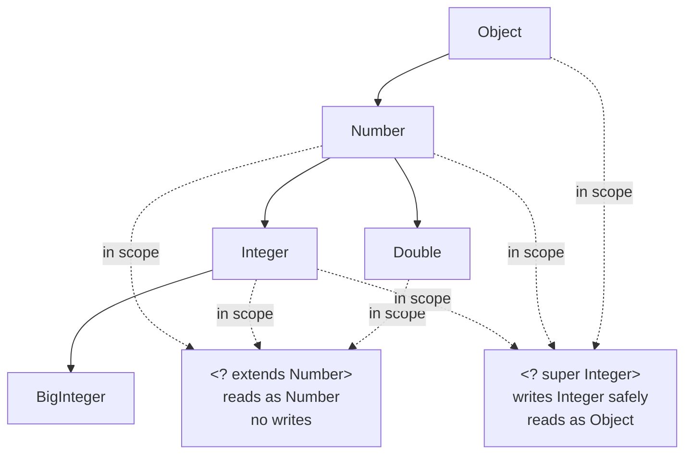
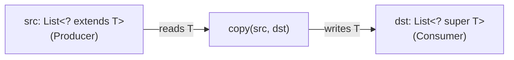
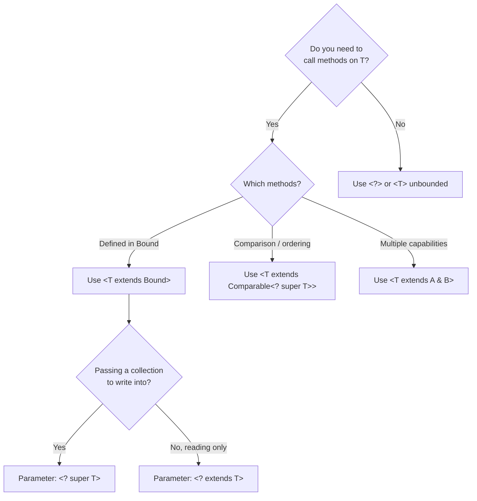

<!-- tldr -->
# Bounded Type Parameters

Bounded type parameters let you declare that a generic placeholder `T` must be a subtype (`extends`) or supertype (`super`) of a given class or interface. Upper bounds (`<T extends Foo>`) widen the operations you can call on `T`; lower bounds (`<? super Foo>`) widen what you can safely put *into* a structure. Together with the PECS rule, they are the primary tool for writing reusable, type-safe library APIs in Java.



<!-- standard -->

## What It Is

Java generics support two flavours of bounds:

| Syntax | Name | Read type | Write type | Use when |
|---|---|---|---|---|
| `<T extends Bound>` | Upper bound | `Bound` | `T` exactly | Consuming values FROM a structure |
| `<? extends Bound>` | Upper wildcard | `Bound` | ❌ (compiler blocks) | Read-only producer |
| `<? super Bound>` | Lower wildcard | `Object` | `Bound` or subtype | Write-only consumer |
| `<T extends A & B>` | Multiple bounds | Both interfaces | `T` exactly | Need capabilities of two types |

**PECS — Producer Extends, Consumer Super** (Bloch, *Effective Java* Item 31):

- A parameter that **produces** `T` values for your method → `? extends T`
- A parameter that **consumes** `T` values your method provides → `? super T`



## Why It Matters

Without bounds, you'd be forced to write separate overloads or accept raw types and cast — both are type-safety landmines at scale. Bounded parameters let `Collections.sort`, `Stream.max`, and virtually every JDK algorithm work across dozens of concrete types without duplicated logic.

## Key Tradeoffs

- **Flexibility vs. writability**: `? extends T` buys call-site flexibility but prevents any element insertion — the compiler cannot verify the concrete type at compile time (wildcard capture).
- **Lower bounds are rare but essential**: `Collections.addAll(Collection<? super T> c, T... elements)` would break without `super`.
- **Multiple bounds force interface-first**: `<T extends Comparable<T> & Serializable>` — a class may appear only once and must be listed first.

<!-- deep -->

## Deep Dive

### Recursive Type Bounds

The most expressive pattern you'll encounter in interviews:

```java
public <T extends Comparable<T>> T max(List<T> list) { … }
```

`T extends Comparable<T>` means "T can compare itself to other T's." This is a **recursive type bound** (F-bounded polymorphism). Real JDK use: `Enum<E extends Enum<E>>`.

A subtly stricter variant:

```java
// Handles comparators over supertypes — correct for heterogeneous hierarchies
public <T extends Comparable<? super T>> T max(List<? extends T> list) { … }
```

`Collections.max` uses exactly this signature. Know why: `Comparable<? super T>` allows a `Fruit` comparator to order both `Apple` and `Orange`.

### Type Erasure Interaction

At runtime, bounds evaporate:

```
List<? extends Number>  →  List (raw)
T extends Closeable     →  Closeable (first bound used as erasure)
T extends A & B & C     →  A (leftmost class/interface)
```

Implications:
- You **cannot** do `new T[]` regardless of bounds — arrays are reified, generics aren't.
- Checked casts against erased types produce `@SuppressWarnings("unchecked")` smells.
- Bridge methods are generated for bounded overrides — this affects reflection and byte-buddy-style proxies.

### Wildcard Capture

The compiler can "capture" a wildcard into a fresh type variable internally, which is why:

```java
void swap(List<?> list, int i, int j) {
    // list.set(i, list.get(j));  // won't compile: ? is unknown
    swapHelper(list, i, j);       // helper captures ? as T
}
private <T> void swapHelper(List<T> list, int i, int j) {
    T tmp = list.get(i); list.set(i, list.get(j)); list.set(j, tmp);
}
```

This is the **capture helper** idiom — critical for implementing algorithms over wildcard collections.

### Real-World Usage in Major Systems

```mermaid
sequenceDiagram
    participant Client
    participant StreamAPI as Stream&lt;T&gt;
    participant Collector as Collector&lt;T,A,R&gt;
    participant Comparator as Comparator&lt;? super T&gt;

    Client->>StreamAPI: stream.sorted(comparator)
    Note over StreamAPI,Comparator: T extends Object; comparator accepts supertypes
    StreamAPI->>Comparator: compare(a, b) — safe because ? super T
    StreamAPI->>Collector: collect(downstream)
    Note over StreamAPI,Collector: Collector&lt;? super T, A, R&gt; in Collectors.groupingBy
    Collector-->>Client: R (result)
```

| System | Bounded type usage | Why |
|---|---|---|
| **JDK Collections** | `<T extends Comparable<? super T>>` in `sort`, `max`, `min` | Heterogeneous subtype comparisons |
| **JDK Streams** | `Collector<? super T, A, R>` in `collect` | Accept downstream collectors for supertypes |
| **Guava** | `<K extends Comparable<? super K>>` in `ImmutableSortedMap` | Natural-order guarantees at construction time |
| **Spring** | `<T extends ApplicationEvent>` in `ApplicationEventPublisher` | Publish-subscribe type safety |
| **Jackson** | `<T extends JsonNode>` in `ObjectMapper.treeToValue` | Node-type-safe deserialization |

### Failure Modes & Interview Pitfalls

**Pitfall 1 — Mixing bounded wildcards with `new`:**
```java
// WRONG
List<? extends Number> list = new ArrayList<? extends Number>(); // compile error
// RIGHT — wildcard only on left
List<? extends Number> list = new ArrayList<Integer>();
```

**Pitfall 2 — Adding to an `extends` list:**
```java
List<? extends Number> nums = new ArrayList<Integer>();
nums.add(3.14); // compile error — correct! compiler can't verify the concrete type
```

**Pitfall 3 — Forgetting `? super T` in comparators:**
```java
// Fragile: only accepts Comparator<Employee>, not Comparator<Person>
public void sort(List<Employee> list, Comparator<Employee> c) { … }
// Robust:
public void sort(List<Employee> list, Comparator<? super Employee> c) { … }
```

**Pitfall 4 — Using wildcards in return types** (Bloch Item 31): wildcards in return types leak into caller code, forcing *them* to use wildcards. Prefer bounded type parameters in return positions.

### Capacity / Performance Notes

- Bounds are compile-time only — zero runtime overhead vs. unbounded generics.
- Bridge method generation: O(number of overriding methods). In hot paths (e.g., a Comparator called 1M QPS), the JIT inlines the bridge — effectively 0 ns overhead.
- Unbounded wildcards (`<?>`) produce the same bytecode as raw types but *retain* compiler checks. Prefer `<?>` over raw for any field or parameter you don't need to write to.

### Decision Rubric: When to Reach for Bounded Parameters



**Rule of thumb for interviews:**
1. Algorithm that *reads* from a collection → `? extends T` on the input.
2. Algorithm that *writes* into a collection → `? super T` on the output.
3. Need to call interface methods on `T` inside the method body → `T extends Interface` (named type parameter, not wildcard).
4. Comparing elements → `T extends Comparable<? super T>` to support heterogeneous hierarchies.
5. Never use a wildcard in a **public return type** — it forces callers into wildcard hell.