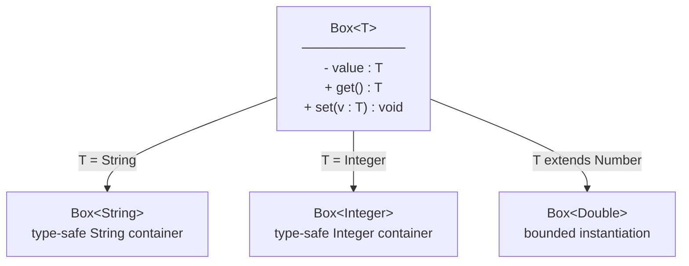
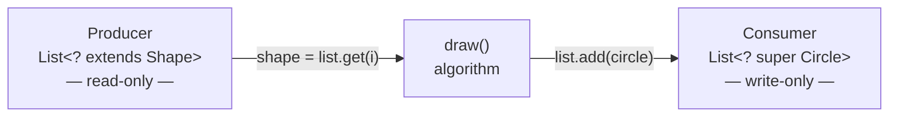
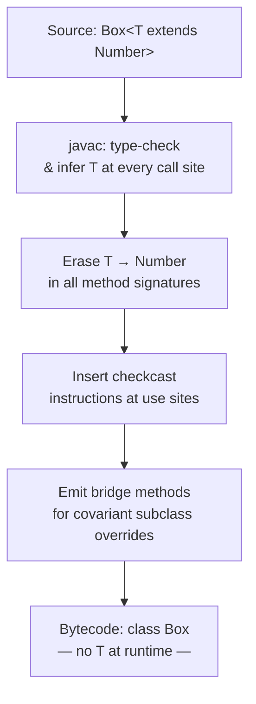

<!-- tldr -->
# Generic Classes and Methods

Generics let you write a single class or method that operates correctly over a family of types, with the compiler enforcing type constraints. Introduced in Java 5 via JSR 14, they are implemented through *type erasure*: type parameters exist only at compile time and are replaced with `Object` (or their bound) in bytecode. Every major Java library—Collections, Streams, `CompletableFuture`, Spring's `ResponseEntity<T>`—is built on generics.



<!-- standard -->

## What They Are

**Generic class** — a class declaration with one or more type parameters in angle brackets:

```java
public class Pair<A, B> {
    private final A first;
    private final B second;
    public Pair(A first, B second) { this.first = first; this.second = second; }
    public A first()  { return first; }
    public B second() { return second; }
}
```

**Generic method** — a method that introduces its own type parameter, independent of the enclosing class:

```java
public static <T extends Comparable<T>> T max(T a, T b) {
    return a.compareTo(b) >= 0 ? a : b;
}
```

The compiler infers `T` at each call site; explicit witness syntax (`Collections.<String>emptyList()`) is rarely needed post-Java 8.

## Why It Matters

- **Compile-time safety** — a `List<String>` cannot hold an `Integer` without an explicit (flagged) cast.
- **No manual casting** — `list.get(0)` returns `String`, not `Object`.
- **Algorithm reuse** — `Collections.sort`, `BinarySearch`, and `Stream` pipelines work over any type satisfying the bound.
- **API expressiveness** — return types like `Optional<T>` or `CompletableFuture<T>` encode intent in the signature.

## Primary Techniques

| Technique | Syntax | Use Case |
|---|---|---|
| Unbounded type param | `<T>` | Truly type-agnostic logic (swap, identity) |
| Upper-bounded param | `<T extends Comparable<T>>` | Need methods from T's supertype |
| Multiple bounds | `<T extends Runnable & Serializable>` | T must satisfy several contracts |
| Upper-bounded wildcard | `<? extends Number>` | Read from a producer (PECS) |
| Lower-bounded wildcard | `<? super Integer>` | Write into a consumer (PECS) |
| Recursive bound (F-bound) | `<T extends Comparable<T>>` | Fluent builders, enum-like hierarchies |

## Key Tradeoffs

- **No primitives** — `List<int>` is illegal; you must box to `Integer` (autoboxing overhead ~5–10 ns/op on modern JVMs).
- **Type erasure** — `List<String>` and `List<Integer>` share one `.class`; runtime `instanceof List<String>` is impossible without `TypeToken` tricks.
- **Raw types** — `List` (no parameter) silently disables all generic checking; mixing raw and parameterized types causes heap pollution.
- **Array incompatibility** — `new T[10]` is illegal; use `(T[]) new Object[10]` with `@SuppressWarnings` or prefer `List<T>`.



*PECS mnemonic: **P**roducer **E**xtends, **C**onsumer **S**uper.*

<!-- deep -->

## Deep Dive

### Type Erasure — What the Compiler Actually Does

The Java compiler performs four transformations:

1. **Replace each type parameter** with its erasure — `Object` if unbounded, the leftmost bound otherwise (`Comparable` for `<T extends Comparable<T>>`).
2. **Insert synthetic casts** at every call site where a generic value is consumed as a concrete type.
3. **Generate bridge methods** when a subclass overrides a generic method with a more specific signature, preserving polymorphism in bytecode.
4. **Retain metadata in `Signature` attributes** of the `.class` file so reflective tools (Gson, Jackson, Spring) can recover generic information via `Class.getGenericSuperclass()` or `Method.getGenericReturnType()`.



**Key consequence:** `getClass()` on a `List<String>` returns `java.util.ArrayList`, indistinguishable from `List<Integer>`.

---

### Concrete Algorithms & Formulas

#### Bounded Generic Sort

```java
// T must be self-comparable; no runtime overhead beyond natural Comparable dispatch
public static <T extends Comparable<T>> void insertionSort(List<T> list) {
    for (int i = 1; i < list.size(); i++) {
        T key = list.get(i);
        int j = i - 1;
        while (j >= 0 && list.get(j).compareTo(key) > 0) {
            list.set(j + 1, list.get(j--));
        }
        list.set(j + 1, key);
    }
}
```

#### TypeToken Pattern (Recovering Erased Type at Runtime)

```java
// Used by Gson, Jackson, Guava
public abstract class TypeToken<T> {
    private final Type type;
    protected TypeToken() {
        // Superclass generic info survives erasure in Signature attribute
        this.type = ((ParameterizedType)
            getClass().getGenericSuperclass()).getActualTypeArguments()[0];
    }
    public Type getType() { return type; }
}

Type listOfString = new TypeToken<List<String>>(){}.getType();
```

---

### Real-World Systems Using This Pattern

| System | Generic Usage | Why It Matters |
|---|---|---|
| **Java Collections** | `List<E>`, `Map<K,V>`, `Comparable<T>` | Zero-cast, type-safe containers; foundation of every Java app |
| **Stream API** | `Stream<T>`, `Collector<T,A,R>` | Lazy, composable pipelines; `Collector` uses 3 type params to express accumulate → combine → finish |
| **CompletableFuture** | `CompletableFuture<T>` | Chains async stages while preserving the result type through transformations |
| **Spring Framework** | `ResponseEntity<T>`, `ParameterizedTypeReference<T>` | HTTP response deserialization targets a known generic type without losing type info across erasure |
| **Gson / Jackson** | `TypeToken<T>` / `TypeReference<T>` | Reconstructs full generic type from `Signature` bytecode attribute for JSON binding |
| **Reactor / RxJava** | `Flux<T>`, `Mono<T>`, `Observable<T>` | Reactive stream operators compose over T with zero casts; type parameter threads through 20+ operator overloads |

---

### Failure Modes

#### 1. Heap Pollution
```java
List<String> strings = new ArrayList<>();
List raw = strings;           // unchecked warning
raw.add(42);                  // compiles; inserts Integer into List<String>
String s = strings.get(0);    // ClassCastException at runtime — heap polluted
```
**Fix:** never suppress `unchecked` warnings without a documented invariant; use `Collections.checkedList()` in defensive APIs.

#### 2. Varargs + Generics (`@SafeVarargs`)
```java
@SafeVarargs  // required when you own the method and guarantee no heap pollution
public static <T> List<T> listOf(T... items) {
    return Arrays.asList(items);
}
```
Omitting `@SafeVarargs` on a `final`/`static` varargs method causes spurious compiler warnings at every call site.

#### 3. Generic Array Creation
```java
T[] arr = new T[16]; // ILLEGAL — component type unknown at runtime
// Workaround:
@SuppressWarnings("unchecked")
T[] arr = (T[]) new Object[16]; // safe if array doesn't escape as T[]
```

#### 4. Wildcard Capture Errors
```java
List<?> list = new ArrayList<String>();
list.add("hello"); // compile error — ? could be anything
// Fix: use a capture helper
private static <T> void swapHelper(List<T> list, int i, int j) { ... }
public static void swap(List<?> list, int i, int j) { swapHelper(list, i, j); }
```

---

### Capacity & Latency Numbers Worth Knowing

- **Autoboxing cost:** `Integer.valueOf(n)` for cached range [-128, 127] is a cache hit (~1 ns); outside that range allocates (~5–10 ns, plus GC pressure). At 10M ops/sec this is ~50–100 ms/sec of allocation overhead.
- **Reflective generic type resolution** (e.g., `getGenericSuperclass()`) costs ~200–500 ns per call; frameworks cache results — never call in a hot path.
- **`Collections.checkedList` overhead:** one `instanceof` per insertion — negligible at < 1M insert/s, ~10% overhead at 50M insert/s.

---

### Interview Pitfalls

1. **"Is `List<String>` a subtype of `List<Object>`?"** — No. Generics are *invariant* by default. `List<? extends Object>` is the covariant supertype. Confusing invariance with covariance is the #1 generics interview mistake.
2. **"Can you overload on generic type?"** — No: `void process(List<String>)` and `void process(List<Integer>)` have identical erasures → compile error.
3. **"What's the difference between `<T extends Number>` and `<? extends Number>`?"** — Type params (`T`) can be referenced by name multiple times (e.g., return type + parameter); wildcards cannot be named, used for flexible API consumption.
4. **"When does erasure break your design?"** — When you need `new T()`, `new T[n]`, `instanceof T`, or `T.class`. All require workarounds (factory functions, `Class<T>` tokens, reflection).
5. **"Explain bridge methods."** — A `StringBox extends Box<String>` overriding `get()` produces a synthetic `Object get()` bridge that delegates to `String get()`, preserving runtime polymorphism through erasure.

---

### When to Reach for Generic Classes / Methods

```
Is the logic truly type-agnostic or bounded by a contract (Comparable, Serializable)?
  YES → Generic method/class.
    Does the caller only READ from the collection?
      YES → Producer: <? extends T>
    Does the caller only WRITE to the collection?
      YES → Consumer: <? super T>
    Both read and write?
      YES → Exact type parameter <T>
  NO → Use a concrete type or an interface; don't over-generify.

Does the class need to create instances of T, or check instanceof T?
  YES → Accept a Class<T> token or Supplier<T> factory as a constructor argument.

Is the generic type needed at runtime (JSON binding, metrics registry)?
  YES → Use the TypeToken/TypeReference pattern to capture type info.
```

**Rule of thumb:** if removing the type parameter would require the caller to cast, you need generics. If it would just move the cast inside the implementation, a concrete type is simpler.