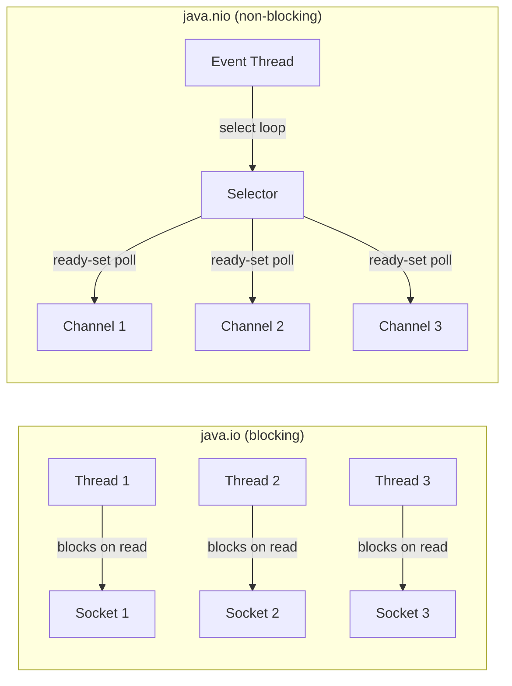
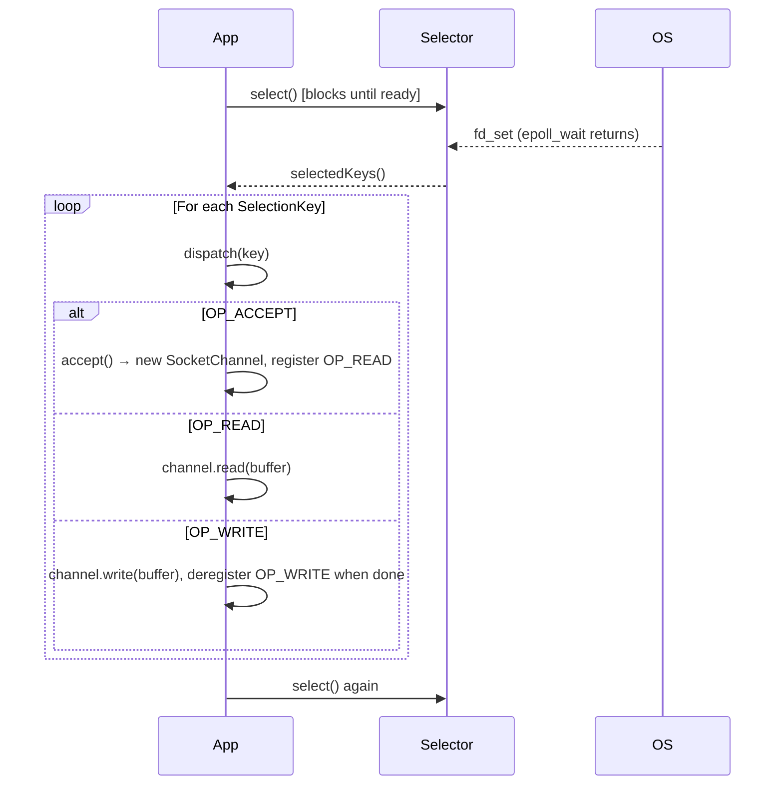
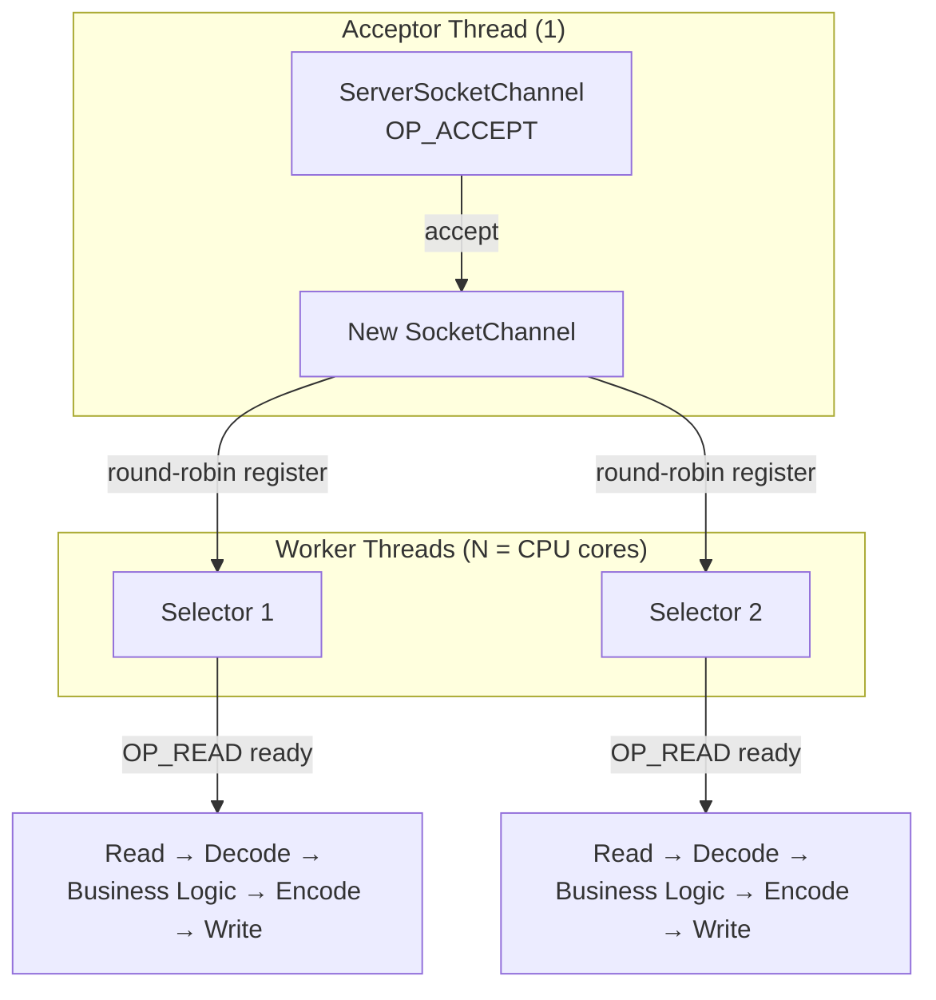

<!-- tldr -->
# Java NIO

Java NIO (New I/O, `java.nio`, Java 1.4; extended in Java 7 as NIO.2) replaces stream-oriented blocking I/O with a buffer-oriented, channel-based model. The killer feature is `Selector`: one thread can monitor thousands of open connections and dispatch only when data is actually ready. NIO.2 adds `AsynchronousChannel` for true OS-level async I/O (IOCP on Windows, epoll/io_uring on Linux).



<!-- standard -->

## What It Is

NIO centres on three abstractions:

| Abstraction | Role | Key Types |
|---|---|---|
| **Buffer** | Fixed-capacity typed container with position/limit/capacity | `ByteBuffer`, `IntBuffer`, `MappedByteBuffer` |
| **Channel** | Bidirectional, closeable I/O endpoint | `SocketChannel`, `FileChannel`, `DatagramChannel` |
| **Selector** | Multiplexes N channels onto M threads (N >> M) | `Selector`, `SelectionKey` |

### Buffer Internals
A `ByteBuffer` maintains three cursors:
- `capacity` — total allocated bytes (fixed)
- `limit` — last valid byte for the current operation
- `position` — next byte to read/write

The flip/clear/compact cycle is the most common source of bugs:

```
write phase → flip() → read phase → compact() (or clear())
```

### Channel Modes
`SocketChannel.configureBlocking(false)` makes all read/write calls return immediately with 0 bytes if no data is available. Register with a `Selector` to be notified when the OS indicates readiness (`OP_READ`, `OP_WRITE`, `OP_CONNECT`, `OP_ACCEPT`).

### Direct vs. Heap Buffers
- **Heap** (`ByteBuffer.allocate`): GC-managed; requires an extra OS copy on every I/O syscall.
- **Direct** (`ByteBuffer.allocateDirect`): off-heap memory pinned for DMA; no intermediate copy. Allocation is slow (~10×), so pool them. Releases via `Cleaner` (not GC); leaks if mismanaged.

### Key Tradeoffs

| | java.io | java.nio (non-blocking) | java.nio (async/NIO.2) |
|---|---|---|---|
| Threading model | 1 thread / connection | 1–few threads / N connections | Completion-callback (IOCP) |
| Latency | OK | Excellent under load | Excellent |
| Complexity | Low | Medium | High |
| Throughput ceiling | ~10 K connections | ~100 K–1 M connections | ~1 M connections |
| GC pressure | Low | Low (direct buffers) | Low |

### Why It Matters
- Netty, Kafka's network layer, Cassandra's native transport, and gRPC-java all build on NIO.
- The C10K problem is solved via selector-based event loops; C10M requires kernel bypass (DPDK) or io_uring.

---

<!-- deep -->

## Deep Dive

### The Selector Event Loop



**Critical implementation detail:** always deregister `OP_WRITE` after a successful write. Leaving it registered causes the selector to spin at 100% CPU because the OS almost always reports writable sockets as ready.

### FileChannel Deep Dive

`FileChannel` is always blocking even if opened from a non-blocking `SocketChannel`. Use `AsynchronousFileChannel` (NIO.2) for truly async file I/O.

**Scatter / Gather**
```java
// Scatter read: fills buffers sequentially
long bytes = channel.read(new ByteBuffer[]{headerBuf, bodyBuf});

// Gather write: drains buffers sequentially (zero-copy framing)
channel.write(new ByteBuffer[]{headerBuf, bodyBuf});
```
The OS batches scatter/gather into a single `readv`/`writev` syscall—critical for protocols like TLS record framing.

**transferTo / transferFrom (Zero-Copy)**
```java
fileChannel.transferTo(0, fileChannel.size(), socketChannel);
```
Maps to `sendfile(2)` on Linux. Skips the user-space copy entirely; typical throughput improvement: **2–4×** for large static file serving. Kafka's consumer fetch path uses this exclusively.

### Memory-Mapped Files

```java
MappedByteBuffer buf = fileChannel.map(
    FileChannel.MapMode.READ_WRITE, offset, length);
```
- Backed by `mmap(2)`; page faults bring data into memory on demand.
- Mutations go directly to the OS page cache; `buf.force()` → `msync`.
- Max mapping size on 32-bit JVM: 2 GB; 64-bit: effectively unlimited.
- **Unmap problem:** no public `unmap()` in Java < 21. Use `Unsafe.invokeCleaner(buf)` (Java 9+) or accept that the file handle stays open until GC runs the `Cleaner`.

### NIO.2 Asynchronous Channels

Two completion models:

| Model | API | Under the Hood |
|---|---|---|
| `Future` | `channel.read(buf)` returns `Future<Integer>` | Thread-pool polled internally |
| `CompletionHandler` | callback on `completed()`/`failed()` | OS async I/O (IOCP/io_uring) |

```java
AsynchronousSocketChannel ch = AsynchronousSocketChannel.open();
ch.read(buf, attachment, new CompletionHandler<Integer, A>() {
    public void completed(Integer n, A att) { /* handle */ }
    public void failed(Throwable ex, A att) { /* handle */ }
});
```

Real-world adopters: **Vert.x** (routes completions to event-loop threads), **WildFly XNIO**.

### Capacity & Latency Numbers

- Selector loop can handle **~500 K–1 M active TCP connections** with <5% CPU on modern hardware (epoll).
- `ByteBuffer.allocateDirect` throughput for network I/O: ~**10 GB/s** (memory-bandwidth bound).
- `transferTo` on a 1 GB file: ~**800 ms** vs ~**2 s** with InputStream copy at 1 GbE.
- Direct buffer allocation: **~1–5 µs** vs heap allocation **~50–100 ns**; always pool via `java.util.concurrent` queues or Netty's `PooledByteBufAllocator`.

### Real-World Systems

| System | NIO Usage |
|---|---|
| **Kafka** | `SocketServer` uses selector-based acceptors + processors; `FileChannel.transferTo` for zero-copy fetch |
| **Cassandra** | Native transport uses Netty (NIO) selectors per thread; async compaction uses `AsynchronousFileChannel` |
| **Netty** | `NioEventLoop` = one thread per selector; `EpollEventLoop` bypasses NIO for raw epoll FD |
| **Elasticsearch** | Netty for transport; memory-mapped Lucene segments for zero-copy search |
| **HBase** | Async RPC via NIO; HDFS short-circuit reads via `FileChannel.transferTo` |

### Failure Modes

1. **Selector spin loop** — `select()` returns 0 but `selectedKeys()` is empty, burning CPU. JDK bug (pre-Java 7 on Linux). Netty detects it by counting rapid zero-return cycles and rebuilding the `Selector`.
2. **Buffer position corruption** — forgetting `flip()` before read or `clear()` before write; produces silent data truncation.
3. **Direct buffer leak** — `allocateDirect` without pooling; native OOM with misleading `OutOfMemoryError: Direct buffer memory`. Tuned via `-XX:MaxDirectMemorySize`.
4. **`ClosedSelectorException`** — calling `select()` after `selector.close()` in shutdown paths; always guard with `isOpen()`.
5. **Half-write on non-blocking channel** — `channel.write(buf)` may write fewer bytes than requested; check `buf.hasRemaining()` and re-register `OP_WRITE`.

### Architecture: NIO-Based Server



This is the reactor pattern. **Single-reactor** (one selector thread) works to ~50 K QPS; **multi-reactor** (Netty's default) scales to millions.

### Interview Pitfalls

- **"NIO is non-blocking"** — partially true. `FileChannel` is always blocking. State this explicitly.
- **Confusing NIO with NIO.2** — NIO (1.4) = channels/buffers/selectors; NIO.2 (Java 7) = `Path`, `AsynchronousChannel`, `WatchService`.
- **Selector thread safety** — `Selector.select()` and `SelectionKey.interestOps()` are not thread-safe across threads without synchronization or `wakeup()`.
- **GC of direct buffers** — interviewed candidates often say direct buffers are "not GC'd at all." They are managed by `Cleaner` (a `PhantomReference`), which runs in a dedicated daemon thread post-Java 9.

### When to Reach for NIO

```
Need > 10K concurrent connections?          → Yes → Use NIO/Selector (or Netty)
Large file transfer (>10MB)?                → Yes → FileChannel.transferTo
Random-access structured binary data?       → Yes → MappedByteBuffer
True async file I/O on Linux?              → Yes → AsynchronousFileChannel or io_uring (JEP 425+)
Simple request/response, <1K connections?   → No  → java.io is fine; lower complexity
```

For greenfield services in Java 21+, evaluate **virtual threads** (`Thread.ofVirtual()`) before NIO. Virtual threads make blocking I/O scale like NIO without the selector complexity, at the cost of slightly higher memory per connection (~few KB vs near-zero for a parked virtual thread stack vs a selector registration).