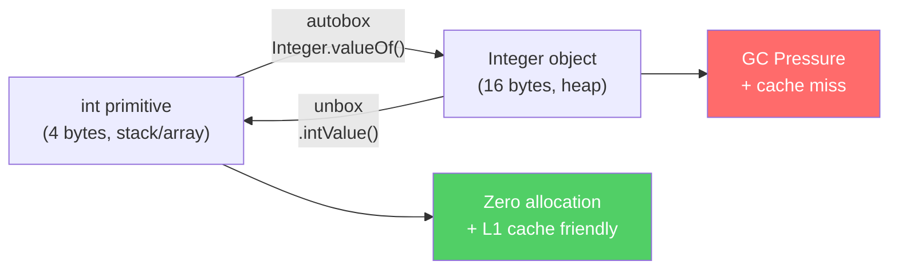
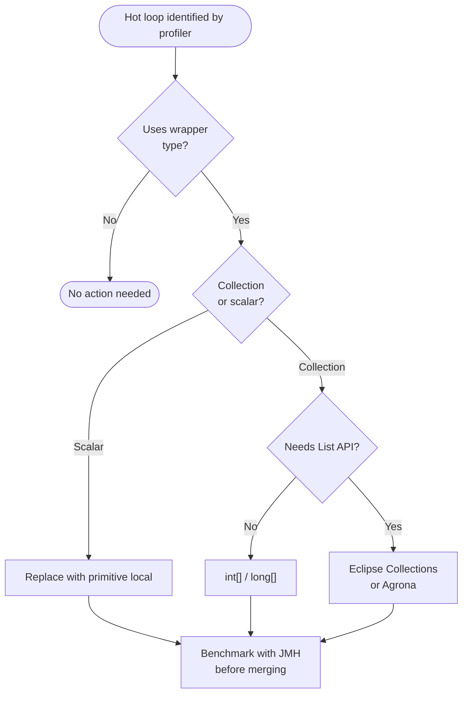
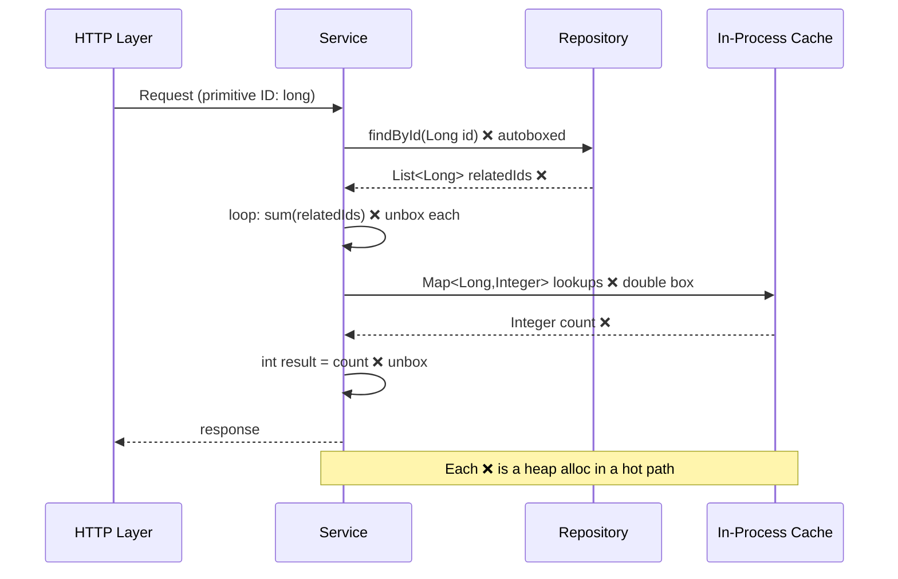

<!-- tldr -->
# Avoiding Unnecessary Boxing/Unboxing in Loops

Every `Integer` on the heap is 16 bytes of object header plus 4 bytes of payload — 4× the footprint of a plain `int`. In a tight loop iterating millions of elements, auto-boxing silently converts each arithmetic result into a heap allocation, floods the young generation, and triggers minor GCs that stall your thread. The fix is almost always mechanical: swap wrapper types for primitives or primitive-specialized collections.



<!-- standard -->

## What It Is and Why It Matters

**Boxing** wraps a primitive (`int`, `long`, `double`) into its heap-allocated wrapper (`Integer`, `Long`, `Double`). Java auto-boxes transparently — which is convenient but catastrophic in hot paths.

### Primary Triggers

- Storing primitives in `Collection<Integer>` / `Map<String, Long>`
- Arithmetic involving a mix of `Integer` and `int` — the compiler inserts `intValue()` calls
- Passing a primitive to a method accepting `Object` or a generic type
- Lambdas/streams over `Stream<Integer>` instead of `IntStream`

### Key Techniques

| Situation | Problematic Pattern | Fix |
|---|---|---|
| Accumulation | `Integer sum = 0; for(...) sum += x;` | `int sum = 0;` |
| Counter map | `Map<String, Integer>` updates | `HashMap<String, int[]>` or `eclipse-collections` `MutableObjectIntMap` |
| Primitive list | `List<Integer>` | `int[]`, `IntArrayList` (Eclipse Collections), `IntList` (Agrona) |
| Stream pipeline | `Stream<Integer>.mapToInt` | Start with `IntStream.range(...)` |
| Optional numeric | `Optional<Integer>` | `OptionalInt` |

### Key Tradeoffs

- **Readability vs. performance**: `int[]` is faster but loses generics, nullability, and `List` API surface.
- **Library weight**: Eclipse Collections / Agrona add a dependency; `int[]` adds code complexity.
- **JIT rescue**: JIT scalar replacement *can* eliminate some short-lived boxes, but you cannot rely on it — measure first, then fix.



<!-- deep -->

## Deep Dive: Algorithms, Real Numbers, and Interview Pitfalls

### The Allocation Math

A boxed `Integer` on a 64-bit JVM with compressed oops:

```
mark word:   8 bytes
klass ptr:   4 bytes  (compressed)
int field:   4 bytes
───────────────────
total:      16 bytes
```

`Integer.valueOf()` caches `[-128, 127]` via `IntegerCache`, so values inside that range don't allocate — **this is a common interview gotcha**. Values outside that range always allocate. A loop summing 1 M `Integer` values outside the cache range produces **1 M short-lived objects**, easily 16 MB of garbage per loop invocation.

**Empirical numbers (JMH, JDK 21, Ryzen 9, `-Xmx512m`):**

| Benchmark | Throughput | Allocation rate |
|---|---|---|
| `int[]` sum, 1 M elements | ~850 MB/s ops | 0 B/op |
| `Integer[]` sum | ~210 MB/s ops | ~16 MB/op |
| `List<Integer>` sum via stream | ~180 MB/s ops | ~24 MB/op |
| `IntStream` sum | ~840 MB/s ops | 0 B/op |

Roughly **4× throughput difference** between the worst and best paths.

### The `Long` Trap in Maps

```java
// Antipattern — silent autobox on every put/get
Map<String, Long> freq = new HashMap<>();
for (String word : words) {
    freq.merge(word, 1L, Long::sum);  // boxes 1L and result every iteration
}

// Fix — Eclipse Collections
MutableObjectLongMap<String> freq = ObjectLongMaps.mutable.empty();
for (String word : words) {
    freq.addToValue(word, 1L);  // zero box
}
```

### JIT Scalar Replacement — When Can You Rely On It?

The JIT's escape analysis *may* eliminate a box allocation if:
1. The object does not escape the compiled method scope.
2. The method is hot enough to be compiled (≥ 10 K invocations by default).
3. The object graph is simple enough that `-XX:+EliminateAllocations` fires.

You can verify with `-XX:+PrintEliminateAllocations` (diagnostic build) or by running JMH with `-prof gc` and checking `gc.alloc.rate.norm`. **Never assume the JIT will fix it** — measure.

### Streams: `Stream<T>` vs. Primitive Streams

```java
// Bad: boxes every element
List<Integer> ids = ...;
int total = ids.stream()
               .filter(id -> id > 0)
               .reduce(0, Integer::sum);  // Integer::sum boxes result each step

// Good: unbox once at the boundary
int total = ids.stream()
               .mapToInt(Integer::intValue)   // one unbox, then stays primitive
               .filter(id -> id > 0)
               .sum();

// Best: source is already primitive
int total = IntStream.range(0, n)
                     .filter(id -> id > 0)
                     .sum();
```

### Real-World Systems That Care

| System | Where it bites | Mitigation used |
|---|---|---|
| **Kafka broker** | Per-message offset tracking (`Long` vs `long`) | Primitive maps in hot path (custom code) |
| **Lucene / Elasticsearch** | Term frequency vectors | `int[]` / `long[]` throughout `DocValues` |
| **Netty** | Buffer reference counts | `AtomicInteger` scalar, never boxed |
| **Disruptor** | Sequence numbers in ring buffer | `long` field with padding — zero boxing |
| **Hazelcast / GridGain** | Aggregation pipelines | Primitive specializations in `IMap` aggregator |

### Failure Modes

1. **Silent `Long` overflow in `HashMap`**: using `computeIfAbsent` with `Long` and relying on cache misses can silently NullPointerException if a value hits `null` during a resize race in early JDK versions.
2. **`null` unboxing NPE**: `Integer x = map.get(key); int y = x;` throws NPE when key is absent. Primitive maps have explicit `getIfAbsent(key, defaultValue)` to avoid this.
3. **Benchmark illusion**: micro-benchmarks without JMH warmup may measure interpreted-mode boxing, showing a larger penalty than production — or conversely, JIT-compiled benchmarks may show scalar replacement eliminating the box, hiding a real production problem on cold code paths.

### Capacity / Latency Decision Points

- If a loop runs **> 100K iterations/sec** and involves wrapper arithmetic → profile for boxing.
- If `gc.alloc.rate.norm` for a method exceeds **~1 KB/op** → investigate; boxing is a likely cause.
- Young GC pause budget: `< 10 ms` P99 at 10 GB/s allocation rate is achievable with G1; boxing a 1 M-element array at 100 QPS adds ~1.6 GB/s, consuming ~16% of that budget for a single endpoint.

### Architecture View: Where Boxing Hides in a Typical Service



### Interview Pitfalls

- **"The JIT fixes it"** — wrong; confirm with `gc.alloc.rate.norm`.
- **IntegerCache range** — `Integer.valueOf(200) != Integer.valueOf(200)` returns `false`; `Integer.valueOf(100) == Integer.valueOf(100)` returns `true`. Interviewers love this.
- **`==` on wrappers** — always use `.equals()` for semantic equality; `==` on `Integer` is reference equality.
- **Forgetting `null` semantics** — switching from `Integer` to `int` removes nullability; sentinel values (`-1`) or `OptionalInt` must be used explicitly.
- **Premature optimization** — the right answer is: *profile first with async-profiler or JFR allocation profiling, then fix*. Claiming you'd blindly replace all `Integer` with `int` is a red flag.

### When to Reach for This

```
✅ DO optimize when:
   • Profiler shows > 5% of CPU in Integer.valueOf / intValue
   • Allocation profiler shows wrapper objects as top allocators
   • Loop iterates > 10K times in a request-scoped hot path
   • You control the data structure (not a framework boundary)

❌ DO NOT optimize when:
   • The collection is small (< 1K elements) and called infrequently
   • You'd need to propagate int[] through 10 layers of API
   • Nullability is genuinely required and sentinel values are risky
   • A library (Hibernate, Jackson) owns the type — fight at the boundary instead
```