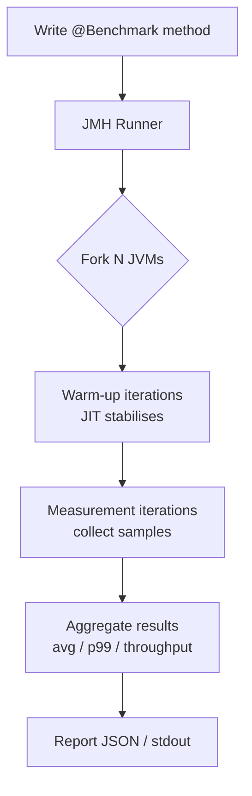
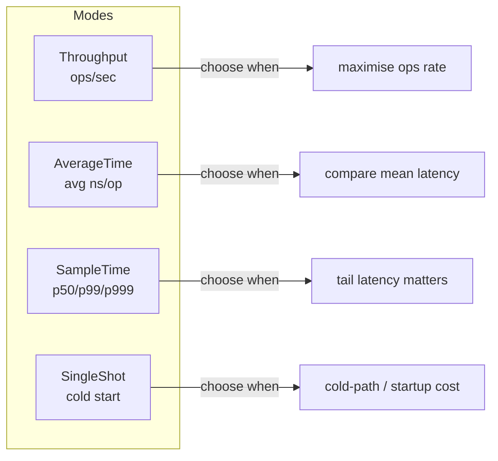
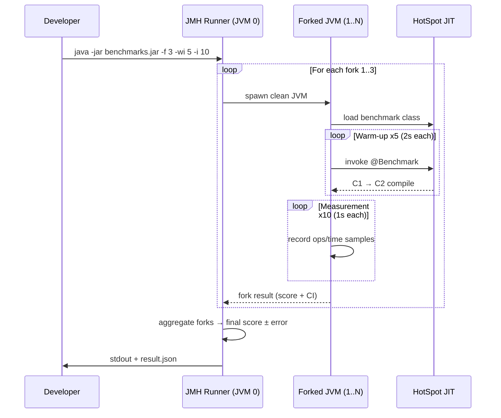

<!-- tldr -->
# Benchmarking with JMH

JMH (Java Microbenchmark Harness), maintained by the OpenJDK team, is the only trustworthy way to measure small units of Java code. Naïve `System.nanoTime()` loops produce wildly misleading results because the JIT compiles, inlines, and dead-code-eliminates your benchmark right out of existence. JMH drives the JVM through a controlled warm-up phase, forks fresh JVM processes per trial, and provides statistical aggregation — making it a prerequisite for any performance claim that has to survive code review.



<!-- standard -->

## What It Is & Why It Matters

Microbenchmarks measure one operation in isolation: a regex match, a `HashMap.get`, a serialisation call. Getting them right requires defeating four JVM behaviours:

- **Dead-code elimination (DCE)** — the JIT discards computations whose result is never consumed.
- **Constant folding** — inputs known at compile/JIT time get pre-computed; you measure nothing.
- **Inlining bias** — a method behaves differently when called from a benchmark harness vs. real code.
- **Class-loading / JIT warmup** — C1 → C2 tiered compilation takes thousands of invocations; measurements taken before tier-4 compile are noise.

JMH addresses all four systematically.

## Core Annotations

| Annotation | Purpose |
|---|---|
| `@Benchmark` | Marks a method for measurement |
| `@BenchmarkMode` | `Throughput`, `AverageTime`, `SampleTime`, `SingleShotTime` |
| `@OutputTimeUnit` | `NANOSECONDS`, `MICROSECONDS`, `MILLISECONDS` |
| `@Warmup` / `@Measurement` | Iteration count & duration |
| `@Fork` | Number of isolated JVM processes (≥ 3 for publications) |
| `@State(Scope.*)` | Lifts shared state out of the hot path; scope: `Benchmark`, `Thread`, `Group` |
| `@Param` | Matrix of input values across runs |

## Defeating DCE and Constant Folding

```java
@Benchmark
public int measureAdd(MyState s, Blackhole bh) {
    int result = s.x + s.y;   // state prevents constant folding
    bh.consume(result);        // Blackhole prevents DCE
    return result;             // returning also works
}
```

**`Blackhole.consume()`** is the idiomatic sink: it has a JMH-generated implementation that is opaque to the JIT but has near-zero overhead.

## Key Tradeoffs

- **Forks add wall-clock time** — 5 forks × 5 warm-up × 5 measurement at 1 s each = 50 s minimum; budget accordingly in CI.
- **`@State(Scope.Thread)` vs `Scope.Benchmark)`** — thread-scoped state avoids false sharing but hides contention; benchmark-scoped state exercises real concurrency.
- **`SampleTime` mode** catches tail latency (p99/p99.9) that `AverageTime` masks.



<!-- deep -->

## Deep Dive: Algorithms, Real Numbers & Interview Pitfalls

### Setup & Maven Dependency

```xml
<dependency>
  <groupId>org.openjdk.jmh</groupId>
  <artifactId>jmh-core</artifactId>
  <version>1.37</version>
</dependency>
<dependency>
  <groupId>org.openjdk.jmh</groupId>
  <artifactId>jmh-generator-annprocess</artifactId>
  <version>1.37</version>
  <scope>provided</scope>
</dependency>
```

JMH generates benchmark classes at compile time via annotation processing. Always build a **fat JAR** (`maven-shade-plugin`) and run via `java -jar benchmarks.jar` — running inside an IDE skips the harness machinery.

---

### How JMH Eliminates Warmup Noise

JMH drives the JVM through HotSpot's tiered compilation ladder:

```
Interpreted → C1 (tier 1-3) → C2 (tier 4, fully optimised)
```

A typical warm-up of **5 iterations × 2 s each** (~10 s total) is enough for most methods to reach tier-4. Evidence: look at `perfasm` output — if you see `<nmethod>` entries and the assembly stops changing between iterations, you're stable.

**Rule of thumb:** warm-up until throughput variance across iterations is < 5%.

---

### Statistical Model

JMH reports per-fork statistics and aggregates across forks using the **bootstrap confidence interval** method. The JSON output provides:

```
score      ± error  (99% CI)
```

For publication-quality numbers: **≥ 5 forks, ≥ 10 measurement iterations each**. For CI regression detection: **3 forks, 5 iterations** is a pragmatic tradeoff (~2–3 min runtime).

Latency categories to know cold:

| Operation | Typical P50 | P99 budget |
|---|---|---|
| L1 cache hit | ~1 ns | — |
| L3 cache hit | ~10 ns | — |
| `HashMap.get` (no collision) | 15–30 ns | 80 ns |
| `ConcurrentHashMap.get` | 20–50 ns | 120 ns |
| `ArrayList` iteration (10k ints) | 1–5 µs | 15 µs |
| Object serialisation (Jackson, 1 KB) | 2–8 µs | 25 µs |

---

### Real-World Systems That Use This Methodology

- **Netty** benchmarks all buffer-pool operations with JMH; their `PooledByteBufAllocator` claims < 50 ns allocation at P99 based on JMH `SampleTime` results.
- **Caffeine cache** (used in Spring, Guava replacement) uses JMH to validate near-`ConcurrentHashMap`-speed reads (~50 ns) and to tune the frequency sketch false-positive rate.
- **Apache Kafka** broker uses JMH for critical path: `RecordBatch` decode and `LogSegment` append. Their target is < 2 µs per record at 1 M msg/s throughput.
- **Project Loom** (virtual threads) used JMH to quantify scheduling overhead vs. OS threads — typically 100–200 ns context-switch cost for virtual vs. 1–2 µs for platform threads.

---

### Failure Modes & Traps

#### 1. Loop Optimisation / Auto-vectorisation
A loop inside a `@Benchmark` method may be auto-vectorised by C2, reporting unrealistically fast times:

```java
// BAD: JIT may vectorise and unroll
@Benchmark
public long sumArray() {
    long sum = 0;
    for (int i : data) sum += i;
    return sum; // return prevents DCE but vectorisation still fires
}
```

Use `@CompilerControl(DONT_INLINE)` on called methods or verify via `-prof perfasm` to see actual assembly.

#### 2. `@State` Sharing and False Sharing
Fields of a `@State` object that are accessed by multiple threads land on the same cache line (64 bytes). Use `@jdk.internal.vm.annotation.Contended` (or pad manually) if you're benchmarking concurrent throughput.

#### 3. Dead-Store Across Iterations
If `@State` fields are mutable and not reset, iteration N's result influences N+1. Use `@Setup(Level.Invocation)` — but note: invocation-level setup adds overhead visible in the numbers if the setup itself is slow.

#### 4. JVM Flags Mismatch
If your production JVM runs with `-XX:+UseG1GC -Xmx4g` but your benchmark uses defaults, GC pauses and heap pressure differ. Pass JVM args via `@Fork(jvmArgsPrepend = {...})`.

---

### Profilers Built Into JMH

| Profiler | Flag | What It Shows |
|---|---|---|
| `stack` | `-prof stack` | Async sampling stack traces |
| `gc` | `-prof gc` | GC pressure per operation |
| `perfasm` | `-prof perfasm` | CPU assembly with hotspot annotation |
| `async` | `-prof async` | Async-profiler integration (flame graphs) |
| `jfr` | `-prof jfr` | JFR recording per fork |

For FAANG interviews, citing `perfasm` plus `gc` profiler to identify allocation hotspots is a strong signal.

---

### Architecture: Full Benchmark Execution Flow



---

### Capacity & Throughput Considerations

- A single `@Benchmark` method should not be faster than **~1 ns/op** — if it is, the JIT has almost certainly eliminated your code. Verify with `-prof perfasm`.
- JMH's internal timing resolution is `System.nanoTime()`, which on Linux (TSC-based) has **~20–30 ns** resolution. Benchmarking sub-10 ns operations requires `@BenchmarkMode(SampleTime)` with very high ops counts to amortise timer overhead.
- For throughput benchmarks targeting **1 M ops/s**, run `@Threads(N)` sweeps from 1 → 2× core count to find the saturation point.

---

### Decision Rubric: When to Reach for JMH

```
Is the performance gap you're investigating > 10%?
 └─ Yes → Is it a hot path called > 100K times/sec in prod?
      └─ Yes → Write a JMH benchmark.
           └─ Profile first with async-profiler; only micro-benchmark the specific suspect method.
      └─ No → Macro-benchmark the full request path instead.
 └─ No → Don't benchmark; the noise floor makes it meaningless.
```

**Interview checklist:**
- Always mention **forks** — without them you can't distinguish JVM startup/JIT artefacts from the signal.
- Explain **`Blackhole`** and why `return` alone is sometimes insufficient.
- Know the difference between `AverageTime` (hides tail) and `SampleTime` (exposes tail).
- Name at least one `-prof` flag and what you'd look for in its output.
- State that you'd validate benchmark results against a **production flame graph** before shipping an optimisation.