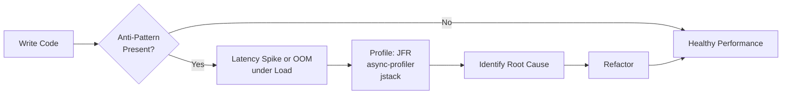
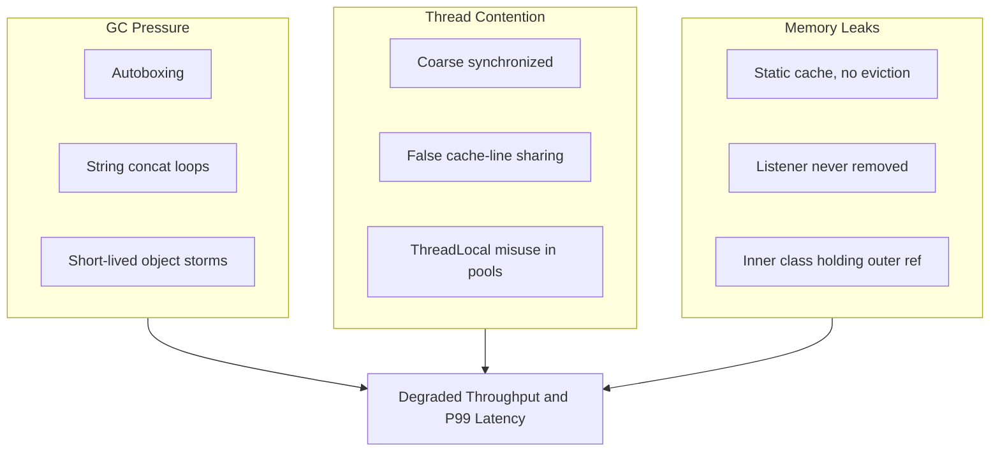
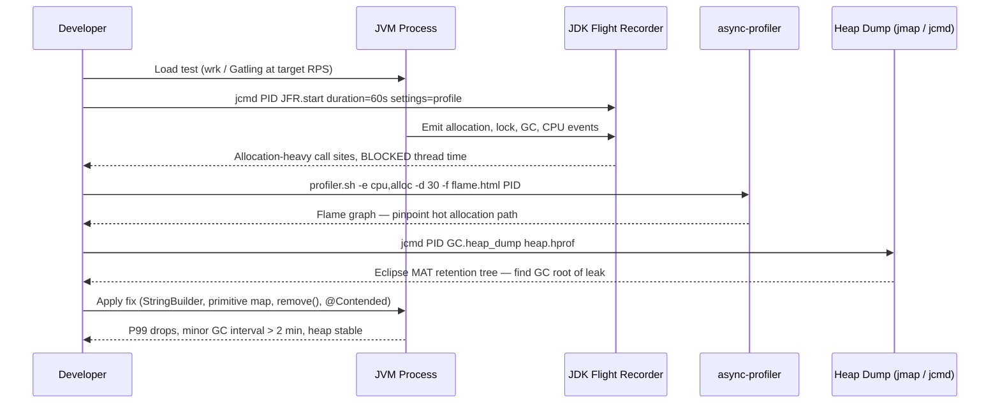

<!-- tldr -->
# Common Java Performance Anti-Patterns

Anti-patterns in Java performance are recurring coding mistakes that cause measurable degradation — GC pressure, lock contention, CPU waste, or memory leaks — at scale. Unlike correctness bugs, they pass all tests at low load and only surface under production traffic. Diagnosing them requires profiling with JFR or async-profiler, not guessing. The diagram below shows the canonical lifecycle: code that looks fine locally, degrades under load, and demands instrumented investigation.



<!-- standard -->

## What It Is and Why It Matters

Java's managed runtime abstracts memory and threading, which makes it easy to write code that is subtly expensive. The JIT compiler compensates for some mistakes in micro-benchmarks, creating a false sense of safety. Under realistic concurrency and data volumes, the same patterns cause P99 latencies to spike from 5 ms to 500 ms or trigger stop-the-world GC pauses that violate SLAs.

### The Six Most Costly Anti-Patterns

**1. String Concatenation in Loops**
`s += x` inside a loop creates O(n²) character array copies because `String` is immutable. At n = 10 k, that is 50 million copies. Use `StringBuilder` (single-threaded) or `String.join` / `StringJoiner` for known sets.

**2. Autoboxing and Unboxing on Hot Paths**
`HashMap<Long, Long>` allocates a heap `Long` per entry. At 100 k RPS with one map operation per request, that is ~800 MB/min of allocation pressure, exhausting Eden and triggering minor GC every few seconds.

**3. Wrong Data Structure Choice**
- `LinkedList` for indexed access → O(n) traversal vs. O(1) `ArrayList`
- `ArrayList` for head insertions → O(n) shifts per insert
- `HashMap` with broken `hashCode` → O(n) bucket chain traversal
- `HashSet` where sorted output is needed → forces an extra sort pass

**4. Coarse-Grained Locking**
A single `synchronized` method serializes all threads regardless of whether they touch shared state. At 32 threads on a 16-core machine this is a 4–8× throughput loss.

**5. Memory Leaks via Static Collections and Listeners**
Static `Map` caches that never evict, or `EventListener` registrations that are never removed, keep entire object graphs alive across requests — the most common cause of heap-growth OOM in long-running services.

**6. Swallowing Exceptions**
`catch (Exception e) {}` hides state corruption and makes downstream failures appear as unrelated symptoms (NullPointerException three stack frames later, silent data loss).

### Comparison Table

| Anti-Pattern | Symptom | Correct Approach |
|---|---|---|
| `String +=` in loop | High alloc rate, long GC pauses | `StringBuilder` |
| Autoboxing on hot path | Eden exhaustion, minor GC spike | Primitive collections (Eclipse Collections, Koloboke) |
| Wrong data structure | High CPU, slow method time | Profile and pick correct ADT |
| Coarse `synchronized` | Thread BLOCKED time, CPU idle | `ReadWriteLock`, `StampedLock`, `LongAdder` |
| Static cache, no eviction | Monotonic heap growth, eventual OOM | Caffeine / `LinkedHashMap` with `removeEldestEntry` |
| Broad `catch (Exception)` | Silent corruption, misleading traces | Catch specific types, log and rethrow |



<!-- deep -->

## Deep Dive: Algorithms, Real Systems, and Numbers

### String Concatenation: The Algebra

`"a" + "b" + … + z` in a loop of n iterations copies `1 + 2 + … + n = n(n+1)/2` characters. For n = 10,000 that is **50 million character copies**. `StringBuilder.append` uses a doubling growth strategy — amortized O(1) per append, O(n) total.

```java
// Anti-pattern — O(n²) copies
String result = "";
for (String s : list) result += s;

// Fix — O(n) copies, ~1 allocation
StringBuilder sb = new StringBuilder(list.size() * 32);
for (String s : list) sb.append(s);
String result = sb.toString();
```

The JIT can optimize trivial two-operand cases (`a + b`) into `StringBuilder` internally, but it never restructures loop bodies that span method boundaries. Never rely on it.

---

### Autoboxing: Numbers That Matter

A compressed-OOPs `Long` object is 16 bytes on the heap. A service running 100 k RPS with one `Long` allocation per hot-path operation allocates **~960 MB/min**, saturating Eden and triggering minor GC every 3–4 seconds instead of every 2–3 minutes under a well-tuned configuration.

Kafka's internal consumer group coordinator originally tracked offsets with `Map<TopicPartition, Long>`. The fix for high-partition clusters switched hot paths to primitive arrays and pre-allocated structures — a well-documented optimization in KAFKA-7996.

**Preferred alternatives:**

| Use Case | Replace | With |
|---|---|---|
| `int`/`long` map keys | `HashMap<Integer, T>` | `IntObjectHashMap` (Eclipse Collections) |
| Counters | `Long[]` | `long[]` or `LongAdder` |
| Sets of primitives | `HashSet<Integer>` | `IntHashSet` (Eclipse Collections) |
| Ring buffers | `Queue<Long>` | `long[]` (LMAX Disruptor pattern) |

---

### Lock Contention and False Sharing

**False sharing** occurs when two independently written fields land on the same 64-byte CPU cache line. Core A's write invalidates Core B's cached line even though B never touched A's field. At 10 cores × 1 M ops/sec, measured throughput drops 5–10× compared to padded layout.

```java
// Broken: counter and flag share a cache line
class State {
    volatile long writes;   // 8 bytes
    volatile boolean flag;  // 1 byte — same line!
}

// Fixed: JDK 8+ @Contended (requires -XX:-RestrictContended)
class State {
    @Contended volatile long writes;
    @Contended volatile boolean flag;
}
```

**Lock hierarchy — reach for these in order:**

1. **`synchronized`** — simple, full mutual exclusion; fine for low-contention paths
2. **`ReentrantReadWriteLock`** — good when reads outnumber writes >5:1
3. **`StampedLock`** — optimistic reads without reader blocking; best for >80% reads
4. **`LongAdder` / `DoubleAdder`** — lock-free striped counters (Striped64); outperforms `AtomicLong` at high contention
5. **Immutable data + copy-on-write** — zero lock for read-dominated config; `CopyOnWriteArrayList` only when writes are rare (<1%)

**Real system:** Cassandra's MemTable uses `ConcurrentSkipListMap` to achieve O(log n) row-level concurrency without coarse table locks, enabling ~1 M writes/sec per node on NVMe.

---

### Memory Leaks: Detection and Canonical Fixes

#### ThreadLocal Leak in Thread Pools

```java
// Leak: Tomcat/Jetty reuses threads; value is never cleared
static final ThreadLocal<byte[]> BUFFER =
    ThreadLocal.withInitial(() -> new byte[1 << 20]); // 1 MB per thread

void handle(Request req) {
    byte[] buf = BUFFER.get();
    process(req, buf);
    // BUFFER.remove() omitted → 1 MB leaked per thread per hot-deploy cycle
}

// Fix
void handle(Request req) {
    try {
        byte[] buf = BUFFER.get();
        process(req, buf);
    } finally {
        BUFFER.remove(); // non-negotiable in pooled environments
    }
}
```

Omitting `remove()` in application servers caused `ClassLoader` leaks across hot deploys — a documented and reproduced failure mode in Tomcat 6/7 and JBoss AS.

#### Static Cache Without Eviction

```java
// Leak — grows without bound
static final Map<String, ComputedResult> CACHE = new HashMap<>();

// Fix — bounded LRU via LinkedHashMap
static final Map<String, ComputedResult> CACHE =
    Collections.synchronizedMap(new LinkedHashMap<>(1024, 0.75f, true) {
        @Override
        protected boolean removeEldestEntry(Map.Entry<String, ComputedResult> e) {
            return size() > 1024;
        }
    });

// Production-grade: Caffeine
LoadingCache<String, ComputedResult> cache = Caffeine.newBuilder()
    .maximumSize(10_000)
    .expireAfterWrite(5, TimeUnit.MINUTES)
    .recordStats()
    .build(key -> expensiveCompute(key));
```

---

### Anti-Pattern Detection Workflow



---

### Capacity and Latency Reference Numbers

| Scenario | Before Fix | After Fix |
|---|---|---|
| String concat, n = 50 k loop | ~2 s, 2 GB allocation | ~2 ms, 1 MB allocation |
| `HashMap<Long,Long>` hot counter | 800 MB/min GC pressure | ~0 GC (primitive array) |
| Coarse `synchronized` at 32 threads | 4–8× throughput loss | Near-linear with `StampedLock` |
| ThreadLocal leak, Tomcat 100 redeploys | OOM in ~2 h | Stable with `remove()` |
| Static cache, no eviction, 1 M entries | OOM in ~6 h | Stable at 10 k entries + Caffeine |
| False sharing on shared counter | 10× latency under 8 cores | Baseline after `@Contended` |

---

### Interview Pitfalls

- **"The JIT will optimize it."** JIT optimizes inlined hot loops; it never restructures algorithmic complexity or eliminates cross-method allocation chains. Do not bet on it.
- **Premature micro-optimization.** Swapping `ArrayList` for `ArrayDeque` without a profile is cargo-cult engineering. Always measure first.
- **Mutable keys in `HashMap`.** Mutating a field used in `hashCode` after insertion makes the entry permanently unfindable — a silent logical leak. Keys must be effectively immutable.
- **`ConcurrentHashMap` is not a silver bullet.** `get` then `put` is not atomic. Use `computeIfAbsent` for atomic read-modify-write; use `merge` for atomic accumulation.
- **Catching `Throwable` or `Exception` to "be safe."** This catches `OutOfMemoryError`, `StackOverflowError`, and `InterruptedException` — each of which requires specific recovery logic that a blanket catch prevents.

---

### Decision Rubric: When to Reach for Each Fix

```
Is allocation rate > 500 MB/min? (visible in JFR → Memory → Allocation by class)
  YES → Hunt autoboxing, String concat, anonymous class capture in hot loops
  NO  → Skip allocation tuning; look elsewhere

Is CPU > 70% with throughput below expected?
  → Check JFR → Thread → Lock Instances for BLOCKED time
  YES → Upgrade lock strategy: synchronized → ReadWriteLock → StampedLock → LongAdder
  NO  → Check flame graph for unexpected serialization / reflection overhead

Is heap growing monotonically, not released after full GC?
  → Memory leak. Run jmap + Eclipse MAT, find shortest GC-root path
  → Fix: add eviction (Caffeine), use WeakReference for caches, call ThreadLocal.remove()

Is P99 > 100 ms for logic that should complete in < 1 ms?
  → Check for false sharing (JFR hardware counters or perf stat)
  YES → Apply @Contended, pad structs, or partition data per thread
  → Also verify no blocking I/O on a virtual-thread carrier thread (JDK 21+)
```