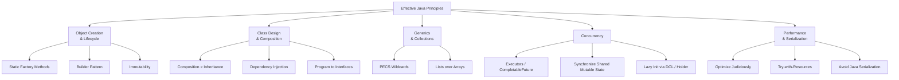
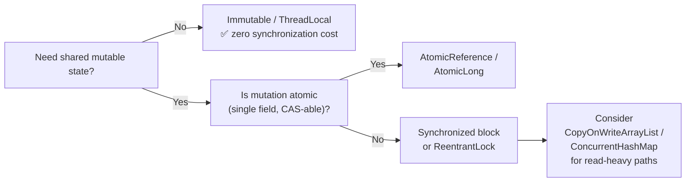
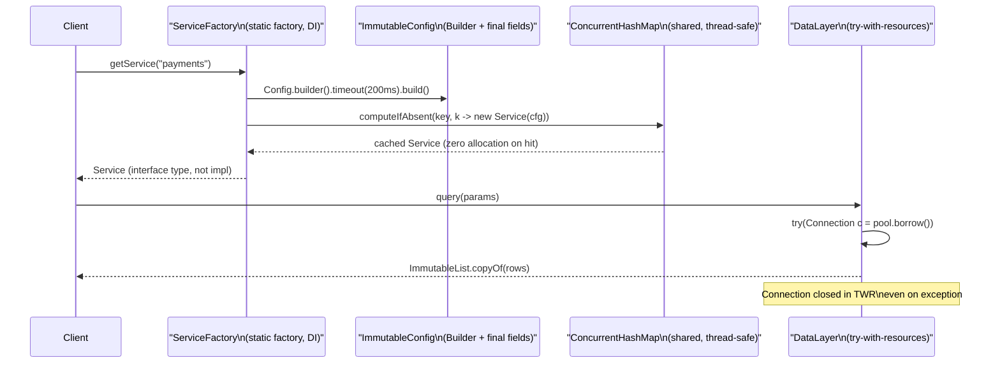

<!-- tldr -->
# Effective Java Principles

Joshua Bloch's *Effective Java* (3rd ed.) distills two decades of JDK authorship into ~90 items grouped around object creation, class design, generics, lambdas, concurrency, and serialization. For senior interviews, the high-leverage clusters are: **creation idioms** (static factories, Builder, DI), **immutability + composition**, **generics / PECS**, and **concurrency utilities over raw threads**. Mastering *why* each rule exists — the failure mode it prevents — is more important than reciting the item number.



<!-- standard -->

## What It Is & Why It Matters

Effective Java codifies the gap between code that compiles and code that survives production. Each item targets a concrete failure mode — memory leaks, broken `equals` contracts, race conditions, class-hierarchy fragility — that shows up in code reviews at senior/staff level. Interviewers at FAANG probe these not as trivia but as a proxy for judgment under constraints.

---

### Core Principle Clusters

#### 1. Object Creation & Lifecycle

- **Static factory methods over constructors** (Item 1): named, cacheable, can return subtypes. `Boolean.valueOf(true)` never allocates; constructors always do.
- **Builder for ≥4 parameters** (Item 2): avoids telescoping constructors; makes optional fields explicit; thread-safe by construction.
- **Avoid unnecessary object creation** (Item 6): prefer `String.valueOf` over `new String(...)`, reuse `Pattern` instances compiled once.
- **Eliminate obsolete references** (Item 7): manual array-backed stacks must null out popped slots or cause leaks; `WeakHashMap` for caches.
- **Prefer try-with-resources** (Item 9): `Closeable` resources closed in finally blocks suppress exceptions from `close()` silently; TWR propagates both.

#### 2. Class Design

- **Minimize mutability** (Item 17): immutable classes are inherently thread-safe, freely shareable, and failure-atomic. Make fields `final`, no setters, defensive copies in/out.
- **Composition over inheritance** (Item 18): inheritance breaks encapsulation when the superclass changes implementation across versions (`InstrumentedHashSet` counting inserts is the canonical bug).
- **Design for inheritance or prohibit it** (Item 19): either document all self-use and write tests, or declare `final`.
- **Prefer interfaces over abstract classes** (Item 20): existing classes can be retrofitted; mixins are possible (`Comparable`, `Serializable`).

#### 3. Generics & Collections

| Rule | Why |
|---|---|
| Prefer `List<E>` over `E[]` | Arrays are covariant + reified; generics are invariant + erased. Mixing causes `ClassCastException` at runtime |
| Use bounded wildcards (PECS) | `Producer Extends, Consumer Super` — `List<? extends Number>` for reading, `List<? super Integer>` for writing |
| Prefer `@SafeVarargs` over `@SuppressWarnings` | Documents heap-pollution contract explicitly |

#### 4. Concurrency

- **Synchronize access to shared mutable data** (Item 78): `long`/`double` reads are not atomic on 32-bit JVMs; `volatile` only fixes visibility, not atomicity.
- **Prefer `Executor`, tasks over raw threads** (Item 80): `ForkJoinPool`, `CompletableFuture`, `StructuredTaskScope` (JDK 21) give lifecycle control for free.
- **Prefer concurrency utilities to `wait`/`notify`** (Item 81): `CountDownLatch`, `Phaser`, `BlockingQueue` express intent clearly; `wait`/`notify` are brittle to spurious wakeup.



---

<!-- deep -->

## Deep Dive

### Object Creation: Algorithms & Real Numbers

#### Static Factory Method Pattern

```java
// Can return cached instances — zero allocation on hot path
public static Boolean valueOf(boolean b) {
    return b ? Boolean.TRUE : Boolean.FALSE;
}
```

- `Boolean.valueOf` eliminates ~48 bytes/object allocation on repeated calls.
- At 1M QPS on a hot path that creates 3 wrapper objects per request → saving ~144 MB/s of heap pressure, reducing GC pause frequency measurably at P99.
- Factories enable **service-provider frameworks**: `DriverManager.getConnection` returns a `Connection` subtype without coupling callers to the JDBC driver class.

#### Builder Pattern: Implementation Details

```java
public final class NutritionFacts {
    private final int calories;        // required
    private final int fat;             // optional
    private final int sodium;          // optional

    public static class Builder {
        private final int calories;
        private int fat = 0;
        private int sodium = 0;

        public Builder(int calories) { this.calories = calories; }
        public Builder fat(int val)    { fat = val;    return this; }
        public Builder sodium(int val) { sodium = val; return this; }
        public NutritionFacts build()  { return new NutritionFacts(this); }
    }
    private NutritionFacts(Builder b) {
        calories = b.calories; fat = b.fat; sodium = b.sodium;
    }
}
```

**Pitfall**: Builder allocation itself adds ~16-32 bytes. For value-type-like objects on hot paths, consider factory methods with explicit parameter names via static imports. JDK 23's value classes (`@ValueBased`) may eliminate this overhead entirely via scalarization.

---

### Immutability: Failure Modes & Enforcement

| Technique | Enforcement | Cost |
|---|---|---|
| `final` fields | Compile-time | Zero runtime |
| Defensive copy in constructor | Runtime | 1 allocation |
| Defensive copy on getter | Runtime | 1 allocation per call |
| `Collections.unmodifiableList` | Runtime throws | View wrapper object |
| `List.copyOf` (JDK 10+) | Deep copy | O(n) |

**Real system**: Kafka's `ProducerRecord` is effectively immutable after construction — key, value, headers, timestamp are all set at build time and never mutated, enabling lock-free reads across producer and interceptor threads without synchronization.

**Failure mode**: Shallow defensive copy.

```java
// BROKEN — Date is mutable; attacker retains reference to original
public Period(Date start, Date end) {
    this.start = start; // ← should be new Date(start.getTime())
    this.end   = end;
}
```

After construction, caller mutates `start` through their retained reference, violating invariants. Fix: copy *before* validation (Item 50).

---

### Composition Over Inheritance: The `InstrumentedHashSet` Bug

```java
// Broken — counts each addAll element twice because HashSet.addAll calls add()
public class InstrumentedHashSet<E> extends HashSet<E> {
    private int addCount = 0;
    @Override public boolean add(E e)           { addCount++; return super.add(e); }
    @Override public boolean addAll(Collection<? extends E> c) {
        addCount += c.size(); return super.addAll(c); // calls add() internally → double-count
    }
}
```

**Composition fix**: wrap a `HashSet` via a forwarding class; override only the public API surface you own. This pattern is used extensively in Guava's `ForwardingCollection` hierarchy.

---

### Generics & PECS: Interview Cheat Sheet

**Producer Extends, Consumer Super**

```java
// PECS in action
public static <T> void copy(List<? super T> dest, List<? extends T> src) {
    for (T t : src) dest.add(t);
}
```

- `? extends T` → you can *read* T values out (producer).
- `? super T` → you can *write* T values in (consumer).
- `Comparator<? super T>` is a consumer of T — it reads two T's and produces an int, so it should accept any supertype comparator, allowing reuse across hierarchies.

**Heap pollution** occurs when a `List<String>` is referenced via `List<Object>`. At erasure, the cast inserted by the compiler fails. `@SafeVarargs` is a promise to the compiler that the method body does not pollute the heap — violating it causes `ClassCastException` at the *call site*, not the method, making debugging brutal.

---

### Concurrency: DCL and the Holder Idiom

#### Double-Checked Locking (Item 83)

```java
// Correct DCL — requires volatile (JDK 5+ memory model)
private volatile FieldType field;
private FieldType getField() {
    FieldType result = field;       // local var avoids 2nd volatile read on fast path
    if (result != null) return result;
    synchronized (this) {
        if (field == null) field = computeFieldValue();
        return field;
    }
}
```

Without `volatile`, the JIT can reorder the store to `field` before the constructor finishes, and another thread reads a partially constructed object. This was the source of a notorious JDK 1.4 bug in `String.hashCode` caching.

**P99 latency**: With `volatile` + DCL on a modern x86 (TSO memory model), the fast path adds ~1–3 ns versus ~200–400 ns for an uncontested `synchronized` block. Use DCL only when the initialization cost exceeds that delta (e.g., loading a config file, connecting to a DB pool).

#### Initialization-on-Demand Holder (preferred for statics)

```java
private static class FieldHolder {
    static final FieldType field = computeFieldValue(); // class-init lock
}
private static FieldType getField() { return FieldHolder.field; }
```

No explicit synchronization; JVM class-loading guarantees safe publication. Zero overhead after first load.

---

### Serialization: Why to Avoid It

Java serialization is a remote-code-execution vector. `ObjectInputStream.readObject` is effectively a universal constructor that bypasses all invariants. Real exploits (Apache Commons Collections, Spring, JBoss) used gadget chains through the serialization graph.

**Alternatives adopted by production systems**:

| System | Format |
|---|---|
| Kafka / Avro pipelines | Apache Avro, Protobuf |
| gRPC services | Protocol Buffers |
| REST APIs | JSON via Jackson |
| Cassandra inter-node | Thrift (legacy) / custom binary |
| DynamoDB SDK | JSON over HTTPS |

If you must use Java serialization, implement `readObject` defensively (validate invariants, defensive-copy mutable fields), and declare `serialVersionUID` explicitly to prevent accidental incompatibility.

---

### Architecture: How Principles Compose in a Real Service



---

### Interview Pitfalls

| Pitfall | What interviewers test |
|---|---|
| "Always prefer immutability" without qualification | Can you identify when defensive copy cost exceeds benefit? (e.g., huge byte arrays in serialization hot paths) |
| Conflating `volatile` with `synchronized` | `volatile` guarantees visibility + ordering, not atomicity of compound actions |
| Overusing streams for side-effectful code | Item 46: streams should be purely functional; forEach with mutation is worse than a loop |
| Returning `null` instead of `Optional` | `Optional` is for return types only; never use as field type or parameter — adds 16 bytes of wrapper overhead |
| Making everything `Serializable` | Locks in internal representation forever; breaks encapsulation across versions |

---

### When to Reach for Each Principle: Decision Rubric

```
Creating an object?
 ├── ≥4 optional params              → Builder
 ├── Caching / subtype flexibility   → Static factory
 └── Simple, few params              → Constructor

Sharing across threads?
 ├── Read-only data                  → Immutable + volatile/final publication
 ├── Single-field atomic update      → AtomicReference / LongAdder
 └── Multi-field invariant           → synchronized / ReentrantLock

Extending behavior?
 ├── You own the superclass          → Carefully designed inheritance + docs
 └── Third-party / evolving class    → Composition + forwarding class

Serializing data?
 ├── Cross-language / schema         → Protobuf / Avro
 ├── Human-readable                  → JSON
 └── Java-only, must use             → Implement readObject + serialVersionUID
```