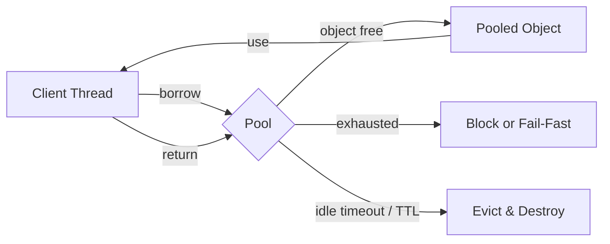
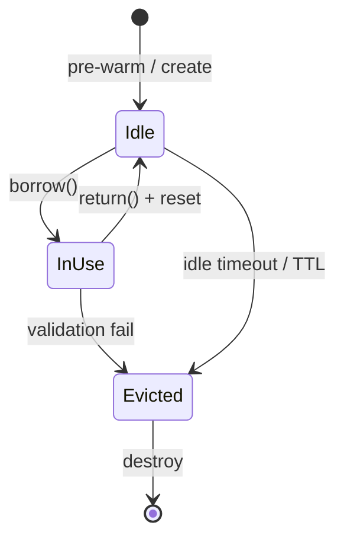
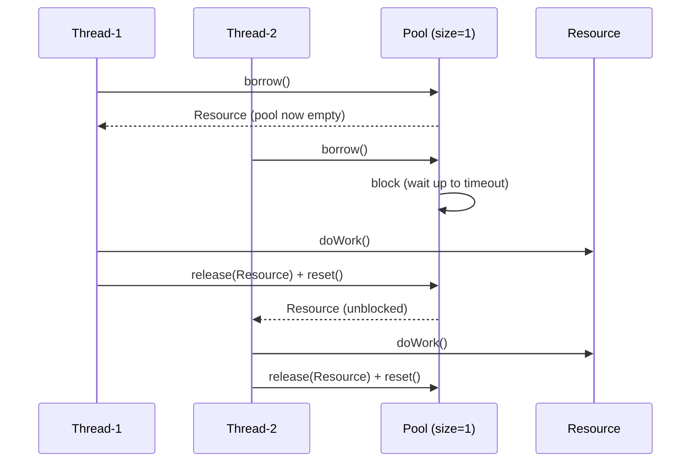

<!-- tldr -->
# Object Pooling

Object pooling pre-allocates a fixed set of expensive-to-create objects (connections, threads, byte buffers) and lends them to callers on demand, reclaiming them after use. It trades memory for latency by avoiding per-request allocation and the GC overhead that follows. In latency-sensitive or throughput-bound Java services, pool exhaustion or mis-sizing is a top-5 production incident cause.



<!-- standard -->

## What It Is

A pool holds *N* reusable instances behind a thread-safe queue or ring buffer. Clients call `acquire()` (borrow), do work, then call `release()` (return). The pool optionally validates objects on borrow/return and evicts stale ones on a background thread.

## Why It Matters

- **Allocation cost** — `new Object()` is cheap in isolation but at 1 M RPS with a 1 KB object it generates ~1 GB/s of garbage, triggering Young-Gen GC every few seconds.
- **GC pause impact** — even G1/ZGC concurrent collectors incur CPU overhead; pooling shrinks live-set churn.
- **Resource scarcity** — DB connections, SSL sessions, and native memory buffers are finite OS resources that cannot simply be allocated per-request.

## Primary Techniques

| Technique | Thread Safety | Use Case |
|---|---|---|
| `BlockingQueue<T>` pool | Lock-based | General objects, simple impl |
| `ThreadLocal<T>` pool | Lock-free | Per-thread scratch buffers |
| Apache Commons Pool 2 | Lock-based | JDBC, legacy systems |
| Netty `PooledByteBufAllocator` | Lock-free slab | High-throughput I/O buffers |
| HikariCP | CAS + `SynchronousQueue` | JDBC connection pooling |
| Custom ring buffer | Lock-free | Ultra-low latency, LMAX Disruptor style |

## Key Tradeoffs

- **Memory vs. latency** — larger pool → lower wait time, higher heap footprint.
- **Object state leakage** — returned objects must be reset; failing to do so causes cross-request data corruption.
- **Pool starvation** — under-sized pools serialize throughput; P99 latency spikes become P50 latency spikes.
- **Over-pooling** — modern JVMs (TLAB allocation) make short-lived small objects nearly free; pooling them adds lock contention with zero benefit.

## Object Lifecycle States



<!-- deep -->

## Deep Dive: Object Pooling

### Sizing with Little's Law

The canonical pool-sizing formula comes from queueing theory:

```
L = λ × W
```

Where:
- **L** = pool size (number of objects needed)
- **λ** = arrival rate (requests/sec)
- **W** = average hold time per object (seconds)

**Example:** A service at **5,000 RPS** where each DB query holds a connection for **8 ms** needs:

```
L = 5000 × 0.008 = 40 connections minimum
```

Add 20–30% headroom for bursts → **pool size = 52**. Going to 200 wastes DB file descriptors and RAM without improving throughput.

For 99th-percentile safety under bursty traffic, model W as **P99 hold time**, not mean.

---

### Real-World Implementations

#### HikariCP (JDBC)
- Uses a `ConcurrentBag` — a lock-free structure with thread-local fast-path + `SynchronousQueue` fallback.
- `connectionTimeout` default: **30 s** (throw `SQLTimeoutException` if exceeded).
- `maximumPoolSize` recommendation: `(core_count × 2) + effective_spindle_count` (Hikari's formula).
- Keeps P99 connection acquisition < **1 ms** at 50k QPS on typical 32-core hosts.

#### Netty `PooledByteBufAllocator`
- Jemalloc-inspired slab allocator: arenas → chunk (16 MB) → page (8 KB) → subpage.
- Eliminates native memory fragmentation; powers Kafka's network layer and gRPC-Java.
- Pool is **per-thread** (arena affinity) + small global fallback — near-zero contention.

#### Disruptor Ring Buffer
- Pre-allocates all event objects at startup; producers overwrite fields in-place.
- Avoids GC entirely for the hot path — target: **< 1 µs** P99 publish latency.
- Used by LMAX Exchange, Chronicle Queue, Aeron.

#### Akka Dispatcher Thread Pool
- Configures a `ForkJoinPool` with work-stealing; actors are scheduled onto pooled threads.
- `default-dispatcher.parallelism-factor` tunes pool size per CPU core.

---

### Failure Modes

| Failure | Root Cause | Detection | Mitigation |
|---|---|---|---|
| Pool exhaustion | Under-sized or leaked borrows | `pool.waitingCount` metric spike | Increase size; add borrow timeout + alert |
| Object state leakage | Missing reset on return | Data corruption in prod | Defensive `reset()` + integration tests |
| Connection leak | Exception path skips `close()` | Pool size grows monotonically | try-with-resources; leak detection thread |
| Thundering herd | Mass timeout → mass retry on recovery | Latency spike post-incident | Exponential backoff + jitter on acquire |
| Memory bloat | Pool too large, objects too heavy | Heap growth in heap profiler | Cap pool size; use soft references for overflow |

---

### Implementation Skeleton (Java 21)

```java
public final class SimplePool<T> implements AutoCloseable {
    private final ArrayBlockingQueue<T> idle;
    private final Supplier<T> factory;
    private final Consumer<T> reset;
    private final long timeoutMs;

    public SimplePool(int size, Supplier<T> factory, Consumer<T> reset, long timeoutMs) {
        this.idle = new ArrayBlockingQueue<>(size);
        this.factory = factory;
        this.reset = reset;
        this.timeoutMs = timeoutMs;
        IntStream.range(0, size).forEach(i -> idle.add(factory.get()));
    }

    public T borrow() throws InterruptedException {
        T obj = idle.poll(timeoutMs, TimeUnit.MILLISECONDS);
        if (obj == null) throw new IllegalStateException("Pool exhausted after " + timeoutMs + "ms");
        return obj;
    }

    public void release(T obj) {
        reset.accept(obj);      // MUST reset state before returning
        idle.offer(obj);
    }

    @Override public void close() {
        idle.forEach(obj -> { /* destroy */ });
    }
}
```

**Critical:** The `reset.accept(obj)` call is non-negotiable. A returned `StringBuilder` must call `.setLength(0)`; a returned `PreparedStatement` must clear parameters and cancel active result sets.

---

### Sequence: Borrow Under Contention



---

### Capacity & Latency Reference Numbers

| System | Typical Pool Size | Acquire P99 | Notes |
|---|---|---|---|
| HikariCP (PostgreSQL) | 10–50 | < 1 ms | Bottleneck is DB, not pool |
| Netty ByteBuf pool | Dynamic (arenas × threads) | < 1 µs | Per-thread arena eliminates lock |
| gRPC channel pool | 2–8 channels | < 50 µs | HTTP/2 multiplexing reduces need |
| Thread pool (Virtual Threads, Java 21) | Carrier threads = CPU cores | N/A | Virtual threads largely replace object pooling for I/O work |

---

### When to Reach for Object Pooling

**✅ Use pooling when:**
- Object creation cost > **10 µs** (DB connections, TLS sessions, large buffers).
- The object represents a scarce OS resource (file descriptors, sockets, native memory).
- Allocation rate causes measurable GC pause inflation (verify with JFR / async-profiler).
- Working in the hot path of a latency-sensitive service (P99 target < 10 ms).

**❌ Skip pooling when:**
- Objects are small POJOs or DTOs — TLAB makes them effectively free.
- Using Java 21 Virtual Threads for I/O-bound work — structured concurrency replaces connection pooling patterns.
- Pool adds lock contention that exceeds the allocation savings (measure first with `async-profiler alloc`).

---

### Interview Pitfalls

1. **"GC is fast, why pool?"** — Correct answer: GC overhead is amortized but causes **stop-the-world safepoints** and CPU overhead even in ZGC. Pooling eliminates allocation pressure, not just pause time.
2. **Forgetting thread safety** — A `BlockingQueue`-backed pool is safe; a plain `ArrayList` is not. Know the difference.
3. **Not resetting state** — The single most common production bug from custom pools. Examiners will probe this.
4. **Over-pooling with virtual threads** — Java 21 changes the calculus. Pooling threads or I/O handlers is antipattern territory; pooling DB *connections* is still correct because connections are server-side resources.
5. **Ignoring `connectionTimeout` vs `maxLifetime`** — HikariCP's `maxLifetime` (default 30 min) prevents stale connections after DB-side TCP timeouts; missing this causes silent connection failures at 2 AM.