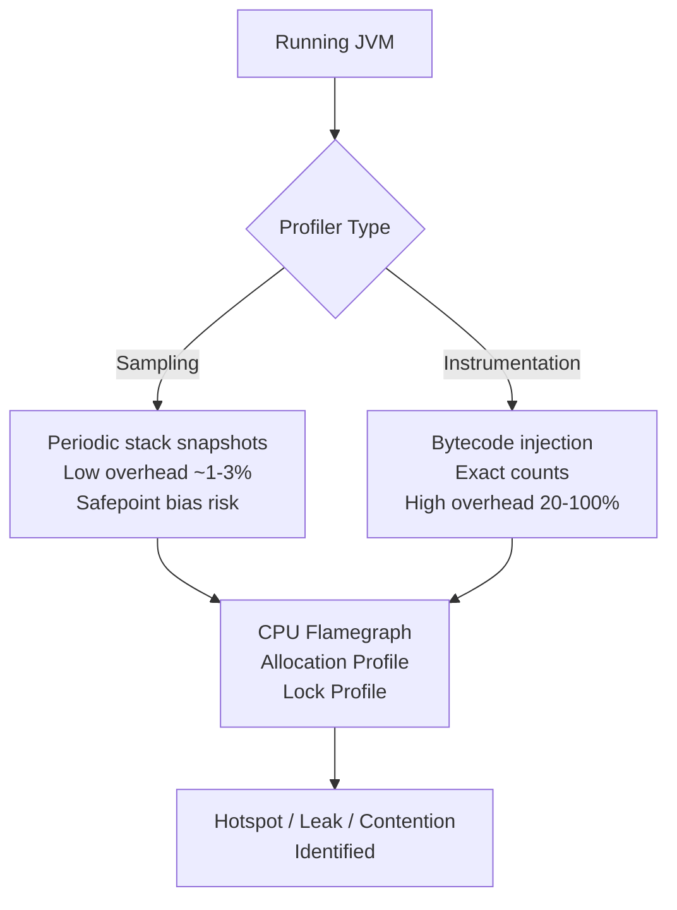
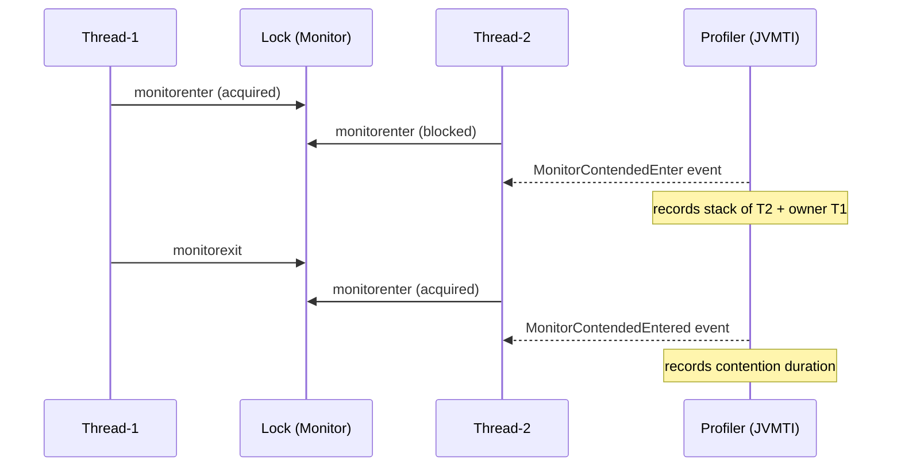
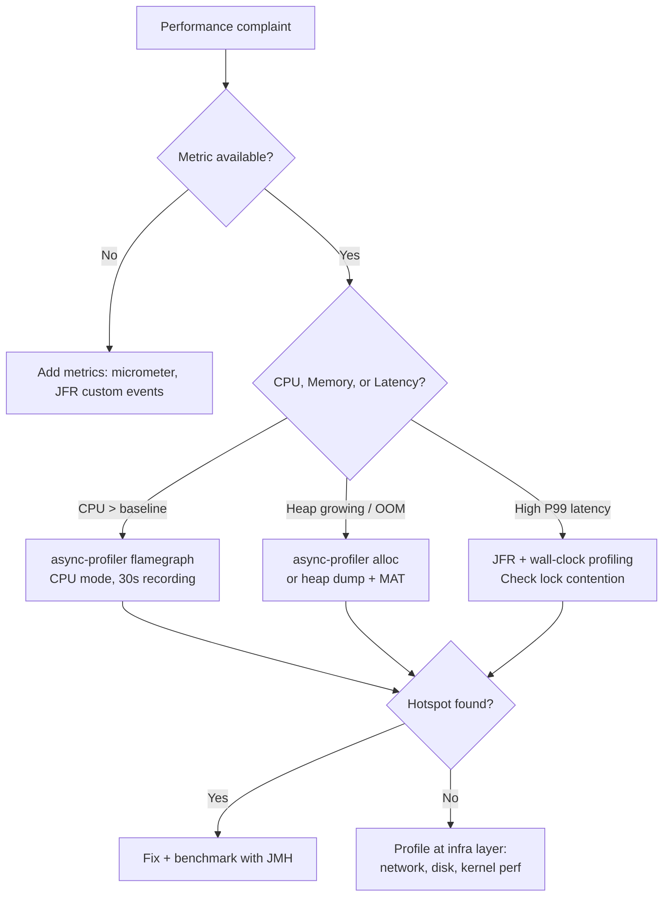

<!-- tldr -->
# Java Profiling

Profiling is the disciplined practice of measuring a running JVM to find where time, memory, and threads are actually spent—not where you guess they are spent. It splits into three orthogonal concerns: CPU (where cycles go), heap (what objects live and die), and concurrency (where threads block). Picking the wrong profiler type or misreading its output is one of the most common senior-engineer failure modes in production investigations.



<!-- standard -->

## What It Is and Why It Matters

Profiling answers "where is my application slow / bloated / stuck?" with data instead of intuition. At FAANG scale a 5% CPU regression on a 10,000-node fleet costs millions of dollars per year; profiling is the only reliable path to finding and proving a fix.

### Primary Techniques

- **Sampling** — the profiler interrupts the JVM at a fixed interval (e.g., every 1 ms) and captures the current stack. Statistical but low-overhead.
- **Instrumentation** — the profiler rewrites bytecode to count every method entry/exit. Exact but can distort latency 10–100×.
- **Async-signal-safe sampling** (async-profiler, JFR) — uses OS signals (`SIGPROF`) or perf events to capture stacks without waiting for a safepoint, eliminating *safepoint bias*.

### Key Tools

| Tool | Type | Overhead | Best For |
|---|---|---|---|
| **JFR + JMC** | Sampling + events | < 1% | Production, always-on |
| **async-profiler** | Async sampling | < 2% | CPU flamegraphs, alloc |
| **YourKit / JProfiler** | Sampling + instr. | 5–30% | Dev/staging deep dives |
| **VisualVM** | Sampling | 3–10% | Quick local inspection |
| **perf + jmaps** | OS-level sampling | < 1% | Native / JNI hotspots |

### Key Tradeoffs

- **Safepoint bias**: pure-JVM samplers only capture stacks at safepoints. Hot code in tight loops may never show up. Use async-profiler or JFR to avoid this.
- **Observer effect**: instrumentation profilers change JIT inlining decisions—you may profile a program that no longer resembles production.
- **Allocation profiling** incurs write-barrier overhead; sample at every Nth TLAB refill (async-profiler `-e alloc`) rather than every allocation.
- **Wall-clock vs CPU time**: sleeping threads appear hot in wall-clock mode; use CPU mode to find compute hotspots, wall-clock to find I/O stalls.

```mermaid
flowchart LR
    subgraph CPU Profile
        F1[Flamegraph top-down\nwider = more time]
    end
    subgraph Heap Profile
        F2[Object histogram\nRetained size vs shallow]
    end
    subgraph Thread Profile
        F3[Lock contention graph\nBlocked % per thread]
    end
    CPU Profile --> R[Root cause]
    Heap Profile --> R
    Thread Profile --> R
```

<!-- deep -->

## Deep Dive: Java Profiling for Staff-Level Interviews

### How the JVM Exposes Profiling Data

The JVM exposes profiling through three APIs:
- **JVMTI** (`jvmtiEnv`) — C-level agent API used by YourKit/JProfiler. Can listen to `MethodEntry`, `MethodExit`, `GarbageCollectionStart`, `MonitorContended*`.
- **JVM TI + AsyncGetCallTrace** — non-standard extension used by async-profiler to capture stacks outside safepoints.
- **JFR (Java Flight Recorder)** — built into HotSpot ≥ JDK 11 (free). Records 200+ event types with nanosecond timestamps at < 1% overhead. The gold standard for production profiling.

### Safepoint Bias — The Hidden Trap

HotSpot only allows stack walking at *safepoints* (GC pause checkpoints, interpreted back-edges, method exits). A tight `for` loop compiled by C2 may not have a safepoint for millions of iterations. A safepoint-biased profiler will show the *check* before the loop as hot, not the loop body itself.

**Fix**: Use async-profiler (`-e cpu`) or JFR, both of which use `SIGPROF` / perf hardware counters to interrupt threads asynchronously.

### Flamegraph Anatomy

```
Width  ∝  self time of that frame across all samples
Height  =  call depth (bottom = entry point, top = leaf)
Color   =  arbitrary (package groupings by convention)
```

Red flags on a flamegraph:
- A **plateau** (wide flat top) → genuine hotspot.
- **`sun.misc.Unsafe` / `Object.clone`** near the top → serialization overhead (Kryo misconfiguration, protobuf reflection, etc.).
- **`Thread.sleep` / `LockSupport.park`** → I/O or lock stall; switch to wall-clock mode.

### Memory Profiling

**Allocation profiling** (async-profiler `-e alloc`):
- Samples on every TLAB exhaustion (default) or every N bytes.
- Reveals *allocation sites*, not just live objects.
- Common finding: `String` / `byte[]` churn from logging, JSON serialization, or `StringBuilder` misuse inside hot loops.

**Heap dump analysis**:
1. `jcmd <pid> GC.heap_dump /tmp/heap.hprof`
2. Open in Eclipse MAT or VisualVM.
3. Look at **retained heap** (subtree owned by object) vs **shallow heap**.
4. **Dominator tree** identifies the single object keeping the most memory alive.

Typical findings at FAANG scale:
- `LinkedList` used where `ArrayDeque` would shrink heap 3×.
- Unbounded `ConcurrentHashMap` caches (missing eviction → OOM under traffic spike).
- `ClassLoader` leaks in hot-deploy scenarios (retained ~50–200 MB per redeploy).

### Lock / Concurrency Profiling



JFR event `jdk.JavaMonitorEnter` with threshold `1ms` captures real contention with < 1% overhead. Key metrics:
- **Blocked %** > 5% for any thread → investigate the lock.
- **Average contention duration** > 10 ms → likely serializing I/O under a lock.

### Real-World Systems That Expose Profiling Complexity

| System | Profiling Challenge | Solution |
|---|---|---|
| **Kafka broker** | GC pauses inflating P99 produce latency | JFR + async-profiler; tune G1 region size, reduce allocation rate in hot path |
| **Cassandra** | Off-heap (Netty/LMAX) invisible to heap profiler | perf + async-profiler native frames; jemalloc heap profiler |
| **DynamoDB (client)** | Retry storms causing CPU spikes | async-profiler flamegraph shows `RetryHandler` as top frame |
| **Elasticsearch** | Lucene segment merge threads starving query threads | JFR thread profiling + CPU affinity analysis |
| **Spring Boot** | Reflection + proxy overhead at startup | `-Xss` trace, JFR `ClassLoad` events |

### Capacity & Latency Reference Numbers

- async-profiler CPU sampling at 100 Hz: **< 0.5% CPU overhead**.
- JFR always-on default profile: **< 1% CPU, ~5 MB/min disk**.
- Full instrumentation (YourKit all-methods): **20–100× slowdown** — never in production.
- Heap dump of 8 GB heap: **10–30 seconds** of stop-the-world; use `-XX:+HeapDumpAfterFullGC` or live histogram (`jmap -histo:live`) to avoid full STW.
- `jstack` thread dump: **< 50 ms** (safe in production); take 3 dumps, 500 ms apart to confirm a blocked thread isn't transient.

### Failure Modes to Know

1. **Profiling a different JVM than production** — JIT tier, GC, and flag differences invalidate results. Profile the exact same binary with the same flags.
2. **Warm-up blindness** — profiling during cold start measures interpreter overhead, not steady-state JIT behavior. Wait for `CompileThreshold` (default 10k invocations) before recording.
3. **Coordinated omission** — benchmarks that skip recording a sample while the system is slow under-report P99. Use JMH with `-prof` to account for this.
4. **GC masking a hotspot** — very short-lived objects may never show in a heap snapshot because they're collected before you dump. Allocation profiling is the only way to see them.
5. **Mistaking GC CPU for app CPU** — `G1` concurrent marking threads appear as Java threads; confirm with `jstat -gcutil` whether GC CPU is above baseline.

### Interview Pitfalls

- "I'd attach YourKit to production" → immediate red flag. JFR is the correct answer for production.
- Confusing **shallow** vs **retained** heap in a MAT walkthrough.
- Not knowing what safepoint bias is when asked why async-profiler is preferred.
- Unable to read a flamegraph (width = time, not depth).
- Proposing heap dump on a 32 GB heap without acknowledging the STW cost.

### Decision Rubric: When to Reach for Profiling vs Other Tools



**Use JFR always-on** in production (zero setup cost, negligible overhead).  
**Reach for async-profiler** when you have a reproducible CPU or allocation spike and need a flamegraph in < 5 minutes.  
**Use heap dump + MAT** only when you need to understand *what is alive*, not *what was allocated*.  
**Use instrumentation profilers** only in staging when you need exact call counts on a suspected but hard-to-find code path.