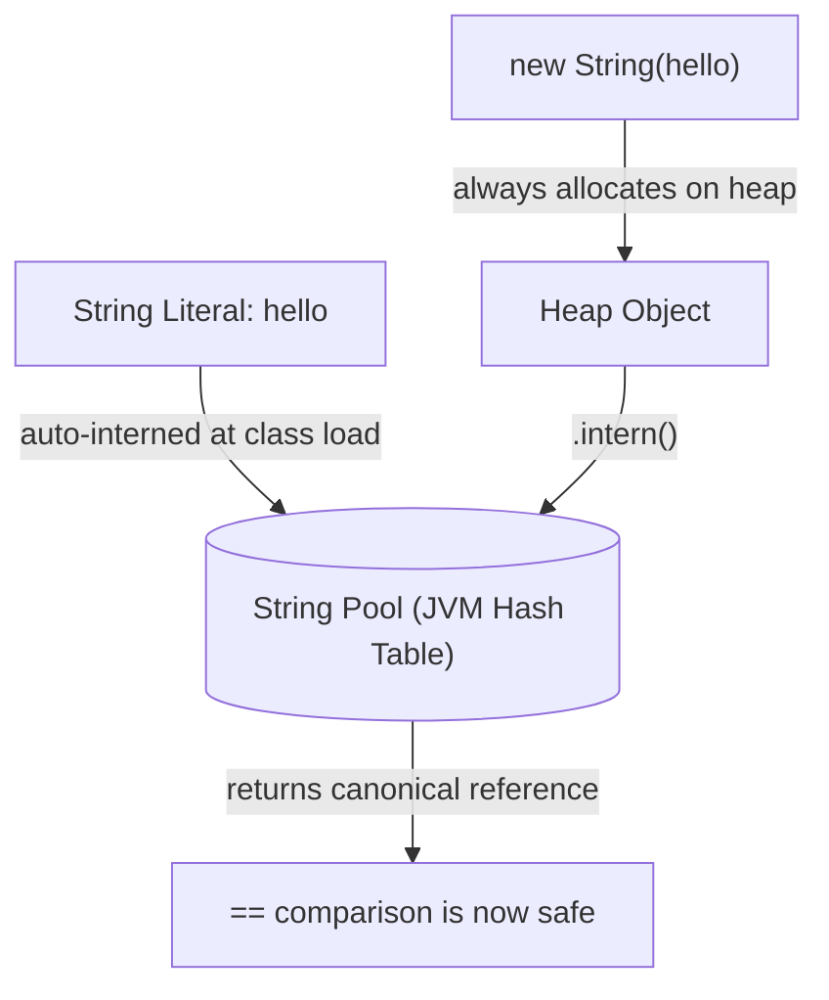
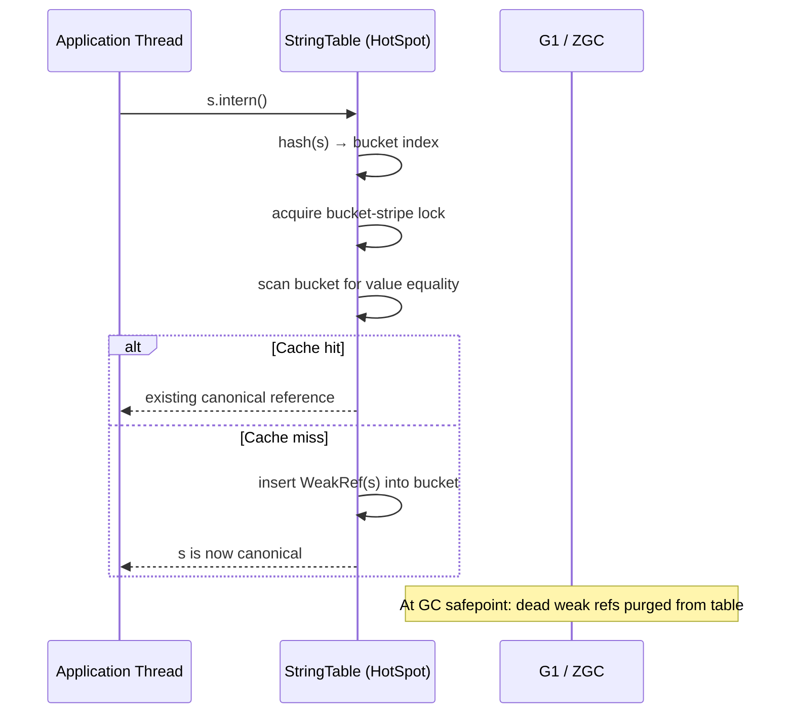

<!-- tldr -->
# String Interning

The JVM maintains a **String Pool** (a.k.a. String Table)—a hash table of canonical string objects. Compile-time literals (`"foo"`) are automatically interned at class load; runtime strings join only via `String#intern()`. Because identical content maps to one object, heap pressure shrinks and `==` becomes a valid equality test, but `intern()` itself is a synchronized native call with measurable cost at scale.



<!-- standard -->

## What It Is

The String Pool is a fixed-size open-addressing hash table inside HotSpot (`StringTable`). Before Java 7 it lived in PermGen—fixed size, easy `OutOfMemoryError`. Since **Java 7**, it lives on the regular heap and entries are stored as **weak references**, so unreachable interned strings are collected at GC safepoints. The default pool size is 65,536 buckets in Java 8 and **1,000,003 buckets** in Java 11+, tunable via `-XX:StringTableSize=<prime>`.

## Why It Matters

- **Memory**: 10M `String` objects with 1,000 distinct values wastes ~380 MB on duplicates (avg 40 bytes/object on Java 21 with compact strings). Interning collapses that to ~40 KB of canonical objects.
- **Throughput**: `==` is a single pointer comparison; `equals()` is O(n) over characters.
- **GC pressure**: Fewer live objects means shorter minor GC pauses and lower promotion rate.

## Primary Techniques

| Technique | When to Use | Cost |
|---|---|---|
| Compile-time literals | Always; free | Zero |
| `String#intern()` | Runtime dedup of bounded-domain strings | ~150–400 ns/call |
| `-XX:+UseStringDeduplication` | G1 GC background dedup, no code change | ~1–3% CPU |
| Manual `HashMap` cache | Full control, avoid native overhead | Extra memory for map |

### `intern()` vs G1 String Deduplication

- `intern()` changes **object identity**; `==` works; strings live in the pool.
- G1 dedup does **not** change identity; `==` still fails; it only consolidates the backing `byte[]` array. Zero-code-change but no identity semantics.

## Key Tradeoffs

- **Contention**: The table uses striped locking (256 stripes in modern HotSpot); heavy concurrent `intern()` traffic causes measurable lock contention.
- **Pool saturation**: A too-small `StringTableSize` degrades bucket traversal from O(1) toward O(n).
- **Unbounded input**: Interning user-supplied strings causes unbounded pool growth—a memory leak disguised as an optimization.
- **Semantic risk**: Using `==` on strings that are only *sometimes* interned produces intermittent, environment-sensitive bugs.

<!-- deep -->

## Deep Dive

### JVM Internals: How the String Table Works

`StringTable` in HotSpot is a concurrent, fixed-size hash map of `WeakReference<oop>` (ordinary object pointers). Each `intern()` call:

1. Computes the string's `hashCode()`.
2. Acquires a **bucket-level lock** (lock striping—256 stripes; contention is per-stripe, not global).
3. Walks the bucket's linked list, comparing `value` arrays for equality.
4. **Hit**: returns the existing pooled reference; the caller's object becomes eligible for GC.
5. **Miss**: inserts `WeakRef(caller_object)` and returns the caller's object as the new canonical.

At GC safepoints, dead weak references are purged from the table, keeping the pool from growing without bound (Java 7+).

Use `-XX:+PrintStringTableStatistics` at JVM shutdown to observe bucket count, entry count, and average chain length.



### Capacity & Latency Numbers

| Metric | Value |
|---|---|
| Default table size (Java 11+) | 1,000,003 buckets |
| `intern()` latency, warm cache, no contention | ~150–300 ns |
| `intern()` latency, 32 threads, high contention | ~2–8 µs |
| Memory per interned string (Java 21, compact strings) | ~32–40 bytes |
| G1 string deduplication CPU overhead | 1–3%, async background |
| Recommended max load factor | < 2.0 (entries / buckets) |

At 1M interned strings with a 1,000,003-bucket table, load factor ≈ 1.0 — healthy O(1) average. At 5M interned strings, load factor ≈ 5.0 — degrade to linked-list scan; bump `StringTableSize` to a larger prime.

### Real-World Systems That Lean on Interning

**Hadoop / HDFS NameNode**
Block metadata holds hostname strings for every DataNode across every replica. At 10,000 nodes × 3 replicas × 100M blocks, interning hostnames saves 200–500 MB. HDFS explicitly interns `StorageID` and pool IDs in `BlockManager`.

**Apache Lucene / Elasticsearch**
`LeafReader#internFieldName()` interns field name strings so segment-level merges can use identity comparison instead of `equals()`. Fields like `"_source"`, `"_id"`, `"keyword"` appear in every document; deduplication is load-bearing.

**JVM Class Loading (C++ layer)**
Every class name, method descriptor, and field name is stored as a `Symbol`—HotSpot's C++-level equivalent of the String Pool. Symbols are reference-counted, not GC'd, and deduplicated globally across all class loaders.

**High-Throughput JSON Parsers (Jackson, Gson)**
Jackson's `InternCache` (a small fixed-size `String[]` array, not the JVM pool) interns property keys like `"type"`, `"id"`, `"name"` to avoid repeated `equals()` during deserialization at >500K req/s.

### Failure Modes

1. **Interning unbounded user input**: Every unique request header or query parameter persists in the pool until GC determines no external strong reference exists. Under load this expands the pool to hundreds of MB and causes long GC pauses.
2. **PermGen OOM (Java 6 and earlier)**: `intern()` in a loop was the canonical `OutOfMemoryError: PermGen space` bug. Non-issue post-Java 7, but still appears in legacy codebases.
3. **Pool saturation with small `StringTableSize`**: Hash chains grow; `intern()` latency climbs from ~200 ns to tens of microseconds. Diagnose with `-XX:+PrintStringTableStatistics`.
4. **G1 dedup + `==` confusion**: Enabling `-XX:+UseStringDeduplication` does *not* make `==` work. Engineers assume identity is unified; it is not—only the `byte[]` backing array is shared.
5. **Inconsistent interning across call paths**: If 90% of paths intern a string and 10% do not, `==` comparisons silently fail for that 10%. These bugs are environment- and load-dependent, making them extremely hard to reproduce in tests.

### Algorithms & Formulas

**Memory savings estimate:**
```
saved_bytes = (total_strings - unique_strings) × avg_object_size_bytes
```
Example: 10M strings, 500 unique values, 40 bytes each:
`(10,000,000 − 500) × 40 ≈ 380 MB`

**Table load factor:**
```
load_factor = interned_count / StringTableSize
```
Target: `load_factor < 2`. At `load_factor > 5`, average bucket chain length degrades throughput measurably.

**Intern call rate budget:**
At 300 ns/call, a single thread can sustain ~3.3M `intern()` calls/second. At 32 threads with contention, throughput drops to ~4–8M calls/second total (not 32×), making `intern()` a potential bottleneck above ~100K req/s if called per-request.

### Interview Pitfalls

| Pitfall | What Interviewers Expect You to Know |
|---|---|
| "Does `==` always work after `intern()`?" | Only if **every** code path that produces these strings calls `intern()`. One `new String(s)` without `.intern()` breaks the contract silently. |
| "Is `intern()` cheap?" | No. It's a native JNI call with lock acquisition. Benchmark; don't assume. |
| "Can interned strings be GC'd?" | Yes—since Java 7 (weak references). In Java 6 they could not, causing PermGen leaks. |
| "What's `intern()` vs `String.valueOf()`?" | Completely different concerns; `valueOf()` converts types to string, no pooling involved. |
| "When G1 dedup vs `intern()`?" | G1 dedup: zero-code-change, background, no identity change. `intern()`: identity guaranteed, requires code instrumentation, works on any GC. |
| "What's the pool size?" | 1,000,003 by default (Java 11+); tunable via `-XX:StringTableSize`. Must be prime for even hash distribution. |

### Decision Rubric: When to Reach for Interning

```
Is the string domain bounded and finite?
├── No  → Do NOT intern. Unbounded pool growth is a memory leak.
└── Yes → Continue ↓

Do you need == identity equality (e.g., fast map keys, sentinel checks)?
├── Yes → String#intern() — the only option that changes identity.
└── No  → Prefer -XX:+UseStringDeduplication (G1) for zero-code-change savings.

Is the duplication ratio > 10:1?
├── Yes → Interning ROI is high; instrument ingest/parse path.
└── No  → Profile first; intern() overhead may exceed memory savings.

Is call rate > 1M intern() calls/sec across threads?
├── Yes → Benchmark contention. Consider a manual ConcurrentHashMap<String,String>
│         cache to avoid native lock overhead.
└── No  → Standard intern() is fine.

Are you on Java 6?
└── Stop. Migrate first. PermGen OOM is guaranteed.
```

**Rule of thumb**: Intern only domain-bounded enumerables—status codes, field names, hostnames, currency symbols, ticker names. Never intern arbitrary user input or data read from external systems.