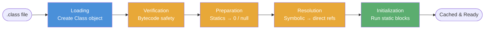
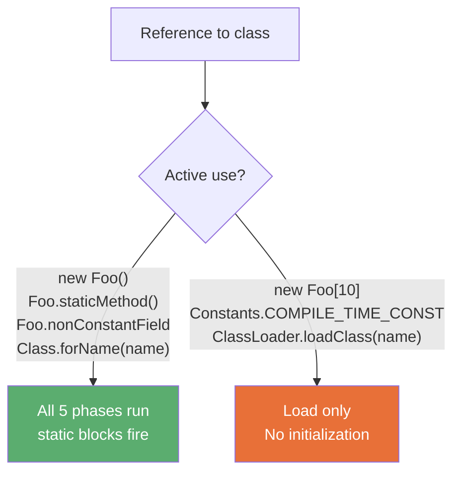
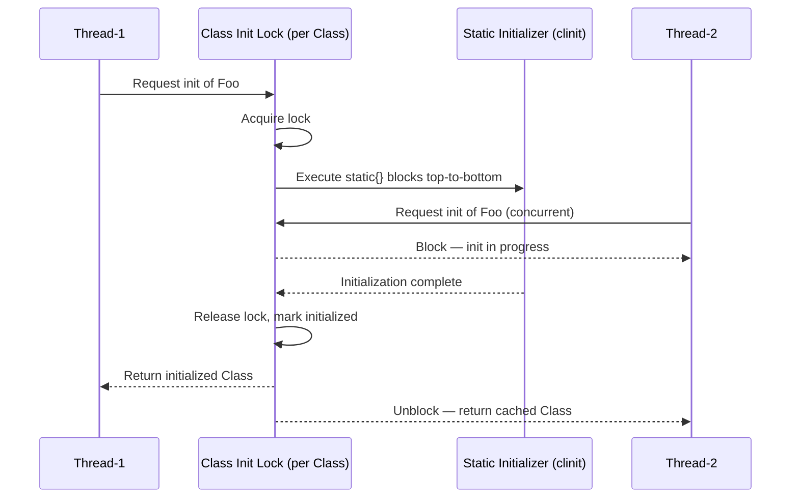

<!-- tldr -->
# JVM Class Loading Phases

Class loading converts a `.class` bytecode file into a `java.lang.Class` object through five phases: Loading → Verification → Preparation → Resolution → Initialization. Each phase runs exactly once per class per JVM lifetime; after initialization completes the `Class` object is cached and reused on every subsequent reference. Mastering this pipeline is essential for debugging `ExceptionInInitializerError`, reasoning about static field timing, and implementing thread-safe lazy singletons.



<!-- standard -->

## What It Is

The JVM's class-loading subsystem transitions a raw `.class` file through five discrete phases before any user code can reference its fields or invoke its methods.

- **Loading** — A `ClassLoader` finds the `.class` binary, validates the magic bytes (`0xCAFEBABE`), and constructs a `java.lang.Class` heap object.
- **Verification** — The Bytecode Verifier performs static data-flow analysis: file format, constant-pool integrity, type safety, operand-stack bounds, control-flow validity, and access-rule enforcement. No bytecode executes here.
- **Preparation** — Memory is allocated for all static fields in the method area (Metaspace) and set to **default zero-values**. Your source-level assignments are **not** applied yet.
- **Resolution** — Symbolic references (`"com/example/Foo.doSomething:(I)V"`) in the constant pool are replaced with direct runtime references (vtable offsets, field byte offsets). May be lazy or eager per JVM implementation.
- **Initialization** — Static field assignments and `static {}` blocks execute **top-to-bottom** in textual order, exactly once, under a JVM-guaranteed class-init lock.

## Why It Matters

| Symptom | Responsible Phase |
|---|---|
| `VerifyError` | Verification — malformed or tampered bytecode |
| Static field reads `0` / `null` unexpectedly | Preparation vs. Initialization ordering |
| `ExceptionInInitializerError` | Initialization — static block threw |
| `NoClassDefFoundError` (post-init) | Initialization previously failed; class permanently broken |
| `NoSuchMethodError` at runtime | Resolution — method removed between compile and deploy |

## Active Use vs. Passive Use

Not every reference to a class triggers initialization. The JVM spec distinguishes **active use** (all five phases) from **passive use** (load only, no initialization).



**Compile-time constant inlining**: A `static final` primitive or `String` assigned a literal is baked directly into callers' bytecode by `javac`. Accessing it at runtime makes zero reference to the declaring class — its static block **never fires**.

## Key Tradeoffs

- **`-Xverify:none`** eliminates a critical security boundary. Saves ~5–15% JVM boot time for large class sets, but never acceptable in production.
- **`Class.forName()`** loads and initializes. **`ClassLoader.loadClass()`** loads only. JDBC drivers require `Class.forName()` so their `static {}` block registers the driver with `DriverManager`.
- **Circular static dependencies** (A init → triggers B init → triggers A) are allowed by the JVM spec but leave one class partially initialized, producing subtle `NullPointerException`s.
- **Metaspace per class**: ~2–4 KB per class for the `Klass` structure and constant pool. A 20,000-class monolith consumes ~60–80 MB of Metaspace.

<!-- deep -->

## Deep Dive: JVM Class Loading Phases

### Phase 1 — Loading

The `ClassLoader` hierarchy follows the **parent-delegation model**: before searching its own classpath, each loader delegates upward.

```
Bootstrap CL  (java.base, rt.jar)
  └─ Platform CL  (extension modules)
       └─ Application CL  (classpath / module path)
            └─ Custom CL  (OSGi bundle, Spring Boot nested JAR, plugin)
```

`loadClass()` first calls `findLoadedClass()` (cache hit → return immediately). On a miss it delegates to the parent; only on parent failure does it call `findClass()`, which reads raw bytes and calls `defineClass()`.

**`defineClass()` parsing checklist:**
1. Magic bytes = `0xCAFEBABE`
2. Major version ≤ JVM's supported maximum (Java 21 = class version 65)
3. Constant pool entries structurally valid
4. Field/method descriptors parseable as type descriptors

**Critical isolation rule**: Two classes with the **same binary name** loaded by **different `ClassLoader` instances** are completely distinct types. `instanceof` returns `false`, and casting between them throws `ClassCastException`. This is the source of hours of debugging pain in OSGi, JBoss Modules, and Tomcat webapps.

### Phase 2a — Verification

The Verifier tracks a **type state** (types on the operand stack + local variable slots) for every bytecode instruction. It verifies:

- Operand stack never underflows or overflows its declared `max_stack`
- Local variable table never exceeds `max_locals`
- Every code path terminates with `RETURN`, `ATHROW`, or a backward jump
- `INVOKEVIRTUAL`/`INVOKESPECIAL` argument counts and types match the method descriptor exactly
- `final` classes are not subclassed; `final` methods are not overridden; private members not accessed externally

`javac`-produced code always passes. Unverifiable bytecode comes from: ASM-based instrumentation agents (Mockito, ByteBuddy, Hibernate proxies), obfuscators, and hand-rolled bytecode generators. Always run with verification enabled in CI when using instrumentation.

### Phase 2b — Preparation

Static field memory is allocated in **Metaspace** (HotSpot ≥ Java 8). Fields receive JVM-level zero-values:

| Java type | Zero-value |
|---|---|
| `byte`, `short`, `int`, `char` | `0` |
| `long` | `0L` |
| `float` | `0.0f` |
| `double` | `0.0d` |
| `boolean` | `false` |
| Any reference type | `null` |

**Interview trap**: `static int MAX = 100` — after Preparation `MAX` is `0`. It becomes `100` only after Initialization.

**One exception to zero-value rule**: `static final` fields whose value is a compile-time constant carry a `ConstantValue` attribute in the `.class` file. HotSpot sets these to their declared value **during Preparation**, not Initialization. This is exactly why reading a compile-time constant never triggers class initialization.

### Phase 2c — Resolution

Symbolic references in the constant pool are resolved to:

- **Class/interface references** → pointer to the `Klass` C++ structure in HotSpot internals
- **Field references** → byte offset within the object's memory layout
- **Method references** → index into the virtual dispatch table (vtable) for virtual calls, or interface table (itable) for interface calls

Resolution may **load** referenced classes but does **not initialize** them. Resolution can be deferred (lazy) until the bytecode instruction that uses the reference first executes.

**Failure mode — binary incompatibility**: `NoSuchMethodError` / `NoSuchFieldError` at runtime occurs when a library JAR was recompiled (removing a method/field) but the caller JAR was not recompiled against the new version. The symbolic reference was valid at compile time; resolution fails at runtime.

### Phase 3 — Initialization



The class-init lock guarantees exactly-once, thread-safe execution. This property underpins the **Initialization-on-Demand Holder** idiom — the canonical thread-safe lazy singleton in Java:

```java
public class Singleton {
    private Singleton() {}

    private static class Holder {
        // JVM initializes Holder lazily, thread-safely, exactly once
        static final Singleton INSTANCE = new Singleton();
    }

    public static Singleton getInstance() {
        return Holder.INSTANCE; // triggers Holder init on first call only
    }
}
```

**Why it beats `synchronized getInstance()`**: zero lock acquisition cost on every call after initialization. No `volatile` needed. No contention under load.

**Initialization triggers (active use):**
1. `new Foo()` — instantiation
2. `Foo.staticField = x` / reading a non-constant static field
3. `Foo.staticMethod()`
4. `Class.forName("com.example.Foo")` — forces full initialization
5. Initializing a subclass — always initializes its superclass chain first
6. The class designated as the JVM startup entry point

### Failure Modes

#### `ExceptionInInitializerError`

Thrown when any `Throwable` escapes a `static {}` block or static field initializer. The class transitions to a **permanently failed** state. **Every subsequent reference** throws `NoClassDefFoundError` — not `ExceptionInInitializerError`. This is a common interview gotcha.

```
Caused by: java.lang.ExceptionInInitializerError
Caused by: java.lang.RuntimeException: DB pool failed
    at Config.<clinit>(Config.java:12)
```

**Fix**: Wrap risky logic in try-catch inside the static block, or defer initialization to an explicit factory method.

#### Circular Initialization

```
A.<clinit> → references B → B.<clinit> → references A
```

The JVM detects the cycle and allows A's `<clinit>` to proceed while B sees A's fields at their zero-values (Preparation state). Legal per spec, almost always a bug. Manifests as mysterious `NullPointerException`s from static fields that should be non-null.

#### `ClassNotFoundException` vs. `NoClassDefFoundError`

| Error | When it fires |
|---|---|
| `ClassNotFoundException` | Class binary not found on classpath during Loading |
| `NoClassDefFoundError` | Class was found and loaded but a prior initialization attempt failed |

### Real-World Systems

- **JDBC**: `Class.forName("org.postgresql.Driver")` relies on Initialization to run the `static {}` block that calls `DriverManager.registerDriver()`. Skipping init (via `loadClass()`) silently breaks all subsequent `getConnection()` calls.
- **Spring Framework**: `ClassPathScanningCandidateComponentProvider` uses `loadClass()` for classpath scanning (load-only, cheap), then triggers Initialization only for beans that are actually instantiated.
- **Mockito / ByteBuddy**: Generate subclass bytecode via ASM at runtime. Their bytecode must pass Verification; they use `-noverify` in test harnesses to allow otherwise-illegal subclass tricks on `final` types.
- **Log4j2 / SLF4J**: `ServiceLoader` calls `loadClass()` for provider discovery, then `Class.forName()` (initialize=true) to activate the chosen binding's registration side-effect.
- **Kotlin companion objects**: Compile to a `static final` inner class (`Foo$Companion`) loaded lazily via the Holder pattern — identical JVM semantics to the idiom above.
- **GraalVM Native Image**: Performs class loading and initialization **at build time** (closed-world assumption). Static initializers that do I/O or depend on runtime state must be explicitly deferred via `--initialize-at-run-time`.

### Capacity & Latency Numbers

- **Spring Boot startup**: HotSpot loads ~2,000–5,000 classes; each class's full pipeline takes ~5–20 μs.
- **Verification overhead**: ~1–3 μs per class; negligible unless loading tens of thousands of instrumented classes simultaneously.
- **Metaspace footprint**: ~2–4 KB per class (Klass + constant pool). A 20,000-class monolith = ~60–80 MB Metaspace.
- **CDS (`-Xshare:on`)**: Class Data Sharing maps a pre-verified, pre-parsed shared archive (~150 MB for JDK base classes), skipping Loading and Verification for mapped classes. Reduces startup by 20–40% for JDK classes; AOT class lists extend savings to application classes.

### Interview Pitfalls

1. **"Preparation sets fields to their declared values."** Wrong. Preparation sets zero-values. Declared values are applied during Initialization (except compile-time constants, which are set in Preparation via the `ConstantValue` attribute).
2. **"Accessing `static final int MAX = 100` initializes the class."** Wrong. It's a compile-time constant inlined by `javac`; the class is never referenced at runtime.
3. **"`Class.forName()` only loads the class."** Wrong. It loads **and** initializes. Use `Class.forName(name, false, loader)` to load without initializing.
4. **"A class can be re-initialized after `ExceptionInInitializerError`."** Wrong. It's permanently broken for that JVM run; subsequent uses throw `NoClassDefFoundError`.
5. **"Static initialization requires `synchronized` for thread safety."** Wrong. The JVM provides the class-init lock automatically; adding external `synchronized` is redundant and can cause deadlock.
6. **"Subclass initialization is independent of superclass initialization."** Wrong. Initializing a subclass always triggers superclass initialization first, recursively up the chain.

### Decision Rubric

| Situation | Reach for |
|---|---|
| Thread-safe lazy singleton | Initialization-on-Demand Holder idiom |
| Slow startup with thousands of classes | CDS (`-Xshare:on`), AppCDS, GraalVM native image |
| Plugin isolation / hot reload | Custom `ClassLoader` per plugin; never share statics across loaders |
| Detect missing JARs at startup, not first use | Eager `Class.forName()` in an init probe during app bootstrap |
| Framework instrumentation generating bytecode | ByteBuddy/ASM; verify output with `-ea` and a Verifier pass |
| Debugging static field `NullPointerException` | Audit initialization order, check for circular `<clinit>` dependencies |
| Shared JVM process (app server, Spark executor) | Understand per-ClassLoader caching; isolate static state per deployment unit |