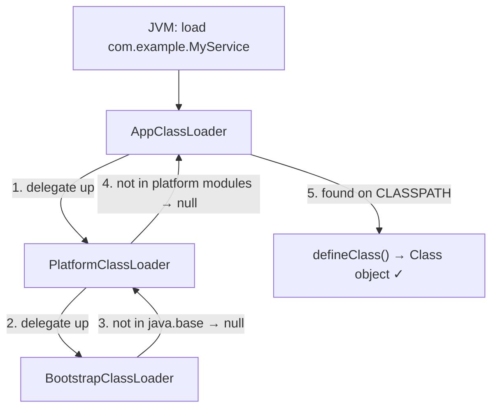
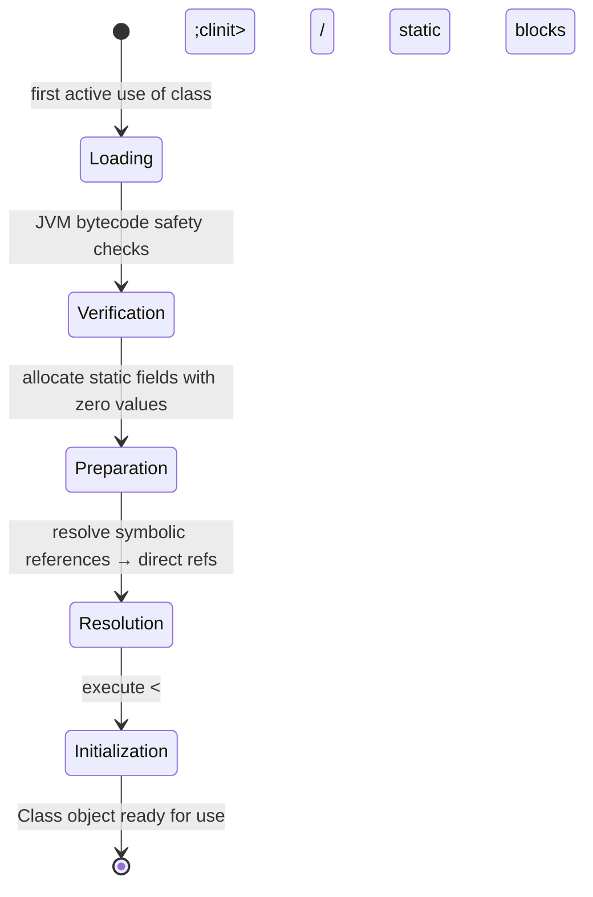
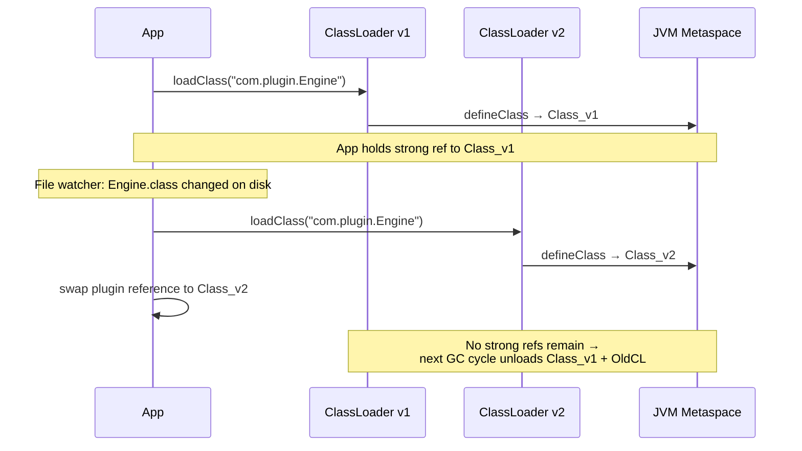

<!-- tldr -->
# ClassLoader Subsystem

Before any Java class executes, its bytecode must be located, read, verified, and installed as a `java.lang.Class` object inside the running JVM. ClassLoaders perform this pipeline **lazily** — on first use, not at startup. The Parent Delegation Model enforces a strict hierarchy where every loader defers to its parent first, guaranteeing that JDK classes can never be shadowed by rogue classpath entries.



<!-- standard -->

## What It Is

A ClassLoader is a Java object (`java.lang.ClassLoader`) that maps a binary class name to raw bytecode and registers it with the JVM via `defineClass()`. Three built-in loaders form the canonical parent chain:

- **Bootstrap** — loads `java.lang.*`, `java.util.*`, and all `java.base` module classes. Implemented in native C++; `getClassLoader()` returns `null` for any class it owns.
- **Platform** (formerly Extension, Java 8) — loads `javax.*`, `java.sql`, `java.desktop`, and other standard-library extensions.
- **AppClassLoader** — loads everything on your `-classpath` or `--module-path`; this is the loader for your application code.

## Why It Matters

| Concern | Mechanism |
|---|---|
| **Security** | Delegation prevents a rogue `java.lang.String` on the classpath from replacing the real JDK one |
| **Namespace isolation** | Class identity = `(ClassLoader instance, binary name)` — same bytecode, different loader = different type |
| **Lazy loading** | Unreferenced classes never consume Metaspace; reduces cold-start footprint |
| **Dynamic extensibility** | Hot-reload, OSGi bundles, and plugin systems all work by creating new ClassLoader instances at runtime |

## The Parent Delegation Algorithm

`ClassLoader.loadClass()` follows three steps in strict order:

1. **Cache** — `findLoadedClass(name)` short-circuits if this loader already owns it.
2. **Delegate** — recursively call `parent.loadClass()`; if parent is `null`, invoke Bootstrap via native call.
3. **Self-search** — only after every ancestor returns `ClassNotFoundException`, call `findClass()` on self.

Override `findClass()`, **never** `loadClass()`. Touching `loadClass()` breaks the delegation contract and is a security hole.

## Key Tradeoffs

- **Isolation vs. cross-loader sharing** — strong per-loader namespaces enable multi-tenancy but produce `ClassCastException` when objects cross loader boundaries (same name, different loader = incompatible types).
- **Hot-reload Metaspace cost** — each reload creates a new ClassLoader; old `Class` objects stay in Metaspace until GC clears all strong references.
- **Parent-first vs. child-first** — OSGi and Tomcat's `WebappClassLoader` flip to child-first for application classes so that deployed apps can override server-bundled library versions (e.g., a newer `log4j` than the container ships).

<!-- deep -->

## Deep Dive: ClassLoader Subsystem

### Class Loading Lifecycle

Every class transitions through five JVM-internal phases before it can be instantiated:



**Loading** is the ClassLoader's domain. Everything after it is JVM-internal. One critical distinction at the API level:

- `ClassLoader.loadClass(name)` — loads and links the class; **does not** run `<clinit>`.
- `Class.forName(name)` — loads, links, **and initializes** (runs static blocks) by default.

This is why legacy JDBC registration uses `Class.forName("com.mysql.cj.jdbc.Driver")` — the driver's static block calls `DriverManager.registerDriver(new Driver())`. Using `loadClass()` here silently skips that registration.

### Class Identity Formula

```
classIdentity = (ClassLoader instance, binary class name)
```

Two `Class<?>` objects are `==` only when **both** components match. Consequences:

- `instanceof`, casts, and method dispatch all break silently when objects cross loader boundaries — even with identical bytecode.
- The canonical fix: define **shared API interfaces** in a **common parent** loader. Communicate across loader boundaries only through those interfaces or via reflection.

### Writing a Production-Grade Custom ClassLoader

```java
public class EncryptedJarClassLoader extends ClassLoader {
    private final Path   jarPath;
    private final SecretKey aesKey;

    public EncryptedJarClassLoader(Path jar, SecretKey key, ClassLoader parent) {
        super(parent);          // ← always wire the delegation chain
        this.jarPath = jar;
        this.aesKey  = key;
    }

    @Override
    protected Class<?> findClass(String name) throws ClassNotFoundException {
        String entry = name.replace('.', '/') + ".class";
        try (JarFile jar = new JarFile(jarPath.toFile())) {
            byte[] encrypted = jar.getInputStream(
                jar.getJarEntry(entry)).readAllBytes();
            byte[] bytecode  = decrypt(encrypted, aesKey);   // AES-GCM
            return defineClass(name, bytecode, 0, bytecode.length);
        } catch (IOException | GeneralSecurityException e) {
            throw new ClassNotFoundException(name, e);
        }
    }
}
```

**JVM-enforced rules:**

- `defineClass()` for the same `(loader, name)` pair exactly once — a second call throws `LinkageError`.
- The JVM verifier runs immediately after `defineClass()`; malformed bytecode produces `VerifyError`.
- The binary name embedded in the bytecode must match the `name` argument — mismatch throws `NoClassDefFoundError`.

### Hot-Reload Sequence



**Metaspace leak prevention checklist:**

- No `static` fields in dynamically loaded classes that hold `Class<?>` or `ClassLoader` references.
- `ThreadLocal` values **must** be cleared before discarding a loader — threads are GC roots.
- Store loader references in registries as `WeakReference<ClassLoader>`; validate before dereferencing.

### Real-World Systems

| System | ClassLoader Strategy | Why |
|---|---|---|
| **Tomcat** | One `WebappClassLoader` per WAR; child-first for app classes | Library version isolation per deployment |
| **OSGi (Felix / Equinox)** | One loader per bundle; explicit `Import-Package` wires bundle loaders | Fine-grained, declarative dependency versioning |
| **JRebel / Spring DevTools** | Instrumentation + new loader per reload cycle | Sub-second hot-reload without JVM restart |
| **Spark / Flink** | `ChildFirstURLClassLoader` for job JARs | Job code can override cluster-bundled Guava / Hadoop versions |
| **Java Agents** | `Instrumentation.redefineClasses()` — bypasses ClassLoader entirely | In-place bytecode rewriting for APM, profilers, mocking frameworks |

### Failure Modes & Diagnostics

#### `ClassNotFoundException` vs. `NoClassDefFoundError`

| | `ClassNotFoundException` | `NoClassDefFoundError` |
|---|---|---|
| **Type** | Checked Exception | Error (unchecked) |
| **Trigger** | `Class.forName()` / `loadClass()` cannot locate the class at runtime | JVM resolves a symbolic reference to a class absent at runtime but present at compile time |
| **Root cause** | JAR missing from runtime classpath; wrong module; delegation skips it | Packaging failure — JAR not bundled, fat-jar assembly missed a transitive dep |
| **Diagnosis** | `-verbose:class` JVM flag to trace loader activity; audit classpath | Inspect `Caused by:` — typically wraps an earlier `ExceptionInInitializerError` |

#### `LinkageError: loader constraint violated`

Surfaces when two ClassLoaders each independently load the same class, and the JVM detects a type mismatch during method-linking (e.g., a method's parameter type was loaded by loader A but the argument object was loaded by loader B). Classic symptom in J2EE stacks that bundle the same library in both the server classpath and the WAR.

**Fix:** Declare the shared dependency as `provided` scope in Maven/Gradle so it is loaded exclusively by the parent server loader.

### Capacity & Latency Numbers

- `defineClass()` for a typical 5 KB `.class` file: **< 1 ms** including bytecode verification.
- Metaspace footprint: roughly **1–4 KB overhead per class** plus raw bytecode size stored in off-heap native memory.
- A production server with 10 000 loaded classes consumes ~40–160 MB Metaspace. Uncontrolled hot-reload leaks add ~0.5–2 MB per reload cycle if references are not cleared.
- Default Metaspace is **unbounded** on the JVM; always set `-XX:MaxMetaspaceSize=256m` (or similar) in production to prevent native OOM crashes.
- ClassLoader GC requires a **full GC or Metaspace-sweeping concurrent cycle** — minor GC never unloads classes. Unloading can lag reload events by seconds under heap pressure; `-XX:+CMSClassUnloadingEnabled` (G1/ZGC do this by default on modern JVMs).

### Interview Pitfalls

1. **"Override `loadClass()` to implement custom loading."** — Wrong. Override `findClass()`. Overriding `loadClass()` breaks the delegation model and is a security vulnerability.
2. **"Two classes with the same binary name are the same type."** — Wrong. Identity includes the loader instance. Same name + different loader = incompatible types → `ClassCastException`.
3. **"`String.class.getClassLoader()` returns the Bootstrap ClassLoader object."** — Technically wrong; it returns `null`. Bootstrap is native C++ with no Java proxy object.
4. **"Hot-reload swaps the existing Class object in place."** — Wrong. `Class` objects are immutable once defined. Reload creates a new `ClassLoader` + new `Class`; the old one persists until GC.
5. **"All classes load at JVM startup."** — Wrong. Loading is lazy; a class is not loaded until its first **active** use (field read/write, method invocation, instantiation, or `Class.forName()`).

### Decision Rubric: When to Reach for a Custom ClassLoader

```
Loading classes from a non-standard source (encrypted JAR, network, generated bytecode)?
  → Custom ClassLoader overriding findClass()

Per-tenant library version isolation inside a shared JVM process?
  → One ClassLoader per tenant (Tomcat / OSGi pattern); shared parent for API interfaces

Hot-reload during development without restarting the JVM?
  → New ClassLoader per reload cycle; API interfaces pinned to a common parent loader

Bytecode transformation at load time (tracing, mocking, coverage)?
  → Java Agent + Instrumentation.addTransformer() — avoids ClassLoader complexity entirely

Need a class's static initializer to run on load?
  → Class.forName(name, true, loader), not ClassLoader.loadClass()
```