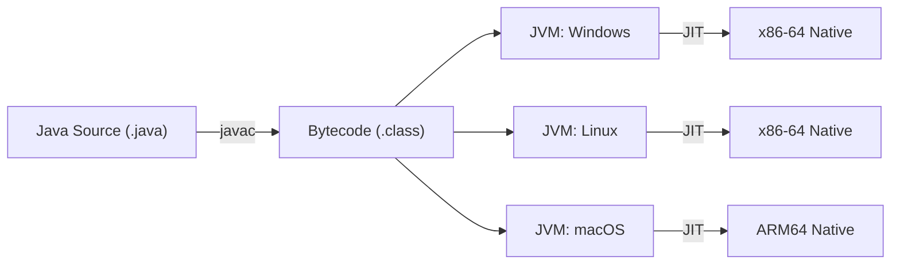
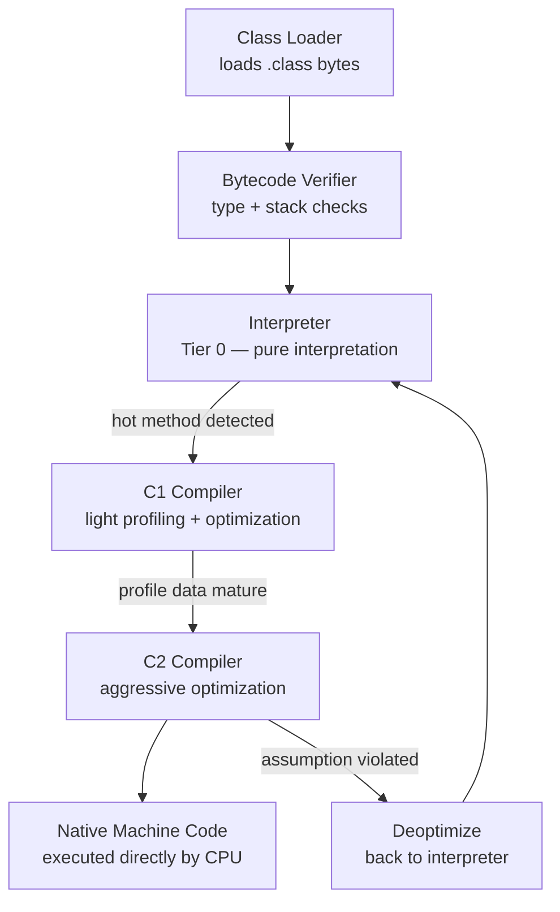
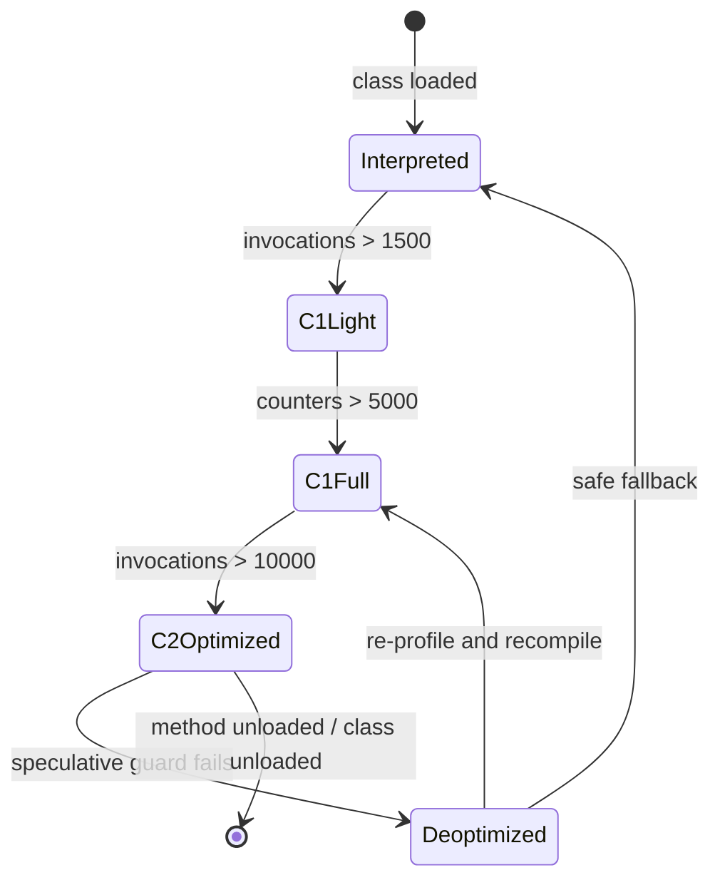

<!-- tldr -->
# How Java Achieves Platform Independence

Java's "Write Once, Run Anywhere" (WORA) promise rests on a two-layer abstraction: `javac` compiles `.java` source into platform-neutral **bytecode** stored in `.class` files, and a platform-specific **JVM** translates that bytecode into native machine instructions at runtime. The JVM specification—not the source language—is the portability contract; every certified JVM must produce semantically identical results from the same bytecode regardless of OS or CPU architecture. Kotlin, Scala, and Clojure all inherit this guarantee by targeting the same bytecode format.



<!-- standard -->

## What It Is

Platform independence means the same compiled artifact—a `.class` file or a `.jar`—runs unmodified on any operating system and CPU architecture that hosts a conforming JVM. The portability boundary is the bytecode layer, not the source layer. The JVM itself is a native binary compiled per OS/arch; it is emphatically **not** platform independent. Understanding this distinction is the single most important point for interviews.

## Why It Matters

- **Single build artifact**: one `.jar` deployed to Linux production servers, macOS developer laptops, and Windows CI agents without recompilation.
- **Cloud portability**: workloads migrate across providers without rebuild pipelines, reducing operational coupling.
- **Security floor**: the bytecode verifier enforces type safety and stack discipline before any instruction executes, eliminating entire classes of memory-corruption vulnerabilities that exist in native-compiled languages.
- **Polyglot ecosystem**: any JVM language (Kotlin, Clojure, Groovy, Scala) interoperates with Java at zero cost—they all share the same `.class` artifact boundary.

## Primary Techniques

| Layer | Artifact / Mechanism | Responsibility |
|---|---|---|
| `javac` | `.class` bytecode | Compile source to a stack-based ISA with no real-CPU dependencies |
| Class Loader | In-memory `Class<?>` object | Load, link, and initialize bytecode into the running JVM |
| Bytecode Verifier | — | Enforce type safety, stack depth, and access control pre-execution |
| Interpreter / JIT | Native code | Execute bytecode; profile and compile hot paths to native |
| GC | — | Abstract memory lifecycle from application code |

## Key Tradeoffs

| Execution Strategy | Platform Independent | Peak Throughput | Cold-Start Latency |
|---|---|---|---|
| JVM Bytecode (HotSpot JIT) | ✅ | High | ~100–500 ms |
| Interpreted (CPython) | ✅ | Low | ~10–50 ms |
| AOT Native (C++ / Rust) | ❌ | Highest | < 5 ms |
| GraalVM Native Image | ❌ | High | ~5–50 ms |

The fundamental tradeoff Java makes is **JIT warmup cost for portability plus near-native throughput**. HotSpot reaches full optimization speed after roughly 10,000 invocations of a hot method—a 60–120 second window for large services. Operators who need sub-50 ms cold-starts either accept per-arch builds (GraalVM Native Image) or pre-warm with synthetic traffic before promoting to production.



<!-- deep -->

## The Class File Format

Every `.class` file starts with the 4-byte magic number `0xCAFEBABE`, followed by a 2-byte minor version and 2-byte **major version** identifying the minimum JVM required:

| Major Version | Java Release |
|---|---|
| 55 | Java 11 |
| 61 | Java 17 |
| 65 | Java 21 |
| 66 | Java 22 |

A JVM rejects bytecode with a major version exceeding its own, throwing `UnsupportedClassVersionError`. This is one of the most frequent production failures when a downstream library is compiled against a newer JDK than the runtime—pin `--release N` in `javac`/Maven/Gradle to prevent it.

After the version header the format contains:

1. **Constant pool** — a variable-length table of UTF-8 strings, class references, method/field descriptors, numeric literals. All symbolic references in the file index into this pool; the verifier and linker resolve them lazily.
2. **Access flags** — bitmask encoding `public`, `abstract`, `interface`, `enum`, `record`, etc.
3. **This/super class references** — indices into the constant pool.
4. **Interfaces, fields, methods** — each method carries a `Code` attribute containing actual opcodes, max stack depth, max locals, and an exception table.
5. **Attributes** — `SourceFile`, `LineNumberTable`, `LocalVariableTable`, `StackMapTable`, `BootstrapMethods` (for `invokedynamic`), `Record`, etc.

The `StackMapTable` (mandatory since Java 7 via JSR 202) precomputes type state at every branch target, enabling the verifier to run in **O(n)** linear time rather than iterating to a fixed point. At scale this matters: a large application with 10,000+ classes must verify all of them on startup.

## Bytecode: A Stack-Based ISA

JVM bytecode uses ~200 opcodes over a per-frame **operand stack** and **local variable array**. Unlike register-based ISAs (x86, ARM64), the stack model is trivially portable because it carries no assumption about register count.

Concrete example—`return a + b` where `a` and `b` are `int` locals at indices 0 and 1:

```
iload_0   // push local[0] onto operand stack
iload_1   // push local[1] onto operand stack
iadd      // pop two ints, push their sum
ireturn   // return top-of-stack int to caller
```

The verifier confirms at compile time that at each instruction the stack has the expected depth and that every `iload` follows an `istore` or a method parameter of type `int`. Type-unsafe sequences are rejected before the first byte executes.

Key opcode families:

| Prefix | Type |
|---|---|
| `i` | `int` |
| `l` | `long` |
| `f` | `float` |
| `d` | `double` |
| `a` | reference |
| `b/s` | `byte`/`short` (widened to `int` on stack) |

## HotSpot Tiered Compilation In Depth

HotSpot implements five compilation tiers:

| Tier | Engine | Profile Data Collected |
|---|---|---|
| 0 | Interpreter | Method invocation + back-edge counters |
| 1 | C1 | None (pure speed) |
| 2 | C1 | Invocation + back-edge counters |
| 3 | C1 | Full type profiles, branch statistics |
| 4 | C2 | Uses Tier 3 profiles for speculative optimization |

Critical thresholds (HotSpot server defaults):
- Tier 3 → Tier 4: **~10,000 invocations** (`-XX:CompileThreshold`)
- OSR (on-stack replacement): back-edge counter > **~14,000** during a loop body
- Inlining budget: ~35 bytecodes by default (`-XX:MaxInlineSize`)

C2 performs **speculative optimizations**: if a virtual call site has been monomorphic (one concrete receiver type observed), C2 inlines the callee directly and emits a guard. When a new subtype is loaded later, HotSpot **deoptimizes**—traps the affected compiled frame back to the interpreter in a single safepoint, then re-profiles. Deoptimization storms after a large class-loading event (plugin registration, OSGI bundle deployment) cause measurable P99 latency spikes—a common production war story.



## Real-World Systems That Rely on This Model

### Apache Kafka (Confluent)
A single Kafka broker sustains **1M+ messages/sec** at < 5 ms P99. Kafka is pure JVM; operators run brokers for days, so JIT warmup (~2 min) is negligible against the operational lifetime. The zero-copy `FileChannel.transferTo()` path delegates to the OS `sendfile` syscall through JNI without breaking the WORA property of the broker JAR itself.

### Apache Cassandra
Cassandra uses bytecode instrumentation (via ASM library) to generate serializer/deserializer classes at runtime for user-defined types. This is only possible because the JVM's class loader model permits loading new `.class` bytes from a `byte[]` array at runtime (`ClassLoader.defineClass`). Platform independence here extends to the dynamically generated code—the same generated bytecode runs on any JVM.

### Elasticsearch / Lucene
Lucene uses `MethodHandles.lookup()` and `invokedynamic` for field access in its codec layer, enabling JIT to inline across abstraction boundaries it historically could not. The JVM's `invokedynamic` instruction (introduced in Java 7, leveraged by lambda desugaring since Java 8) is a key extensibility point that preserves the portability contract while enabling near-zero-overhead polymorphism.

### Android (Dalvik / ART)
Android does **not** execute standard JVM bytecode. The `d8` compiler cross-compiles `.class` files to **DEX (Dalvik Executable)** format—a register-based bytecode optimized for constrained RAM. ART (Android Runtime, since Android 5.0) AOT-compiles DEX to native at install time. This is the sharpest real-world demonstration that "JVM bytecode" is the portable layer, but every actual execution engine is platform-specialized.

### GraalVM Native Image
`native-image` performs **closed-world static analysis**: it follows all reachable code from the entry point, AOT-compiles everything to a self-contained native binary, and discards the JVM runtime. Results:
- Cold-start: **~10 ms** vs ~300 ms for HotSpot
- Resident memory: **~30–50 MB** vs ~150–300 MB for HotSpot
- Platform independence: **gone**—you need one CI job per `(OS, arch)` pair
- Dynamic class loading: **unavailable** by default (requires explicit reflection/resource config)

Teams running Java on AWS Lambda or Google Cloud Run with p99 cold-start SLAs of 100 ms routinely choose Native Image, explicitly trading the WORA guarantee for operational performance.

## Failure Modes

| Failure | Root Cause | Mitigation |
|---|---|---|
| `UnsupportedClassVersionError` | Library compiled with JDK N+1, runtime is JDK N | Enforce `--release N` in build toolchain; align JDK versions in CI and prod |
| JNI breaks WORA | `.so`/`.dll` native libraries are arch-specific | Ship per-arch classifier JARs; always provide a pure-Java fallback |
| Float precision drift | Pre-Java 17: x87 FPU used 80-bit extended precision unless `strictfp` was declared | Use `strictfp` pre-Java 17; Java 17+ makes `strictfp` the unconditional default (JEP 306) |
| Deoptimization storm | Megamorphic call sites exposed after bulk class loading | Profile with `-XX:+PrintCompilation`; prefer `sealed` hierarchies to keep call sites bimorphic |
| `NoSuchMethodError` at runtime | Binary-compatible but API-incompatible library upgrade | Enforce dependency convergence; use `jdeps` to detect split packages |
| Reflection breaks encapsulation post Java 9 | Module system (`JPMS`) restricts cross-module deep reflection | Add `--add-opens` exports or migrate to public API; avoid deep reflection in frameworks |

## Capacity & Latency Reference Numbers

- **`javac` throughput**: ~10,000–50,000 LOC/sec on a modern dev machine.
- **Class loading**: 1–5 ms per class on first access; near-zero on repeat (cached in the metaspace).
- **JIT warmup to full C2 speed**: 60–120 sec for a large microservice (~5,000–15,000 loaded classes).
- **Interpreter vs. C2 throughput ratio**: 10–50× slower in the interpreter; C2 code is typically within 1.5–2× of equivalent C++.
- **JVM base memory (HotSpot server)**: ~30–80 MB metaspace + heap before application allocations.
- **GraalVM Native Image binary size**: 30–70 MB self-contained executable for a typical Spring Boot service.
- **Deoptimization latency**: single deoptimization event < 1 ms; storms across thousands of frames can pause the application for tens of milliseconds.

## Interview Pitfalls

1. **"The JVM is platform independent."** — The JVM is a platform-native binary. Only the bytecode it consumes is platform independent. Mixing these up is an instant red flag.

2. **Conflating source compatibility with binary compatibility.** — Java 8 source may compile fine on Java 21's `javac`, but a `.class` compiled at `--release 21` will not load on a Java 11 JVM. Source compat ≠ binary compat.

3. **Ignoring JNI in WORA discussions.** — Libraries like RocksDB Java, TensorFlow Java, and Chronicle Map ship JNI bindings. They are not WORA; you must distribute per-arch native artifacts alongside the JAR.

4. **Treating GraalVM Native Image as "still JVM."** — Native Image is AOT-compiled; it has no JIT, no dynamic class loading by default, and no bytecode at runtime. Calling it "JVM" in a system design context is incorrect.

5. **Overlooking the bytecode verifier's role.** — Portability is not merely "same instructions everywhere." It is "same **verified, type-safe** semantics everywhere." The verifier is what makes it safe to load and run untrusted `.class` bytes.

6. **Missing `invokedynamic` in lambda discussions.** — Java lambda bodies are desugared to synthetic methods and bound via `invokedynamic` + `LambdaMetafactory` at first call, not at compile time. The JIT can then inline the lambda target after profiling. Understanding this is expected at the senior level.

## When to Reach for Each Strategy

```
Is cold-start latency a hard SLA (< 50 ms)?
  YES → GraalVM Native Image (accept per-arch CI matrix, no dynamic class loading)
  NO  ↓

Is the process long-running (> 5 minutes in production)?
  YES → HotSpot JIT; warmup cost amortized; peak throughput optimal
  NO  → Consider -XX:TieredStopAtLevel=1 (skip C2) to trade peak throughput for
         faster startup; or evaluate Native Image

Does the application require runtime code generation or dynamic class loading?
  YES → Must use standard JVM; Native Image is not viable without extensive config
  NO  → Native Image is a viable option for performance-critical short-lived processes

Are you deploying to a heterogeneous fleet (mixed OS/arch) without per-target builds?
  YES → Standard JVM bytecode is the correct default — this is exactly the use case WORA solves
  NO  → Profile whether Native Image startup and memory savings justify the build complexity
```