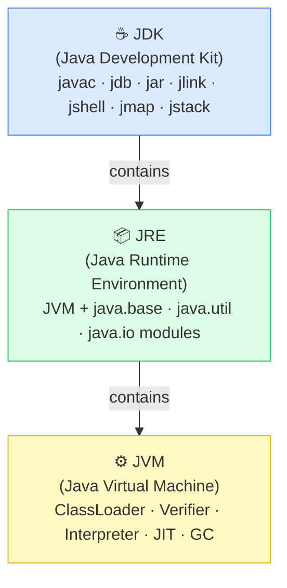
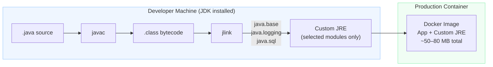

<!-- tldr -->
# JDK vs JRE vs JVM

The Java platform is a three-layer containment hierarchy: the JDK ships everything a developer needs, the JRE provides the runtime environment for end users, and the JVM is the abstract bytecode execution engine underneath both. The `.class` file produced by `javac` is platform-independent bytecode; each JVM implementation translates it to native instructions at runtime, delivering the "write once, run anywhere" guarantee. Since Java 11, Oracle no longer ships a standalone JRE — `jlink` composes a minimal custom runtime from modules instead.



---

<!-- standard -->

## What Each Layer Is and Why It Matters

### The Three Layers

| Layer | Contains | Audience | Key Characteristic |
|-------|----------|----------|--------------------|
| **JVM** | ClassLoader, Bytecode Verifier, Interpreter, JIT, GC, Runtime Data Areas | JRE and everything above | Defined by *specification*; multiple implementations exist |
| **JRE** | JVM + standard modules (`java.base`, `java.util`, `java.io`, etc.) | End users, app servers | No compiler — sufficient to *run* apps |
| **JDK** | JRE + `javac`, `javadoc`, `jdb`, `jar`, `jlink`, `jshell`, `jmap`, `jstack`, `jconsole` | Developers, build engineers | Complete toolkit for development |

### Essential JDK Tools

- **`javac`** — compiles `.java` → `.class` (bytecode)
- **`javap -c`** — disassembles `.class` files; prints abstract bytecode instructions (`getstatic`, `invokevirtual`, etc.)
- **`jlink`** *(Java 9+)* — composes a minimal custom JRE from selected modules; Docker images shrink from 200+ MB → ~50 MB
- **`jshell`** *(Java 9+)* — interactive REPL; no compile/run cycle needed
- **`jmap`** — heap statistics; triggers heap dumps for leak analysis
- **`jstack`** — dumps all thread stack traces; essential for diagnosing deadlocks

### Why Bytecode Is the Secret Sauce

`javac` compiles to *platform-independent* bytecode — abstract instructions (`getstatic`, `ldc`, `invokevirtual`) that reference no x86 registers, no OS syscalls, no memory addresses. The JVM on each platform interprets or JIT-compiles bytecode to native instructions at runtime. The **same** `.class` binary runs unmodified on Linux x86-64, Windows x86-64, and ARM.

### Java 9 Module System Impact

Before Java 9, `rt.jar` was a monolithic ~200 MB blob of ~4,200 classes. Java 9 decomposed it into ~100 named modules. This matters because:
- `jlink` can now produce runtimes containing *only* the modules your app uses
- Explicit `requires`/`exports` in `module-info.java` enforce encapsulation at the platform level
- The standalone JRE download is deprecated; build a custom one with `jlink`

> **Gotcha:** Don't confuse *packages* (`java.util`) with *modules* (`java.base`). Packages have existed since Java 1.0. Modules are a Java 9+ abstraction that *group* packages and declare explicit dependencies.

---

<!-- deep -->

## Deep Dive: Internals, Implementations, and Interview Mastery

### The Full Lifecycle: Source → Execution

```mermaid
sequenceDiagram
    participant Dev as Developer
    participant javac as javac (JDK)
    participant FS as HelloWorld.class
    participant CL as ClassLoader (JVM)
    participant Ver as Bytecode Verifier
    participant Interp as Interpreter
    participant JIT as JIT Compiler (C1/C2)
    participant Native as Native CPU

    Dev->>javac: javac HelloWorld.java
    javac->>FS: Emit platform-independent bytecode
    Note over FS: Same binary on Linux / Windows / ARM
    FS->>CL: java HelloWorld triggers Bootstrap CL → App CL
    CL->>Ver: Pass bytecode for structural validation
    Ver-->>Interp: Type-safe; no stack underflows; valid branches ✓
    Interp->>Native: Execute bytecode (interpreted, slow path)
    Note over Interp,JIT: ~10,000 invocations → method flagged "hot"
    Interp->>JIT: Hand off hot method
    JIT->>Native: Emit optimized native code (fast path)
```

**Key lifecycle phases:**

1. **Bootstrap ClassLoader** loads `java.lang.Object`, `java.lang.System` (from `java.base` module)
2. **Application ClassLoader** loads `HelloWorld.class` from classpath
3. **Bytecode Verifier** enforces type safety, valid control flow, and stack integrity — a security boundary
4. **Interpreter** begins execution immediately (cold path)
5. **Tiered Compilation**: C1 (client compiler, fast profiling) → C2 (server compiler, aggressive optimization) kicks in after ~10k invocations of a hot method; expect P99 < 5ms for steady-state vs. 50–200ms during warmup

### JVM Specification vs. Implementations

The JVM is a *specification* (`docs.oracle.com/javase/specs`), not a product. Any vendor can ship a conformant implementation:

| Implementation | Vendor | Strength | Primary Use Case |
|---------------|--------|----------|-----------------|
| **HotSpot** | Oracle / OpenJDK | Peak throughput; excellent C2 JIT; tiered compilation | Most production servers |
| **OpenJ9** | Eclipse / IBM | 40–60% lower RSS at startup; AOT via Shared Classes Cache | Cloud / container workloads (pay-per-GB) |
| **GraalVM CE** | Oracle | Polyglot (JS/Python/Ruby); Native Image (AOT to native binary) | Microservices; serverless cold-start |
| **Azul Zing** | Azul Systems | Pauseless GC (C4); consistent sub-millisecond GC pauses | High-frequency trading; real-time |
| **Android ART** | Google | AOT + JIT hybrid; DEX format (not `.class`) | Android apps |

> **Critical Android gotcha:** ART is JVM-compatible at the *language* level (you write Java) but NOT at the *binary* level. `.class` files are compiled to `.dex` (Dalvik Executable) format. You cannot drop an arbitrary `.jar` onto an Android device and run it. This distinction is a frequent interview trap.

### Bytecode Inspection with `javap`

```bash
# Compile
javac HelloWorld.java

# Disassemble
javap -c HelloWorld.class
```

Sample output:
```
public static void main(java.lang.String[]);
  Code:
     0: getstatic     #7   // Field System.out
     3: ldc           #13  // String "Hello, World!"
     5: invokevirtual #15  // Method PrintStream.println
     8: return
```

`getstatic`, `ldc`, `invokevirtual` — these are abstract stack-machine instructions. No registers. No OS calls. The JVM maps them to platform-specific machine code at runtime.

**When to reach for `javap -c`:**
- Verify compiler optimized string concatenation to `StringBuilder`
- Debug `ClassLoader` issues without source access
- Security audit of third-party `.jar` contents
- Confirm an expected compiler transformation occurred (e.g., auto-boxing elision)

### Capacity & Latency Reference Numbers

| Scenario | Typical Number |
|----------|---------------|
| JVM warmup (tiered compilation) | 10,000 invocations per method (configurable via `-XX:CompileThreshold`) |
| HotSpot P99 latency (steady-state) | < 5ms (GC-dependent) |
| OpenJ9 RSS vs HotSpot (idle Spring Boot) | ~150 MB vs ~250 MB |
| `jlink` minimal JRE (only `java.base`) | ~30–40 MB |
| Full OpenJDK 21 JRE | ~180–220 MB |
| GraalVM Native Image startup time | ~10–50ms vs ~500ms–2s for JVM |

### Failure Modes and Pitfalls

#### `ClassNotFoundException` vs `NoClassDefFoundError`
- **`ClassNotFoundException`**: Thrown at *runtime* when `Class.forName()` or a ClassLoader can't find a class — typically a missing dependency on the classpath.
- **`NoClassDefFoundError`**: Class was present at *compile time* but missing at *runtime* — often a missing transitive dependency in a fat-JAR or module misconfiguration.

#### VerifyError
The Bytecode Verifier rejects malformed `.class` files. Triggered by: bytecode instrumentation agents that produce invalid code, mismatched class file versions (`UnsupportedClassVersionError` is a subtype), or hand-crafted bytecode with type mismatches.

#### Java 9 Module System Pitfalls
- **`InaccessibleObjectException`**: Reflective access to non-exported module members now throws by default. Common in frameworks like Spring, Hibernate with Java 17+. Fix: add `--add-opens` JVM flag or proper `module-info.java` exports.
- **Split packages**: A package spanning two modules is illegal under JPMS. Migrating legacy monolithic apps often surfaces this.

### Architecture: JDK → JRE Composition with jlink



### When to Reach for What

**Choose HotSpot (default OpenJDK)** when:
- Running traditional Spring Boot / JEE apps on VMs or bare metal
- Throughput and peak performance > startup time
- Team familiarity and ecosystem support are priorities

**Choose OpenJ9** when:
- Deploying containerized microservices billed per GB of memory
- Pod startup time matters but native compilation overhead is unacceptable
- Running many JVM instances side-by-side on the same host

**Choose GraalVM Native Image** when:
- Serverless / FaaS where cold-start must be < 100ms
- CLI tools where JVM warmup is unacceptable
- Willing to accept: no dynamic classloading, limited reflection, longer build times

**Use `jlink`** when:
- Shipping a Docker image and want to minimize surface area
- Embedding a JRE in a standalone installer
- Java 11+ is your baseline (standalone JRE is deprecated)

### Interview Question Checklist

| Question | Key Point to Hit |
|----------|-----------------|
| Difference between JDK / JRE / JVM? | Containment hierarchy; JRE deprecated post-Java 11; `jlink` replaces it |
| Can you run Java without JDK? | Yes — only JRE (or custom runtime via `jlink`) needed in production |
| What is bytecode? | Platform-independent intermediate representation; enables WORA |
| HotSpot vs OpenJ9? | Throughput vs memory/startup; both spec-compliant JVM implementations |
| What does `javap -c` show? | Abstract bytecode instructions; not native machine code |
| What changed in Java 9 for JRE? | JPMS modules replaced `rt.jar`; `jlink` for custom minimal runtimes |
| Android and JVM? | ART uses DEX format; language-compatible but NOT binary-compatible with standard JVM |