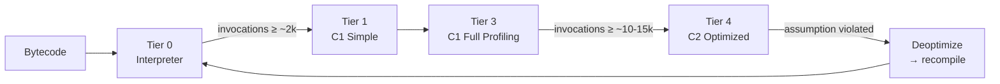
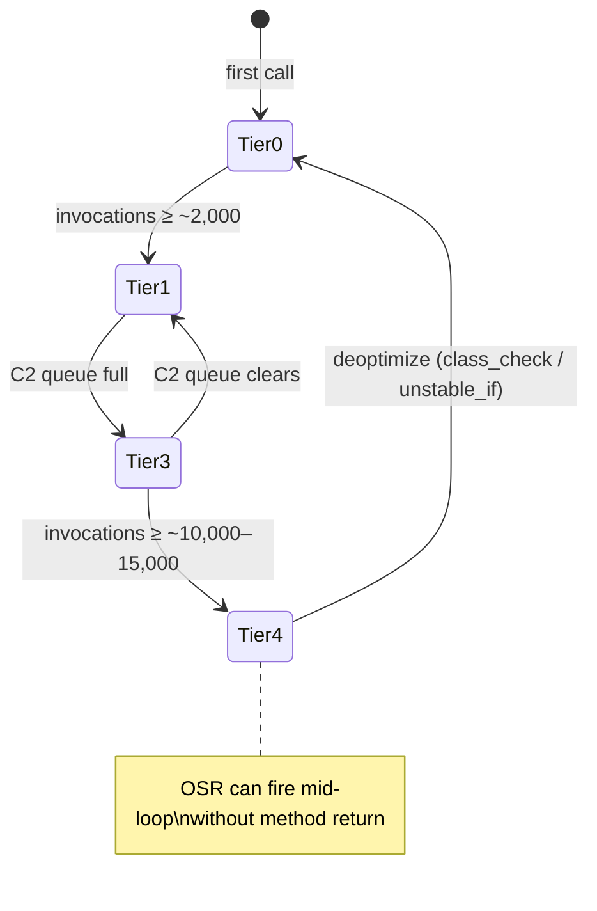
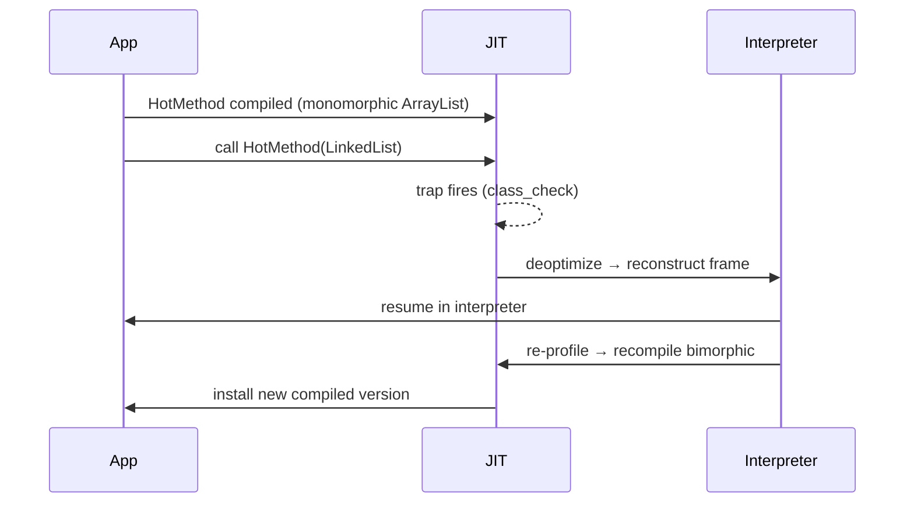

<!-- tldr -->
# JIT Compiler

The JVM starts every method interpreted — universal but slow (~30 ns/instruction). As methods accumulate invocation counts, HotSpot's tiered compiler progressively compiles them to native code, using profiling data to drive aggressive speculative optimizations. C1 delivers fast initial compilation; C2 delivers peak throughput. The result: JIT-compiled Java can match C++ for steady-state throughput while retaining runtime adaptability static compilers can't match.



<!-- standard -->

## What It Is

The JIT (Just-In-Time) compiler is a subsystem inside HotSpot that detects *hot* methods and loops at runtime and compiles them to native CPU instructions. Unlike ahead-of-time (AOT) compilation, the JIT has runtime type feedback — it knows which concrete classes actually appear, which branches are always taken, and what the memory layout looks like. This runtime intelligence lets it make optimizations that `javac` and even GCC cannot.

## Why It Matters

- **Startup vs. throughput tension:** Pure interpretation is safe and fast to start but can be 10–100× slower at steady state.
- **Tiered compilation resolves this:** C1 compiles quickly for moderate gains; C2 spends more time for maximum native performance.
- **Unlocks downstream optimizations:** Every inlining decision opens the door to constant folding, dead code elimination, escape analysis, and vectorization across what were previously opaque method boundaries.

## Primary Techniques

| Optimization | Trigger | Effect |
|---|---|---|
| **Method Inlining** | Callee ≤ 35 bytecodes (`-XX:MaxInlineSize`) | Eliminates call overhead; enables all others |
| **Escape Analysis** | Object not visible outside method | Stack allocation → zero GC pressure |
| **Devirtualization** | Monomorphic call site (one observed type) | Vtable lookup → direct call → inline |
| **Loop Unrolling** | Counted loops | 4× reduction in branch/counter overhead |
| **Vectorization (SIMD)** | Independent array ops | 4–8 elements per instruction (SSE/AVX) |
| **Dead Code Elimination** | Branch always false per profile | Removes entire unreachable blocks |
| **Deoptimization** | Speculative assumption violated | Reverts to interpreter; recompiles safely |

## Key Tradeoffs

- **Warmup cost:** Cold JVMs are slow. Serverless / short-lived containers pay a steep penalty — consider GraalVM native-image or `-XX:TieredStopAtLevel=1` for startup-critical paths.
- **Inlining budget:** Methods > 35 bytecodes won't inline. Fat "utility" methods on hot paths kill optimization chains.
- **Polymorphism vs. performance:** JIT devirtualizes monomorphic sites. More than 2 concrete types at one call site (megamorphic) degrades to a vtable dispatch and prevents inlining.
- **JIT compilation is not free:** C2 compilation itself consumes CPU and a compiler thread pool. Under high load, the queue can back up, temporarily degrading throughput.

<!-- deep -->

## Deep Dive: JIT Compiler Internals

### The Five Tiers



| Tier | Name | Compile Time | Notes |
|---|---|---|---|
| 0 | Interpreter | None | Counts invocations + back-edges |
| 1 | C1 Simple | Very fast | No profiling instrumentation |
| 2 | C1 Limited | Fast | Invocation/back-edge counters only |
| 3 | C1 Full | Fast | Full type feedback + branch data |
| 4 | C2 Optimized | Slow | All aggressive opts; best native code |

### Method Inlining: The Force Multiplier

Inlining is gated by bytecode size (`-XX:MaxInlineSize=35` default, `-XX:FreqInlineSize=325` for hot methods). The impact compounds:

```
toString()
  └─ StringBuilder.append()         ← inlined
       └─ System.arraycopy()        ← inlined
            └─ native memcpy()      ← single instruction
```

Without inlining none of the other optimizations can see across that call chain. **Rule of thumb:** keep hot-path methods under 35 bytecodes. Getters, setters, and small predicates are perfect candidates.

### Escape Analysis & Scalar Replacement

Escape analysis classifies each object allocation:

- **No escape** → stack allocate or *scalar replace* (explode fields into local variables, no object created at all).
- **Thread escape** → heap, needs synchronization.
- **Method escape** → heap, but lock elision still possible for `synchronized(this)`.

```java
// This Point is scalar-replaced — zero heap allocation:
public int sumPoint(int x, int y) {
    Point p = new Point(x, y); // JIT: p.x = x, p.y = y as locals
    return p.x + p.y;          // JIT: return x + y
}
```

**Capacity impact:** A service allocating 50M small DTOs/sec can save ~400 MB/s of heap churn if those objects don't escape — measurable GC pause reduction.

### On-Stack Replacement (OSR)

OSR solves a critical edge case: a loop that runs for *minutes* would stay interpreted after JIT finishes compiling it, because the compiled version only kicks in on the *next* call. OSR swaps the compiled frame in *mid-execution*, reconstructing the interpreter state. You can spot OSR in `-XX:+PrintCompilation` output by the `%` suffix and `@ <bci>` bytecode index.

```
204 3% 4 com.example.HotLoop::run @ 15 (134 bytes)
               ↑ OSR at bytecode index 15 (inside the loop)
```

### Deoptimization: The Safety Net

Every speculative optimization installs a *trap*. When the trap fires, the JVM:

1. Suspends the affected thread.
2. Reconstructs the interpreter state from the compiled frame (using a *debug info* map baked into the compiled code).
3. Marks the compiled method `not_entrant` (won't be called again).
4. Re-profiles and eventually recompiles with broader assumptions.

**Deopt reasons to know:**

| Reason | Cause | Fix |
|---|---|---|
| `class_check` | New concrete type at devirtualized site | Accept bimorphic; avoid megamorphic hot paths |
| `unstable_if` | Branch flipped after profiling | Ensure training data covers all branches |
| `null_check` | Null reference at assumed-non-null site | Add null guards; check input validation |
| `div0_check` | Division by zero | Guard before division |



### Real-World Systems That Rely on JIT Behavior

**Kafka (Broker hot path):** The fetch/produce path is a tight loop over `ByteBuffer` reads. C2 devirtualizes `ByteBuffer.get()` and vectorizes batch copies. Without JIT warmup, broker throughput can be 5–10× lower for the first 30 seconds.

**Cassandra (Read path):** SSTable iterators are megamorphic during compaction (multiple concrete types). Cassandra's performance tuning guides specifically recommend avoiding excessive subclassing of hot iterator types to prevent megamorphic deopt storms.

**Netty (I/O event loop):** Netty is designed so that the `ChannelPipeline` traversal is always the same concrete handler types — intentional monomorphism to guarantee JIT devirtualizes and inlines every handler's `channelRead()`.

**DynamoDB (Java client):** AWS's Java SDK v2 uses request interceptors. The client internally type-specializes interceptor chains to keep call sites monomorphic — a JIT-aware design decision documented in the SDK internals.

### Capacity & Latency Numbers

| Scenario | Interpreted | JIT Warmed |
|---|---|---|
| Tight arithmetic loop (1B iters) | ~30 s | ~0.3 s (100×) |
| HashMap.get() P99 | ~150 ns | ~15 ns |
| Virtual call (megamorphic, 5 types) | ~8 ns | ~8 ns (no devirt) |
| Virtual call (monomorphic, inlined) | ~8 ns | ~1 ns |
| Small object allocation (non-escaping) | ~5 ns + GC | ~0 ns (stack/scalar) |

### Diagnostic Flags Cheat Sheet

```bash
# See every compilation decision:
java -XX:+PrintCompilation MyClass

# See inlining decisions (verbose):
java -XX:+PrintInlining MyClass

# See deoptimization events:
java -XX:+PrintDeoptimization MyClass

# Verify escape analysis & stack allocation:
java -XX:+PrintEscapeAnalysis -XX:+EliminateAllocations MyClass

# Interpreter-only baseline (no JIT):
java -Xint MyBenchmark

# Cap at C1 only (no C2 — faster startup, lower peak):
java -XX:TieredStopAtLevel=3 MyClass

# Print native assembly (requires hsdis library):
java -XX:+PrintAssembly -XX:CompileOnly=com/example/Foo.hotMethod MyClass
```

### Interview Pitfalls

1. **"JIT is always faster."** Wrong. Short-lived lambdas that execute once and a half tiers of compilation are pure overhead. Microbenchmarks without JMH warmup measure *interpreter* speed, not JIT speed.

2. **"Escape analysis eliminates all small allocations."** Only non-escaping objects. The moment you store a reference in a field, a collection, or pass it to another thread, it goes to the heap.

3. **"Polymorphism is free."** Megamorphic call sites (> 2 types) defeat devirtualization and inlining. In tight loops this is a 5–8× regression vs. a monomorphic devirtualized+inlined call.

4. **"Deoptimization is catastrophic."** One-time deopt is fine. *Repeated* deopt (oscillating types) is the problem — manifests as `make_not_entrant` spam in `-XX:+PrintDeoptimization`.

5. **Confusing `javac` optimizations with JIT optimizations.** `javac` does almost nothing (no inlining, no constant propagation across methods). Everything interesting happens in HotSpot at runtime.

### When to Reach for This Knowledge

**Reach for JIT understanding when:**
- Benchmarking shows unexpected slowness in early test runs → warmup issue; use JMH with `@Warmup` iterations.
- GC pressure is high despite small short-lived objects → check escape analysis with `-XX:+PrintEscapeAnalysis`.
- A hot service degrades after a new subclass is introduced → megamorphic deopt; profile with async-profiler.
- Containerized/serverless startup latency is unacceptable → consider GraalVM native-image (AOT) or `-XX:TieredStopAtLevel=1` to skip C2.
- You're tuning Kafka/Cassandra/Netty for P99 latency → understand that the first 30–60 seconds are always JIT warmup territory; don't SLA-measure cold starts.