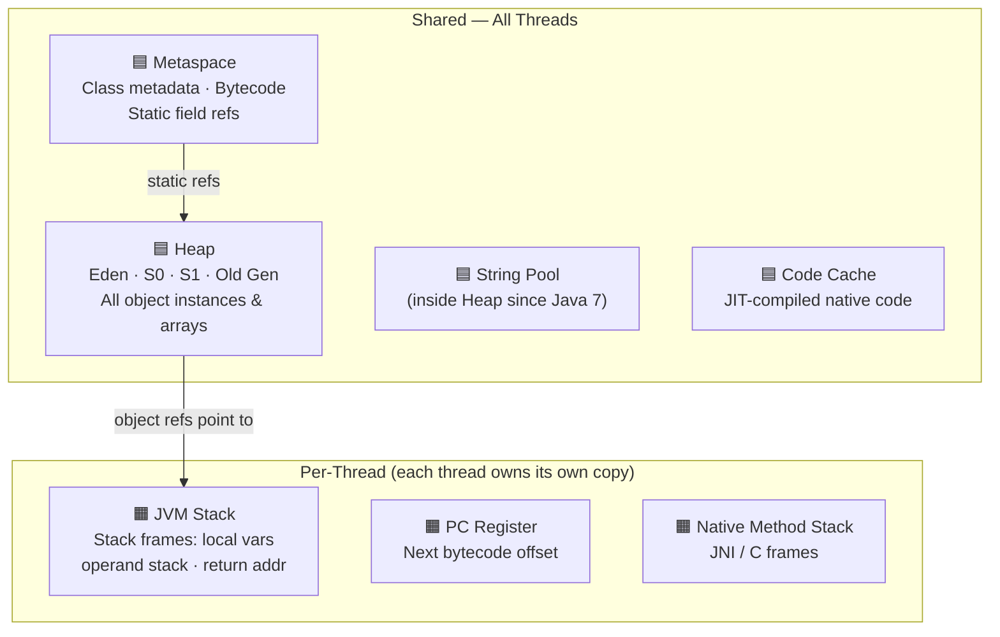
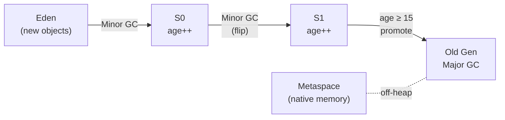
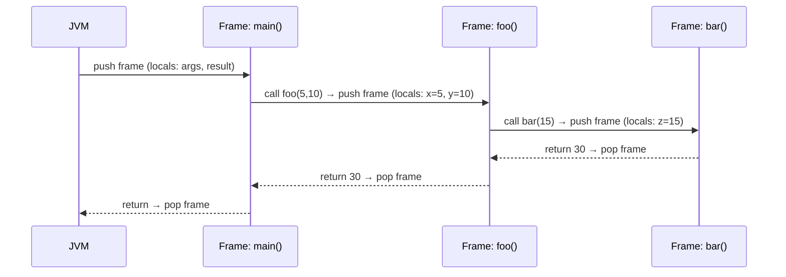
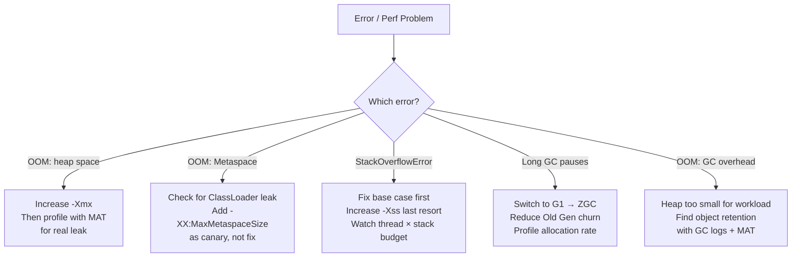

<!-- tldr -->
# JVM Memory Layout

The JVM specification defines five runtime data areas. Two are shared across all threads (Heap, Metaspace) and three are private per-thread (JVM Stack, PC Register, Native Method Stack). This split is the root cause of every `OutOfMemoryError` and `StackOverflowError` you will ever debug, and it is the conceptual foundation for reasoning about thread safety without running the code. Every JVM flag you tune—`-Xmx`, `-XX:MaxMetaspaceSize`, `-Xss`—directly sizes one of these regions.



<!-- standard -->

## What It Is

The JVM runtime carves the process address space into five named areas at startup. The **Heap** holds every object instance and array you ever allocate with `new`. **Metaspace** (native memory, off-heap since Java 8) holds class structures, bytecode, static field references, and constant pool entries. Each thread gets its own **JVM Stack** (LIFO frames), a tiny **PC Register** (current bytecode offset), and a **Native Method Stack** (JNI frames).

## Why It Matters

- Explains `OutOfMemoryError: Java heap space` vs `OutOfMemoryError: Metaspace` vs `StackOverflowError`—three different regions, three different fixes.
- Explains thread safety: only shared regions (Heap, Metaspace) require synchronization. A local `int` on the Stack is inherently thread-safe; the `ArrayList` it points to on the Heap is not.
- Every tuning flag maps 1-to-1 to a region.

## Primary Techniques / Key Concepts

| Memory Area | Shared / Per-Thread | What It Stores | Key Error |
|---|---|---|---|
| Heap | Shared | All object instances & arrays | `OOM: Java heap space` |
| Metaspace | Shared | Class metadata, static refs | `OOM: Metaspace` |
| JVM Stack | Per-Thread | Stack frames (local vars, operand stack) | `StackOverflowError` |
| PC Register | Per-Thread | Next bytecode instruction address | Never (internal) |
| Native Method Stack | Per-Thread | JNI / native C frames | `StackOverflowError` |

### Heap Generations

The Heap is split into **Young Generation** (Eden + S0 + S1) and **Old (Tenured) Generation**. The generational hypothesis: 80–98% of objects die before their first GC. Minor GC sweeps only Young Gen (milliseconds, frequent); Major/Full GC sweeps Old Gen (seconds, infrequent).

- New objects land in **Eden**.
- Minor GC copies survivors to **S0** or **S1**, incrementing an age counter each cycle.
- At age ≥ 15 (default tenuring threshold), objects are **promoted** to Old Gen.

### Metaspace vs PermGen

Before Java 8, class metadata lived in **PermGen**—a fixed-size on-heap region infamous for `OOM: PermGen space` in app servers. Java 8 replaced it with **Metaspace** in native memory, which grows dynamically. `-XX:PermSize` / `-XX:MaxPermSize` are silently ignored on Java 8+; use `-XX:MetaspaceSize` and `-XX:MaxMetaspaceSize`.

### JVM Stack & Frames

Each method call pushes a **stack frame** containing:
1. **Local Variable Array** — `this`, parameters, declared locals (primitives by value; object refs as pointers).
2. **Operand Stack** — working area for bytecode arithmetic.
3. **Frame Data** — runtime constant pool ref, return address.

## Key Tradeoffs

- **Large `-Xss`**: deeper recursion without SOE, but `N threads × stack size` consumes real RAM. 1000 threads × 4 MB = 4 GB just for stacks.
- **Uncapped Metaspace**: no `OOM: Metaspace` from legitimate class loading, but a ClassLoader leak silently grows native memory until the OS kills the process.
- **Huge Young Gen**: fewer promotions to Old Gen, but each Minor GC takes longer to copy survivors.



<!-- deep -->

## Deep Dive: JVM Memory Layout

### Heap Internals & Sizing Numbers

| Region | Typical Allocation | GC Type | Typical Pause |
|---|---|---|---|
| Eden | ~80% of Young Gen | Minor GC | 5–50 ms |
| S0 / S1 | ~10% each of Young Gen | Minor GC | 5–50 ms |
| Old Gen | 60–75% of `-Xmx` | Major / Full GC | 0.5–5 s |
| Metaspace | Grows on demand (off-heap) | Full GC trigger | Rare |

**Tuning flags:**
```
-Xms2g -Xmx8g                     # initial / max heap
-XX:NewRatio=3                     # Old:Young = 3:1
-XX:SurvivorRatio=8                # Eden:Survivor = 8:1
-XX:MaxTenuringThreshold=15        # promote after 15 Minor GCs
-XX:MetaspaceSize=128m             # initial Metaspace commit
-XX:MaxMetaspaceSize=512m          # hard cap
-Xss512k                           # stack size per thread
```

A 16 GB heap with G1GC typically achieves P99 < 200 ms GC pauses for most web workloads. ZGC and Shenandoah aim for P99 < 10 ms at the cost of higher CPU overhead (~5–10%).

---

### Real-World Systems Using This Layout

#### Cassandra
Cassandra is notoriously heap-sensitive. The `MemTable` is a large on-heap structure; oversized heaps cause multi-second Full GC pauses that violate SLAs. The tuned configuration caps the JVM heap at 8–16 GB and offloads the `BlockCache` to off-heap (`file.cache.size.in.mb`) to avoid GC pressure entirely.

#### Apache Kafka (Broker)
Kafka brokers keep the heap small (~4–6 GB) and rely on the OS **page cache** (native memory) for throughput. The JVM heap holds primarily the metadata index structures. Large heaps = long Full GC = broker heartbeat timeouts = leader re-election. Classic Kafka tuning deliberately keeps heap *small*.

#### Spring Boot / Hibernate (Metaspace)
Spring AOP, Hibernate's bytecode enhancement, and Reflection proxies each register new `Class` objects. Every `CGLib` proxy requires a unique `Class`. In hot-redeploy environments (e.g., Tomcat reload), if the old `ClassLoader` is leaked, those `Class` objects never unload. Metaspace grows 2–5 MB per redeploy. After 50 redeploys: `OOM: Metaspace`.

#### HotSpot JIT (Code Cache)
JIT-compiled native code lives in the **Code Cache** (separate from Metaspace). Default size is 240 MB on Java 8+ with tiered compilation. When the Code Cache fills, HotSpot switches back to interpreted mode—a silent, severe performance regression. Watch for the log warning: `CodeCache is full. Compiler has been disabled`.

```
-XX:ReservedCodeCacheSize=512m     # increase for large Spring apps
```

---

### Stack Frame Anatomy & Sequence



Each frame consumes: ~(number of local vars × 4 bytes) + operand stack + frame metadata. A method with 10 local variables and an operand stack depth of 4 might occupy ~100–200 bytes. With a default `-Xss` of 512 KB, you get roughly 2,000–5,000 nested frames before `StackOverflowError`.

---

### Failure Modes & Diagnosis

#### `OOM: Java heap space`
**Root cause:** Strong references prevent GC. Typical culprit: a `static` `Map`/`List` that grows unbounded.

```java
// Classic heap leak
static Map<String, byte[]> cache = new HashMap<>();
scheduler.scheduleAtFixedRate(() ->
    cache.put(UUID.randomUUID().toString(), new byte[1_048_576]), // 1 MB/tick
    0, 1, TimeUnit.SECONDS);
// → heap exhausted in minutes
```

**Diagnosis:**
```bash
jmap -dump:live,format=b,file=heap.hprof <pid>
# Open in Eclipse MAT → Leak Suspects → find retained heap by object type
```

#### `OOM: Metaspace`
**Root cause:** `ClassLoader` leak. Every dynamically generated class (Spring proxy, CGLIB, ASM) stays in Metaspace as long as its `ClassLoader` is reachable.

```bash
jcmd <pid> VM.metaspace          # current usage + per-loader breakdown
jstat -gc <pid> 1000             # MU (Metaspace Used) climbing = leak
```

#### `StackOverflowError`
**Signature:** Same method name repeated thousands of times in the stack trace. Either missing base case (pure SOE) or mutual recursion between two methods (alternating pair in trace).

**Fix options in priority order:**
1. Add a correct base case.
2. Refactor to iterative with an explicit `Deque<>` stack.
3. Last resort: `-Xss4m` (remember: total memory = `-Xss` × thread count).

#### `OOM: GC overhead limit exceeded`
Thrown when GC is spending > 98% of CPU time recovering < 2% of heap. Signals a near-full heap with heavy object churn. Enable GC logs for evidence:
```
-Xlog:gc*:file=gc.log:time,uptime,level,tags
```

---

### String Pool Deep Dive

The String Pool is a hash table inside the Heap (since Java 7; was in PermGen in Java 6). `String.intern()` inserts or retrieves. Intern heavily in Java 6 and you OOM PermGen. In Java 7+ the pool is GC-eligible, so unreferenced interned strings can be collected.

```java
String a = "hello";           // pool lookup → insert if absent
String b = "hello";           // same pool object
a == b;                        // true — same reference

String c = new String("hello"); // new heap object, NOT in pool
a == c;                         // false

String d = c.intern();         // returns the pool entry
a == d;                         // true
```

**Rule:** Never use `==` for content equality on `String`. Use `.equals()`. The only safe `==` use is checking if two refs point to the same interned literal—almost never what you want in production code.

---

### Per-Thread vs Shared: Thread-Safety Cheat Sheet

| What You Write | Where It Lives | Thread-Safe? | Why |
|---|---|---|---|
| `int x = 5` (local) | Stack | ✅ Yes | Private to thread |
| `new ArrayList<>()` (local ref) | Ref on Stack; object on Heap | ❌ No | Heap object is shared if ref escapes |
| `static int counter = 0` | Metaspace ref + Heap int | ❌ No | Shared, needs `AtomicInteger` or `synchronized` |
| `"hello"` literal | String Pool (Heap) | ✅ Yes | Immutable |
| `this.name` (instance field) | Inside object on Heap | ❌ No | Needs `volatile` or synchronization |
| Method param `Object obj` | Ref on Stack; object on Heap | ❌ No | Object itself is shared |

**Key rule:** A local reference on the Stack is private. The *object it points to* on the Heap is potentially shared the moment you pass it to another thread.

---

### Capacity & Latency Reference Numbers

| Scenario | Typical Number |
|---|---|
| Minor GC pause (well-tuned, 4 GB Young Gen) | 5–50 ms |
| Full GC pause (8 GB Old Gen, CMS) | 500 ms – 3 s |
| G1GC pause target (default) | 200 ms |
| ZGC / Shenandoah pause | < 10 ms (any heap size) |
| Default `-Xss` per thread | 512 KB (Linux) – 1 MB (Windows) |
| Default Code Cache | 240 MB (Java 11+, tiered) |
| Stack frames before SOE at `-Xss512k` | ~2,000–5,000 |
| Metaspace per Spring proxy class | ~50–200 KB |

---

### Interview Pitfalls

1. **"Local variables are garbage collected"** — Wrong. They're popped from the Stack when the method returns. GC only applies to Heap objects.
2. **"Static fields live in Metaspace"** — Partially right. The *reference* is in Metaspace; the *object the reference points to* is on the Heap and subject to GC.
3. **"Metaspace is unlimited"** — It's bounded by native memory (OS + process address space). An uncapped leak will kill the process with a native OOM before Java throws `OOM: Metaspace`.
4. **"PermGen and Metaspace are the same"** — PermGen is on-heap, fixed-size, Java ≤7. Metaspace is off-heap, dynamic, Java 8+. Flags are incompatible.
5. **Confusing thread-safety of the reference vs the object** — The local reference is safe; the shared mutable object it points to is not.

---

### When to Reach for Each Tuning Knob



**Decision rubric:**
- High allocation rate + short-lived objects → tune Young Gen size upward; benefit from ZGC.
- Many dynamically loaded classes (OSGi, hot-deploy, Hibernate) → monitor Metaspace; ensure `ClassLoader` lifecycle is managed.
- Deep call trees (parsers, recursive algorithms) → budget `-Xss` carefully; prefer iterative with explicit `Deque`.
- Latency-sensitive service (P99 < 50 ms) → ZGC or Shenandoah; keep heap ≤ 32 GB for compressed oops benefit.
- Memory-constrained environment (container with 512 MB) → set `-Xmx` explicitly; JVM defaults to 25% of visible RAM which miscounts cgroup limits without `-XX:+UseContainerSupport` (on by default since Java 10).