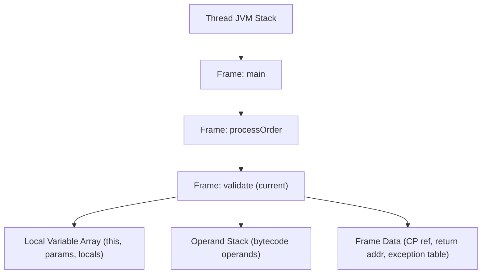
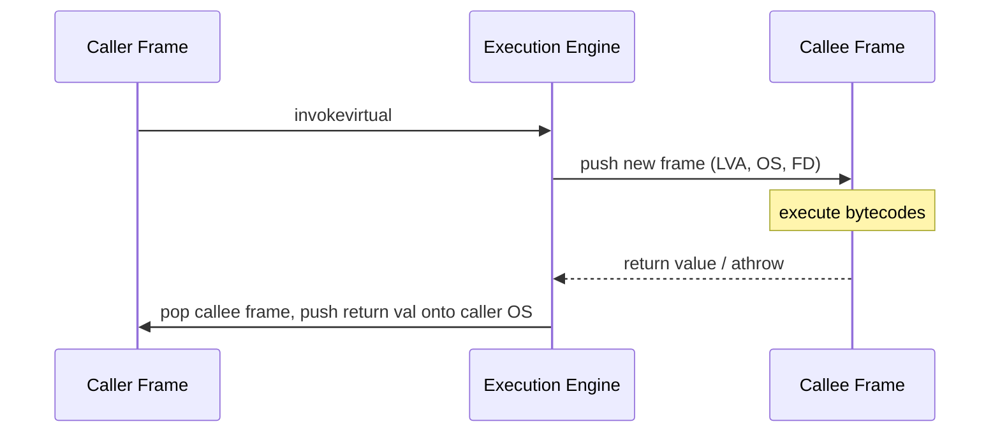
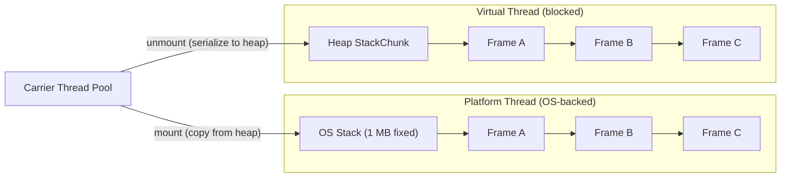

<!-- tldr -->
# Stack Frames

Every method call on the JVM allocates a **stack frame** on the calling thread's private JVM stack. The frame contains all state for one method activation: a fixed-size local variable array, a bounded operand stack, and metadata linking execution back to the runtime constant pool. When the method returns—normally or via exception—the frame is discarded and the caller's frame resumes.



<!-- standard -->

## What It Is

A stack frame (JVM spec §2.6) is the per-invocation activation record. Three sub-structures live inside every frame:

- **Local Variable Array (LVA)** — Zero-indexed array of 32-bit slots. For instance methods, slot 0 holds `this`; for static methods, slot 0 holds the first parameter. `long` and `double` each consume two consecutive slots. The maximum slot index (`max_locals`) is a compile-time constant emitted into the `Code` attribute.
- **Operand Stack** — The JVM is a pure stack machine; all computation moves values through this stack. Maximum depth (`max_stack`) is also a compile-time constant, so the interpreter needs no bounds checks at runtime.
- **Frame Data** — A reference to the current class's runtime constant pool (for symbolic resolution), a pointer to the exception table, and normal/abrupt-completion bookkeeping.

## Why It Matters

- **Thread-local, GC-free allocation** — The JVM stack is off-heap and never garbage-collected; frame allocation is pointer-bump O(1).
- **Hard size ceiling** — Default `-Xss` is 512 KB–1 MB. At 200–2,000 bytes per frame, recursion deeper than ~500–8,000 levels throws `StackOverflowError`.
- **JIT inlining erases frames** — Once a hot method is inlined, its frame disappears at native code level, impacting stack traces and escape analysis.

## Primary Techniques

| Concern | Approach |
|---|---|
| Unbounded recursion | Convert to iteration or trampoline |
| Inspecting frames at runtime | `StackWalker` API (Java 9+) — lazy, safepoint-free |
| Large per-frame footprint | Reduce `max_locals` by shrinking local variable scope |
| SOE in production | Thread dump → repeating frame pattern → reduce `-Xss` or rewrite |

## Key Tradeoffs

- Increasing `-Xss` multiplies committed virtual memory by thread count — 4 MB × 10,000 threads = 40 GB of address space.
- Frames carry zero GC pressure but cannot be resized after thread creation.
- Virtual threads (Java 21+) serialize frame state onto the heap as `StackChunk` objects when blocked, removing the fixed-size constraint at the cost of GC involvement.



<!-- deep -->

## Bytecode-Level Anatomy

Javac emits `max_stack` and `max_locals` into the `Code` attribute. The class file verifier checks these at load time, eliminating per-instruction bounds checks during interpretation.

```
// int sum(int a, int b) { return a + b; }
Code: max_stack=2, max_locals=3
  0: iload_1       // push LV[1] (param a)
  1: iload_2       // push LV[2] (param b)
  2: iadd           // pop 2 values, push sum
  3: ireturn        // return top of OS
```

### Local Variable Array Slot Rules

| Method type | Slot 0 | Slot 1+ |
|---|---|---|
| Instance method | `this` | parameters, then other locals |
| Static method | param[0] | remaining params, then locals |
| `long` / `double` | occupies slots *n* and *n+1* | — |

**Common interview trap**: claiming `this` is always at slot 0. It is absent for `invokestatic` targets.

## Invoke Bytecodes and Frame Creation

| Bytecode | New frame pushed? | `this` in LV[0]? |
|---|---|---|
| `invokevirtual` | Yes | Yes |
| `invokespecial` | Yes | Yes (`<init>`, private, `super`) |
| `invokestatic` | Yes | **No** |
| `invokeinterface` | Yes | Yes |
| `invokedynamic` | Yes (bootstrap on first call) | Depends on lambda signature |

## JIT Compilation: Frame Elimination

After ~10,000 invocations (C2 default), the JIT inlines callees directly into the compiled caller. The callee's stack frame ceases to exist in native code. Cascading effects:

- **Stack traces** may skip inlined frames unless `-XX:+PreserveFramePointer` is set.
- **Escape analysis** can stack-allocate short-lived objects when the JIT can see the full frame lifetime — impossible without inlining.
- **Inlining limits**: `-XX:MaxInlineLevel=9` (call depth), `-XX:MaxInlineSize=35` (max bytecodes for automatic inlining). Override with `@ForceInline` (JDK internals) or profile-guided hints.

## Virtual Threads and Heap-Stored Continuations

Java 21 virtual threads (Project Loom) replace the fixed OS-stack model. When a virtual thread blocks on I/O or a lock, its live frames are marshalled into heap-allocated `StackChunk` objects and the carrier thread is released.



Key numbers:
- Initial continuation stack: ~1–4 KB
- Millions of virtual threads supported within normal heap budget
- Frame semantics are **identical** to platform threads; only the storage medium changes
- Pinned virtual threads (inside `synchronized` blocks or JNI) cannot unmount — monitor usage carefully

## Failure Modes

### StackOverflowError

- Triggered when the JVM cannot push a new frame (stack exhausted).
- `SOE` is a `java.lang.Error`; catching it is legal but dangerous — the stack is partially unwound and no invariants are guaranteed. **Do not resume business logic after catching SOE.**
- Diagnosis: `jstack <pid>` or `kill -3 <pid>`; look for a repeating method pattern in the thread dump.
- Fix hierarchy: (1) convert recursion to iteration, (2) use a trampoline / CPS transform, (3) increase `-Xss` as a last resort.

### Tail-Call Optimization — A Common Misconception

The JVM specification does **not** mandate TCO. A tail-recursive Java method will blow the stack at the same depth as any other recursive method. Workarounds:

- **Manual**: rewrite to loop.
- **Scala `@tailrec`**: compile-time rewrite to a loop; not a JVM feature.
- **Kotlin tail recursion (`tailrec`)**: same compile-time transform.
- **Trampoline**: return a thunk from each call; the outer loop drives execution without growing the stack.

### Native Frame Interleaving

JNI calls push native frames onto the same logical stack. `StackWalker` with `SHOW_HIDDEN_FRAMES` reveals them; standard `Thread.getStackTrace()` omits them. Mixed Java/native stacks are a common blind spot in profiling.

## Capacity and Latency Reference

| Metric | Value |
|---|---|
| Default `-Xss` (server JVM, 64-bit) | 1 MB |
| Approx. bytes per frame | 200 – 2,000 (scales with `max_locals` + `max_stack`) |
| Max recursive depth (default `-Xss`) | ~500 – 8,000 (inversely proportional to frame size) |
| `Thread.getStackTrace()` cost | 5–50 µs (global safepoint required) |
| `StackWalker` (lazy, 10 frames) | ~1–5 µs (no safepoint) |
| C2 inlining invocation threshold | 10,000 invocations |
| Virtual thread initial stack | ~1–4 KB on heap |

## Interview Pitfalls

1. **"JVM does TCO"** — False. The spec has no TCO obligation. Tail calls create full frames like any other call.
2. **Conflating the operand stack with the JVM stack** — The operand stack is a *sub-structure inside* a frame. The JVM stack holds frames.
3. **"Stack memory is garbage collected"** — No. The JVM stack is off-heap. Frames are reclaimed on `return` / `athrow`, not by GC.
4. **Ignoring `-Xss` × thread-count amplification** — A 2 MB bump with 5,000 threads reserves 10 GB of virtual address space.
5. **Assuming `Thread.getStackTrace()` is cheap** — It requires a safepoint; use `StackWalker` for any performance-sensitive stack inspection.
6. **Forgetting `long`/`double` dual-slot rule** — Off-by-one errors in agent bytecode instrumentation that walks LVA slots are notoriously hard to debug.

## When to Reach for This Knowledge

- **Diagnosing SOE in production**: measure frame size first (add `-verbose:class`, review bytecode) before blindly raising `-Xss`.
- **Allocation profiling**: understanding escape analysis scope helps explain why certain objects appear (or don't appear) in heap profilers.
- **Bytecode instrumentation / agents**: slot aliasing, `max_locals` recalculation, and frame map reconstruction are mandatory knowledge for ASM/Javassist work.
- **Virtual thread migration**: audit code for `synchronized`-heavy paths that pin VTs to their carrier; the stack frame model differs in blocking semantics.
- **Reviewing `-Xss` tuning PRs**: always surface the `threads × Xss` virtual memory cost before approving.