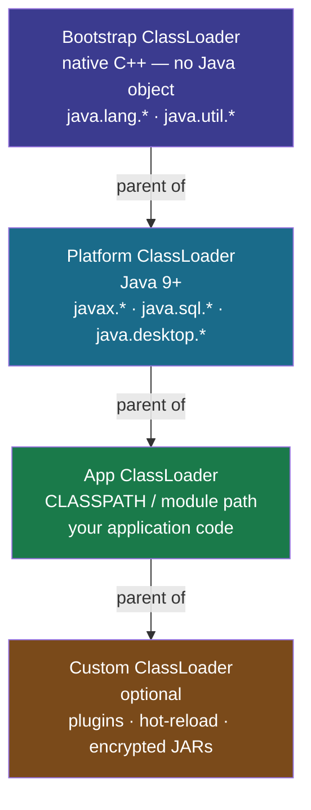
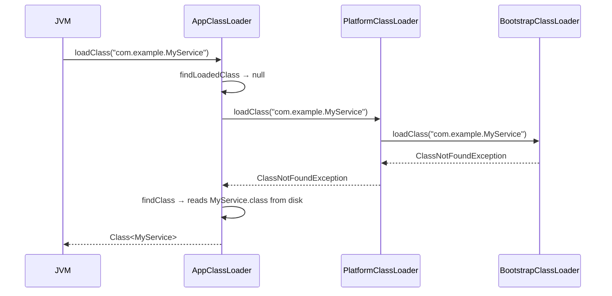
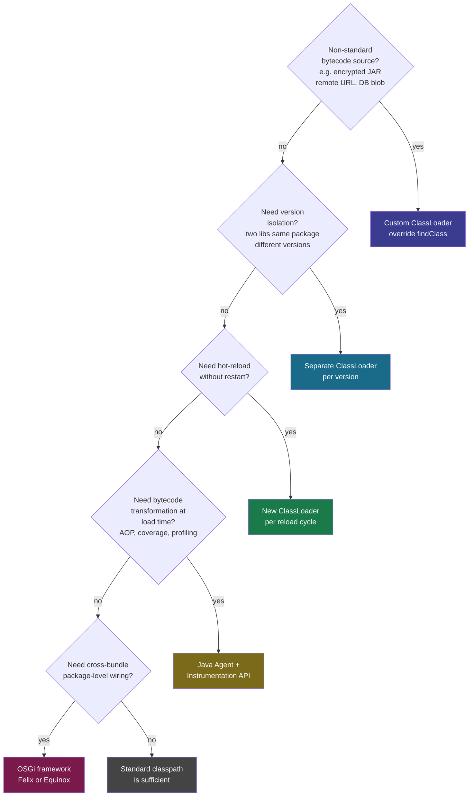

<!-- tldr -->
# JVM ClassLoader Subsystem

The ClassLoader subsystem is the JVM's only path for turning `.class` bytecode into live `java.lang.Class` objects. Three built-in loaders form a strict parent-child hierarchy; each delegates upward before searching its own classpath. Class identity is the tuple `(ClassLoader, binaryName)` — not just the name — which is the foundation of isolation in application servers, plugin systems, and OSGi containers.



<!-- standard -->

## What It Is

Every class passes through three lifecycle phases before your code can touch it:

- **Loading** — `findClass()` locates bytecode; `defineClass()` registers it in Metaspace as a `Class` object.
- **Linking** — *Verify* (structural bytecode checks), *Prepare* (zero-initialize static fields), *Resolve* (replace symbolic references with direct pointers).
- **Initialization** — Run `<clinit>` static initializers, superclass first. Triggered by `new Foo()`, `Foo.staticField`, `Foo.staticMethod()`, or `Class.forName()`.

Loading is **lazy**: a class is touched only on first reference, cutting startup time and Metaspace footprint.

## Why It Matters

| Concern | Mechanism |
|---|---|
| Security | Delegation prevents a rogue `java.lang.String` on the classpath from shadowing the real one |
| Library versioning | Tomcat gives each WAR its own loader; Guava 30 and Guava 32 coexist in the same JVM |
| Dynamic loading | OSGi, Spring DevTools, JRebel load/replace classes at runtime without restart |
| Type-system integrity | `(loaderA, Foo) ≠ (loaderB, Foo)` — the JVM never conflates two separately loaded copies |

## The Parent Delegation Algorithm

`ClassLoader.loadClass()` always follows this sequence:

1. Check the loaded-class cache (`findLoadedClass`). Return on hit.
2. Delegate to `parent.loadClass()`. If `parent == null`, call the native Bootstrap lookup.
3. If the parent throws `ClassNotFoundException`, call `findClass()` on *this* loader.
4. Optionally call `resolveClass()` to complete linking.

**Override `findClass()`, never `loadClass()`** — overriding `loadClass()` breaks the delegation invariant and is the single most common custom-classloader mistake.

## `Class.forName()` vs `ClassLoader.loadClass()`

| | `Class.forName(name)` | `loader.loadClass(name)` |
|---|---|---|
| Runs `<clinit>`? | **Yes** | **No** |
| Default loader | Caller's loader | Explicit |
| Primary use | JDBC driver registration | Custom / lazy loading |

JDBC depends on this: `Class.forName("com.mysql.cj.jdbc.Driver")` fires the static block that calls `DriverManager.registerDriver()`. Replacing it with `loadClass()` silently breaks JDBC.



<!-- deep -->

## Deep Dive: Algorithms, Real Systems & Failure Modes

### Loading → Linking → Initialization in Detail

```
Loading:
  findClass()     → locate bytecode (disk, JAR, network, generated)
  defineClass()   → JVM parses bytecode → Class object allocated in Metaspace

Linking:
  Verify          → stack depth, type safety, opcode validity (JVM Spec §4.9)
  Prepare         → static fields zero-initialized (int→0, Object→null, no user code runs)
  Resolve         → symbolic refs ("com/example/Foo") → direct method-table pointers

Initialization:
  <clinit>        → user static initializers, superclass first
  Triggered by:   new, getstatic, invokestatic, Class.forName(), first subclass init
  NOT triggered by: ClassLoader.loadClass(), array creation (new Foo[10]), reflection on class literal
```

### Writing a Correct Custom ClassLoader

```java
public class EncryptedJarLoader extends ClassLoader {

    private final Path jarPath;

    public EncryptedJarLoader(Path jarPath, ClassLoader parent) {
        super(parent); // ALWAYS pass parent — preserves delegation chain
        this.jarPath = jarPath;
    }

    @Override
    protected Class<?> findClass(String name) throws ClassNotFoundException {
        byte[] encrypted = readFromJar(name);  // your I/O logic
        byte[] bytecode  = decrypt(encrypted); // your decryption logic
        // defineClass() hands bytecode to the JVM verifier and creates Class object.
        // Never call it twice for the same name — JVM caches the result.
        return defineClass(name, bytecode, 0, bytecode.length);
    }
}

// Hot-reload pattern: each cycle = new loader instance
ClassLoader v1 = new EncryptedJarLoader(path, parent);
Class<?> cls1  = v1.loadClass("com.plugin.Handler");

// After file update on disk:
ClassLoader v2 = new EncryptedJarLoader(path, parent); // fresh loader
Class<?> cls2  = v2.loadClass("com.plugin.Handler");   // reads new bytecode
// cls1 and v1 stay alive until all live references are released and GC runs
```

### Real-World Systems

#### Tomcat / Application Servers
`WebappClassLoader` **inverts** delegation for web-app code: it searches `WEB-INF/classes` and `WEB-INF/lib` *before* the parent (except for `java.*`, `javax.servlet.*`, and Tomcat internals). Two deployed WARs can each carry a different Hibernate version in the same JVM with no conflict.

```
Bootstrap
  └── System (tomcat-internals only)
        └── Common (shared libs: JDBC drivers, etc.)
              ├── WebappClassLoader [app1]  ← searches WEB-INF first
              └── WebappClassLoader [app2]  ← independent namespace
```

#### OSGi (Equinox / Felix)
Every bundle gets its own `BundleClassLoader`. Package visibility is declared in `MANIFEST.MF` (`Export-Package`, `Import-Package` with version ranges). The OSGi framework wires loaders together at the *package* level rather than the bundle level — you can wire `com.foo.api [1.0,2.0)` to bundle A and `com.foo.api [2.0,3.0)` to bundle B simultaneously. This is intentional inversion of the flat classpath model.

#### Spring DevTools / JRebel
Spring DevTools creates a `RestartClassLoader` per restart cycle. On file change it discards the old loader and instantiates a new one to reload application classes. The base layer (Spring itself, dependencies) uses a separate "base" loader that is never discarded — keeping restart time under ~1 s.

JRebel instruments bytecode at load time with indirection stubs, allowing field/method signature changes without a full loader cycle. Cost: ~200 ms for a single class change vs. several seconds for a DevTools restart.

#### Java Agents (`-javaagent:`)
`Instrumentation.redefineClasses()` replaces bytecode for an **already-loaded** class *in place*, with no new ClassLoader. Hard JVM restriction: only method bodies may change; adding/removing fields or methods requires `retransformClasses()` with a cooperating agent, or a full restart.

### The Class Identity Problem

```java
ClassLoader loaderA = new FileSystemClassLoader(pathA, parent);
ClassLoader loaderB = new FileSystemClassLoader(pathB, parent);

Class<?> a = loaderA.loadClass("com.example.Service");
Class<?> b = loaderB.loadClass("com.example.Service");

System.out.println(a == b);      // false  — different Class objects
System.out.println(a.equals(b)); // false  — identity comparison

Object obj = a.getDeclaredConstructor().newInstance();
com.example.Service s = (com.example.Service) obj; // ClassCastException!
// The cast uses AppClassLoader's Service; obj was made from loaderA's Service.
```

**Fix**: put the shared `Service` *interface* in a common parent loader. Each child loader provides its own implementation, but they communicate only through the interface type that both sides inherited from the same loader.

### Failure Mode Reference

| Error | Root Cause | Diagnosis & Fix |
|---|---|---|
| `ClassNotFoundException` | Class absent from classpath / module path at runtime | `java -verbose:class` to trace lookups; check `module-info` exports |
| `NoClassDefFoundError` | Present at compile time, missing at runtime (packaging bug) | `mvn dependency:tree`; `jar tf app.jar \| grep ClassName` |
| `ClassCastException` (same name) | Two loaders each loaded the class; their types are incompatible | Promote shared interface to parent loader; use reflection across boundary |
| `LinkageError: loader constraint violated` | Same class loaded by two loaders, both visible in one resolve chain | Restructure so only one loader owns each class |
| Metaspace leak (OOM) | ClassLoader not GC'd due to `ThreadLocal`, static field, or live instance reference | `jmap -clstats <pid>`; OQL: `select cl from java.lang.ClassLoader cl` |

A `ClassLoader` is GC-eligible **only** when: all instances of its classes are unreachable, no `Class` object references remain, and no thread holds a reference (the classic `ThreadLocal` leak in container thread pools).

### Capacity & Latency Numbers

| Operation | Typical cost |
|---|---|
| `findLoadedClass()` cache hit | ~10 ns (ConcurrentHashMap lookup) |
| Full delegation + SSD read (first load) | 1–5 ms |
| `defineClass()` + bytecode verification | 50–500 µs per class |
| Metaspace per loaded class | 1–8 KB metadata + bytecode |
| Spring DevTools restart cycle | ~1–3 s (base layer preserved) |
| JRebel single-class hot-swap | ~200 ms |
| Tomcat WAR undeploy (GC of old loader) | 2–20 s depending on reference cleanup |
| OSGi bundle install + wire | ~50–500 ms per bundle |

### Interview Pitfalls

1. **"Override `loadClass()` to customise loading."** Wrong. Override `findClass()`. Overriding `loadClass()` breaks delegation — the most common custom-loader bug.
2. **"Same class name means same type."** Wrong. Type identity is `(ClassLoader, binaryName)`. Interviewers love the `ClassCastException` trap.
3. **"Bootstrap returns a ClassLoader object."** Wrong. It returns `null`. Always null-check: `cl == null ? "bootstrap" : cl.getName()`.
4. **"`Class.forName()` and `loadClass()` are interchangeable."** Wrong. `Class.forName()` initialises; `loadClass()` does not. Critical for JDBC driver registration.
5. **"Hot-reload modifies the existing `Class` object."** Wrong (without agents). Standard hot-reload creates a new `ClassLoader` and a new `Class` object; the old one survives until GC.
6. **"Bootstrap loads everything in `java.*`."** Mostly true pre-Java 9. Post-Java 9, Bootstrap loads only `java.base`; Platform covers the remaining standard-library modules.

### Decision Rubric: When to Reach for a Custom ClassLoader

