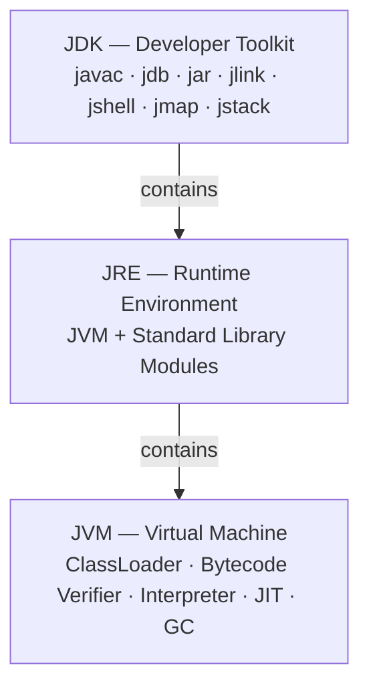
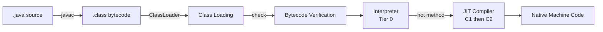

<!-- tldr -->
# JDK vs JRE vs JVM

Three nested components, one containment rule: **JDK ⊃ JRE ⊃ JVM**. The JVM is the bytecode execution engine defined by a specification with multiple vendor implementations; the JRE wraps it with standard library modules; the JDK adds the compiler and full developer toolchain. Since Java 11, the standalone JRE download no longer exists—you install the JDK and use `jlink` to compose a minimal custom runtime for distribution.



<!-- standard -->

## What It Is

The **JVM (Java Virtual Machine)** is an abstract computing engine specified, not shipped, by a single vendor. It loads `.class` bytecode, verifies type safety, and executes it—starting interpreted, then JIT-compiled to native code after ~10,000 hot invocations. Multiple conformant implementations exist: HotSpot, OpenJ9, GraalVM, Azul Zing.

The **JRE (Java Runtime Environment)** is the JVM plus the Java standard library modules (`java.base`, `java.util`, `java.io`, `java.net`, etc.)—the minimal environment needed to _run_ compiled Java applications. No compiler. No debugger.

The **JDK (Java Development Kit)** is the JRE plus the full developer toolchain: `javac`, `jdb`, `jar`, `jlink`, `jshell`, `jmap`, `jstack`, `javadoc`, and diagnostic GUIs like `jconsole`.

## Why It Matters

- **Deployment sizing**: A `jlink`-trimmed runtime is ~50 MB; a full JDK image is ~300 MB. Smaller images mean faster pulls, less attack surface, lower egress cost.
- **JVM selection**: Switching HotSpot to OpenJ9 cuts container memory 40–50% at idle with no code changes.
- **Bytecode portability**: One `.class` file runs unchanged on Linux x86-64, Windows, macOS, and ARM. The JVM on each platform handles native translation at runtime.

## Key JDK Tools

| Tool | Purpose |
|------|---------|
| `javac` | Compiles `.java` → platform-independent `.class` bytecode |
| `jlink` | Composes a minimal custom JRE from selected modules (Java 9+) |
| `jshell` | Interactive Java REPL for rapid experimentation (Java 9+) |
| `javap -c` | Disassembles `.class` → bytecode listing; used for perf audits |
| `jmap` | Heap statistics and heap dump for memory-leak diagnosis |
| `jstack` | Thread dump of all JVM threads; primary deadlock diagnostic |

## JVM Implementations

| JVM | Vendor | Strength | Primary Use Case |
|-----|--------|----------|-----------------|
| HotSpot | Oracle / OpenJDK | Peak throughput; C2 JIT | Most production servers |
| OpenJ9 | Eclipse / IBM | −40% memory; fast startup | Containerized microservices |
| GraalVM CE | Oracle | Polyglot; Native Image AOT | Serverless, CLI tools |
| Azul Zing | Azul | Pauseless GC (C4) | HFT, real-time systems |
| Android ART | Google | AOT+JIT hybrid; DEX format | Android only |

## Compilation and Execution Lifecycle



<!-- deep -->

## Deep Dive: JDK vs JRE vs JVM

### The Bytecode Contract

`javac` does not produce machine code. It produces **bytecode**—a stack-based instruction set whose opcodes reference a symbolic constant pool, not physical memory addresses or OS system calls.

```bash
javap -c HelloWorld.class
# public static void main(java.lang.String[]);
# Code:
#   0: getstatic     #7   // Field System.out
#   3: ldc           #13  // String "Hello, World!"
#   5: invokevirtual #15  // Method PrintStream.println
#   8: return
```

`getstatic`, `ldc`, `invokevirtual`—no register names, no OS calls. The JVM on each target platform resolves these abstract opcodes to native instructions at runtime. This indirection _is_ platform independence.

### Tiered Compilation in HotSpot

HotSpot uses five compilation tiers, progressively increasing optimization cost and output quality:

| Tier | Mode | Approximate Trigger |
|------|------|---------------------|
| 0 | Interpreter | All code begins here |
| 1 | C1 — no profiling | ~200 invocations |
| 2 | C1 — limited profiling | ~200 invocations |
| 3 | C1 — full profiling | ~200 invocations |
| 4 | C2 — aggressive JIT | ~10,000–15,000 invocations |

Relevant JVM flags:
```
-XX:Tier3InvocationThreshold=200   # default
-XX:Tier4InvocationThreshold=5000  # default
-XX:CompileThreshold=10000         # legacy non-tiered mode
```

C2 applies inlining, escape analysis, loop unrolling, and auto-vectorization. A tight loop running at Tier 4 can be 10–100× faster than at Tier 0. This is why JVM warm-up time matters—P99 latency routinely drops 50–90% once C2 kicks in.

### Full Execution Sequence

```mermaid
sequenceDiagram
    participant OS as OS / Shell
    participant JVM as JVM Process
    participant BCL as Bootstrap ClassLoader
    participant ACL as App ClassLoader
    participant VER as Bytecode Verifier
    participant ENG as Execution Engine
    OS->>JVM: java HelloWorld
    JVM->>BCL: load java.lang.Object, java.lang.System
    JVM->>ACL: load HelloWorld.class from classpath
    ACL->>VER: verify type safety, valid branches, stack bounds
    VER->>ENG: bytecode cleared
    ENG->>ENG: interpret main(); profile invocation counts
    ENG->>ENG: C1 compile hot methods; collect feedback
    ENG->>ENG: C2 compile hottest methods to optimized native
    ENG->>OS: exit(0); shutdown hooks run; GC finalizes
```

### Real-World Systems and JVM Choices

**Apache Kafka**: HotSpot. Brokers are long-lived, high-throughput processes where C2's peak throughput compounds across millions of message serializations per second. GC tuning (`-XX:+UseG1GC -XX:MaxGCPauseMillis=20`) is standard at 1M+ msg/sec.

**Elasticsearch**: HotSpot. Heap must be pinned (`-Xms` = `-Xmx`) to prevent resizing pauses. Critical rule: keep heap ≤ 26 GB to stay within compressed OOP range. Exceeding 32 GB disables compressed OOPs, increasing pointer sizes from 4 bytes to 8 bytes and degrading cache efficiency.

**Spring Boot on Kubernetes**: OpenJ9 or GraalVM Native Image. OpenJ9 reduces RSS 40–50% vs. HotSpot at idle, directly cutting per-pod cost. GraalVM Native Image achieves sub-10ms startup (vs. 2–5s HotSpot cold start) for serverless workloads at the cost of fixed AOT optimization—no runtime recompilation.

**High-Frequency Trading**: Azul Zing. HotSpot's G1/ZGC still produces occasional 1–5ms pause spikes. Zing's C4 (Continuously Concurrent Compacting Collector) delivers P99.99 GC pauses < 1ms at 100 GB heaps—a hard requirement when a 1ms delay costs thousands of dollars.

**Android**: ART, not JVM. Build chain: `javac` → `.class` → `d8` → `.dex`. ART AOT-compiles at install time (Android 5+). You cannot run an arbitrary `.jar` directly on Android; the binary format is incompatible.

### Java 9+ Module System and `jlink`

Pre-Java 9: `rt.jar` contained 4,200+ classes (~60 MB), always fully loaded regardless of what your app used.

Post-Java 9: ~100 named modules with explicit `requires`/`exports`. Use `jdeps` to discover which modules your app actually needs, then compose a minimal runtime:

```bash
jdeps --print-module-deps --ignore-missing-deps myapp.jar
# Output: java.base,java.logging,java.sql

jlink \
  --module-path $JAVA_HOME/jmods \
  --add-modules java.base,java.logging,java.sql \
  --output ./custom-jre \
  --compress=2 \
  --strip-debug \
  --no-header-files

# Result: ~32 MB runtime vs. 220 MB eclipse-temurin:21-jre base image
```

Docker image size comparison:
- `eclipse-temurin:21-jre` ≈ 220 MB
- `jlink` custom runtime in `scratch` ≈ 45–80 MB
- GraalVM Native Image in `distroless` ≈ 20–50 MB

### Failure Modes and Diagnostics

| Symptom | Layer | Diagnostic Tool |
|---------|-------|----------------|
| `ClassNotFoundException` | ClassLoader (JVM) | `-verbose:class`, `jstack` |
| `OutOfMemoryError: Java heap space` | JVM heap | `jmap -dump:format=b`, heap profiler |
| `OutOfMemoryError: Metaspace` | JVM metaspace | `-XX:MaxMetaspaceSize`, `jconsole` |
| GC pause P99 > 100ms | GC subsystem | GC logs (`-Xlog:gc*`), `jstat -gcutil` |
| Thread deadlock | JVM thread scheduler | `jstack <pid>` — look for `BLOCKED` + cycle |
| Cold-start latency > 5s | JIT warm-up | CDS (`-Xshare:on`), AOT (GraalVM Native Image) |
| Heap grows unbounded | Memory leak | `jmap -histo`, Eclipse MAT against heap dump |

### Capacity and Latency Numbers

- **JVM startup**: HotSpot ≈ 500ms–3s cold; GraalVM Native Image ≈ 5–50ms.
- **JIT break-even**: C2 optimization kicks in at ~10,000 invocations; expect P99 to improve 50–90% post-warmup.
- **Object header overhead**: 12–16 bytes per object; 16 bytes per array header. A `HashMap.Entry` is 32+ bytes. Budget 2–3× raw data size for heap.
- **Compressed OOPs threshold**: Heap < 32 GB → 4-byte object references; heap ≥ 32 GB → 8-byte. Staying under 32 GB effectively doubles object density per cache line.
- **GC pause targets**: Serial GC: unbounded (proportional to live heap); G1: configurable target ≤ 200ms; ZGC / Shenandoah: P99 < 1ms at multi-TB heaps; Azul C4: P99.99 < 1ms at 100 GB.

### Interview Pitfalls

1. **"JVM = Java"** — Wrong. Kotlin, Scala, Clojure, Groovy all compile to `.class` bytecode and run on any JVM. The JVM spec never mentions Java the language.
2. **"Android uses the JVM"** — Wrong. Android ART runs `.dex` format, not `.class`. The binary formats are incompatible; you cannot `scp` a `.jar` to Android and execute it.
3. **"JRE is still a separate download"** — Not since Java 11. Use `jlink` to build a trimmed runtime; the monolithic JRE installer is gone.
4. **"JIT compiles all code"** — Wrong. Only hot methods (above invocation threshold) get compiled. Cold paths remain interpreted indefinitely.
5. **"Bytecode is platform-specific"** — The exact opposite. Bytecode is the _abstract_ portable layer; platform-specific code is produced by the JIT at runtime on the target machine.
6. **Packages vs. modules** — `java.util` is a _package_ (exists since Java 1.0); `java.base` is a _module_ (Java 9+). Modules are a higher-level abstraction grouping packages with explicit dependency declarations and encapsulation boundaries. Don't conflate them.

### Decision Rubric: Which Layer and Which JVM

| Scenario | Recommendation |
|----------|---------------|
| Local development or CI compilation | Full JDK (any vendor) |
| Production Docker image (any app) | `jlink`-trimmed JRE; run `jdeps` first |
| Kubernetes pods with tight memory limits (< 512 MB) | OpenJ9 over HotSpot |
| Serverless / CLI with cold-start SLA < 100ms | GraalVM Native Image |
| Long-lived server with heavy frameworks (Spring, Hibernate) | HotSpot; frameworks rely on reflection and dynamic proxies that AOT handles poorly |
| Real-time / HFT with GC pause SLA < 1ms | Azul Zing with C4 GC |
| Polyglot runtime (JS + Python + Java in one process) | GraalVM CE with Truffle |
| Android app | ART — no choice; `.dex` is mandatory |