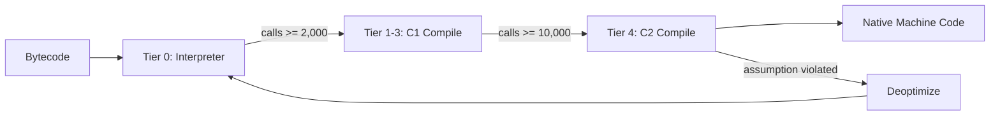
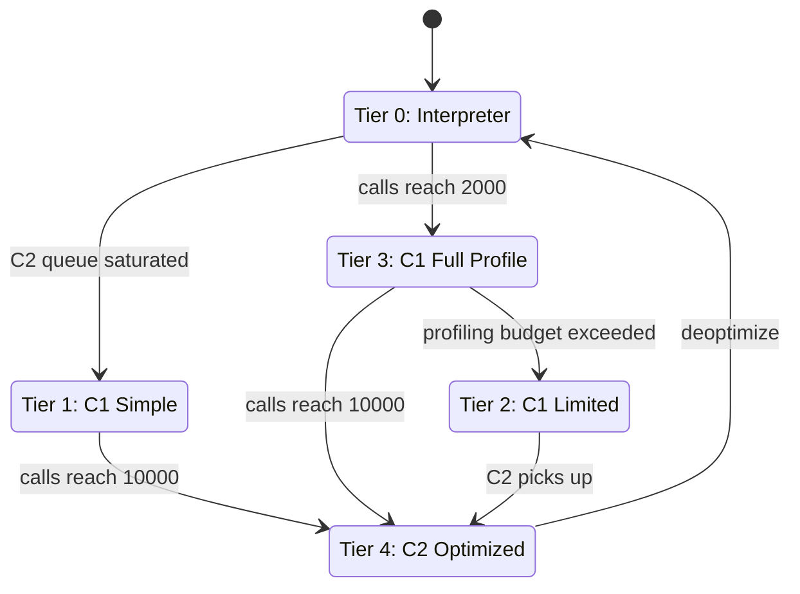
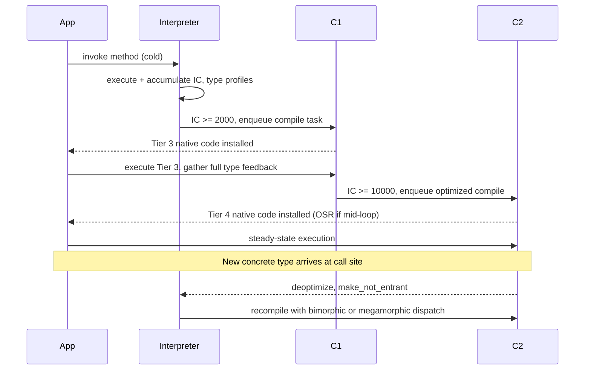

<!-- tldr -->
# JIT Compiler

The JVM starts every method interpreted; as invocation counts cross profiling thresholds, HotSpot's tiered compilation pipeline promotes code from Tier 0 (interpreter) through C1 (fast, instrumented compile) to C2 (aggressive, optimized compile). Runtime profiling gives the JIT information static compilers never have — concrete receiver types, branch bias, and actual call frequencies — enabling optimizations that match or beat ahead-of-time C++ at steady-state throughput while still loading in milliseconds.



<!-- standard -->

## What It Is

The JIT compiler detects **hot** methods — those crossing invocation-count or back-edge-count thresholds — and compiles their bytecode to native machine code at runtime. Unlike `javac`, the JIT operates on live profiling data, not source text, letting it specialize code for the types and branches actually observed. A 1-billion-iteration loop that takes ~30 s interpreted runs in ~0.3 s after C2 compilation (~100× speedup).

## Why It Matters

- **Startup/throughput split**: Interpreted startup < 50 ms; C2-compiled peak throughput dominates in long-running services (Kafka brokers, Cassandra nodes, Elasticsearch shards).
- **Speculative optimization**: The JIT bets that past behavior repeats. Monomorphic call sites, predictable branches, and tight loops yield the biggest gains.
- **GC pressure**: Escape analysis + stack allocation can eliminate millions of short-lived heap allocations per second, reducing GC pause frequency.

## Primary Techniques

| Optimization | What It Does | What It Unlocks |
|---|---|---|
| **Method Inlining** | Copies callee body into call site | Constant folding, escape analysis across boundaries |
| **Escape Analysis** | Identifies non-escaping objects | Stack allocation, scalar replacement, lock elision |
| **Devirtualization** | Replaces `invokevirtual` with direct call | Inlining of polymorphic dispatch |
| **Loop Unrolling** | Replicates loop body N× per cycle | Reduced branch overhead; enables vectorization |
| **Vectorization** | Emits SIMD (SSE/AVX) instructions | 4–8× throughput on independent array loops |
| **Dead Code Elimination** | Removes provably-unreachable branches | Smaller code footprint, fewer mispredictions |

## Inlining Budget

The inliner is the force-multiplier for every other optimization. Methods ≤ 35 bytecodes (`-XX:MaxInlineSize=35`) are always inlined; hot methods up to 325 bytecodes (`-XX:FreqInlineSize=325`) are eligible. Once inlined, constant folding and escape analysis apply across formerly-opaque call boundaries — `toString() → StringBuilder.append() → System.arraycopy()` can collapse to a single `memcpy`.

## Tier Transition State Machine



## Key Trade-offs

- **Compilation latency vs. code quality**: C1 compiles in ~10–100 µs (moderate opts); C2 takes ~1–10 ms but generates near-optimal native code.
- **Speculation vs. safety**: More aggressive assumptions → better throughput but higher deoptimization cost when violated.
- **Code cache pressure**: Default 240 MB cache (`-XX:ReservedCodeCacheSize`); exhaustion silently reverts compiled methods to interpreted — a common production mystery.

<!-- deep -->

## Deep Dive: JIT Compiler Internals

### Tiered Compilation: Exact Thresholds and Fast Paths

HotSpot tracks two counters per method: **IC** (invocation count) and **BEC** (back-edge count, i.e., loop iterations). The normal promotion path is **T0 → T3 → T4**; shortcuts exist when compiler queues are full:

| Tier | Compiler | Threshold | Overhead | Purpose |
|---|---|---|---|---|
| 0 | Interpreter | Always | High | Collect IC/BEC + type profiles |
| 1 | C1 | IC ~2,000 | None | No profiling; fast native code |
| 2 | C1 | — | Low | IC + BEC only |
| 3 | C1 | IC ~2,000 | Medium | Full profile: types, branch data |
| 4 | C2 | IC ~10,000–15,000 | None | Inlining, EA, unrolling, SIMD |

When C2's compile queue fills (common during application warmup bursts), the JVM short-circuits to T0 → T1, ensuring code runs compiled sooner at the cost of missing the profiling data C2 would prefer. C2 re-profiles from T1 instrumentation if needed.

### On-Stack Replacement (OSR)

Without OSR, a method stuck in a long-running loop would remain interpreted even after the JIT compiled it — the compiled version only takes effect on the *next* invocation. OSR patches the loop's **back-edge** to transfer control to the compiled version mid-execution, mapping interpreter locals to compiled frame slots. Visible in `-XX:+PrintCompilation` output:

```
204  3%  4  com.example.HotLoop::run @ 15 (134 bytes)
         ^-- % = OSR; @ 15 = bytecode offset of back-edge that triggered it
```

OSR is essential for benchmarks that do all work in `main()` and for batch-processing jobs that never exit a top-level loop.

### Method Inlining: Algorithms and Size Limits

The inliner performs a depth-first traversal of the call graph starting from each C2-compiled root, subject to:

| Flag | Default | Effect |
|---|---|---|
| `-XX:MaxInlineSize` | 35 bytes | Always inline if ≤ this size |
| `-XX:FreqInlineSize` | 325 bytes | Inline hot methods up to this size |
| `-XX:MaxInlineLevel` | 9 | Maximum call-chain depth |
| `-XX:InlineSmallCode` | 1,000 bytes | Native code size limit for re-inlining |

The compounding effect matters: once `Deque.offer()` inlines `ArrayDeque.addLast()` which inlines an array bounds check, the entire sequence becomes a branchless write with loop-invariant bounds hoisted out.

**Keep hot methods small.** A method that exceeds `MaxInlineSize` by even one bytecode will never be inlined at a call site — a logging statement or defensive null-check added late in a release can silently break inlining.

### Escape Analysis: Three Escape States

| State | Allocation | Locks |
|---|---|---|
| **No escape** (method-local) | Stack or scalar replacement | Elided entirely |
| **Argument escape** (passed to callee) | Heap | Elided if single-thread provable |
| **Global escape** (stored in field / returned / threaded) | Heap | Respected |

**Scalar replacement** is the strongest form of no-escape: `new Point(x, y)` becomes two `int` registers; the object is never materialized. Confirm it's firing:

```bash
java -XX:+UnlockDiagnosticVMOptions \
     -XX:+PrintEscapeAnalysis \
     -XX:+PrintEliminateAllocations \
     MyClass
```

Escape analysis is gated on inlining success. If the constructor of `Point` exceeds the inlining budget, the JIT cannot prove escape state and falls back to heap allocation.

### Deoptimization: Failure Modes and Triggers

| Reason | Root Cause | Action |
|---|---|---|
| `class_check` | New type at a monomorphic call site | `make_not_entrant`; recompile bimorphic |
| `null_check` | Unexpected null where non-null assumed | Recompile with null guard |
| `range_check` | Array index outside profiled range | Add explicit bounds check |
| `unreached` | Code proven dead at compile time executed | Full method deopt |
| `unstable_if` | Branch taken opposite to profile | Recompile with balanced probabilities |

**Deopt storm**: the most damaging pattern. When a polymorphic call site sees >2 concrete types, the JIT compiles bimorphic dispatch; beyond ~5 types it gives up on devirtualization entirely (**megamorphic** dispatch — vtable lookup, no inlining). Framework-heavy code is the usual culprit: Spring AOP CGLIB proxies, Hibernate lazy-load proxies, and Mockito mocks injected into hot paths all introduce extra concrete types that defeat the inliner and devirtualizer simultaneously.

### JIT Compilation Pipeline: Sequence View



### Real-World Systems

**Apache Kafka (broker)**: The write path's tight `ByteBuffer` manipulation in `LogSegment.append()` is a primary C2 target. Vectorized `System.arraycopy` calls and inlined CRC32 computation. Operators see 40–60% throughput degradation before warmup (~60–120 s) vs. steady state. Recommended: `-XX:ReservedCodeCacheSize=512m` on brokers with many active partitions.

**Apache Cassandra**: Compaction and `MemTable` row-iteration loops are the hottest JIT targets. Escape analysis eliminates `DecoratedKey` and `ColumnDefinition` wrapper allocations in read paths, measurably reducing GC pause rates. Operators tune `-XX:ReservedCodeCacheSize=512m` — code cache exhaustion has caused silent throughput cliffs in multi-tenant deployments.

**Elasticsearch / Lucene**: `LeafCollector.collect()` is the canonical Lucene inner-loop. ES benchmarks consistently show 40–60% throughput gap between cold and warm JVM. Elasticsearch 8.x ships startup scripts that pre-warm the JVM by running scoring loops before accepting traffic.

**GraalVM JIT (Graal Compiler)**: Replaces C2 with a Java-written IR compiler (sea-of-nodes graph). Advantages: partial escape analysis (object allocation eliminated even if it escapes *some* paths), better speculative inlining via `Assumption` objects, and more aggressive loop transformations. Graal is the JIT in GraalVM Enterprise and also the AOT backend for `native-image`.

**Azul Zing / Zulu Prime**: ReadyNow! persists JIT compilation profiles (types, call frequencies) to disk across JVM restarts, eliminating warmup entirely. Used in latency-sensitive trading systems where cold-start P99 > 50 ms is unacceptable.

**Android ART**: Hybrid model since Android N — AOT compile on install for startup-critical paths; profile-guided JIT at runtime fills the rest. JIT profiles are flushed to disk and fed back to `dex2oat` on idle, progressively eliminating JIT overhead over a device's lifetime.

### Capacity and Latency Numbers

| Metric | Value |
|---|---|
| Interpreter overhead per bytecode | ~3–5 ns |
| 1B-iteration loop (interpreted, `-Xint`) | ~30 s |
| Same loop after C2 compile | ~0.3 s (100×) |
| C1 compile latency | ~10–100 µs |
| C2 compile latency | ~1–10 ms |
| Default code cache | 240 MB (JDK 8+) |
| Code cache for large apps | 512 MB – 1 GB recommended |
| Default `MaxInlineSize` | 35 bytecodes |
| Default `FreqInlineSize` | 325 bytecodes |
| Typical microservice warmup | 30 s – 5 min |
| Megamorphic threshold | ~5+ concrete types at one call site |

### Interview Pitfalls

1. **Benchmarking before warmup**: `System.nanoTime()` wrapping first-call code measures interpreter + compilation latency, not peak throughput. Use JMH with `@Warmup(iterations = 5, time = 2)`.

2. **"Java is slow"**: True for cold code; false for warmed JIT. C2-compiled numeric inner loops frequently match `gcc -O2` output and outperform it when the JIT's type specialization eliminates branches the static compiler must conservatively keep.

3. **Conflating `-client`/`-server` with tiered compilation**: Pre-JDK 8, `-client` used only C1 and `-server` only C2. Since JDK 8, tiered compilation (`-XX:+TieredCompilation`, on by default) uses both compilers regardless of those legacy flags.

4. **Assuming escape analysis fires unconditionally**: EA requires successful inlining of the allocation site's constructor. A constructor exceeding `MaxInlineSize` blocks EA entirely — the allocation stays on the heap even if the reference is logically method-local.

5. **Ignoring code cache exhaustion**: When `ReservedCodeCacheSize` fills, the JIT stops compiling new methods and may evict old ones. Symptom: steady-state throughput drops suddenly after hours of normal operation. Diagnose with `-XX:+PrintCodeCache` or monitor `java.lang:type=Compilation` MXBean.

6. **Megamorphic hot paths via frameworks**: Spring AOP CGLIB proxies, Hibernate entity proxies, and Mockito mocks create extra concrete types at call sites. If these flow through tight loops, devirtualization and inlining both fail silently — the only evidence is lower-than-expected throughput and a `-XX:+PrintInlining` log showing `failed_to_inline` at the suspected call site.

### When to Reach for JIT Tuning

| Scenario | Recommended Action |
|---|---|
| Default long-running service | Leave tiered compilation on; set `-XX:ReservedCodeCacheSize=512m` |
| Cold-start matters (serverless, CLI) | GraalVM `native-image` (AOT) or `-XX:TieredStopAtLevel=1` |
| High allocation rate / GC pressure | Audit hot paths for escape analysis failures; `-XX:+PrintEliminateAllocations` |
| Throughput plateau post-warmup | Check code cache saturation; increase `ReservedCodeCacheSize` |
| Deopt storm / `make_not_entrant` in logs | Specialize hot-path types; avoid proxies/mocks in inner loops |
| Need warmup across restarts | Azul ReadyNow!, AppCDS (`-XX:+UseAppCDS`), or CDS archives |
| Debugging JIT decisions | `-XX:+PrintCompilation -XX:+PrintInlining -XX:+PrintEscapeAnalysis` |