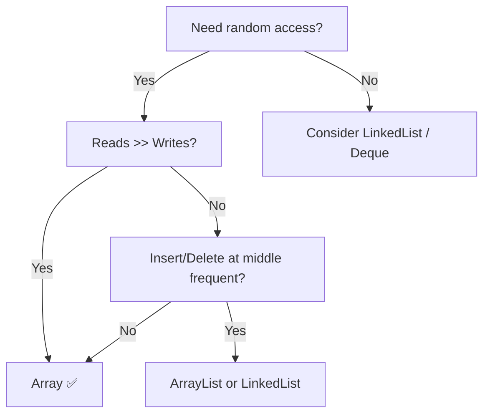

<!-- tldr -->
# Arrays

A Java array is a contiguous, fixed-length sequence of elements sharing a single type, allocated on the heap. Its defining trait is **O(1) indexed access** via direct pointer arithmetic: `base_address + index * element_size`. Every other data structure — ArrayList, HashMap, heap — has an array somewhere underneath it. Knowing when an array's constraints are an asset (cache locality, predictable layout) versus a liability (fixed capacity, costly inserts) is a senior-level judgement call interviewers probe constantly.

```mermaid
flowchart LR
    subgraph Heap["JVM Heap"]
        direction LR
        H["Header\n(type, length)"] --> E0["[0]\n42"] --> E1["[1]\n17"] --> E2["[2]\n99"] --> E3["[3]\n5"]
    end
    REF["arr (stack ref)"] -->|"base ptr"| H
    CALC["arr[2] → base + 2×4 bytes"] -.->|O(1)| E2
```

<!-- standard -->

## What It Is

`int[] a = new int[n]` allocates a single heap block of `n * 4` bytes (for `int`). Java arrays are **objects**: they carry a 16-byte header (mark word + class pointer + length). Primitive arrays are not boxed — `int[]` stores raw ints, not `Integer` references, making them memory- and cache-efficient.

## Why It Matters

- **Cache locality**: sequential access = hardware prefetcher's best friend. A tight loop over `int[10_000]` can outperform a linked list of the same length by 5–10× in microbenchmarks purely due to cache-line utilisation (64-byte lines, 16 ints per line).
- **Index arithmetic**: the basis of binary search, two-pointer, sliding-window, and most DP solutions.
- **Interop**: `System.arraycopy` (native intrinsic), `Arrays.sort` (dual-pivot quicksort for primitives), `Arrays.copyOfRange` — all operate directly on array memory.

## Primary Techniques

| Technique | Time | Space | When |
|---|---|---|---|
| Two Pointers | O(n) | O(1) | Sorted array, pair/partition problems |
| Sliding Window | O(n) | O(1) | Subarray/substring with constraint |
| Prefix Sum | O(n) pre / O(1) query | O(n) | Range sum, subarray sum queries |
| Binary Search | O(log n) | O(1) | Sorted or monotonic array |
| Kadane's Algorithm | O(n) | O(1) | Maximum subarray |
| Dutch National Flag | O(n) | O(1) | 3-way partition (0/1/2 sort) |

## Key Tradeoffs

- **Fixed capacity**: you must know max size upfront or resize (copy) — O(n) amortised with doubling.
- **Insert/delete at arbitrary index**: O(n) shift; use a linked structure if this is frequent.
- **Multidimensional arrays in Java**: `int[][]` is an array of references to row arrays — rows are **not** contiguous. For true 2-D locality, flatten to a 1-D array: `a[r * cols + c]`.



<!-- deep -->

## Deep Dive: Arrays in Production & Interviews

### Memory Layout & JVM Specifics

For a `long[]` of size `n`:
```
heap bytes = 16 (header) + n * 8
```
On a 64-bit JVM with compressed oops, an `Object[]` element is 4 bytes (compressed reference), so `Object[1_000_000]` ≈ 4 MB before counting the objects themselves.

**False sharing**: two threads writing to elements on the same 64-byte cache line (e.g., `a[0]` and `a[1]` in a `long[]`) thrash the cache. Pad or stripe by 8 elements to avoid in concurrent scenarios.

### `Arrays.sort` Internals

- **Primitive arrays** (`int[]`, `long[]`, etc.): **dual-pivot quicksort** (Yaroslavskiy–Bentley–Bloch). Average O(n log n), O(log n) stack space. Not stable.
- **Object arrays** (`Integer[]`, `String[]`): **Timsort** — stable, O(n log n) worst, O(n) on nearly-sorted data. Uses `compareTo` / `Comparator`.

**Interview pitfall**: sorting `int[]` in descending order. You **cannot** pass a `Comparator` to `Arrays.sort(int[])`. Options:
1. Convert to `Integer[]` — boxing overhead.
2. Sort ascending, then reverse in O(n).
3. Negate values, sort, negate back (for numeric only).

### Prefix Sum Pattern (Canonical Formula)

Given array `a[0..n-1]`, build prefix sum `p` where `p[0] = 0`, `p[i] = p[i-1] + a[i-1]`:

```
sum(l, r)  =  p[r+1] - p[l]    // O(1), 0-indexed [l, r] inclusive
```

Used in: **LeetCode 560 (Subarray Sum Equals K)**, **LeetCode 304 (2-D Range Sum Query)**, segment tree leaves, Fenwick tree.

For 2-D:
```
sum(r1,c1,r2,c2) = p[r2+1][c2+1] - p[r1][c2+1] - p[r2+1][c1] + p[r1][c1]
```

### Real-World Systems Using Array-Backed Structures

| System | Usage |
|---|---|
| **Kafka** | Log segments are append-only arrays on disk; offset index is a sparse array of (offset, position) pairs enabling O(log n) seek |
| **Redis** | `ziplist` / `listpack` encoding stores small lists as a contiguous byte array; only graduates to a linked structure beyond 128 entries or 64-byte values |
| **RocksDB / LevelDB** | SSTable index blocks are sorted arrays of key→offset; binary search gives O(log n) point lookup |
| **JVM G1 GC** | The remembered set uses array-backed card tables (1 byte per 512-byte heap region) to track cross-region references |
| **NumPy / Arrow** | Column stores rely entirely on C-contiguous arrays; SIMD vectorisation requires cache-aligned, contiguous layout |

### Capacity & Latency Numbers

- Sequential read of 64 MB `int[]`: ~25–30 ms on a modern server (≈ 2 GB/s effective memory bandwidth).
- Random access to a 1 GB `int[]` (cache-miss dominated): ~100 ns per access × 10M accesses = ~1 s.
- `System.arraycopy` of 1M ints: ~1–2 ms (native, not bytecode loop).
- `Arrays.sort` on 1M ints: ~80–120 ms.

### Failure Modes

1. **`ArrayIndexOutOfBoundsException`**: the #1 Java runtime error. Off-by-one in loop bounds (`< n` vs `<= n`).
2. **`NegativeArraySizeException`**: `new int[-1]` — can arise from integer overflow in size calculations; always validate.
3. **Integer overflow in binary search midpoint**: use `lo + (hi - lo) / 2`, not `(lo + hi) / 2`.
4. **Aliasing in 2-D**: `int[][] grid = new int[3][]; Arrays.fill(grid, new int[4])` — **all rows share the same reference**. Populate with a loop.
5. **Concurrent modification**: arrays have no built-in synchronisation. Reads of a non-volatile array reference by a second thread may observe stale data without a happens-before edge.

### Interview Pitfalls & Patterns

```mermaid
sequenceDiagram
    participant I as Interviewer
    participant E as Engineer
    I->>E: "Find max subarray sum"
    E->>E: Recognise Kadane's (O(n), O(1))
    E-->>I: Walk through: track curMax, globalMax
    I->>E: "What if all negatives?"
    E->>E: Return max single element (initialise both to a[0])
    I->>E: "Now do it in O(n log n) divide & conquer"
    E->>E: Split at mid; max crosses mid = suffix max left + prefix max right
    E-->>I: Explains merge step, useful for segment tree variant
```

**Common traps interviewers set:**
- **All-negative input** for max subarray — initialising to `0` is wrong.
- **Empty subarray allowed?** Changes the invariant for Kadane's.
- **Overflow**: `int` sum over 10^5 elements of 10^4 each overflows; use `long`.
- **Mutating input array** without asking — mention it, offer to copy.
- **Two-pointer on unsorted array** — sort first, note O(n log n) becomes the bottleneck.

### When to Reach for an Array

```
✅ Use an array when:
   - Size is known / bounded at allocation time
   - Access pattern is sequential or indexed (not key-based)
   - You need maximum cache efficiency (tight loops, SIMD, JIT auto-vectorisation)
   - You're implementing another data structure (heap, hash table, circular buffer)
   - Working with primitives and boxing overhead is unacceptable

❌ Prefer a different structure when:
   - Frequent arbitrary-position inserts/deletes (→ LinkedList, tree)
   - Dynamic unbounded growth with many random inserts (→ ArrayList, PriorityQueue)
   - Key-value lookup (→ HashMap)
   - FIFO/LIFO with O(1) ends (→ ArrayDeque, which is still array-backed but managed)
```

### Capacity Planning Rule of Thumb

If you pre-allocate an array as a buffer (e.g., ring buffer for a message queue):
- Aim for **power-of-2** size → enables bitmask modulo: `index & (size - 1)` instead of `%`.
- For a 1 M-msg/s ingest, 1-second retention → `int[1_048_576]` ≈ 4 MB. Trivial.
- At 100 GB/day log ingest (≈ 1.16 MB/s), a 256 MB byte array gives ~220 s buffer — enough for most downstream lag.