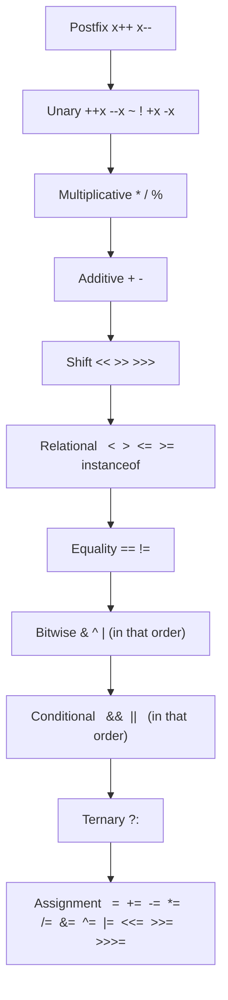
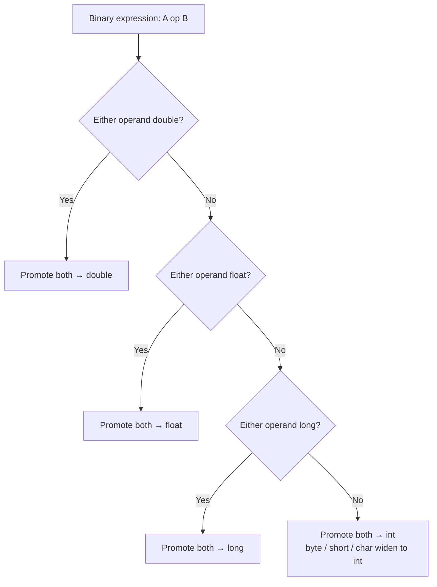
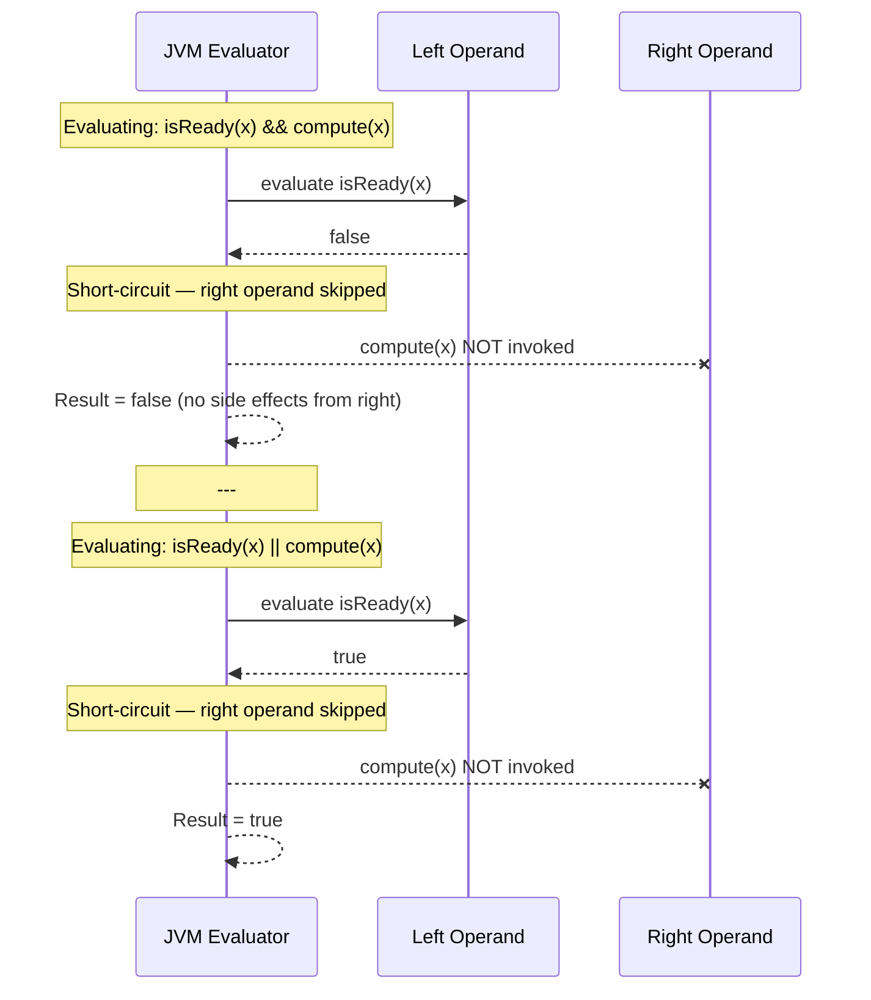

<!-- tldr -->
# Operators

Java operators span arithmetic, bitwise, shift, relational, logical, ternary, and assignment categories, all resolved by a deterministic 15-level precedence table baked into the JLS. Every binary integer operation executes at `int` width or wider — `byte + byte` produces an `int`, not a `byte`. Short-circuit operators (`&&`, `||`) guarantee left-to-right evaluation with early exit, making operand ordering a correctness and performance concern, not just style.



<!-- standard -->

## What It Is

Operators are syntactic tokens the compiler resolves into bytecode instructions (`iadd`, `ishl`, `iand`, etc.). The JLS §15 specifies both **precedence** (which operator binds tighter) and **associativity** (left-to-right for most; right-to-left for unary and assignment).

## Why It Matters

- Precedence bugs silently produce wrong results — `a & b == 0` evaluates as `a & (b == 0)` because `==` binds tighter than `&`.
- Integer promotion causes compile errors: `byte b = 5; b = b + 1;` fails because `b + 1` is `int`; `b += 1` compiles because compound assignment includes a hidden narrowing cast.
- `==` on reference types tests identity, not equality — the most common Java interview gotcha.

## Primary Techniques

**Bitwise tricks (O(1), branch-free):**
- Test power-of-two: `(n & (n - 1)) == 0`
- Isolate lowest set bit: `n & -n`
- Modulo by power-of-two: `n & (capacity - 1)` (used by `HashMap` internally)
- Toggle bit k: `n ^ (1 << k)`
- Count parity: XOR reduction

**Shift operators:**
| Operator | Sign-extends? | Use case |
|----------|--------------|----------|
| `<<` | n/a | Fast `× 2ⁿ` |
| `>>` | Yes (arithmetic) | Signed division by 2ⁿ |
| `>>>` | No (logical) | Unsigned right-shift; hash spreading |

**Short-circuit (`&&`, `||`) vs eager (`&`, `|`):**
- Use `&&` / `||` when the right operand has side effects or is expensive.
- Use `&` / `|` only when both sides must always execute (rare; e.g., in security checks where skipping is a vulnerability).

## Integer Promotion Rules



## Key Tradeoffs

| Choice | Pros | Cons |
|--------|------|------|
| Bitwise over division | ~2–5× faster on modern CPUs | Only valid for power-of-two denominators; less readable |
| `&&` short-circuit | Avoids NPE / expensive calls | Operand order becomes API contract |
| Compound `+=` | Implicit cast, terser | Hides narrowing; masks precision loss on `float`/`double` |

---

<!-- deep -->

## Deep Dive: Operators

### Integer Arithmetic Semantics

The JVM's integer arithmetic wraps silently on overflow — there is no hardware exception. `Integer.MAX_VALUE + 1 == Integer.MIN_VALUE`. Java 8+ provides `Math.addExact(a, b)` which throws `ArithmeticException` on overflow; use it in financial or safety-critical paths.

**Relevant formula — two's complement negation:**
```
-n  ≡  ~n + 1
```
This is why `Integer.MIN_VALUE == -Integer.MIN_VALUE` (overflow) and why `Math.abs(Integer.MIN_VALUE)` returns a negative number.

**Floating-point operators** follow IEEE 754. `double` arithmetic is not associative: `(a + b) + c ≠ a + (b + c)` when magnitudes differ by > 10⁷. The `strictfp` modifier (redundant since Java 17, always-on) enforces identical FP results across platforms.

### Shift Operator Subtleties

- Shift distance is masked: `x << 33` for `int x` is equivalent to `x << 1` (distance `& 0x1F`).
- For `long`, distance is masked to `& 0x3F`.
- `>>>` on a `byte` or `short` operand first promotes to `int`, so `(byte)(-1) >>> 1` is `0x7FFFFFFF`, not `0x7F`.

### Real-World Usage in Production Systems

| System | Operator pattern | Why |
|--------|-----------------|-----|
| `HashMap` (JDK) | `(n-1) & hash` | Fast modulo when table size is power of 2 |
| `HashMap` (JDK) | `h ^ (h >>> 16)` | Spread high bits to reduce collisions |
| Netty `ByteBuf` | Bitwise alignment checks | `(addr & 3) == 0` for 4-byte alignment |
| Kafka `RecordBatch` | `magic & 0xFF` | Unsigned byte interpretation |
| Cassandra `Murmur3` | Extensive `>>>` and `^` | Non-cryptographic hash with good avalanche |
| `AtomicInteger` CAS | `compareAndSet` wraps CPU `CMPXCHG` | Lock-free counters using hardware-level ops |

### Operator Precedence: The Three Traps

#### Trap 1 — Bitwise vs. Equality
```java
// Intended: (a & b) == 0
if (a & b == 0) { ... }   // WRONG: parsed as a & (b == 0) → compile error on non-boolean
if ((a & b) == 0) { ... } // Correct
```

#### Trap 2 — Conditional and Ternary Mixing
```java
int x = condition1 ? 1 : condition2 ? 2 : 3;
// Ternary is right-associative; reads as:
// condition1 ? 1 : (condition2 ? 2 : 3)
```

#### Trap 3 — Post-increment in Expressions
```java
int i = 5;
int j = i++ + ++i; // j = 5 + 7 = 12, i = 7
// Post-increment uses value BEFORE increment; pre-increment uses value AFTER.
```

### Short-Circuit Evaluation: Sequence View



**Ordering rule of thumb:** put the cheapest / most-likely-to-short-circuit operand on the left.

### Compound Assignment Hidden Cast

```java
byte b = 100;
b = b + 1;   // Compile error: int cannot be narrowed to byte
b += 1;      // Compiles: equivalent to b = (byte)(b + 1)
b++;         // Same hidden cast — wraps silently at 127→-128
```
This is a perennial interview question and a real source of bugs in code that processes raw byte streams (parsers, codecs).

### Numeric Overflow Failure Modes

| Scenario | Symptom | Fix |
|----------|---------|-----|
| `int` counter at 2³¹−1 | Silent wrap to MIN_VALUE | Use `long` or `Math.addExact` |
| `int` multiplication: `a * b / c` | Intermediate overflow | Reorder: `a / c * b` or cast to `long` first |
| `(lo + hi) / 2` binary search midpoint | Overflow when both > 10⁸ | Use `lo + (hi - lo) / 2` |
| `float` accumulator in tight loop | Catastrophic cancellation | Use `double` or Kahan summation |

### Capacity / Performance Numbers

- Bitwise ops (AND, OR, XOR, shift): **1 cycle** on all modern CPUs; effectively free.
- Integer division: **20–100 cycles** depending on pipeline (no hardware exception, but significantly slower).
- `HashMap` bucket lookup uses `(n-1) & hash` to serve **millions of QPS** with sub-microsecond latency precisely because it avoids `%`.
- `>>>` in `Murmur3` hash: Kafka broker can hash **1M+ messages/sec** on a single thread; the hash function's bitwise core is not the bottleneck.

### Interview Pitfalls Checklist

- [ ] `==` on `Integer` boxes: `Integer a = 200; Integer b = 200; a == b` → **false** (cache is −128..127).
- [ ] `+` is both addition and string concatenation; `"" + 1 + 2` → `"12"`, not `"3"`.
- [ ] Unary minus on `MIN_VALUE` overflows: `-Integer.MIN_VALUE == Integer.MIN_VALUE`.
- [ ] `>>>` on `byte`/`short` does not produce an unsigned byte/short; promotion to `int` happens first.
- [ ] `^` is XOR, **not** exponentiation. Exponentiation is `Math.pow`.
- [ ] Shift of 32 on `int` is a no-op (`& 0x1F`), not zero.

### Decision Rubric: When to Use Which

```
Need fast modulo by power-of-two?          → (n-1) & value
Need to test/set/clear a specific flag?    → bitwise &, |, ^
Need to guard against NPE on right side?   → &&, || (never & or | for short-circuit intent)
Need safe arithmetic (financial, safety)?  → Math.addExact / Math.multiplyExact
Need to read unsigned byte from stream?    → b & 0xFF  (widens to int without sign extension)
Need unsigned right-shift?                 → >>>  (common in hash functions)
Working with IEEE 754 and need determinism → strictfp (Java <17) or rely on JDK17+ default
```

### Connecting to Compiler and JIT

The JIT aggressively folds constant expressions at compile time and replaces `x / 2` with `x >> 1` (for non-negative `x`) automatically. Writing `x >> 1` explicitly is rarely faster than `x / 2` in modern HotSpot — but it **is** clearer when unsigned semantics are intended, which matters for readability and correctness in hash and codec code.