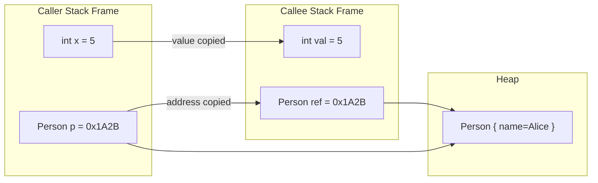
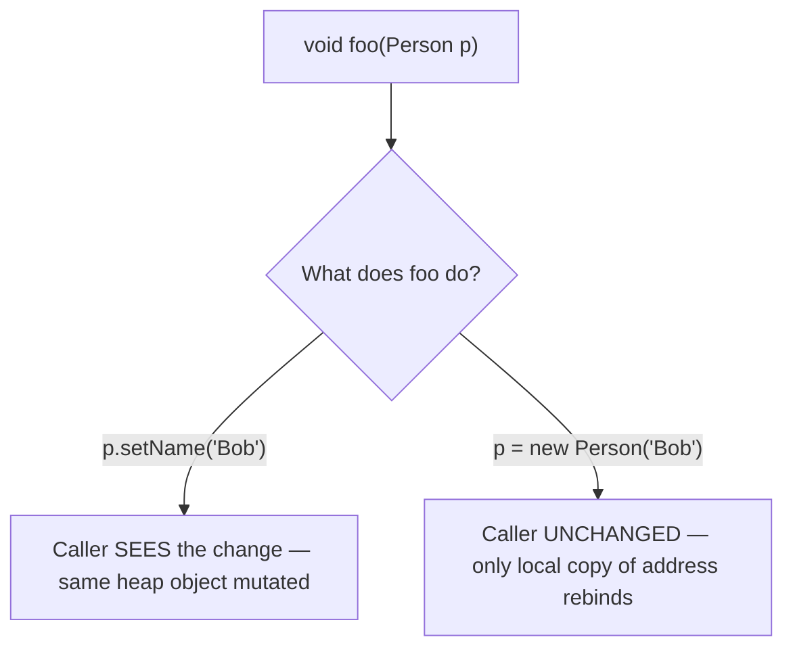
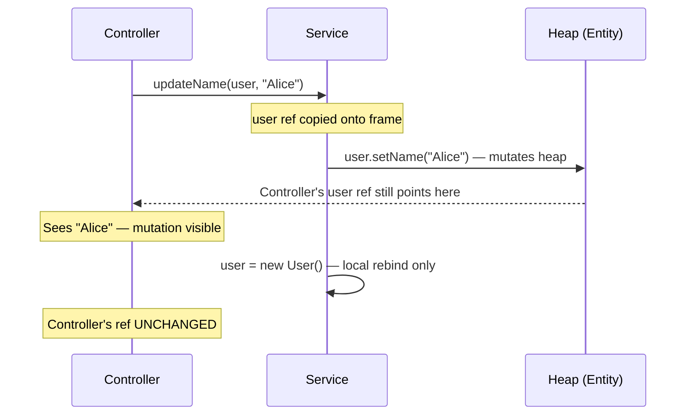

<!-- tldr -->
# Pass-by-value vs Pass-by-reference in Java

Java has exactly one parameter-passing strategy: **pass-by-value**. For primitives, the raw value is copied. For objects, the 64-bit (or 32-bit) heap address stored in the reference variable is copied — giving the callee its own pointer to the same object. The distinction that trips up engineers is this: you can mutate the object through the copied reference, but you cannot rebind the caller's reference variable.



<!-- standard -->

## What It Is

The JVM allocates a new stack frame for every method invocation. Parameters are populated by **copying** the caller's local variable slot:

- **Primitive types** (`int`, `long`, `double`, `boolean`, …): the actual bit pattern is copied. Modifications inside the method are invisible to the caller.
- **Reference types** (any object, array, `String`): the 4/8-byte pointer value is copied. Both caller and callee hold separate reference variables that point at the **same heap object**.

Java is **not** pass-by-reference. In a true pass-by-reference language (C++ `&`, C# `ref`), the callee receives an alias to the caller's variable; reassigning it would change the caller's variable. Java never does this.

## Why It Matters

Getting this wrong produces subtle bugs:

- A developer "swaps" two objects in a helper method and wonders why the caller's variables are unchanged.
- A developer assumes passing a `List` is safe because it's "just a reference," then discovers the callee's `list.add(...)` mutated shared state.

## Mutate vs. Reassign



## Comparison Table

| Scenario | Caller sees change? | Why |
|---|---|---|
| `x = 99` (primitive) | No | Bit-pattern copy; independent slot |
| `p.setName("Bob")` (object field) | **Yes** | Both refs point to same heap object |
| `p = new Person("Bob")` (reassign ref) | No | Callee's copy of the address is rebound; caller's copy unchanged |
| `arr[0] = 99` (array element) | **Yes** | Array object on heap mutated via copied ref |
| `list = new ArrayList<>()` | No | Same as object reassignment |

## Key Tradeoffs

- **Mutation through references is cheap and convenient** but couples caller and callee, making code harder to reason about.
- **Defensive copies** (`new ArrayList<>(incoming)`) protect encapsulation at the cost of allocation.
- **Immutable types** (`String`, `record`, `List.of(...)`) eliminate the mutation risk entirely.

<!-- deep -->

## Deep Dive

### JVM Stack Frame Mechanics

Each invocation frame holds:
1. **Local variable table** — slots for parameters and locals (4 bytes per slot; `long`/`double` occupy 2 slots).
2. **Operand stack** — used during bytecode execution.
3. **Frame metadata** — return address, constant pool reference.

When you call `foo(person)`, the JVM executes `aload_1` (push reference from local slot 1 onto the operand stack) followed by `invokevirtual`, which pops that value and writes it into slot 0 of the new frame. The reference value — a compressed OOP (`compressedOops` is on by default for heaps ≤ 32 GB, encoding the 64-bit address into 32 bits) — is bitwise-copied. No allocation occurs; no reference counting changes.

```
Caller frame slot:  [ 0x00001A2B ]  ← reference to Person on heap
                          |
                    (bitwise copy)
                          ↓
Callee frame slot:  [ 0x00001A2B ]  ← independent slot, same address
```

This is why `==` on two parameter-received references still works (same address), but `=` rebinding is local.

### String Immutability Is Not an Exception

A common source of confusion:

```java
void appendSuffix(String s) {
    s = s + "_suffix"; // creates new String object; caller unchanged
}
```

This behaves identically to any other reassignment. `String` immutability is orthogonal to pass-by-value; it simply means no method on `String` mutates the internal `char[]`. The pass-by-value rule is what prevents the reassignment from propagating back.

### Wrapper Types and Autoboxing

`Integer`, `Long`, etc., are **immutable** objects. There is no `intValue++` on the heap object. Therefore:

```java
void increment(Integer n) {
    n++;  // unboxes → increments primitive copy → boxes into NEW Integer → rebinds local ref
}
// caller's Integer is unchanged
```

This is a frequent interview trap. The fix is to return the new value or use an `int[]` container.

### Real-World Implications

#### Spring / Hibernate

Spring beans are singletons injected as references. Mutating a bean's mutable field inside a `@Service` method is visible to all callers sharing that bean — a serious thread-safety hazard. This is why service-layer objects should be stateless and entity mutations should be scoped to a transaction.



#### Protocol Buffers / gRPC Stubs

Generated `Builder` objects are passed by reference (address copy). Calling `builder.setField(...)` mutates the builder. Passing a `Builder` into a helper that clears fields is a real bug pattern in gRPC service code.

#### Concurrent Systems

`java.util.concurrent` data structures depend on this model:

- `AtomicReference.compareAndSet()` operates on the object the reference points to, not the reference variable.
- Passing a `ConcurrentHashMap` into worker threads is safe for concurrent reads/writes because all threads operate on the same heap object via their individually-copied references.
- Passing a plain `ArrayList` the same way is **not** safe — same reason (shared mutation, no synchronization).

### Failure Modes

| Bug Pattern | Root Cause | Fix |
|---|---|---|
| Swap utility does nothing | Reassigning refs inside method | Return swapped values or use an array/wrapper |
| DTO leaks internal list | Caller holds ref to mutable field | Return `Collections.unmodifiableList()` or deep copy |
| Integer passed to counter method unchanged | Immutable wrapper + autoboxing rebind | Use `int[]` trick or return new value |
| Thread sees stale object state | Shared mutable heap object, no visibility guarantee | `volatile`, `AtomicReference`, or immutable objects |

### Capacity & Latency Notes

- Reference copy: single `aload` + `istore` bytecode — **< 1 ns**, negligible.
- Defensive `new ArrayList<>(list)`: O(n) copy — ~50 ns for 100 elements, ~50 µs for 100 K elements on modern JVM.
- Immutable record construction (`record Point(int x, int y)`): allocation ~10–20 ns; GC amortized cost depends on tenure rate.

### Interview Pitfalls

1. **"Java passes objects by reference"** — Wrong. It passes the *value of the reference*. Use the phrase "pass-by-value of the reference" to demonstrate precision.
2. **Confusing mutability of the object with the semantics of the pass** — These are independent axes.
3. **The swap gotcha** — Interviewers commonly ask you to write a swap method. Demonstrate you know it's impossible for primitive/reference rebinding; offer an `int[]` workaround or a `Pair<>` return type.
4. **`final` parameters** — `final Person p` prevents *reassigning* `p` inside the method, but does not prevent `p.setName(...)`. It communicates intent, nothing more.
5. **Arrays are objects** — Passing `int[] arr` copies the array reference; modifying `arr[0]` is visible to the caller.

### When to Reach for Defensive Copies

```
Is the parameter a mutable collection/array/object?
  └─ YES → Does the callee need its own snapshot, or is shared mutation acceptable?
              └─ Snapshot needed → defensive copy on entry (constructor, setter) or use Records/Immutable wrappers
              └─ Shared mutation OK → document it; consider thread-safety implications
  └─ NO (primitive or known-immutable type like String, Integer, LocalDate)
       → No defensive copy needed; pass-by-value semantics already protect you
```

Use `record` (Java 16+) for value-semantic DTOs — shallow immutability is enforced at the language level, and the canonical constructor is the right place to defensively copy any embedded mutable fields.