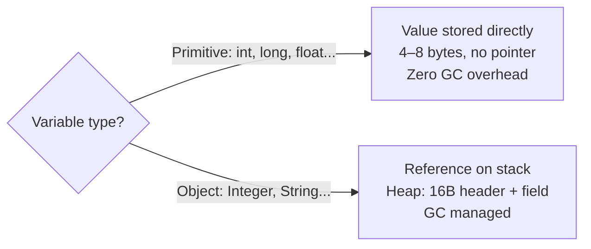
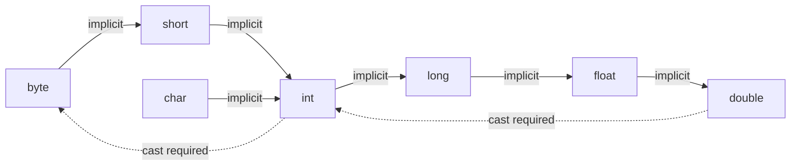
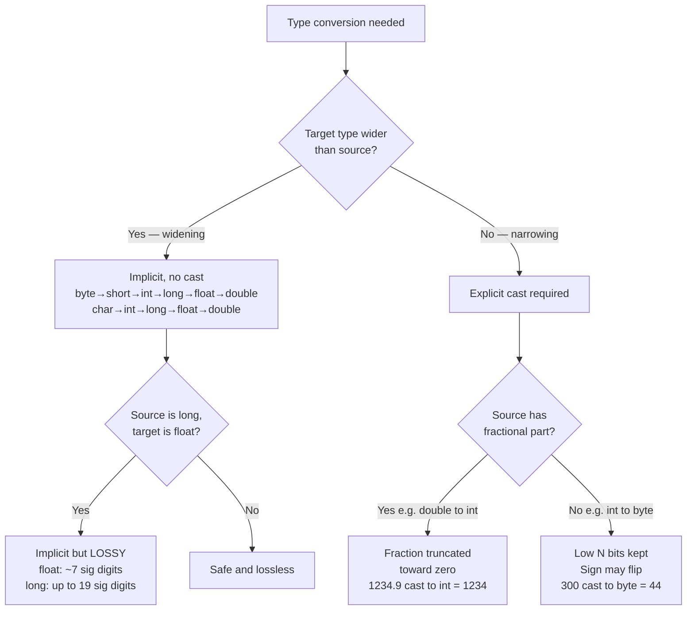

<!-- tldr -->
# Java Primitive Types

Java's 8 primitive types (`boolean`, `byte`, `char`, `short`, `int`, `long`, `float`, `double`) are stored by value — as locals on the stack, or inline within objects and arrays on the heap. They exist for performance: an `int` costs 4 bytes with zero GC overhead, while an `Integer` object costs ≥16 bytes plus a heap pointer. Knowing their exact sizes, ranges, default values, and conversion rules is table-stakes for any Java interview.



<!-- standard -->

## What It Is

Java enforces a hard distinction between 8 built-in primitive types and all reference types. Primitives hold the raw value directly; objects hold a pointer to a heap-allocated structure with an object header (~16 bytes), type metadata, and the actual data.

| Type | Size | Range / Values | Default | Wrapper |
|------|------|----------------|---------|---------|
| `boolean` | JVM-defined (~1 B) | `true` / `false` | `false` | `Boolean` |
| `byte` | 8-bit signed | −128 to 127 | `0` | `Byte` |
| `short` | 16-bit signed | −32,768 to 32,767 | `0` | `Short` |
| `char` | 16-bit **unsigned** | 0 to 65,535 (Unicode BMP) | `\u0000` | `Character` |
| `int` | 32-bit signed | −2,147,483,648 to 2,147,483,647 | `0` | `Integer` |
| `long` | 64-bit signed | ±9.2×10¹⁸ | `0L` | `Long` |
| `float` | 32-bit IEEE 754 | ~±3.4×10³⁸, ~7 sig. digits | `0.0f` | `Float` |
| `double` | 64-bit IEEE 754 | ~±1.8×10³⁰⁸, ~15 sig. digits | `0.0d` | `Double` |

## Why It Matters

- **Cache locality**: `int[1_000_000]` is a contiguous 4 MB block; `Integer[1_000_000]` is 4 MB of pointers scattering into 16 MB+ of heap objects.
- **GC pressure**: primitives generate zero garbage; boxing every integer in a hot loop causes constant minor GC.
- **Throughput**: `int[]` vs `Integer[]` loop summation benchmarks at **4–10× faster** on HotSpot.

## Primary Techniques

**Integer types** — all four are signed two's-complement. Default to `int`; reach for `long` when values exceed ~2.1 billion (timestamps, IDs, byte offsets); use `byte`/`short` only for memory-critical large arrays.

**Floating-point** — `double` by default (~15 significant digits); `float` only when halving memory matters (~7 digits); **`BigDecimal` with a `String` constructor for money without exception**.

**Conversions** come in two kinds:



- **Widening** (solid arrows): implicit, no cast required — but `long → float` is widening yet **lossy** (float has only ~7 sig. digits).
- **Narrowing** (dashed arrows): explicit cast required — truncates fractions, may wrap sign bits.

## Key Tradeoffs

| Concern | Primitive | Object Wrapper |
|---------|-----------|----------------|
| Memory per value | 4–8 bytes | ~20 bytes (header + field + ref) |
| Null support | No | Yes |
| Use in Collections | No | Yes |
| Performance | Fastest | Boxing overhead |
| Overflow detection | Silent wrap | `Math.addExact` throws |

<!-- deep -->

## Java Primitive Types — Deep Dive

### Integer Types: Literals, Overflow, and Unsigned Math

All integer primitives are **signed two's-complement**. The MSB is the sign bit — `byte`'s range is −128 to 127, not 0–255. Java has **no unsigned integer primitives**; simulate unsigned arithmetic with `Integer.toUnsignedLong()` or `Long.compareUnsigned()`.

```java
// Literal forms
int decimal = 1_000_000;         // underscore separators (Java 7+)
int hex     = 0xFF;              // 255
int binary  = 0b1010_1010;       // 170 (Java 7+)
long big    = 9_000_000_000L;    // L suffix required — exceeds int range

// Silent integer overflow — wraps with no exception
int max      = Integer.MAX_VALUE;  // 2,147,483,647
int overflow = max + 1;            // -2,147,483,648 — silent wrap!

// Safe overflow handling
long safe = (long) max + 1;        // 2,147,483,648 — cast BEFORE arithmetic
Math.addExact(max, 1);             // throws ArithmeticException on overflow
```

> **Critical interview trap**: `long c = Integer.MAX_VALUE + 1` still evaluates to `−2,147,483,648`. The addition executes in `int` arithmetic *before* widening to `long`. You must cast *first*: `(long) Integer.MAX_VALUE + 1`.

### Floating-Point: IEEE 754 Precision and NaN

`float` and `double` store values as `mantissa × 2^exponent`. Most decimal fractions — including 0.1 and 0.2 — have no exact binary representation.

```java
System.out.println(0.1 + 0.2);          // 0.30000000000000004
System.out.println(0.1 + 0.2 == 0.3);   // false

// Safe comparison with epsilon
Math.abs((0.1 + 0.2) - 0.3) < 1e-9;    // true

// Money: BigDecimal with String constructor
new BigDecimal("0.10").add(new BigDecimal("0.20")); // 0.30 — exact
// NEVER: new BigDecimal(0.10) — representation error already baked in

// IEEE 754 special values
1.0 / 0.0;                // Infinity
0.0 / 0.0;                // NaN
Double.NaN == Double.NaN; // false — NaN is never equal to itself
Double.isNaN(Double.NaN); // true — only correct way to test
```

**Precision summary**:

| Type | Significant Decimal Digits | Memory | Notes |
|------|-----------------------------|--------|-------|
| `float` | ~7 | 4 bytes | `long → float` widening is implicit but lossy |
| `double` | ~15 | 8 bytes | Default for all FP work |
| `BigDecimal` | Arbitrary | Object overhead | Required for exact decimal arithmetic |

### `char`: The Only Unsigned Primitive

`char` is a 16-bit **unsigned** integer (0–65,535) representing a Unicode BMP code point — it is the sole unsigned primitive in Java. Characters outside the BMP (emoji, rare CJK) require surrogate pairs (two `char` units).

```java
char next = (char)('A' + 1);     // 'B'
int  code = 'Z' - 'A';           // 25

// Surrogate pairs for supplementary code points
String emoji = "\uD83D\uDE00";   // 😀 — U+1F600
emoji.length();                   // 2 (two char units)
emoji.codePointCount(0, 2);      // 1 (one logical character)

// Widening asymmetry — a common exam question
int fromChar = (char)(-1);       // 65535 — unsigned zero-extension
int fromByte = (byte)(-1);       // -1    — signed sign-extension
```

### Default Values and Definite Assignment

| Context | Auto-initialised? | Values |
|---------|-------------------|--------|
| Instance / static field | Yes | `0`, `0L`, `0.0f`, `0.0d`, `false`, `\u0000`, `null` |
| Local variable in method | **No** | Compiler enforces definite assignment before first read |

```java
class Demo {
    int field;   // auto-init to 0

    void method() {
        int local;
        System.out.println(local); // COMPILE ERROR: variable might not have been initialised
    }
}
```

Note: `boolean` defaults to `false`, **not** `0` — Java does not equate the two. Attempting `if (1) {}` or `int x = true;` is a compile error.

### Widening and Narrowing: Algorithms and Edge Cases



**Narrowing examples**:

```java
double d  = 1234.567;
int i     = (int) d;           // 1234  — fraction dropped, not rounded
byte b    = (byte) 300;        // 44    — 300 % 256
byte neg  = (byte) 200;        // -56   — sign wrap (200 - 256)

// The sneaky widening precision loss
long precise = 123_456_789_012_345L;
float approx = precise;               // widening — compiles with no cast
System.out.println(precise);          // 123456789012345
System.out.println((long) approx);    // 123456789462016 — WRONG, lost 9 digits
```

### The 5 Classic Interview Traps

| # | Trap | Wrong Assumption | Correct Rule |
|---|------|-----------------|--------------|
| 1 | `MAX_VALUE + 1` | Throws an exception | Silently wraps to `MIN_VALUE` |
| 2 | `long c = MAX_VALUE + 1` | Widening prevents overflow | Addition in `int` first; cast *before* arithmetic |
| 3 | `0.1 + 0.2 == 0.3` | Exact decimal math | IEEE 754 approximation; use epsilon or `BigDecimal` |
| 4 | Uninitialized local | Gets default `0` | Compile error — definite assignment required |
| 5 | `NaN == NaN` | `true` | Always `false` per IEEE 754; use `Double.isNaN()` |

### Capacity and Performance Numbers

| Scenario | Primitive `int[]` | Boxed `Integer[]` |
|----------|-------------------|-------------------|
| Memory per element | 4 bytes | ~20 bytes (header + field + ref) |
| 1 M element array | ~4 MB | ~20 MB |
| Loop sum throughput (HotSpot) | ~1 ns/op (SIMD-vectorized) | ~5–10 ns/op (pointer chase + GC) |
| GC allocation rate | 0 bytes/op | ~16 bytes/box |
| JIT vectorization | Yes — `int[]` maps to AVX SIMD | No — pointer indirection blocks it |

### Real-World Systems That Rely on These Rules

- **Kafka** internal topic offsets are `long` — a topic receiving 1 M msg/s exhausts `int` range in ~35 minutes; Kafka's `LogOffsetMetadata` uses `long` throughout.
- **Cassandra** token ring arithmetic uses `long` for Murmur3 hash tokens spanning the full 64-bit signed range.
- **Protobuf / Avro** wire formats map directly: `int32` → `int`, `int64` → `long`, `float` → `float`, `double` → `double`. A schema mismatch (sending `int64` into a `float` field) silently loses precision — exactly the `long → float` widening trap.
- **Android ART** documentation recommends `int` over `short` for loop counters even on memory-constrained devices because `short` arithmetic requires sign-extension on every ALU operation, adding overhead with no benefit for scalars.
- **JVM JIT (HotSpot C2)** auto-vectorizes `int[]` loops using AVX2 (processes 8 `int` values per cycle); `Integer[]` cannot be vectorized due to pointer indirection and nullable elements.

### When to Reach for Each Type — Decision Rubric

```
Need an integer?
├─ Value can exceed 2.1 B (epoch ms, user IDs, file offsets)  →  long
├─ Memory-critical large array (audio samples, raw pixels)     →  short / byte
└─ Everything else                                             →  int   ← 90% of cases

Need decimal?
├─ Money / currency / exact decimal (P&L, tax, rates)          →  BigDecimal (String constructor)
├─ ML weights, scientific computation, general FP              →  double  ← default
└─ Millions of FP values in a tensor, GPU buffer               →  float

Need a character?
├─ Known BMP code point (ASCII, common Unicode)                →  char
└─ Emoji, rare scripts, supplementary plane                    →  String + codePoints() / codePointAt()
```

### Interview Pitfalls Checklist

- [ ] Cast to `long` **before** arithmetic when values might exceed `int` range — not after.
- [ ] `long` literals require the `L` suffix — `9_000_000_000` without `L` is a compile error.
- [ ] `float` literals require the `f` suffix — `3.14` is a `double`; assigning to `float` without cast is a narrowing error.
- [ ] Never compare `float` / `double` with `==`; use an epsilon or `BigDecimal`.
- [ ] `char` widens unsigned (`(int)(char)(-1)` → `65535`); `byte` widens signed (`(int)(byte)(-1)` → `-1`).
- [ ] `NaN != NaN` always — only `Double.isNaN()` reliably detects it.
- [ ] `boolean` cannot be cast to or from `int` — Java is not C; `if (1) {}` is a compile error.
- [ ] Local variables are **not** default-initialised — the compiler enforces definite assignment; instance fields are.
- [ ] `long → float` widening is implicit but can silently corrupt a value with more than 7 significant digits.