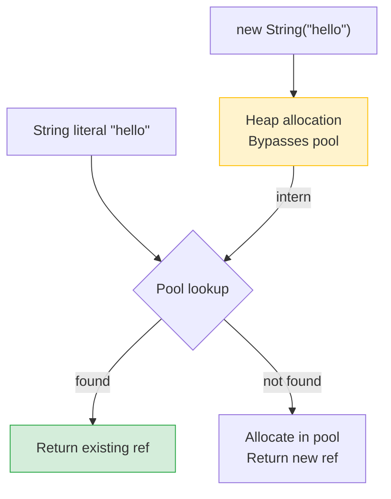
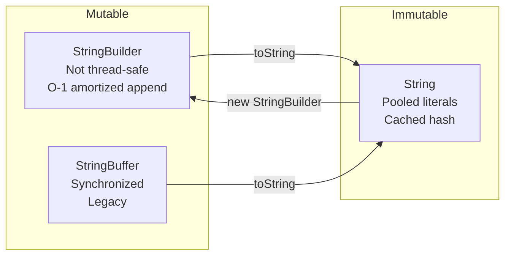
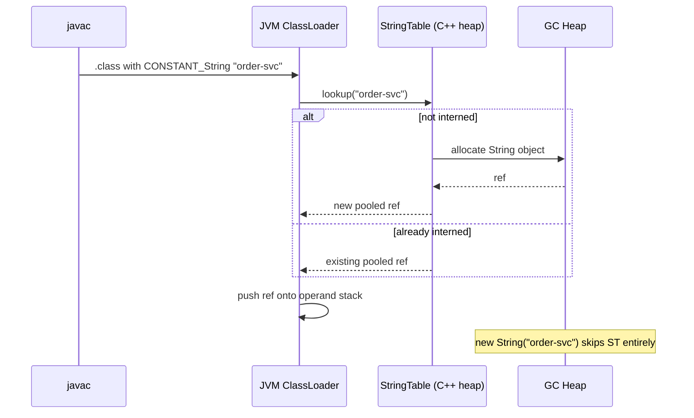

<!-- tldr -->
# String Class

`String` is immutable and `final`—every mutating operation allocates a new object. The JVM maintains a **String Pool** (heap-resident since Java 7) so literal strings are deduplicated at load time. Since Java 9, the internal storage switched from `char[]` to `byte[] + coder`, cutting memory by ~40% for ASCII-heavy workloads. Knowing these internals is prerequisite to reasoning about memory, equality semantics, and performance at scale.



<!-- standard -->

## What It Is

`java.lang.String` wraps an immutable byte sequence. Key fields (Java 9+):

```
byte[] value   // LATIN1 or UTF-16 encoded bytes
byte   coder   // 0 = LATIN1, 1 = UTF16
int    hash    // cached; 0 means "not yet computed"
```

Pre-Java 9 the backing store was `char[]` (always 2 bytes/char). Compact Strings halves memory for the ~90% of real-world strings that are pure ASCII.

## Why It Matters

- **Correctness**: `==` tests reference equality; `.equals()` tests value. Conflating them is among the most common Java bugs.
- **Security**: String immutability lets the JVM safely cache hash codes and intern strings. Using `String` for passwords is an anti-pattern—it stays in the pool; prefer `char[]`.
- **Performance**: naive `+` in a loop is O(n²); wrong interning strategy leaks native memory.

## Primary Techniques

| Operation | Best Choice | Avoid |
|---|---|---|
| Single-threaded building | `StringBuilder` | `StringBuffer` (lock overhead) |
| Multi-threaded shared builder | `StringBuffer` or separate builders | Shared `StringBuilder` |
| Format a hot-path string | `+` or `StringBuilder.append` | `String.format` (regex parse per call) |
| Dedup millions of strings | `String.intern()` or `ConcurrentHashMap` | Storing raw duplicates |
| Multi-line literals (Java 15+) | Text blocks `"""..."""` | escaped `\n` chains |

## Key Tradeoffs

- **Immutability ↔ allocation pressure**: safety is free, but transformation-heavy code creates GC churn. Use `StringBuilder` for loops.
- **Pool ↔ memory**: `intern()` reduces heap duplication but the StringTable is a fixed-bucket hash table; excessive interning degrades to O(n) lookups.
- **Compact strings ↔ Unicode**: any non-Latin-1 character forces the entire string to UTF-16, doubling storage retroactively.



<!-- deep -->

## Internal Memory Layout

### Pre-Java 9
```
String object  →  Object header (16 B)
                  char[] value    (32 B header + 2×n bytes)
                  int hash        (4 B)
                  int count       (removed Java 7u6)
```
A 10-char ASCII string consumed ~80 bytes.

### Java 9+ Compact Strings
```
String object  →  Object header (16 B)
                  byte[] value   (16 B header + n bytes for LATIN1)
                  byte coder     (1 B, padded to 4 B)
                  int hash       (4 B)
```
Same 10-char ASCII string: ~48 bytes — a **40% reduction** across the heap.

The JVM flag `-XX:-CompactStrings` reverts to the old behavior (useful when benchmarking regressions).

---

## String Pool Deep Dive

### Location History
| JDK | Pool Location | Risk |
|---|---|---|
| ≤ 6 | PermGen | `OutOfMemoryError: PermGen` |
| 7+ | Main heap | GC-eligible; tunable |

### StringTable Sizing
The pool is a **fixed-size open-addressing hash table** (C++ layer, not GC heap):

- Default buckets: **65,536** (Java 11+; was 60,013 in Java 8)
- Tune with `-XX:StringTableSize=<prime>` — use a prime near your expected unique string count.
- Inspect at runtime: `-XX:+PrintStringTableStatistics` on JVM exit.

### intern() Performance
`String.intern()` is a JNI call. Each call acquires a global JVM lock on the StringTable bucket. At >1M unique strings:

- Hash collisions degrade to O(k) per lookup
- Prefer a `ConcurrentHashMap<String,String>` for application-level deduplication:
  ```java
  private static final ConcurrentHashMap<String,String> POOL = new ConcurrentHashMap<>();
  public static String dedupe(String s) {
      return POOL.computeIfAbsent(s, k -> k);
  }
  ```
- Or use **G1 String Deduplication** (`-XX:+UseStringDeduplication`, G1 only): asynchronously deduplicates `byte[]` backing arrays without touching the StringTable.

---

## Equality & hashCode Semantics

```java
String a = "hello";          // pool
String b = "hello";          // same pool ref → a == b is TRUE
String c = new String("hello"); // heap copy → a == c is FALSE
String d = c.intern();       // → same as a → a == d is TRUE
```

### hashCode Contract
```java
// java.lang.String source (simplified)
public int hashCode() {
    int h = hash;
    if (h == 0 && !hashIsZero) {
        h = computeHash();     // O(n) — iterates every byte
        if (h == 0) hashIsZero = true;
        else hash = h;         // cached for O(1) subsequent calls
    }
    return h;
}
```
**Pitfall**: The string whose computed hash is exactly `0` (e.g., `"\u0000"`) re-triggers the O(n) loop on every call until Java 12 introduced the `hashIsZero` sentinel flag.

---

## String Concatenation: What the Compiler Does

```java
// Source
String s = a + "-" + b;

// javac (Java 8) emits:
new StringBuilder().append(a).append("-").append(b).toString();

// Java 9+ invokedynamic via StringConcatFactory — single allocation, no intermediate StringBuilder
```

### Loop Trap
```java
// BAD — O(n²): new StringBuilder per iteration
for (String item : list) result += item;

// GOOD — O(n)
StringBuilder sb = new StringBuilder();
for (String item : list) sb.append(item);
String result = sb.toString();
```

---

## Real-World Systems

| System | String-Related Design |
|---|---|
| **JVM class loading** | Class/method names are interned; saves memory in large classpaths |
| **Netty** | Uses `AsciiString` (byte-backed) to avoid charset decode overhead on HTTP/1.1 headers |
| **Cassandra** | Column names stored as `ByteBuffer`, not `String`, to avoid UTF-8 decode on hot read path |
| **Kafka** | Topic names interned in broker metadata cache; limits topic count to avoid StringTable bloat |
| **Spring MVC** | `@RequestMapping` paths resolved once and cached as `String`; avoid `String.format` in hot filter chains |

---

## Failure Modes

### Pre-Java 7u6 `substring()` Memory Leak
Old `substring(int, int)` shared the parent's `char[]`:
```
"very-long-string-100MB".substring(0, 5)
// kept the 100MB char[] alive via internal offset/count fields
```
Fixed in Java 7 update 6 — `substring` now copies. **Interview trap**: interviewers still ask about this to test JDK history awareness.

### Password Leakage
```java
String password = "s3cret"; // stays in pool until GC+compact
// prefer:
char[] password = console.readPassword();
Arrays.fill(password, '\0'); // zero out immediately after use
```

### Charset Decode Bombs
```java
new String(bytes) // uses platform default charset — non-deterministic across JVMs
new String(bytes, StandardCharsets.UTF_8) // explicit — always correct
```

---

## Capacity & Latency Numbers

| Operation | Cost |
|---|---|
| `equals()` same reference | ~1 ns (pointer check short-circuits) |
| `equals()` n-char distinct strings | ~n/8 ns (vectorized in hotspot) |
| `hashCode()` first call, 50-char string | ~15 ns |
| `hashCode()` cached | ~1 ns |
| `String.format("Hello %s", name)` | ~500–800 ns (regex parse + vararg) |
| `intern()` on 1M unique strings | degrades to ~2–5 µs per call |
| `StringBuilder.append` (amortized) | ~3–5 ns |

---

## Architecture: String Resolution Sequence



---

## Interview Pitfalls Checklist

1. **`==` vs `.equals()`** — always `.equals()` for value comparison. Interviewers will probe with `new String("x") == "x"`.
2. **Concatenation in loops** — call out O(n²) explicitly and propose `StringBuilder`.
3. **`intern()` at scale** — know the StringTable is not a Java collection; it has native overhead.
4. **Compact Strings** — mention `byte[] + coder` if asked about Java 9+ memory improvements.
5. **`String.format` on hot paths** — ~100× slower than `+`; never use in O(request) log-message construction without a guard.
6. **`hashCode` of `""`** — is `0`; the sentinel-flag edge case is a good signal of JDK source familiarity.
7. **Text blocks** — know that indentation stripping uses the closing `"""` position (Java 15+).

---

## When to Reach For Each Variant

```
Single immutable value, passed across threads → String
Building a string in a single thread loop   → StringBuilder
Legacy API requires thread-safe mutable str → StringBuffer (rare)
Multi-line config/SQL/JSON literals          → Text block (Java 15+)
ASCII-only, high-throughput network path    → byte[] or AsciiString (Netty)
Deduplicating millions of strings at rest   → G1 String Deduplication
```