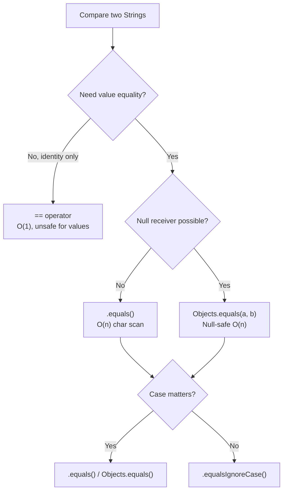
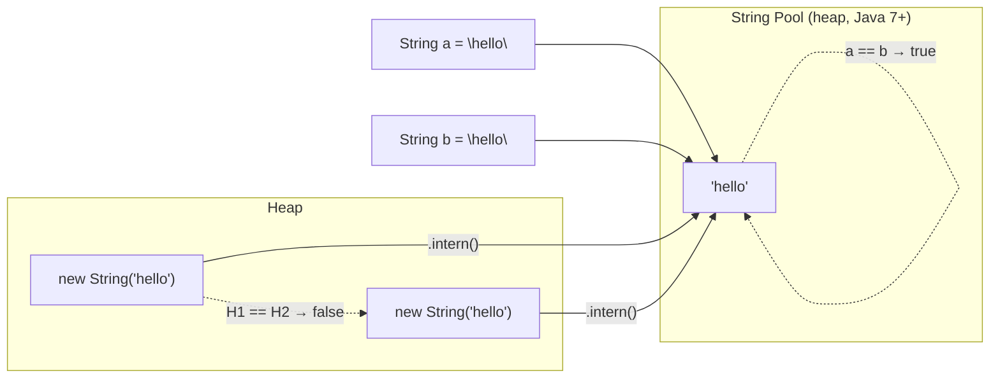
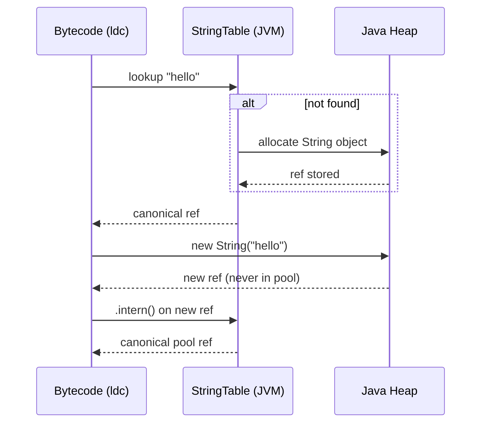

<!-- tldr -->
# String Comparison in Java

Java's `String` is an object, so `==` checks *reference identity*, not *value equality*. The JVM string pool causes two string literals with identical content to share a reference—making `==` appear correct until it silently isn't. Senior engineers must know which method to reach for, when null-safety matters, and the performance cost hiding behind each choice.



<!-- standard -->

## What It Is

Java provides four practical ways to compare string *values*, each with different contracts:

- **`==`** — compares heap addresses. Two `new String("x")` objects are always `!=` even if identical in content.
- **`.equals(String)`** — compares character sequences. Throws `NullPointerException` if the receiver is `null`.
- **`Objects.equals(a, b)`** — null-safe wrapper; returns `true` only if both are null or both are `.equals()`.
- **`.compareTo(String)`** / **`.compareToIgnoreCase(String)`** — lexicographic order; returns negative/zero/positive for sorting.

## Why It Matters

The string pool interns compile-time constants automatically. This means `"hello" == "hello"` returns `true` inside a single classloader, creating a false sense of safety. The moment a string arrives from user input, a database cursor, or an HTTP request it lives on the heap and `==` returns `false`. This is a perennial production bug and a reliable interview filter.

## Primary Techniques

| Method | Null-safe (receiver) | Case-sensitive | Return type | Typical use |
|---|---|---|---|---|
| `==` | ✅ no NPE | N/A | `boolean` | Identity checks only |
| `.equals()` | ❌ NPE if null | ✅ | `boolean` | Standard value equality |
| `.equalsIgnoreCase()` | ❌ | ❌ | `boolean` | User-facing input matching |
| `Objects.equals(a, b)` | ✅ | ✅ | `boolean` | Fields that may be null |
| `.compareTo()` | ❌ | ✅ | `int` | `Comparable` sort key |
| `String.CASE_INSENSITIVE_ORDER` | ❌ | ❌ | `Comparator` | TreeMap / sorted structures |

## Key Tradeoffs

- **Correctness vs. convenience**: `"literal".equals(variable)` avoids NPE by using a known non-null receiver—common idiom in Android and server code.
- **`intern()` vs. heap**: Interning reduces memory by collapsing duplicates, but every lookup hits the JVM's `StringTable` (a hash table with a default size of 65,536 buckets pre-Java 11). Heavy interning under contention can become a bottleneck.
- **`hashCode()` caching**: `String` memoizes its hash on first call. `HashMap<String, …>` lookups are cheap for repeated access, but the first call scans all chars.



<!-- deep -->

## Deep Dive: String Comparison Internals

### The String Pool Mechanics

The JVM maintains a **`StringTable`**—a fixed-capacity open-addressed hash table stored on the heap (moved from PermGen in Java 7u6). String literals and compile-time constant expressions are automatically interned at class-load time via the `ldc` bytecode instruction.

Rules for what lands in the pool:

- **Interned automatically**: `"hello"`, `"hel" + "lo"` (compile-time constant folding by `javac`).
- **NOT interned**: `new String("hello")`, `s1 + s2` where either is a variable, strings from `substring()`, `split()`, `readLine()`, JDBC `ResultSet`, etc.
- **Explicitly interned**: `s.intern()` — inserts into pool if absent, returns canonical reference.



### Algorithms & Complexity

| Operation | Best case | Worst case | Notes |
|---|---|---|---|
| `==` | O(1) | O(1) | Pointer compare |
| `.equals()` | O(1) | O(n) | Length check first; char scan on mismatch |
| `.hashCode()` (cold) | O(n) | O(n) | Cached after first call |
| `.hashCode()` (warm) | O(1) | O(1) | `hash` field ≠ 0 short-circuits |
| `.compareTo()` | O(1) | O(min(m,n)) | Stops at first differing char |
| `.intern()` | O(1) amortized | O(n) | Hash lookup + equals scan on collision |

**`hashCode()` formula** (unchanged since Java 1.0):

```
s[0]*31^(n-1) + s[1]*31^(n-2) + ... + s[n-1]
```

31 is chosen because `31 * i == (i << 5) - i`, a JIT-friendly multiply.

### JVM Tuning Knobs

```
-XX:StringTableSize=131072   # power-of-2 bucket count; default 65536 (Java < 11)
                              # Java 11+ auto-tunes; 1M buckets for intern-heavy workloads
-XX:+UseStringDeduplication  # G1 GC only: deduplicates heap strings without interning
                              # reduces live-set by 10-25% on typical web apps
```

**G1 String Deduplication** (Java 8u20+) is *not* the same as `intern()`. It shares the backing `char[]`/`byte[]` array between duplicate `String` objects but leaves two distinct object headers on the heap. This means `==` still returns `false`. Use it for memory savings on read-heavy workloads, not equality semantics.

### Real-World Systems

| System | How string comparison surfaces |
|---|---|
| **JVM `HashMap`/`HashSet`** | String keys hit `hashCode()` then `equals()`; warm hashCode is O(1), so string keys are fast at scale |
| **Spring MVC / Jakarta EE** | `@RequestParam` values are new heap strings; `==` comparisons in dispatcher logic silently fail |
| **Hibernate / JPA** | Entity `equals()`/`hashCode()` based on business key strings must not use `==`; common source of duplicate-entity bugs in `Set<Entity>` |
| **Kafka consumer group IDs** | Compared via `.equals()` inside broker group coordinator; interning not used—heap strings throughout |
| **Android (Dalvik/ART)** | String interning used aggressively in resource IDs; `TextUtils.equals()` is the null-safe idiom |

### Capacity & Latency Numbers

- `String.equals()` on a 50-char mismatch at position 0: **~2 ns** (single cache line).
- `String.equals()` on a 10 KB identical string: **~1–3 µs** (multiple cache lines, branch-prediction friendly).
- `intern()` with 1M unique strings: `StringTable` lookup at **~50–100 ns**; degrades to **~5–10 µs** with a 64K bucket table under heavy collision.
- G1 deduplication throughput: processes **~100 MB/s** of string data in background; pause-free.

### Failure Modes

1. **`==` on deserialized / RPC strings**: Strings from Jackson, Protobuf, or JDBC are heap-allocated. A subtle `==` check compiles and passes unit tests (pool hits) but silently fails in production (heap strings).

2. **`intern()` under high cardinality**: Interning URLs, UUIDs, or user-agent strings (millions of unique values) causes `StringTable` overflow and O(n) bucket chain scans. Profile with `-XX:+PrintStringTableStatistics` before committing.

3. **`null` receiver NPE**: `userInput.equals("admin")` throws if `userInput` is null. Prefer `"admin".equals(userInput)` or `Objects.equals(userInput, "admin")` in all validation paths.

4. **Compile-time constant folding surprise**: `final String A = "foo"; final String B = "foo"; A == B` is `true`—but remove `final` and it's `false`. Surprises engineers who rely on constants for interning.

5. **`compareTo()` sign contract violation**: Some teams cast the return to `byte` for compactness. `compareTo()` can return values outside `[-128, 127]` (e.g., Unicode diff of `'\uFF00' - '\u0001'` = 65279). Cast truncation silently inverts sort order.

### Interview Pitfalls

- **"When is `==` safe for strings?"** — Only when *you* created both references from the same literal or explicit `intern()`, and you control the classloader. Never in library/framework code.
- **"What does `new String("abc") == "abc"` return?"** — Always `false`. The right side is the pool reference; the left is a fresh heap object.
- **"How would you deduplicate 100 GB/day of log strings in a streaming pipeline?"** — Intern only the *key* portions (event type, host); use a bounded `ConcurrentHashMap<String,String>` as a manual intern cache with LRU eviction rather than JVM intern table (avoids GC-invisible retention).
- **"What's the complexity of using strings as `HashMap` keys?"** — O(1) amortized after first hashCode computation; O(n) on first call per unique string instance.

### Decision Rubric: When to Reach for Each

```
Need value equality?
  └─ Receiver might be null?
       ├─ Yes → Objects.equals(a, b)
       └─ No  → "constant".equals(variable)   ← NPE-safe idiom

Need ordering (sort / TreeMap)?
  └─ Case matters?
       ├─ Yes → Comparable natural order (.compareTo)
       └─ No  → String.CASE_INSENSITIVE_ORDER Comparator

Memory pressure from duplicate strings (millions)?
  └─ Bounded cardinality (e.g., enum-like values)?
       ├─ Yes → intern() or manual intern cache
       └─ No  → G1 deduplication (-XX:+UseStringDeduplication)
```