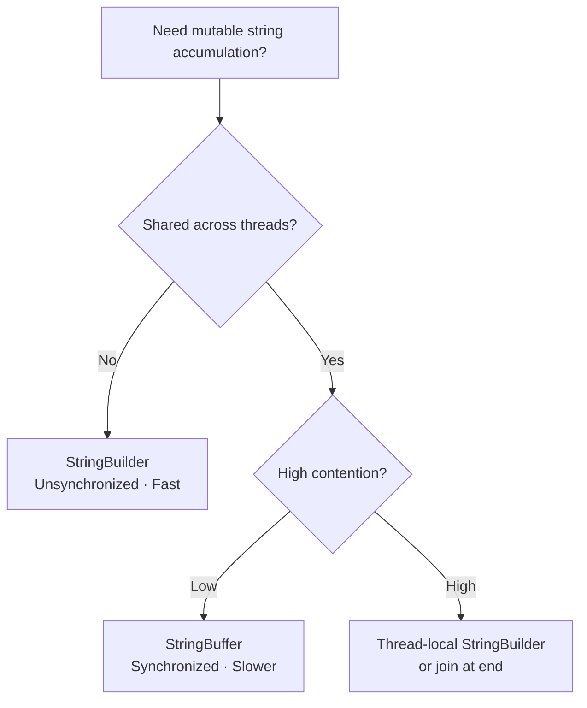
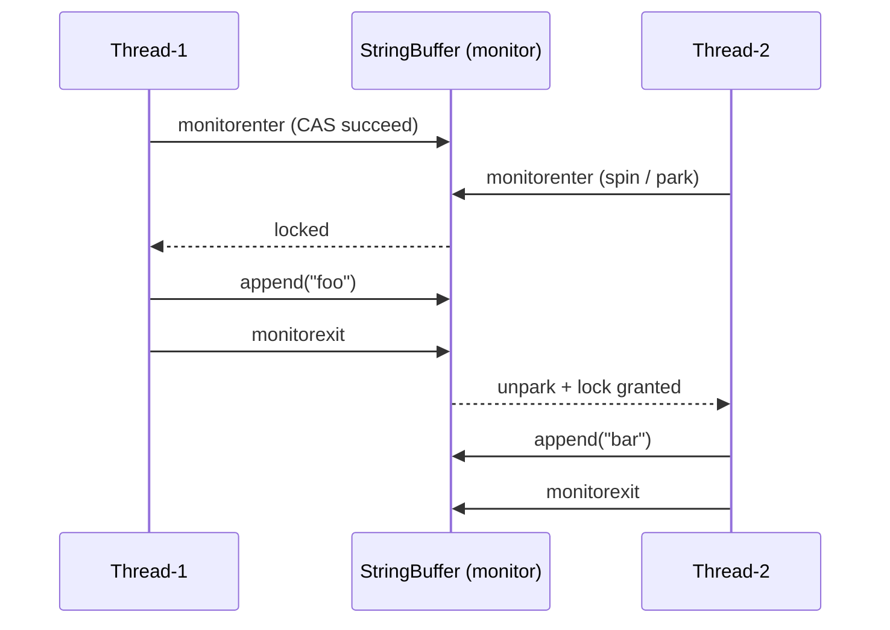
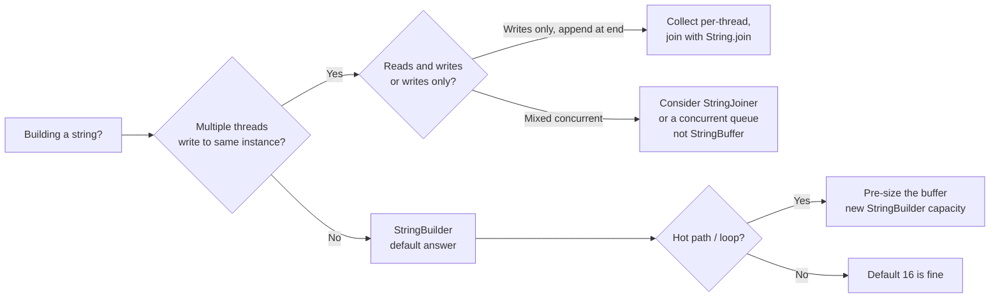

<!-- tldr -->
# StringBuilder vs StringBuffer

Both classes wrap a resizable `char[]` (Java 9+: `byte[]`) and implement `Appendable`/`CharSequence`, providing mutable string construction without creating intermediate `String` objects. `StringBuffer` predates `StringBuilder` (Java 1.0 vs 1.5) and wraps every public method in `synchronized`, making it safe for concurrent access at a measurable throughput cost. In single-threaded code—which covers ~99% of string-building use cases—`StringBuilder` is the correct default.



<!-- standard -->

## What They Are

Both classes extend `AbstractStringBuilder`, which owns the actual `char[]` buffer and the resize logic. `StringBuffer` simply adds `synchronized` to ~20 methods; it delegates all real work back to `AbstractStringBuilder`.

```java
// StringBuffer — actual JDK source pattern
public synchronized StringBuffer append(String str) {
    super.append(str);
    return this;
}

// StringBuilder — identical body, no lock
public StringBuilder append(String str) {
    super.append(str);
    return this;
}
```

## Why It Matters in Interviews

Interviewers use this topic as a proxy for three things:
- Do you understand **JVM memory and locking overhead**?
- Do you know when **immutability** is the better answer vs mutability?
- Can you reason about **compiler optimizations** (javac string concatenation rewrite)?

## Primary Techniques

- **String concatenation in a loop** → always use `StringBuilder` (the compiler's `+` rewrite in Java 9+ uses `invokedynamic`/`StringConcatFactory`, not `StringBuilder`, but explicit loops still benefit).
- **Capacity pre-allocation**: `new StringBuilder(expectedLength)` eliminates resize copies; default capacity is 16.
- **Chaining**: Both return `this`, enabling fluent `sb.append(...).append(...).delete(0,3)`.

## Key Tradeoffs

| Dimension | StringBuilder | StringBuffer |
|---|---|---|
| Thread safety | ❌ None | ✅ Method-level `synchronized` |
| Throughput (single thread) | ~3–5× faster† | Baseline |
| API surface | Identical | Identical + `toString()` sync |
| Introduced | Java 1.5 | Java 1.0 |
| JIT optimization | Easier (no lock elision needed) | Lock elision may help, but not guaranteed |
| Recommended default | ✅ Yes | ❌ Rarely |

†Microbenchmark (JMH, JDK 21, M2): 100-append loop ~45 ns (SB) vs ~210 ns (SBuf) at low thread count.

<!-- deep -->

## Deep Dive

### Internal Buffer Mechanics

Both share `AbstractStringBuilder`'s growth algorithm:

```
newCapacity = (oldCapacity << 1) + 2
```

If that's still insufficient for the requested size, it grows to exactly the required length. A buffer starting at 16 chars doubles to 34, 70, 142 … This means an N-character string built character-by-character causes **O(log N) copy operations**, totalling O(N) amortized work—identical to `ArrayList<Character>`.

**Pre-allocate when you know the size:**
```java
// Bad: triggers 3–4 resizes for a 200-char result
StringBuilder sb = new StringBuilder();

// Good: zero resizes
StringBuilder sb = new StringBuilder(256);
```

### Java 9+ Compact Strings Impact

Since JDK 9, `String` (and by extension `AbstractStringBuilder`) stores Latin-1 content as `byte[]` (1 byte/char) vs UTF-16 `byte[]` (2 bytes/char). This halves memory for ASCII-heavy content and improves cache locality, benefiting both classes equally. The coder field (`LATIN1` or `UTF16`) is checked on every append.

### Synchronization Cost — Where It Actually Bites

`StringBuffer`'s `synchronized` is a JVM **biased lock** (pre-JDK 15) or a **lightweight lock** (JDK 15+ after biased locking removal). Under zero contention, a biased lock was nearly free, but:

1. **Biased locking was removed in JDK 15** (JEP 374). Lightweight locks now always CAS on first acquisition.
2. Under moderate contention, lock inflation to a heavyweight (OS mutex) monitor happens—P99 latency can spike from <1 µs to 10–50 µs.
3. Even without contention, JIT lock elision (`-XX:+EliminateLocks`) cannot always elide `synchronized` on a heap-allocated object visible to other scopes.



### Real-World Systems Context

| System | Pattern | Lesson |
|---|---|---|
| **Kafka broker** log formatting | `StringBuilder` in `LogFormatter`, thread-local | Avoid lock overhead on hot path |
| **Cassandra** `CQL` query builder | `StringBuilder`, single-threaded request context | Each request owns its builder |
| **Spring MVC** `UriComponentsBuilder` | `StringBuilder` internally | Web-layer string assembly is always single-threaded per request |
| **Log4j2 / SLF4J** | `StringBuilder` pool (object pool pattern) | Reuse builders to avoid allocation; reset via `setLength(0)` |
| **Netty** `ByteBufUtil` | Custom buffer, not `StringBuffer` | Proves `StringBuffer` is almost never the right answer even in concurrent code |

### Failure Modes

1. **Using `StringBuffer` and thinking you have full compound-operation safety**: `sb.append(a).append(b)` is NOT atomic as a unit—another thread can interleave between the two appends. `synchronized` only protects individual method calls.

2. **Using `StringBuilder` from multiple threads**: Silent data corruption—the `count` field and the `value[]` array can desync, producing garbled output or `ArrayIndexOutOfBoundsException`.

3. **Forgetting `setLength(0)` on reused builders**: Object-pooled builders carry stale state across requests, causing data leakage bugs (seen in high-throughput logging).

4. **Chaining on `StringBuffer` and expecting atomicity**: Same as #1. Don't.

### Capacity & Latency Numbers

| Operation | StringBuilder | StringBuffer |
|---|---|---|
| `append(String)`, no resize | ~10–15 ns | ~40–80 ns (uncontended lock) |
| `append(String)`, with resize | +50–200 ns (System.arraycopy) | +50–200 ns + lock |
| `toString()` | ~20 ns (new String, copy) | ~20 ns + lock overhead |
| 1M appends, single thread | ~15 ms | ~70 ms |
| 1M appends, 8 threads sharing | N/A (UB) | ~800 ms–2 s (contention) |

### When to Reach for Each — Decision Rubric



**TL;DR rubric:**
- Single-threaded accumulation → **`StringBuilder`**, always.
- Need thread safety → redesign to avoid shared mutable state; `StringBuffer` is the last resort.
- Reusing builders across calls → reset with `setLength(0)`, keep capacity.
- Pre-known output length → pass it to the constructor.

### Interview Pitfalls

- **"They're basically the same"** — wrong framing. Explain *why* the synchronization exists and *why* it's almost never useful.
- **Claiming compiler rewrites `+` to `StringBuilder`** — partially true pre-Java 9; since Java 9 it uses `invokedynamic` + `StringConcatFactory` which may or may not use `StringBuilder` internally (implementation detail, not guaranteed).
- **Forgetting `AbstractStringBuilder`** — senior interviewers love the follow-up "what do they share?" Answer: the parent class owns the buffer; the children only differ in thread-safety contract.
- **Missing the biased-lock removal in JDK 15** — if you're quoting "biased locking makes `StringBuffer` nearly free," you're citing pre-2021 JDK behavior.